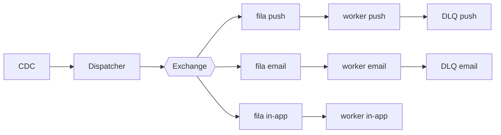

# Fanout de notificações

| | |
|---|---|
| **Estado** | Em revisão |
| **Autor** | Time de Mensageria |
| **Criado em** | 2026-01-28 |
| **Última atualização** | 2026-02-10 |

## Visão geral

O serviço de notificações atual processa os envios de forma sequencial dentro do próprio serviço de mensageria, lendo da tabela `notifications` com um cron a cada minuto, montando o payload de cada canal (push, e-mail, in-app) e chamando os providers um a um. Com o crescimento da base esse modelo começou a apresentar lentidão. Este documento propõe a adoção de um fanout baseado em filas, em que um dispatcher publica eventos numa exchange e workers por canal consomem em paralelo, com DLQ por canal, controle de TPS por provider e ingestão via CDC para os eventos de domínio, garantindo o SLA de entrega e melhor performance geral do sistema.

## Objetivos

- Melhorar a performance dos envios
- Tornar o sistema escalável
- Garantir o SLA

## Fora de escopo

- O sistema não deve ser lento
- O sistema não deve perder notificações

## Solução

A solução proposta é mais escalável e robusta que o modelo atual, além de mais fácil de manter. Adotaremos o fanout com filas por canal:

## Plano

1. Criar exchange e filas
2. Migrar o canal de e-mail
3. Migrar push e in-app
4. Desligar o cron
