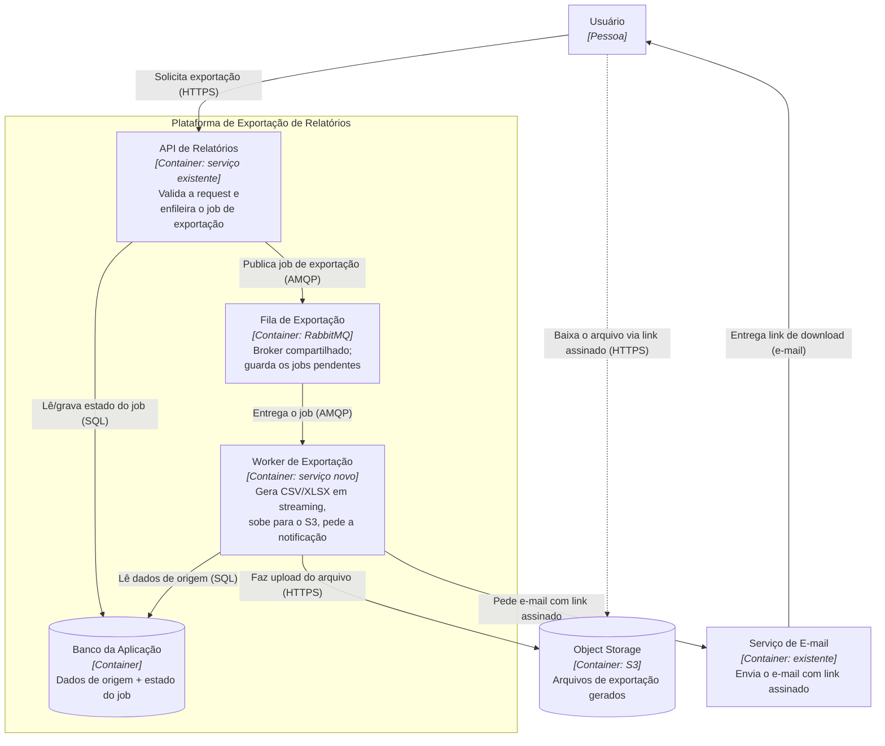
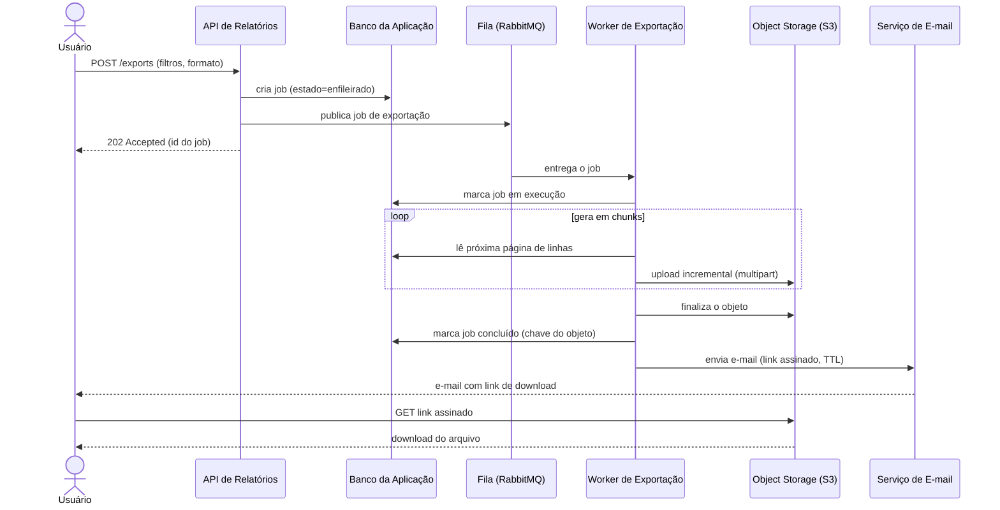

# Exportação de relatórios em background

|                  |                                                    |
| ---------------- | -------------------------------------------------- |
| **Documento**    | DESIGN-DOC                                          |
| **Estado**       | Rascunho                                            |
| **Título**       | Exportação de relatórios em background              |
| **Autores**      | _(a preencher)_                                     |
| **Revisores**    | _(sugeridos)_ Plataforma (fila compartilhada), Segurança (link assinado com PII) |
| **Criado**       | 2026-06-07                                          |
| **Atualizado**   | 2026-06-07                                          |
| **Tags**         | exportação, relatórios, fila, rabbitmq, s3, assíncrono |

## Glossário

| Termo | Definição |
| --- | --- |
| **Job** | Unidade de trabalho de exportação enfileirada pela API e processada pelo worker. |
| **Worker** | Serviço separado da API que consome jobs da fila e gera os arquivos. |
| **AMQP** | Protocolo de mensageria usado pelo RabbitMQ para enfileirar e entregar jobs. |
| **Link assinado (signed URL)** | URL temporária do S3 que dá acesso a um único arquivo por tempo limitado, sem credenciais. |
| **TTL** | _Time to live_; janela em que o link assinado continua válido. |
| **PII** | _Personally Identifiable Information_; dado pessoal de cliente presente nos relatórios. |
| **Streaming** | Geração do arquivo em pedaços (chunks), sem carregar o resultado inteiro em memória. |
| **Gateway** | Camada de entrada da API onde hoje incide o timeout de 30s. |

## Visão geral

Hoje os relatórios são gerados dentro da própria request da API. Exportações grandes
estouram o timeout de 30s do gateway — cerca de 12% das exportações acima de 50 mil
linhas falham, e o suporte abre ticket disso toda semana. Este documento propõe mover a
geração de relatórios para um worker em background: a API passa a enfileirar um job, o
worker gera o CSV/XLSX em streaming e sobe o arquivo para o S3, e o usuário recebe por
e-mail um link assinado quando a exportação termina. O objetivo é zerar os timeouts de
exportação e suportar relatórios de até 100 mil linhas.

## Escopo e contexto

A geração de relatórios é hoje **síncrona**: a request da API monta o relatório inteiro
em memória e responde com o arquivo na mesma chamada. Para volumes grandes isso não cabe
na janela de 30s imposta pelo gateway, e a exportação falha antes de terminar.

Sintomas atuais:

- ~12% das exportações **acima de 50 mil linhas** falham por timeout.
- O suporte abre ticket sobre essas falhas **toda semana**.
- O usuário não tem um caminho confiável para extrair relatórios grandes.

A infraestrutura já oferece as peças necessárias para uma abordagem assíncrona: **já
temos RabbitMQ** rodando e **S3** disponível para armazenar arquivos. Não é preciso
introduzir tecnologia nova de mensageria ou de armazenamento.

## Objetivos e fora de escopo

### Objetivos

- **Zerar os timeouts de exportação** removendo a geração do relatório do ciclo
  request/response da API — a API só enfileira; quem gera é o worker, sem o limite de
  30s do gateway.
- **Suportar exportações de até 100 mil linhas** gerando o arquivo em streaming e
  subindo direto para o S3, sem carregar o resultado inteiro em memória.
- **Entregar o resultado de forma assíncrona** via e-mail com link assinado, dando ao
  usuário um caminho único e confiável para qualquer tamanho de exportação.

### Fora de escopo

- **Download imediato/síncrono.** Mesmo exportações pequenas (que hoje funcionam na
  hora) passam a ser assíncronas — ver _Trade-offs_. Não manteremos dois caminhos.
- **Mudança no conteúdo ou no layout dos relatórios.** Geramos os mesmos CSV/XLSX de
  hoje; só muda como e quando são entregues.
- **Volumes muito acima de 100 mil linhas.** O alvo desta entrega é 100 mil; volumes
  maiores não são garantidos aqui e ficam como pergunta em aberto (paginação de
  exportação, particionamento).
- **Geração agendada/recorrente de relatórios.** Continuamos atendendo exportações sob
  demanda do usuário.

## A solução

### Visão geral da solução

A API deixa de gerar o relatório e passa a **enfileirar um job** no RabbitMQ, retornando
imediatamente ao usuário um aceite (e um identificador do job). Um **worker separado**
consome o job, **gera o CSV/XLSX em streaming** e faz **upload para o S3**. Concluído o
upload, o worker dispara um e-mail com um **link assinado** para o usuário baixar o
arquivo.

A decisão central — e o trade-off que a aceitamos — é **ter um caminho único**:
toda exportação vira assíncrona. O usuário perde o download imediato das exportações
pequenas em troca de um fluxo que nunca mais estoura timeout e de uma base de código com
um só caminho para manter.

### Arquitetura



Os componentes:

- **API de Relatórios** (serviço existente): deixa de gerar o arquivo. Passa a validar a
  request, registrar o job e publicá-lo na fila. Responde rápido, fora da janela de
  geração.
- **Fila de Exportação** (RabbitMQ, já existente): desacopla a API do worker e absorve
  picos de demanda. É uma **fila compartilhada** — ponto de atenção para o time de
  Plataforma (ver _Concerns transversais_).
- **Worker de Exportação** (serviço novo): consome jobs, lê os dados de origem
  paginando, gera o arquivo em streaming e sobe para o S3. Isola a parte cara e
  demorada da exportação fora do ciclo da API.
- **Object Storage (S3)**: guarda o arquivo gerado e serve o download por link assinado,
  sem passar o tráfego de download de volta pela API.
- **Serviço de E-mail** (existente): notifica o usuário com o link assinado quando o
  arquivo está pronto.
- **Banco da Aplicação**: além de fonte dos dados do relatório, guarda o **estado do
  job** (enfileirado / em execução / concluído / falhou), permitindo acompanhamento e
  reprocessamento.

### Fluxo de uma exportação



Pontos do fluxo que importam para o desenho:

- A API responde **`202 Accepted`** com o id do job assim que publica na fila — é o que
  tira a geração da janela de 30s. O contrato da API muda de "devolve o arquivo" para
  "aceita o pedido"; ver _Concerns transversais → Compatibilidade_.
- O worker **gera e sobe em chunks** (upload incremental/multipart), em vez de montar o
  arquivo inteiro em memória — é o que permite chegar a 100 mil linhas sem estourar
  memória.
- O **estado do job no banco** é a fonte da verdade do progresso; um e-mail perdido não
  perde o trabalho já feito, e jobs que falharam podem ser reprocessados.
- O **download não passa pela API**: o usuário baixa direto do S3 pelo link assinado.

### API e payloads

Mostramos só os dois pontos do contrato que o desenho muda; o restante segue o esquema
de exportação atual.

A chamada deixa de retornar o arquivo e passa a retornar um aceite:

```
POST /exports        -> 202 Accepted   { "job_id": "...", "status": "queued" }
```

Sugere-se um endpoint de consulta de estado para o frontend acompanhar o job (e para
suporte investigar tickets), refletindo o estado guardado no banco:

```
GET /exports/{job_id} -> 200 OK        { "status": "queued|running|done|failed", ... }
```

O formato do arquivo (`csv` | `xlsx`) e os filtros do relatório permanecem os mesmos de
hoje, apenas movidos do corpo da resposta síncrona para o payload do job.

### Dados e sensibilidade

Os relatórios **contêm PII de cliente**. Isso restringe o desenho em dois pontos:

- O arquivo no S3 e o **link assinado** dão acesso a dado pessoal — daí o TTL curto, o
  acesso só por link assinado (sem bucket público) e a revisão pela Segurança.
- O **estado do job** no banco deve guardar o mínimo para acompanhamento (id, dono,
  estado, chave do objeto, timestamps) — não os dados do relatório em si.

## Trade-offs da solução escolhida

- ✓ **Zera o timeout de exportação**: a geração sai do ciclo request/response e deixa de
  estar sujeita ao limite de 30s do gateway.
- ✓ **Suporta volumes grandes** (alvo de 100 mil linhas) gerando em streaming e subindo
  direto ao S3, sem montar o arquivo inteiro em memória.
- ✓ **Um caminho só para manter**: toda exportação é assíncrona, então não há dois
  códigos de geração nem dois contratos de API para evoluir e testar.
- ✓ **Absorve picos**: a fila desacopla a demanda do usuário da capacidade do worker.
- ✓ **Download não onera a API**: o tráfego de download vai direto do S3 ao usuário.
- ✗ **O usuário perde o download imediato.** Exportações pequenas, que hoje voltam na
  hora, passam a chegar por e-mail depois — **regressão deliberada de UX** aceita em
  troca de um caminho único e confiável. _(É o trade-off central deste documento.)_
- ✗ **Mais partes móveis**: um serviço novo (worker), uma fila no caminho crítico e a
  dependência do e-mail para a entrega — mais superfície para operar e monitorar.
- ✗ **Novo risco de PII**: arquivo com dado de cliente no S3 e link assinado por e-mail
  são uma superfície que hoje não existe (ver _Concerns transversais → Segurança_).
- ✗ **Carga numa fila compartilhada**: exportações grandes podem competir com outros
  consumidores do RabbitMQ (ver _Concerns transversais → Infraestrutura_).

## Alternativas consideradas

| Alternativa | Resumo | Veredito |
| --- | --- | --- |
| **Worker assíncrono + S3 + link por e-mail** | API enfileira; worker gera em streaming e sobe ao S3; usuário recebe link assinado. | ✓ **Escolhida** |
| Geração síncrona com timeout maior | Aumentar o timeout do gateway e seguir gerando na request. | ✗ Descartada |
| Ferramenta de BI externa | Delegar a geração de relatórios a uma plataforma de BI de terceiros. | ✗ Descartada |
| Não fazer nada | Manter a geração síncrona atual. | ✗ Descartada |

- **Geração síncrona com timeout maior.** Aumentar o timeout do gateway adiaria o
  limite, mas **só empurra o problema**: relatórios maiores voltariam a estourar, e
  segurar uma request por minutos prende recursos da API e degrada a experiência. Não
  ataca a causa (geração dentro do ciclo da request). _Descartada._
- **Ferramenta de BI externa.** Resolveria a geração, mas foi descartada por **custo** e
  por **expor dado de cliente** a um terceiro — inaceitável dado o conteúdo de PII dos
  relatórios. _Descartada._
- **Não fazer nada.** Mantém os ~12% de falhas acima de 50 mil linhas e o fluxo semanal
  de tickets de suporte; não há caminho confiável para relatórios grandes. _Descartada._

Por que a escolhida venceu: é a única que **remove a geração do ciclo da request**
(zerando o timeout) **reusando infra que já temos** (RabbitMQ e S3), **sem expor dado a
terceiros**. O custo aceito é a perda do download imediato.

## Concerns transversais

### Segurança — _envolver desde já; sugerido como revisor_

O link assinado dá acesso a um arquivo **com PII de cliente**. Pontos a alinhar com
Segurança:

- **TTL do link**: janela curta de validade (valor a definir com Segurança — ver
  _Perguntas em aberto_).
- **Acesso só por link assinado**: bucket não público; nenhum arquivo acessível sem o
  link.
- **Quem pode receber o link**: garantir que o e-mail vá para o solicitante autorizado.
- **Retenção e expiração** dos arquivos no S3 (ver _Perguntas em aberto_).

### Infraestrutura / Plataforma — _envolver desde já; sugerido como revisor_

O RabbitMQ é uma **fila compartilhada**. Jobs de exportação grandes (rumo a 100 mil
linhas) podem competir por recursos com outros consumidores. A alinhar com Plataforma:

- Fila/exchange dedicada para exportação vs. usar a fila existente.
- Limite de concorrência do worker (quantos jobs em paralelo).
- Comportamento sob carga e o que acontece com jobs em backlog.

### Compatibilidade

O contrato da API de exportação muda: de **devolver o arquivo** na resposta para
**aceitar o pedido (`202`)** e entregar depois. Clientes do endpoint (frontend e
quaisquer integrações) precisam ser atualizados para o fluxo assíncrono. Como **não
manteremos o caminho síncrono**, essa quebra precisa ser coordenada na entrega (ver
_Plano de implantação_).

## Testabilidade e observabilidade

- **Antes de subir**: testes de geração em streaming com um relatório de **100 mil
  linhas** (validando que não estoura memória nem tempo) e testes de integração do fluxo
  API → fila → worker → S3 → e-mail.
- **Em produção**:
  - **Taxa de timeout de exportação** — deve ir a **zero** (objetivo principal).
  - **Taxa de sucesso/falha de jobs** e **tempo de geração por tamanho** de exportação.
  - **Profundidade da fila** (backlog) e **idade do job mais antigo**, para flagrar
    saturação da fila compartilhada.
  - **Alerta** em job preso/falho e em backlog crescente.

## Plano de implantação

Esboço — a detalhar com Plataforma e Segurança:

1. **Worker + infra**: subir o serviço worker, a fila e a integração com S3 e e-mail; o
   estado do job no banco.
2. **Validação interna**: rodar exportações grandes (até 100 mil linhas) por trás do
   fluxo novo, sem expor ao usuário, conferindo geração em streaming e link assinado.
3. **Migração do contrato da API**: atualizar a API para enfileirar (`202`) e o frontend
   para o fluxo assíncrono; coordenar a quebra com integrações.
4. **Cutover**: passar todas as exportações pelo caminho assíncrono e desligar a geração
   síncrona. Como decidimos por um caminho único, o síncrono não fica como _fallback_.

## Perguntas em aberto

- **Autores e revisores nomeados** do documento — quem assina e quem de Plataforma e
  Segurança revisa?
- **TTL do link assinado** e **política de retenção/expiração** dos arquivos no S3 — a
  definir com Segurança.
- **Fila dedicada vs. compartilhada** e **limite de concorrência** do worker — a definir
  com Plataforma.
- **O que acontece quando a exportação falha** no worker (retry automático, notificação
  de falha ao usuário, reprocessamento manual via suporte)?
- **Volumes acima de 100 mil linhas** — fora do escopo desta entrega; haverá demanda real
  que exija paginação/particionamento da exportação?
