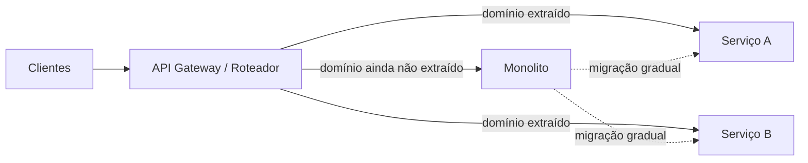

# Design Doc: Migração do Monolito para Microsserviços

> **Status:** Rascunho (DRAFT)
> **Autor(es):** _(preencher)_
> **Revisores:** _(preencher)_
> **Última atualização:** 2026-06-07

> ⚠️ **Aviso importante**
> Este documento é um **esqueleto/template preenchível**. Ele foi escrito sem acesso ao
> código do monolito atual nem a informações sobre o time, a stack, o tráfego ou as metas
> de negócio. Todos os trechos marcados com `_(preencher)_` ou `<placeholder>` precisam ser
> completados com dados reais. **Não inventei** números, nomes de serviços, tecnologias ou
> prazos — eles seriam chutes e poderiam levar a decisões erradas.
> Veja a seção [Perguntas em aberto](#0-perguntas-em-aberto-responder-antes-de-aprovar) no
> início: respondê-las é o que transforma este rascunho em um design doc real.

---

## 0. Perguntas em aberto (responder antes de aprovar)

Estas respostas são pré-requisito para o doc fazer sentido. Estão agrupadas por tema.

### Contexto e motivação
1. **Por que migrar agora?** Qual é a dor concreta? (ex.: deploys lentos, time travado por acoplamento, escala de um módulo específico, custo, confiabilidade, organização dos times). Sem um "porquê" claro, microsserviços costumam adicionar mais problema do que resolvem.
2. Quais **métricas de sucesso** definem que a migração valeu a pena? (ex.: frequência de deploy, lead time, MTTR, custo de infra, tempo de onboarding).
3. Existe alguma **restrição de prazo** ou evento de negócio que pressiona a migração?

### O monolito atual
4. Qual a **linguagem/framework** principal do monolito? (ex.: Rails, Django, Spring, .NET, Node, Laravel...).
5. Qual o **banco de dados** atual e o tamanho aproximado (nº de tabelas, volume)? É um único banco compartilhado?
6. Como é feito o **deploy** hoje (VM, container, PaaS, Kubernetes)? Qual a frequência?
7. Qual o **tráfego / carga** atual e o crescimento esperado?
8. Há **testes automatizados**? Qual a cobertura aproximada?
9. Quais são os **principais domínios/módulos** de negócio dentro do monolito? (ex.: usuários, pagamentos, catálogo, pedidos, notificações).
10. Quais módulos **mais mudam** e quais **mais escalam**? (são os melhores candidatos a sair primeiro).

### Time e organização
11. Quantas pessoas no time de engenharia? Como estão organizados os times?
12. O time tem experiência prévia com **sistemas distribuídos** (mensageria, observabilidade, deploys independentes)?
13. Existe (ou existirá) uma estrutura de **plataforma/infra** para sustentar múltiplos serviços?

### Restrições técnicas e de negócio
14. Há requisitos de **compliance/regulatório** (LGPD, PCI, etc.) que afetam onde os dados podem viver?
15. Qual o **orçamento** disponível (infra + tempo de pessoas)?
16. Há **integrações externas** ou sistemas legados que dependem do monolito?

> Quando essas perguntas estiverem respondidas, o restante do documento deixa de ser
> template e passa a refletir a realidade do projeto.

---

## 1. Resumo executivo (TL;DR)

_(Preencher após responder a seção 0. Em 3-5 linhas: o que vamos fazer, por quê, e qual o resultado esperado.)_

Exemplo de estrutura (substituir pelo real):
> Vamos migrar o módulo `<módulo>` do monolito `<nome>` para um serviço independente,
> seguido por `<módulos>`, ao longo de `<período>`, usando o padrão **Strangler Fig**.
> Objetivo: `<métrica de sucesso>`. Mantemos o monolito no ar durante toda a transição.

---

## 2. Contexto e problema

### 2.1 Situação atual
_(Descrever o monolito: o que ele faz, como está estruturado, onde dói.)_

### 2.2 Por que microsserviços?
_(A justificativa real, baseada na pergunta 1 da seção 0.)_

> 🧭 **Reflexão honesta antes de seguir:** microsserviços **não** são automaticamente
> melhores. Eles trocam complexidade interna (código acoplado) por complexidade
> operacional distribuída (rede, consistência, observabilidade, deploys coordenados).
> Se a dor for "código bagunçado", um **monolito modular** bem feito pode resolver com
> uma fração do custo. Vale registrar aqui por que a equipe concluiu que microsserviços
> são a resposta certa — e não só a moda.

### 2.3 Alternativas consideradas
| Alternativa | Prós | Contras | Decisão |
|---|---|---|---|
| Manter o monolito como está | Custo zero de migração | Não resolve a dor `<X>` | _(preencher)_ |
| Monolito modular ("modular monolith") | Baixo custo operacional, melhora acoplamento | Não dá deploy/escala independentes | _(preencher)_ |
| Migração para microsserviços (este doc) | Deploy e escala independentes por domínio | Alta complexidade operacional | _(preencher)_ |
| Reescrita do zero | "Limpa" o legado | Altíssimo risco, "big bang" | _(geralmente descartada)_ |

---

## 3. Objetivos e não-objetivos

### 3.1 Objetivos
- _(ex.: permitir deploy independente do domínio de pagamentos)_
- _(ex.: escalar o domínio de catálogo separadamente)_
- _(preencher com base nas métricas da seção 0)_

### 3.2 Não-objetivos (escopo fora)
- _(ex.: não vamos reescrever o front-end nesta fase)_
- _(ex.: não vamos trocar a stack de linguagem nesta fase)_
- _(ex.: não é um "big bang" — o monolito continua no ar)_

---

## 4. Estratégia de migração

### 4.1 Padrão recomendado: Strangler Fig
A abordagem de referência para migrar monolito → microsserviços de forma incremental e
reversível é o **Strangler Fig Pattern**:

1. Coloca-se uma **camada de roteamento** (API gateway / reverse proxy) na frente do monolito.
2. Extrai-se **um domínio por vez** para um novo serviço.
3. O roteamento passa a direcionar o tráfego daquele domínio para o novo serviço.
4. Remove-se o código correspondente do monolito quando o novo serviço está estável.
5. Repete-se até o monolito "encolher" ao mínimo (ou desaparecer).

Vantagens: cada passo é pequeno, validável e **reversível** (rollback de roteamento).

> _(Validar/renderizar este diagrama e ajustar os nomes de serviços quando definidos.)_

### 4.2 Como decidir as fronteiras dos serviços
As fronteiras devem seguir **domínios de negócio** (Domain-Driven Design / bounded contexts),
**não** camadas técnicas. Critérios de priorização para o "quem sai primeiro":
- Módulos com **maior taxa de mudança** (ganha-se velocidade de deploy).
- Módulos com **necessidade de escala distinta**.
- Módulos com **acoplamento de dados baixo** com o resto (mais fáceis de extrair).
- Evitar começar pelo núcleo mais entrelaçado (alto risco logo de cara).

> 📌 As fronteiras concretas dependem das respostas às perguntas 9 e 10 da seção 0.
> Sem essa informação, listar serviços específicos aqui seria invenção.

### 4.3 Ordem de extração (preencher)
| Ordem | Domínio/Serviço | Justificativa | Risco | Dependências |
|---|---|---|---|---|
| 1 | _(preencher)_ | _(preencher)_ | _(preencher)_ | _(preencher)_ |
| 2 | _(preencher)_ | _(preencher)_ | _(preencher)_ | _(preencher)_ |
| 3 | _(preencher)_ | _(preencher)_ | _(preencher)_ | _(preencher)_ |

---

## 5. Dados: o problema mais difícil

A parte mais custosa de uma migração geralmente **não é o código, é o banco de dados**.

### 5.1 Decisões necessárias
- **Database-per-service?** Cada serviço deve, idealmente, ser dono dos seus dados.
- Como **separar tabelas compartilhadas** sem quebrar consultas com JOIN?
- Como manter **consistência** entre serviços (saga, eventos, dual-write evitado)?
- Estratégia de **migração de dados**: copiar e sincronizar (ex.: CDC) antes de cortar.

### 5.2 Padrões a avaliar
- **Decompose the database** gradualmente (não tudo de uma vez).
- **Saga pattern** para transações distribuídas (em vez de transações ACID entre serviços).
- **Outbox pattern** para publicar eventos de forma confiável.
- **CDC (Change Data Capture)** para sincronizar dados durante a transição.

> _(Preencher com a realidade do banco atual — pergunta 5 da seção 0.)_

---

## 6. Comunicação entre serviços

| Aspecto | Opções | Recomendação |
|---|---|---|
| Síncrono | REST, gRPC | _(preencher conforme stack)_ |
| Assíncrono | Fila/broker de eventos (Kafka, RabbitMQ, SQS...) | _(preencher)_ |
| Contratos | OpenAPI / Protobuf / AsyncAPI | _(preencher)_ |
| Service discovery | DNS, service mesh | _(preencher)_ |

⚠️ **Risco de "monolito distribuído":** se os serviços precisarem se chamar
sincronicamente para quase tudo, você terá o pior dos dois mundos — o acoplamento do
monolito **mais** a latência e a fragilidade da rede. Preferir comunicação assíncrona
por eventos sempre que a consistência do negócio permitir.

---

## 7. Infraestrutura e operação

_(Preencher conforme perguntas 6, 11, 12, 13 da seção 0.)_

- **Orquestração/runtime:** _(Kubernetes? ECS? PaaS?)_
- **CI/CD:** pipelines independentes por serviço.
- **Observabilidade (não-negociável em microsserviços):**
  - Logs centralizados
  - Métricas (ex.: Prometheus/Grafana)
  - **Tracing distribuído** (ex.: OpenTelemetry) — essencial para depurar chamadas entre serviços.
- **Gestão de configuração e segredos.**
- **Estratégia de resiliência:** timeouts, retries com backoff, circuit breakers.

---

## 8. Plano de rollout e rollback

### 8.1 Fases sugeridas
1. **Fase 0 — Fundação:** colocar gateway/roteamento, observabilidade e pipeline de CI/CD para serviços. Nenhum domínio extraído ainda.
2. **Fase 1 — Primeiro serviço:** extrair o domínio de menor risco (validar todo o "caminho" da plataforma com algo pequeno).
3. **Fase 2..N — Extrações sucessivas:** um domínio por vez, seguindo a seção 4.3.
4. **Fase final — Encolher o monolito:** remover código migrado; decidir se o monolito vira mais um serviço ou some.

### 8.2 Rollback
Cada extração deve ser **reversível por roteamento**: se o novo serviço falhar, o gateway
volta a apontar para o monolito. Manter o código no monolito até o novo serviço estar estável.

### 8.3 Cronograma
_(Preencher — depende de time e prazos, perguntas 3, 11, 15. Não estimei datas porque
seriam números inventados.)_

---

## 9. Riscos e mitigações

| Risco | Impacto | Mitigação |
|---|---|---|
| Virar um "monolito distribuído" | Alto | Fronteiras por domínio + comunicação assíncrona |
| Migração de dados quebrar consistência | Alto | CDC + saga/outbox + cutover gradual |
| Custo operacional acima do esperado | Médio/Alto | Começar pequeno; reavaliar após Fase 1 |
| Time sem experiência em distribuído | Médio | Investir em observabilidade e plataforma antes de escalar |
| Escopo crescer demais ("migrar tudo") | Médio | Priorização rígida; não-objetivos claros |
| Perda de velocidade durante a transição | Médio | Strangler Fig (incremental) em vez de big bang |

---

## 10. Critérios de sucesso (revisão pós-migração)

_(Preencher com as métricas definidas na seção 0, com valores-alvo. Ex.: "lead time de
deploy de X para Y", "MTTR de X para Y", "custo de infra dentro de Z".)_

---

## 11. Referências
- _Strangler Fig Application_ — Martin Fowler
- _Building Microservices_ — Sam Newman (estratégias de decomposição e migração de dados)
- _Monolith to Microservices_ — Sam Newman
- _Domain-Driven Design_ — Eric Evans (bounded contexts)

---

## Apêndice: como continuar este documento
1. Responder a **Seção 0**.
2. Preencher os blocos `_(preencher)_` com os dados reais.
3. Validar as fronteiras de serviço com o time de produto/negócio.
4. Revisar com engenharia e operações antes de aprovar.
5. Quebrar a Fase 1 em tarefas executáveis.
