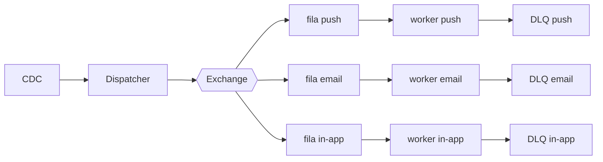

# Fanout de notificações

| | |
|---|---|
| **Estado** | Em revisão |
| **Autor** | Time de Mensageria |
| **Revisores** | _(a definir — sugestão: Infraestrutura/Plataforma, dono do broker de mensageria)_ |
| **Criado em** | 2026-01-28 |
| **Última atualização** | 2026-06-07 |

## Glossário

| Termo | Definição |
|---|---|
| **Fanout** | Padrão em que um evento publicado é distribuído para múltiplos consumidores (aqui, uma fila por canal). |
| **SLA** | _Service Level Agreement_ — acordo de nível de serviço; aqui, o prazo máximo de entrega de uma notificação. |
| **CDC** | _Change Data Capture_ — captura de mudanças no banco para gerar eventos a partir de alterações na tabela `notifications`. |
| **DLQ** | _Dead Letter Queue_ — fila para onde vão mensagens que falharam após o limite de tentativas. |
| **TPS** | _Transactions Per Second_ — limite de requisições por segundo que cada provider aceita. |
| **Provider** | Serviço externo que efetivamente entrega a notificação (push, e-mail, in-app). |
| **Exchange** | Roteador de mensagens do broker que distribui os eventos para as filas dos canais. |

## Visão geral

O envio de notificações hoje é sequencial e, com o crescimento da base, começou a
apresentar lentidão. Este documento propõe substituir o processamento em série por um
*fanout* baseado em filas, no qual cada canal (push, e-mail, in-app) é consumido em
paralelo por workers dedicados. O objetivo é destravar a vazão de envios sem reescrever
a lógica de cada canal.

## Contexto

O serviço de notificações atual processa os envios de forma sequencial dentro do
próprio serviço de mensageria: um cron roda a cada minuto, lê da tabela `notifications`,
monta o payload de cada canal (push, e-mail, in-app) e chama os providers um a um. Como
todos os canais compartilham a mesma execução serial, um provider lento atrasa todos os
demais, e a vazão é limitada pelo intervalo do cron somada à soma dos tempos de chamada.
Com o crescimento da base, esse acoplamento passou a gerar atrasos perceptíveis na
entrega.

## Objetivos

> **Nota do revisor:** os objetivos abaixo ainda não são verificáveis — não dizem
> *quanto* nem *como medir*. Ver as perguntas ao final do documento.

- Reduzir o tempo de envio das notificações (paralelizando os canais em vez de
  processá-los em série).
- Suportar o crescimento da base de envios sem degradar a vazão (escalando os workers
  por canal de forma independente).
- Manter as notificações dentro do prazo de entrega acordado (SLA).

## Fora de escopo

> **Nota do revisor:** os itens anteriores apenas negavam os objetivos ("não deve ser
> lento") e não excluíam nada de concreto. Substituí por exclusões reais — confirme se
> estão corretas (ver perguntas ao final).

- Mudanças na lógica de montagem de payload ou na integração com cada provider — os
  canais existentes são reaproveitados como estão.
- Novos canais de notificação (ex.: SMS, WhatsApp) — fora deste trabalho.

## Solução

Adotaremos um *fanout* com uma fila por canal. Em vez de o cron processar os envios em
série, um **dispatcher** publica cada evento de notificação numa **exchange**, que o
distribui para uma fila por canal (push, e-mail, in-app). Cada fila é consumida por um
**worker** dedicado, que chama o provider do seu canal respeitando o TPS suportado.
Mensagens que falham após as tentativas vão para uma **DLQ** específica do canal, sem
bloquear o restante do fluxo. A ingestão dos eventos de domínio é feita via **CDC** a
partir da tabela `notifications`.

O ganho central vem de desacoplar os canais: como cada worker consome sua própria fila,
um provider lento (ou indisponível) afeta apenas o seu canal, e cada canal pode escalar
o número de workers de forma independente. A DLQ por canal isola as falhas — uma
mensagem problemática para a fila morta em vez de travar a fila principal — e preserva a
mensagem para reprocessamento, sem perda silenciosa.

> **Nota do revisor:** o texto acima descreve o *desenho*, mas o documento ainda não diz
> *o que essa escolha custa* nem *o que mais foi considerado*. Essas são as lacunas mais
> importantes — ver perguntas ao final.

## Plano

1. Criar a exchange e as filas (push, e-mail, in-app) e respectivas DLQs.
2. Migrar o canal de e-mail, mantendo o cron atual em paralelo como _fallback_.
3. Migrar push e in-app.
4. Desligar o cron.

> **Nota do revisor:** não há história de _rollback_ por etapa nem critério para avançar
> de uma etapa à seguinte. Ver perguntas ao final.
