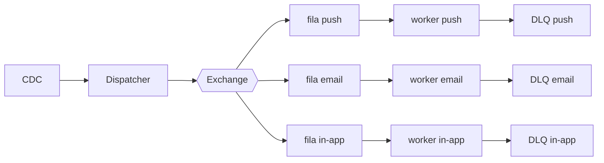

# Fanout de notificações

| | |
|---|---|
| **Estado** | Em revisão |
| **Autor** | Time de Mensageria |
| **Criado em** | 2026-01-28 |
| **Última atualização** | 2026-02-10 |

## Visão geral

O serviço de notificações atual processa os envios de forma sequencial dentro do
próprio serviço de mensageria: um cron roda a cada minuto, lê da tabela
`notifications`, monta o payload de cada canal (push, e-mail, in-app) e chama os
providers um a um. Com o crescimento da base, esse modelo passou a apresentar
latência crescente e não escala horizontalmente, porque todo o processamento
está acoplado a uma única instância e a uma janela fixa de um minuto.

Este documento propõe substituir esse modelo por um **fanout baseado em filas**:
um *dispatcher* publica eventos em uma *exchange* e *workers* por canal consomem
em paralelo. Cada canal tem sua própria fila e DLQ, há controle de TPS por
provider e a ingestão dos eventos de domínio passa a ser feita via CDC (Change
Data Capture), eliminando o cron de polling.

## Contexto e problema

<!-- TODO(autor): preencher com números concretos. Sem dados, os objetivos abaixo
     não são verificáveis. Ver perguntas no final. -->

- Volume atual: _<TODO: notificações/dia e pico de notificações/minuto>_
- Latência atual (p50/p95/p99 entre criação e entrega): _<TODO>_
- Limite efetivo do modelo atual: o cron processa de forma sequencial em janelas
  de 1 minuto numa única instância, então a vazão máxima é limitada por
  `(tempo de processamento por notificação) × (chamadas sequenciais)`.
- Incidentes/dores que motivaram a mudança: _<TODO: ex. atrasos em horário de
  pico, retries manuais, perda de notificações?>_

## Objetivos

> Objetivos devem ser mensuráveis. Os números abaixo são placeholders e precisam
> ser confirmados pelo autor (ver perguntas no final).

- Reduzir a latência de entrega para _p95 ≤ <TODO> s_ (hoje: _<TODO>_).
- Suportar pico de _<TODO> notificações/min_ com escala horizontal dos workers.
- Garantir o SLA de entrega de _<TODO>%_ das notificações em até _<TODO>_, com
  reprocessamento automático de falhas via DLQ.
- Não perder notificações: toda notificação publicada é entregue ou termina
  explicitamente em uma DLQ para inspeção/reprocessamento.

## Fora de escopo

- Mudança nos providers de push, e-mail e in-app (continuam os mesmos).
- Alteração no esquema da tabela `notifications` além do necessário para CDC.
- Preferências de notificação do usuário / opt-out (tratadas a montante).
- Templates e internacionalização de conteúdo.

<!-- Nota da revisão: os itens anteriores ("o sistema não deve ser lento",
     "não deve perder notificações") não eram itens de fora de escopo, e sim
     requisitos. Foram movidos para Objetivos. -->

## Solução proposta

Adotaremos o fanout com uma fila e uma DLQ por canal. O fluxo:

1. **CDC** captura mudanças na tabela `notifications` (insert de novas
   notificações) e emite eventos de domínio, eliminando o polling por cron.
2. O **dispatcher** consome esses eventos, resolve os canais aplicáveis e publica
   na **exchange**.
3. A exchange faz o fanout para uma **fila por canal** (push, e-mail, in-app).
4. Cada **worker** consome sua fila em paralelo, monta o payload do canal e chama
   o provider correspondente, respeitando o **TPS máximo** de cada provider.
5. Mensagens que esgotam as tentativas vão para a **DLQ daquele canal**, sem
   bloquear os demais.

### Garantias e pontos de atenção

- **Entrega e idempotência**: as filas tendem a entregar pelo menos uma vez
  (*at-least-once*), então os workers precisam ser idempotentes (deduplicação por
  `notification_id`) para evitar envio duplicado. _<TODO: confirmar estratégia.>_
- **Controle de TPS**: como será aplicado o rate limit por provider — token
  bucket no worker, *prefetch* limitado, ou limitador centralizado? _<TODO.>_
- **Ordenação**: o fanout não garante ordem global. Há algum caso que dependa de
  ordem (ex. "lida" depois de "recebida")? _<TODO.>_
- **Reprocessamento de DLQ**: manual, automático com backoff, ou ambos? Qual a
  política de retenção das DLQs? _<TODO.>_

## Alternativas consideradas

<!-- TODO(autor): por que fila/exchange e não, por exemplo, um worker pool lendo
     direto da tabela, ou um agendador distribuído? Documentar o trade-off
     justifica a escolha e evita rediscussão futura. -->

- _<TODO: alternativa A — ex. manter o cron, mas paralelizar com worker pool.>_
- _<TODO: alternativa B — ex. broker/tecnologia X vs Y (RabbitMQ, SQS, Kafka).>_
- Tecnologia de fila/broker escolhida e justificativa: _<TODO.>_

## Observabilidade e operação

- Métricas por canal: tamanho da fila, idade da mensagem mais antiga, taxa de
  sucesso/erro, latência de entrega, taxa de mensagens em DLQ.
- Alertas: fila crescendo (consumo < produção), DLQ acima de um limiar.
- Painel/dashboard: _<TODO: onde — Grafana? Datadog?>_

## Riscos e mitigações

- Migração com cron antigo e novo fluxo ativos ao mesmo tempo pode gerar **envio
  duplicado** → garantir idempotência antes de ligar os dois; migrar canal a
  canal.
- CDC pode atrasar/parar → monitorar lag do CDC e ter alerta dedicado.
- Provider com TPS estourado pode encher a fila → backpressure e DLQ por canal
  isolam o impacto entre canais.

## Plano de implementação

1. Provisionar exchange, filas e DLQs (com a DLQ de in-app incluída desde o
   início).
2. Implementar dispatcher + ingestão via CDC, publicando em paralelo ao cron
   atual (sem ligar os workers ainda) para validar o volume.
3. Garantir idempotência nos workers.
4. Migrar o canal de **e-mail** (menor risco): ligar o worker, desligar o trecho
   de e-mail do cron, observar métricas.
5. Migrar **push** e **in-app** da mesma forma.
6. Desligar o cron por completo.
7. Definir critérios de rollback por etapa: _<TODO: o que dispara reverter um
   canal para o cron?>_
