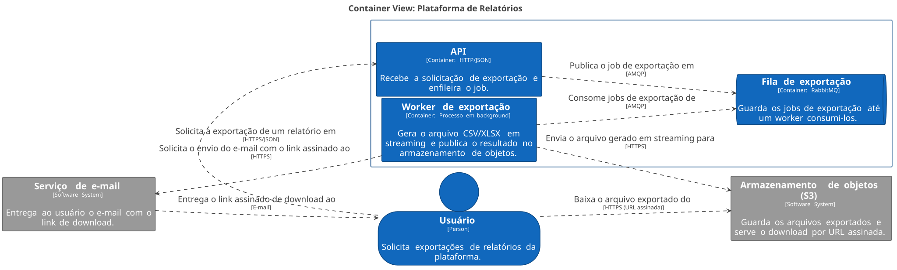
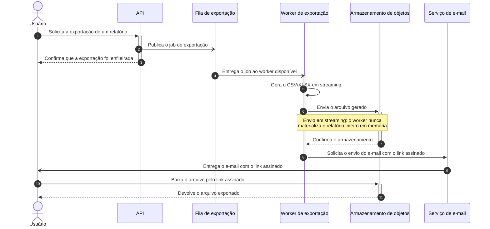

# Exportação de relatórios em background

|  |  |
|---|---|
| **Documento** | DESIGN-DOC |
| **Estado** | Rascunho |
| **Título** | Exportação de relatórios em background |
| **Autores** | *a definir* |
| **Revisores** | *a definir* — sugestão: um representante de Plataforma (fila compartilhada) e um de Segurança (link assinado com PII) |
| **Criado** | 2026-07-20 |
| **Última atualização** | 2026-07-20 |
| **Tags** | exportação, relatórios, processamento assíncrono, fila |

## Glossário

| Termo | Significado |
|---|---|
| **BI** | *Business Intelligence* — ferramentas de análise e geração de relatórios, aqui no sentido de produto externo contratado. |
| **CSV** | Formato de arquivo tabular em texto separado por vírgulas. |
| **gateway** | Camada de entrada que recebe as requisições HTTP antes da API e hoje corta a conexão em 30 segundos. |
| **job** | Unidade de trabalho enfileirada: uma exportação solicitada, com os parâmetros do relatório. |
| **link assinado** | URL temporária que autoriza o download de um arquivo no armazenamento de objetos sem exigir credenciais adicionais. |
| **PII** | *Personally Identifiable Information* — dado pessoal identificável de cliente. |
| **S3** | Serviço de armazenamento de objetos da AWS, onde o arquivo exportado fica guardado. |
| **streaming** | Geração e envio do arquivo em pedaços, sem manter o relatório inteiro em memória. |
| **worker** | Processo que roda em background consumindo jobs da fila. |
| **XLSX** | Formato de planilha do Excel. |

## Visão geral

Hoje a API gera os relatórios de exportação dentro da própria requisição, e as exportações
grandes não terminam antes do gateway cortar a conexão. Este documento propõe mover a
geração do arquivo para um serviço em background: a API passa a enfileirar um job, um
worker gera o arquivo e o publica no armazenamento de objetos, e o usuário recebe por
e-mail um link assinado para baixá-lo.

A proposta troca o download imediato — que hoje funciona para as exportações pequenas —
por um caminho único e assíncrono que aguenta relatórios grandes sem estourar tempo de
requisição.

## Escopo e contexto

A API gera o arquivo de exportação de forma síncrona, dentro da requisição do usuário. O
gateway encerra a conexão em 30 segundos, e relatórios grandes não cabem nesse tempo:
cerca de **12% das exportações acima de 50 mil linhas falham**. O suporte abre ticket
sobre essas falhas toda semana.

A infraestrutura já tem RabbitMQ em operação, mantido pelo time de plataforma e
compartilhado com outros times.

## Objetivos e fora de escopo

**Objetivos**

- Zerar os timeouts de exportação, tirando a geração do arquivo do caminho da requisição
  HTTP.
- Suportar exportações de até 100 mil linhas, gerando o arquivo em streaming em vez de
  montá-lo inteiro em memória.

**Fora de escopo**

- Manter um caminho síncrono para exportações pequenas: mesmo as exportações que hoje
  respondem na hora passam a ser assíncronas, para existir um caminho só.
- Mudar o conteúdo, as colunas ou os formatos dos relatórios — continuam CSV e XLSX, como
  hoje.

## A solução

A API deixa de gerar o arquivo e passa a apenas registrar o pedido: valida os parâmetros,
publica um job de exportação na fila e responde imediatamente ao usuário que a exportação
foi aceita. Um worker separado consome o job, gera o CSV ou XLSX em streaming, envia o
arquivo para o armazenamento de objetos e dispara um e-mail com um link assinado. O
usuário baixa o arquivo direto do armazenamento por esse link.

O trade-off central está aqui: a requisição de exportação deixa de devolver um arquivo e
passa a devolver uma promessa. Em troca, nenhuma exportação depende mais do limite de 30
segundos do gateway.

### Arquitetura



<details>
<summary>Fonte do diagrama (Structurizr DSL)</summary>

```
workspace "Exportação de relatórios" "Exportação assíncrona de relatórios em background." {

    !identifiers hierarchical

    model {
        usuario = person "Usuário" "Solicita exportações de relatórios da plataforma."

        plataforma = softwareSystem "Plataforma de Relatórios" "Permite consultar e exportar relatórios operacionais." {
            api = container "API" "Recebe a solicitação de exportação e enfileira o job." "HTTP/JSON"
            fila = container "Fila de exportação" "Guarda os jobs de exportação até um worker consumi-los." "RabbitMQ" {
                tags "Queue"
            }
            worker = container "Worker de exportação" "Gera o arquivo CSV/XLSX em streaming e publica o resultado no armazenamento de objetos." "Processo em background"
        }

        armazenamento = softwareSystem "Armazenamento de objetos (S3)" "Guarda os arquivos exportados e serve o download por URL assinada." {
            tags "External"
        }

        email = softwareSystem "Serviço de e-mail" "Entrega ao usuário o e-mail com o link de download." {
            tags "External"
        }

        usuario -> plataforma.api "Solicita a exportação de um relatório em" "HTTPS/JSON"
        plataforma.api -> plataforma.fila "Publica o job de exportação em" "AMQP"
        plataforma.worker -> plataforma.fila "Consome jobs de exportação de" "AMQP"
        plataforma.worker -> armazenamento "Envia o arquivo gerado em streaming para" "HTTPS"
        plataforma.worker -> email "Solicita o envio do e-mail com o link assinado ao" "HTTPS"
        email -> usuario "Entrega o link assinado de download ao" "E-mail"
        usuario -> armazenamento "Baixa o arquivo exportado do" "HTTPS (URL assinada)"
    }

    views {
        systemContext plataforma "SystemContext" {
            include *
            autoLayout
        }

        container plataforma "Containers" {
            include *
            autoLayout lr
        }

        styles {
            element "Element" {
                background #1168bd
                color #ffffff
            }
            element "Person" {
                shape person
            }
            element "Queue" {
                shape pipe
            }
            element "External" {
                background #999999
                color #ffffff
            }
        }
    }

    configuration {
        scope softwaresystem
    }
}
```

</details>

O desenho tem quatro peças além do usuário. A **API** recebe a solicitação de exportação e
publica o job na fila; ela não gera mais arquivo nenhum, então sua resposta não depende do
tamanho do relatório. A **fila de exportação** (RabbitMQ, a instância que o time de
plataforma já opera) guarda os jobs e absorve picos de solicitação. O **worker de
exportação** consome os jobs, gera o arquivo em streaming e o envia para o **armazenamento
de objetos** (S3), que é quem serve o download final. O **serviço de e-mail** entrega ao
usuário a mensagem com o link assinado, e o usuário baixa o arquivo direto do
armazenamento — o arquivo nunca volta a passar pela API.

### Fluxo de uma exportação



A requisição do usuário termina no passo 3, poucos milissegundos depois de começar: a API
só publica o job e confirma o recebimento, e é essa quebra que elimina o timeout do
gateway. Do passo 4 ao 8 o trabalho pesado acontece fora da requisição — o worker gera o
arquivo e o envia em streaming, de modo que o consumo de memória não cresce junto com o
número de linhas. Nos passos 9 a 11 o usuário recebe o e-mail e baixa o arquivo direto do
armazenamento de objetos.

O diagrama mostra apenas o caminho feliz. O comportamento em caso de falha do worker
(retentativa, descarte, aviso ao usuário) ainda não está definido — ver *Perguntas em
aberto*.

### Dados e sensibilidade

Os relatórios exportados carregam dado de cliente (PII) — foi justamente esse ponto que
descartou a alternativa de BI externo. Com este desenho, o dado passa a ficar em repouso
no armazenamento de objetos e o acesso a ele passa a depender de um link assinado enviado
por e-mail. Isso muda a superfície de exposição e é o item que o time de segurança precisa
revisar.

## Trade-offs da solução escolhida

- ✓ Nenhuma exportação depende mais do limite de 30 segundos do gateway — o objetivo de
  zerar os timeouts cai fora do caminho crítico da requisição.
- ✓ A geração em streaming faz o custo de memória parar de crescer com o número de linhas,
  o que sustenta a meta de 100 mil linhas.
- ✓ Existe um caminho só para exportação, grande ou pequena: uma implementação, um
  conjunto de testes, um comportamento para o suporte explicar.
- ✗ **O usuário perde o download imediato.** A exportação pequena, que hoje volta na hora,
  passa a exigir esperar um e-mail. Aceitamos essa piora justamente para não manter dois
  caminhos.
- ✗ O sistema ganha partes móveis: uma fila, um worker, um armazenamento de objetos e um
  serviço de e-mail passam a fazer parte do caminho de uma exportação, e cada um deles
  pode falhar sozinho.
- ✗ O arquivo com PII passa a ficar armazenado e acessível por um link enviado por e-mail
  — uma superfície de exposição que hoje não existe.
- ✗ A fila compartilhada do time de plataforma recebe carga nova, que não é nossa para
  dimensionar sozinhos.

## Alternativas consideradas

| Alternativa | Trade-offs | Resultado |
|---|---|---|
| Não fazer nada | ✓ Custo zero, nenhuma mudança de experiência. ✗ Mantém os 12% de falha acima de 50 mil linhas e o ticket semanal de suporte, e piora conforme os relatórios crescem. | ✗ Descartada |
| Gerar síncrono com timeout maior | ✓ Mudança pequena, o usuário mantém o download imediato. ✗ Só empurra o problema: o limite volta a ser atingido com relatórios maiores, e requisições longas seguram recursos da API. | ✗ Descartada |
| Ferramenta de BI externa | ✓ Tira o problema de casa. ✗ Custo da ferramenta e exposição de dado de cliente a um terceiro. | ✗ Descartada |
| **Fila + worker em background** | ✓ Tira a geração do caminho da requisição e aguenta relatórios grandes. ✗ Custa o download imediato e mais peças para operar. | **✓ Escolhida** |

## Preocupações transversais

### Segurança

O link assinado dá acesso a um arquivo com PII e viaja por e-mail. O time de segurança
precisa se pronunciar sobre o prazo de validade do link, sobre exigir ou não sessão
autenticada no download e sobre por quanto tempo o arquivo fica retido no armazenamento.

### Plataforma / infraestrutura

A fila é compartilhada e operada pelo time de plataforma. As exportações passam a
publicar nela um volume novo, com jobs longos, então o time precisa avaliar o impacto no
dimensionamento e no isolamento em relação aos outros consumidores.

### Compatibilidade

O contrato da exportação muda para todos os consumidores da API, inclusive os que hoje
recebem o arquivo na resposta: a chamada passa a devolver uma confirmação de
enfileiramento. Qualquer cliente que dependa do arquivo no corpo da resposta precisa ser
migrado.

## Perguntas em aberto

- Onde fica o estado do job? O usuário consegue consultar se a exportação está em
  andamento, ou o e-mail é o único sinal?
- Qual serviço de e-mail o worker usa, e por qual mecanismo (chamada direta, fila de
  notificação já existente)?
- Qual a validade do link assinado e por quanto tempo o arquivo fica retido?
- O que acontece quando o job falha ou o worker cai no meio da geração — retentativa,
  fila de mensagens mortas, aviso ao usuário?
- Como vamos verificar o resultado antes e depois de subir: qual métrica prova que os
  timeouts foram a zero e que 100 mil linhas passam?
- A migração dos consumidores atuais acontece em uma virada só ou em etapas?
