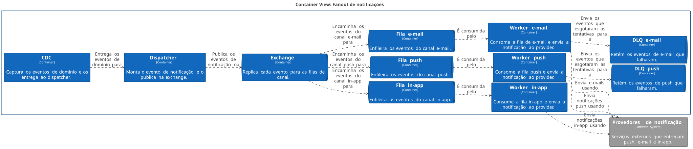

# Fanout de notificações

| | |
|---|---|
| **Estado** | Em revisão |
| **Autor** | Time de Mensageria |
| **Criado em** | 2026-01-28 |
| **Última atualização** | 2026-07-20 |

## Glossário

| Termo | Definição |
|---|---|
| **CDC** | *Change Data Capture* — captura as alterações de uma base de dados e as publica como um fluxo de eventos. |
| **DLQ** | *Dead-letter queue* — fila para onde vão as mensagens que não puderam ser processadas depois de esgotadas as tentativas. |
| **Exchange** | Ponto de publicação do broker que decide para quais filas cada mensagem é encaminhada. |
| **Fanout** | Distribuição de um mesmo evento para vários consumidores, que o processam em paralelo. |
| **In-app** | Canal de notificação exibido dentro do próprio produto, sem envio externo. |
| **Provider** | Serviço externo que efetivamente entrega a notificação ao destinatário. |
| **SLA** | *Service Level Agreement* — o compromisso de nível de serviço acordado, aqui o prazo de entrega da notificação. |
| **TPS** | *Transactions per second* — o número de requisições por segundo enviadas a um provider. |
| **Worker** | Processo que consome uma fila e executa o trabalho de cada mensagem. |

## Visão geral

Este documento propõe substituir o envio sequencial de notificações por um fanout
baseado em filas, em que cada canal é processado em paralelo por um worker próprio. O
objetivo é sustentar o crescimento da base de usuários sem comprometer o prazo de
entrega das notificações.

## Escopo e contexto

Hoje o serviço de mensageria processa os envios de forma sequencial dentro do próprio
serviço: um cron roda a cada minuto, lê a tabela `notifications`, monta o payload de
cada canal (push, e-mail e in-app) e chama os providers um a um. Com o crescimento da
base, esse modelo começou a apresentar lentidão.

## Objetivos

- Melhorar a performance dos envios
- Tornar o sistema escalável
- Garantir o SLA

## Fora de escopo

- O sistema não deve ser lento
- O sistema não deve perder notificações

## Solução

Adotaremos o fanout com filas por canal. Um componente de CDC captura os eventos de
domínio e os entrega ao dispatcher, que publica um evento de notificação numa exchange;
a exchange replica esse evento para uma fila por canal, e cada canal tem seu próprio
worker consumindo em paralelo, com DLQ e controle de TPS por provider.

### Arquitetura



<details>
<summary>Fonte do diagrama (Structurizr DSL)</summary>

```
workspace "Fanout de notificações" "Modelo de containers do fanout de notificações por fila." {

    !identifiers hierarchical

    model {
        provedores = softwareSystem "Provedores de notificação" "Serviços externos que entregam push, e-mail e in-app." {
            tags "External"
        }

        notificacoes = softwareSystem "Fanout de notificações" "Distribui e entrega as notificações por canal." {
            cdc = container "CDC" "Captura os eventos de domínio e os entrega ao dispatcher."
            dispatcher = container "Dispatcher" "Monta o evento de notificação e o publica na exchange."
            exchange = container "Exchange" "Replica cada evento para as filas de canal." {
                tags "Queue"
            }
            filaPush = container "Fila push" "Enfileira os eventos do canal push." {
                tags "Queue"
            }
            filaEmail = container "Fila e-mail" "Enfileira os eventos do canal e-mail." {
                tags "Queue"
            }
            filaInApp = container "Fila in-app" "Enfileira os eventos do canal in-app." {
                tags "Queue"
            }
            workerPush = container "Worker push" "Consome a fila push e envia a notificação ao provider."
            workerEmail = container "Worker e-mail" "Consome a fila de e-mail e envia a notificação ao provider."
            workerInApp = container "Worker in-app" "Consome a fila in-app e envia a notificação ao provider."
            dlqPush = container "DLQ push" "Retém os eventos de push que falharam." {
                tags "Queue"
            }
            dlqEmail = container "DLQ e-mail" "Retém os eventos de e-mail que falharam." {
                tags "Queue"
            }
        }

        notificacoes.cdc -> notificacoes.dispatcher "Entrega os eventos de domínio para"
        notificacoes.dispatcher -> notificacoes.exchange "Publica os eventos de notificação na"
        notificacoes.exchange -> notificacoes.filaPush "Encaminha os eventos do canal push para"
        notificacoes.exchange -> notificacoes.filaEmail "Encaminha os eventos do canal e-mail para"
        notificacoes.exchange -> notificacoes.filaInApp "Encaminha os eventos do canal in-app para"
        notificacoes.filaPush -> notificacoes.workerPush "É consumida pelo"
        notificacoes.filaEmail -> notificacoes.workerEmail "É consumida pelo"
        notificacoes.filaInApp -> notificacoes.workerInApp "É consumida pelo"
        notificacoes.workerPush -> notificacoes.dlqPush "Envia os eventos que esgotaram as tentativas para a"
        notificacoes.workerEmail -> notificacoes.dlqEmail "Envia os eventos que esgotaram as tentativas para a"
        notificacoes.workerPush -> provedores "Envia notificações push usando"
        notificacoes.workerEmail -> provedores "Envia e-mails usando"
        notificacoes.workerInApp -> provedores "Envia notificações in-app usando"
    }

    views {
        container notificacoes "Containers" {
            include *
            include provedores
            autoLayout lr
        }

        styles {
            element "Element" {
                background #1168bd
                color #ffffff
            }
            element "Queue" {
                shape pipe
            }
            element "External" {
                background #999999
                color #ffffff
            }
        }
    }

    configuration {
        scope softwaresystem
    }
}
```

</details>

O **CDC** observa os eventos de domínio e os entrega ao **dispatcher**, que deixa de ser
um cron: em vez de varrer a tabela `notifications` a cada minuto, ele reage a cada
evento, monta o evento de notificação e o publica na **exchange**. A exchange replica
esse evento para as três **filas de canal** — push, e-mail e in-app —, e é aí que o
paralelismo aparece: cada fila tem seu próprio **worker**, que consome no ritmo que o
provider daquele canal suporta, sem que um canal lento segure os demais. Quando um
worker esgota as tentativas de uma mensagem, ele a envia para a **DLQ** do seu canal —
o diagrama traz DLQ para push e e-mail —, onde ela fica disponível para inspeção e
reprocessamento em vez de se perder. Os **providers** são serviços externos ao time, e o
controle de TPS por provider limita o ritmo de envio de cada worker.

## Plano

1. Criar exchange e filas
2. Migrar o canal de e-mail
3. Migrar push e in-app
4. Desligar o cron
