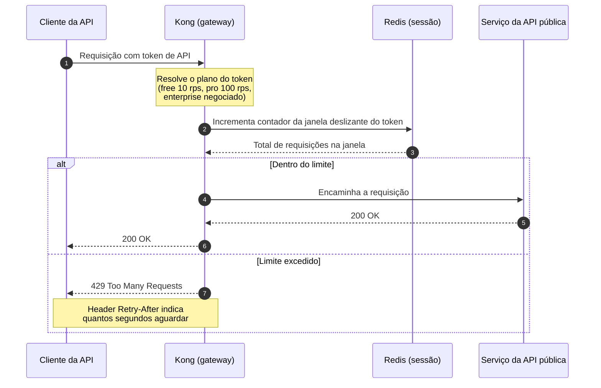

# DD-2026-008 · Rate limiting da API pública

| | |
|---|---|
| **Documento** | DD-2026-008 |
| **Estado** | Rascunho |
| **Autores** | _a definir_ |
| **Revisores** | _a definir_ |
| **Criado em** | 2026-07-20 |
| **Última atualização** | 2026-07-20 |
| **Tags** | api-pública, rate-limiting, gateway, disponibilidade |

## Resumo

A API pública não impõe nenhum limite de tráfego por cliente, e um único integrador mal configurado consegue derrubá-la para todos os demais — foi o que aconteceu no incidente INC-4412. Este documento propõe aplicar rate limiting por token de API no gateway, com limites definidos por plano contratado.

## Contexto

A API pública atende todos os clientes sem qualquer limite por cliente: quem manda mais requisições simplesmente consome mais capacidade compartilhada. No incidente INC-4412, um cliente com uma integração mal feita enviou 40 vezes o tráfego normal e a API ficou indisponível para todos os clientes por 25 minutos.

O tráfego entra pelo Kong, que já é o gateway da API pública. A plataforma também já opera um Redis usado para sessão.

## Objetivos

- Nenhum token de API excede o limite do seu plano por mais de 1 segundo.
- A API absorve um cliente abusivo sem degradar o atendimento dos demais clientes.

## Proposta

Aplicar rate limiting por **token de API** no Kong, antes de a requisição alcançar qualquer serviço. O gateway resolve o plano do token e conta as requisições em uma **janela deslizante**, com os contadores no Redis que já usamos para sessão. Os limites são por plano: **free 10 rps**, **pro 100 rps**, **enterprise negociado**. Quando o token estoura o limite, o Kong responde **429** com o header **Retry-After**, dizendo ao cliente quanto tempo esperar antes de tentar de novo.

O cliente envia a requisição com seu token de API e o Kong é quem decide, sozinho, se ela segue adiante: ele identifica o plano do token, incrementa no Redis o contador da janela deslizante daquele token e compara o total com o limite do plano. Dentro do limite, o Kong encaminha a requisição ao serviço da API pública e devolve a resposta ao cliente. Acima do limite, o Kong corta ali mesmo — devolve 429 com Retry-After e o serviço nem chega a ser acionado. O contador vive no Redis porque todas as instâncias do gateway precisam enxergar a mesma contagem; um contador local por instância limitaria cada instância, não o cliente.

O escopo do limite é o token, não o endereço de origem: dois clientes atrás do mesmo IP têm tokens diferentes e contadores independentes.

### Compensações

- ✓ Um cliente abusivo passa a consumir no máximo o seu limite; o impacto de uma integração mal feita para de recair sobre os demais clientes
- ✓ O corte acontece no gateway, antes de a requisição consumir malha de serviço e capacidade dos serviços
- ✓ Reaproveita o Kong e o Redis que já operamos — sem novo componente de infraestrutura e sem custo de licença
- ✗ Um cliente legítimo em pico (uma Black Friday, por exemplo) pode tomar 429 mesmo sem estar abusando; mitigamos com o Retry-After e com um alerta para o time de contas avisar os clientes enterprise
- ✗ O Redis de sessão passa a estar no caminho crítico de toda requisição da API pública, acoplando a disponibilidade da API à dele

## Alternativas consideradas

**Limitar dentro de cada serviço** — cada serviço da API pública contaria as requisições do token e recusaria o excesso. Descartada: a decisão chega tarde demais, porque a requisição já consumiu o gateway e a malha antes de ser recusada; além disso, a regra teria de ser replicada em cada serviço.

**Módulo pago de rate limiting do gateway gerenciado** — a funcionalidade pronta do produto gerenciado, sem implementação nossa. Descartada por custo e por lock-in no fornecedor.

**Não fazer nada** — manter a API sem limites. Descartada: é exatamente o cenário do INC-4412, em que um único cliente tirou a API do ar por 25 minutos para todo mundo, e nada impede que se repita.

**Escolhida: rate limiting por token no Kong**, por cortar o excesso no ponto mais barato do caminho e reaproveitar componentes que já operamos.

## Riscos

| Risco | Mitigação |
|---|---|
| O Redis de sessão vira ponto de contenção ao absorver os contadores de toda a API pública | Medir o impacto na fase de shadow mode, antes de qualquer enforcement |
| Cliente legítimo em pico recebe 429 e interpreta como indisponibilidade | Retry-After em toda resposta 429 e alerta para o time de contas avisar os clientes enterprise |

## Plano de entrega

1. **Shadow mode** — contadores ativos, apenas medindo: quantos tokens estourariam o limite, e qual o custo dos contadores no Redis de sessão.
2. **Enforcing no plano free** — o 429 passa a valer para os tokens do plano free.
3. **Enforcing geral** — o 429 passa a valer para todos os planos.
