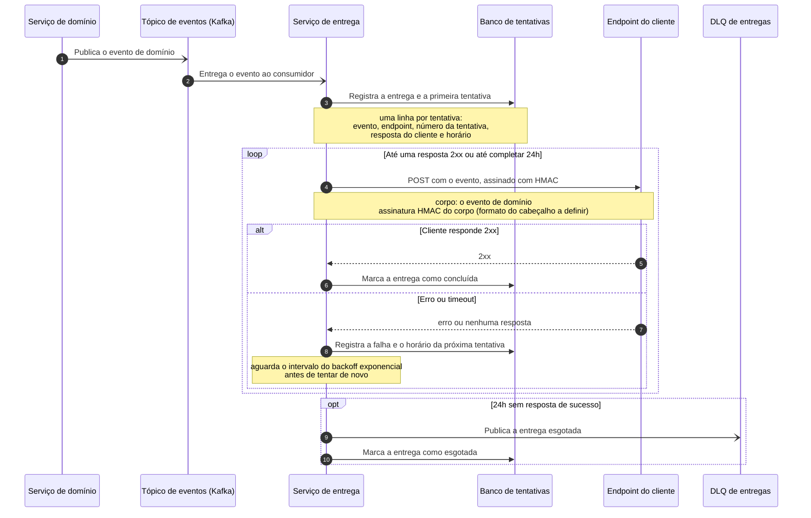

# Serviço de entrega de webhooks de saída

| | |
|---|---|
| **Documento** | DESIGN-DOC |
| **Estado** | Rascunho |
| **Título** | Serviço de entrega de webhooks de saída |
| **Autores** | A definir |
| **Revisores** | A definir — sugestões: Segurança (assinatura e guarda das chaves HMAC), Infraestrutura/Plataforma (novo serviço, banco e tópico de DLQ), times donos dos serviços de domínio que hoje fazem o POST |
| **Criado** | 2026-07-20 |
| **Última atualização** | 2026-07-20 |
| **Tags** | webhooks, integração, kafka, confiabilidade |

## Glossário

| Termo | Definição |
|---|---|
| **Webhook de saída** | Chamada HTTP que a nossa plataforma faz para um endpoint do cliente para avisá-lo de um evento. |
| **Evento de domínio** | Fato de negócio já publicado pelos nossos serviços no Kafka (por exemplo, "pedido aprovado"). |
| **HMAC** | Código de autenticação de mensagem baseado em hash: assina o corpo da requisição com uma chave secreta compartilhada, para que o cliente confirme que a chamada veio de nós e não foi alterada. |
| **Backoff exponencial** | Política de reenvio em que o intervalo entre tentativas cresce a cada falha, em vez de repetir na mesma cadência. |
| **DLQ** | *Dead letter queue*: fila para onde vão as entregas que esgotaram a política de retentativa, para tratamento fora do fluxo normal. |

## Visão geral

Hoje, cada serviço que precisa avisar um cliente externo faz o POST por conta própria. Quando o endpoint do cliente está fora do ar, o evento simplesmente se perde e nós só descobrimos quando o suporte é acionado. Este documento propõe concentrar essa comunicação em um único serviço de entrega de webhooks: ele consome os eventos de domínio que já publicamos no Kafka, registra cada tentativa, entrega a chamada assinada ao cliente e reenvia com backoff exponencial até o cliente responder — ou até esgotar 24 horas, quando a entrega vai para uma DLQ.

O documento descreve a arquitetura desse serviço, o fluxo de entrega com retentativa, o custo que aceitamos em troca (a entrega deixa de ser imediata em alguns casos) e a alternativa que descartamos.

## Escopo e contexto

- Os serviços de domínio já publicam seus eventos no Kafka; a infraestrutura de mensageria existe e está em uso.
- A notificação ao cliente externo, porém, não passa por esse caminho: cada serviço faz o `POST` diretamente, no momento em que trata o evento.
- Esse `POST` não tem retentativa. Se o endpoint do cliente estiver indisponível — ou responder erro — a chamada se perde ali mesmo.
- Também não existe log central das chamadas. Ninguém consegue responder "nós tentamos entregar esse evento? quantas vezes? o que o cliente respondeu?" sem ir atrás dos logs de cada serviço, um a um.
- A consequência prática: descobrimos a falha pelo suporte, depois que o cliente reclama.

## Objetivos e fora de escopo

**Objetivos**

- Nenhum evento perdido por indisponibilidade do cliente: toda entrega que falha é reenviada com backoff exponencial por até 24 horas e, se ainda assim não for aceita, termina na DLQ em vez de desaparecer.
- Visibilidade de cada tentativa: toda tentativa de entrega fica registrada — evento, endpoint, resultado e horário — em um único lugar consultável.
- Um único caminho de saída: os serviços de domínio deixam de fazer o `POST` na mão e passam apenas a publicar o evento no Kafka, como já fazem.

**Fora de escopo**

- Entrega em tempo real garantida: a entrega passa a ser assíncrona (ver *Trade-offs*).
- Reprocessamento automático do que cair na DLQ: o tratamento da DLQ é manual/operacional nesta primeira versão.
- Webhooks de entrada (chamadas que o cliente faz para nós) — este documento trata só do sentido de saída.

## A solução

### Visão geral da solução

Um serviço único de entrega assume toda a comunicação com endpoints de clientes. Ele consome os eventos de domínio do Kafka que já temos, persiste a tentativa no Postgres, faz o `POST` assinado com HMAC no endpoint do cliente e, quando a entrega falha, reenvia com backoff exponencial por até 24 horas. Passado esse prazo sem sucesso, a entrega vai para uma DLQ.

A troca central está aí: a entrega deixa de sair no mesmo instante em que o evento acontece, porque passa pela fila e pelo serviço de entrega, e ganha em contrapartida a garantia de retentativa e o registro de cada tentativa.

### Arquitetura


<!-- Imagem a renderizar a partir do DSL abaixo na passagem manual. -->

<details>
<summary>Fonte do diagrama (Structurizr DSL)</summary>

```
workspace "Entrega de webhooks de saída" "Serviço único de entrega de webhooks para endpoints de clientes externos." {

    !identifiers hierarchical

    model {
        servicos = softwareSystem "Serviços de domínio" "Serviços internos que publicam os eventos de negócio." {
            tags "External"
        }

        cliente = softwareSystem "Endpoint do cliente" "Endpoint HTTP do cliente externo que recebe a notificação." {
            tags "External"
        }

        webhooks = softwareSystem "Entrega de webhooks de saída" "Entrega os eventos de domínio aos endpoints dos clientes, com retentativa e registro de cada tentativa." {
            eventos = container "Tópicos de eventos de domínio" "Eventos de negócio publicados pelos serviços de domínio." "Kafka" {
                tags "Queue"
            }
            entregador = container "Serviço de entrega" "Consome os eventos, assina o corpo com HMAC, entrega ao endpoint do cliente e reagenda a retentativa com backoff exponencial." "A definir"
            tentativas = container "Banco de tentativas" "Guarda uma linha por tentativa de entrega: evento, endpoint, resposta e horário." "PostgreSQL" {
                tags "Database"
            }
            dlq = container "DLQ de entregas" "Recebe as entregas que esgotaram 24h de retentativa." "Kafka" {
                tags "Queue"
            }
        }

        servicos -> webhooks.eventos "Publica eventos de domínio em" "Kafka"
        webhooks.eventos -> webhooks.entregador "Entrega os eventos de domínio para" "Kafka"
        webhooks.entregador -> webhooks.tentativas "Registra e consulta as tentativas de entrega em" "SQL/TCP"
        webhooks.entregador -> cliente "Envia o evento assinado com HMAC para" "HTTPS"
        webhooks.entregador -> webhooks.dlq "Publica as entregas esgotadas em" "Kafka"
    }

    views {
        systemContext webhooks "SystemContext" {
            include *
            autoLayout
        }

        container webhooks "Containers" {
            include *
            autoLayout lr
        }

        styles {
            element "Element" {
                background #1168bd
                color #ffffff
            }
            element "Person" {
                shape person
            }
            element "Database" {
                shape cylinder
            }
            element "Queue" {
                shape pipe
            }
            element "External" {
                background #999999
                color #ffffff
            }
        }
    }

    configuration {
        scope softwaresystem
    }
}
```

</details>

Os **serviços de domínio** continuam fazendo exatamente o que fazem hoje: publicam seus eventos nos **tópicos de eventos de domínio** do Kafka. A novidade é que eles deixam de chamar o cliente. Quem passa a fazer isso é o **serviço de entrega**, que consome esses tópicos, grava a tentativa no **banco de tentativas** (Postgres) e faz o `POST` assinado no **endpoint do cliente**. Se o cliente não aceita a chamada, o próprio serviço de entrega reagenda a tentativa seguinte com backoff exponencial, gravando cada rodada no mesmo banco — é esse banco que responde "tentamos, quantas vezes e o que o cliente respondeu". Quando 24 horas se passam sem uma resposta de sucesso, o serviço publica a entrega na **DLQ de entregas**, e ela sai do ciclo de retentativa.

### Fluxo de entrega com retentativa



O fluxo começa no serviço de domínio, que publica o evento no Kafka (passo 1) sem saber quem vai consumi-lo. O serviço de entrega recebe o evento (passo 2) e, antes de qualquer chamada externa, registra a entrega no banco de tentativas (passo 3) — é o que garante que nenhum evento consumido fique sem rastro. A partir daí o serviço entra no ciclo de entrega: envia o `POST` assinado ao endpoint do cliente (passo 5) e grava o resultado. Se o cliente responde `2xx`, a entrega é encerrada como concluída (passos 6 e 7). Se responde erro ou não responde, a falha é gravada junto com o horário da próxima tentativa (passos 8 e 9) e o serviço aguarda o intervalo do backoff antes de repetir o ciclo. Se as 24 horas terminarem sem sucesso, a entrega é publicada na DLQ e marcada como esgotada (passos 10 e 11), o que a tira do ciclo e a coloca no radar de quem opera o serviço.

### Dados e sensibilidade

O banco de tentativas guarda, por tentativa: o evento entregue, o endpoint de destino, o número da tentativa, a resposta do cliente e o horário. Como o corpo entregue é o próprio evento de domínio, o banco passa a conter uma cópia de dados de negócio que hoje só circulam no Kafka — o que faz da retenção desses registros e do tratamento de dados sensíveis dentro do payload pontos a definir (ver *Questões em aberto*).

## Trade-offs da solução escolhida

- ✓ Nenhum evento se perde por indisponibilidade do cliente: a retentativa por 24 horas cobre quedas longas do endpoint e, se elas passarem disso, a DLQ preserva o evento em vez de descartá-lo.
- ✓ Cada tentativa fica registrada em um lugar só, então a pergunta "o que aconteceu com esse evento?" passa a ter resposta sem depender do suporte nem de caçar logs em vários serviços.
- ✓ O payload não sai da nossa borda: a entrega continua saindo da nossa infraestrutura direto para o cliente.
- ✓ Os serviços de domínio param de carregar código de entrega HTTP, retentativa e assinatura — cada um passa apenas a publicar seu evento.
- ✗ **A entrega deixa de ser imediata em alguns casos**, porque passa pela fila e pelo serviço de entrega antes de chegar ao cliente. Este é o custo que aceitamos em troca da garantia de reenvio.
- ✗ Passamos a operar mais um serviço e mais um banco: eles entram no rol de coisas que precisam de plantão, monitoramento e capacidade.
- ✗ A entrega vira um ponto central: quando o serviço de entrega para, param todos os webhooks de saída, e não apenas os de um serviço de domínio.

## Alternativas consideradas

### Não fazer nada — manter o POST na mão em cada serviço (descartada)

Manter o cenário atual custa zero de desenvolvimento e não adiciona nenhum componente para operar. Foi descartada porque é exatamente ela que produz o problema: sem retentativa, uma queda do endpoint do cliente destrói o evento; sem registro central, a descoberta da falha depende de o cliente reclamar com o suporte. O custo de continuar assim não é visível no orçamento, mas aparece em cada incidente.

### SaaS de webhooks (descartada)

Um serviço de webhooks de mercado entregaria retentativa, assinatura e painel de tentativas sem construirmos nada. Foi descartada por dois motivos: o custo por evento, que cresce com o volume, e o fato de o payload passar a sair da nossa borda — os eventos de domínio ficariam com um terceiro para poderem ser entregues.

### Serviço próprio de entrega (escolhida)

Ganha porque atende aos dois objetivos — nenhum evento perdido e visibilidade de cada tentativa — sem custo por evento e sem tirar o payload da nossa borda, reaproveitando o Kafka que já temos. Aceita em troca a latência da fila e o custo operacional de mais um serviço.

## Preocupações transversais

- **Segurança.** A chamada ao cliente é assinada com HMAC, o que dá ao cliente como verificar a origem e a integridade do que recebeu. Como as chaves são geradas, guardadas e rotacionadas ainda não está definido, e é o principal ponto para a revisão de Segurança. O payload continua saindo da nossa infraestrutura, sem intermediários.
- **Infraestrutura.** Entram na operação um serviço novo, um banco Postgres e um tópico de DLQ; o serviço passa a ser mais um consumidor dos tópicos de eventos de domínio existentes.
- **Times donos dos serviços de domínio.** Cada serviço que hoje faz o `POST` precisa remover esse código e confiar a entrega ao novo serviço — é uma mudança coordenada, e esses times precisam revisar este documento.

## Testabilidade e observabilidade

O próprio banco de tentativas é o instrumento de observabilidade do objetivo "visibilidade de cada tentativa": ele responde, por evento, quantas tentativas houve, o que o cliente respondeu e quando. A DLQ é o segundo sinal — uma entrega ali significa 24 horas de falha, e é o gatilho natural para ação humana. Quais métricas e alertas derivam desses dois (taxa de falha por cliente, tamanho da DLQ, idade da entrega mais antiga em retentativa) ainda precisa ser definido.

## Questões em aberto

- Qual a linguagem/stack do serviço de entrega e qual time fica responsável por operá-lo?
- Qual é a curva concreta do backoff dentro das 24 horas (intervalo inicial, fator, número máximo de tentativas)?
- Como o serviço descobre o endpoint de cada cliente e a chave HMAC correspondente — existe um cadastro de assinantes hoje, ou ele faz parte deste trabalho?
- Como as chaves HMAC são geradas, guardadas e rotacionadas?
- Quais respostas do cliente contam como falha retentável? Erros `4xx` de payload, por exemplo, provavelmente não melhoram com o reenvio.
- O cliente pode receber o mesmo evento mais de uma vez ou fora de ordem? Se puder, precisamos dizer isso no contrato do webhook.
- Qual a retenção dos registros de tentativa e o que fazer com dados sensíveis dentro do payload armazenado?
- Quem cuida da DLQ, com qual expectativa de prazo?
- Quais métricas e alertas acompanham a entrega em produção?
- Em quais etapas os serviços de domínio migram — todos de uma vez ou um a um — e existe caminho de volta se a migração de um deles der errado?
