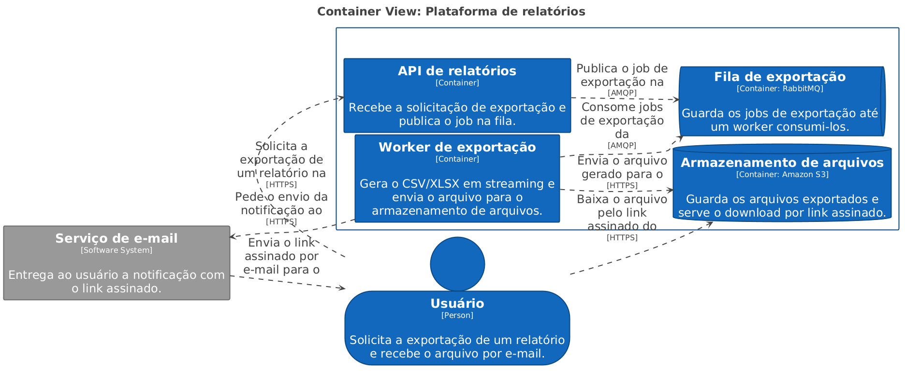
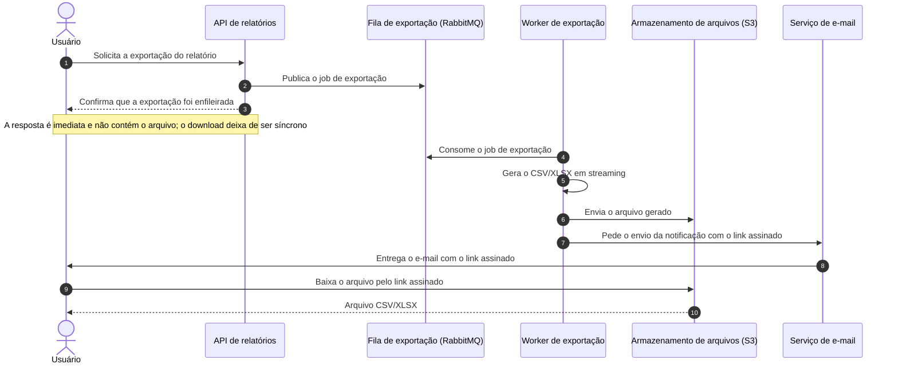

# Exportação de relatórios em background

| | |
|---|---|
| **Documento** | DESIGN DOC |
| **Estado** | Rascunho |
| **Título** | Exportação de relatórios em background |
| **Autores** | *a definir* |
| **Revisores sugeridos** | *a definir* (Plataforma — fila compartilhada), *a definir* (Segurança — link assinado com PII) |
| **Criado em** | 2026-07-21 |
| **Última atualização** | 2026-07-21 |
| **Tags** | exportação, relatórios, assíncrono, fila |

## Glossário

| Termo | Definição |
|---|---|
| **BI** | *Business Intelligence* — ferramentas de análise e relatórios, normalmente contratadas de terceiros. |
| **CSV** | Formato de arquivo de texto com valores separados por vírgula. |
| **Gateway** | Ponto de entrada HTTP que fica na frente da API e aplica, entre outras políticas, o timeout de 30s. |
| **Job** | Unidade de trabalho enfileirada — aqui, uma solicitação de exportação a ser processada por um worker. |
| **Link assinado** | URL temporária que autoriza o download de um arquivo no S3 sem exigir credenciais da AWS. |
| **PII** | *Personally Identifiable Information* — dado que identifica uma pessoa (nome, e-mail, documento). |
| **RabbitMQ** | Broker de mensagens já em uso na nossa infraestrutura, onde a fila de exportação vai viver. |
| **S3** | Serviço de armazenamento de objetos da AWS, onde os arquivos exportados ficam guardados. |
| **Streaming** | Geração do arquivo em blocos, escrevendo a saída conforme os dados chegam, sem montar o resultado inteiro em memória. |
| **Worker** | Processo separado da API que consome jobs da fila e os executa. |
| **XLSX** | Formato de planilha do Excel. |

## Visão geral

Hoje a API gera os relatórios dentro da própria requisição e as exportações grandes não terminam a tempo: o gateway corta a conexão em 30s e cerca de 12% das exportações acima de 50 mil linhas falham. Este documento propõe tirar a geração do caminho da requisição — a API passa a enfileirar um job, um worker separado gera o arquivo e o usuário recebe por e-mail um link para baixá-lo.

A proposta troca imediatismo por confiabilidade: nenhuma exportação volta a morrer no timeout, e em contrapartida ninguém mais recebe o arquivo na hora, nem quem exporta poucas linhas.

## Escopo e contexto

- A exportação de relatórios acontece hoje de forma síncrona: o usuário chama a API, a API monta o CSV/XLSX e devolve o arquivo na resposta.
- O gateway na frente da API encerra qualquer requisição que passe de 30s. Relatórios grandes estouram esse limite.
- Cerca de **12% das exportações acima de 50 mil linhas falham** por esse motivo.
- O suporte abre ticket sobre essas falhas **toda semana**.
- Já temos **RabbitMQ** rodando na infraestrutura, operado pelo time de plataforma.

## Objetivos e fora de escopo

### Objetivos

- **Zerar as falhas de exportação por timeout**, tirando a geração do relatório de dentro da requisição HTTP.
- **Suportar exportações de até 100 mil linhas**, gerando o arquivo em streaming em vez de montá-lo inteiro em memória.

### Fora de escopo

- **Manter um caminho síncrono para exportações pequenas.** Toda exportação passa pela fila, inclusive as que hoje funcionam na hora (ver Trade-offs).
- **Mudar o conteúdo ou o formato dos relatórios.** Continuam sendo os mesmos CSV/XLSX de hoje.

## O design

### Visão da solução

A API deixa de gerar o relatório e passa a publicar um job de exportação na fila do RabbitMQ, respondendo na hora que o pedido foi aceito. Um worker separado consome esse job, gera o CSV/XLSX em streaming, envia o arquivo para o S3 e dispara um e-mail com um link assinado para o usuário baixar.

A separação entre API e worker é o que resolve o problema: a requisição HTTP passa a durar o tempo de publicar uma mensagem, e a geração — que é a parte demorada — roda fora do alcance do timeout do gateway. O preço dessa separação é que o arquivo nunca mais chega na resposta da chamada.

### Arquitetura



<details>
<summary>Fonte do diagrama (Structurizr DSL)</summary>

```
workspace "Exportação de relatórios em background" "Modelo C4 do serviço de exportação assíncrona de relatórios." {

    !identifiers hierarchical

    model {
        usuario = person "Usuário" "Solicita a exportação de um relatório e recebe o arquivo por e-mail."

        relatorios = softwareSystem "Plataforma de relatórios" "Permite consultar e exportar relatórios em CSV e XLSX." {
            api = container "API de relatórios" "Recebe a solicitação de exportação e publica o job na fila."
            fila = container "Fila de exportação" "Guarda os jobs de exportação até um worker consumi-los." "RabbitMQ" {
                tags "Queue"
            }
            worker = container "Worker de exportação" "Gera o CSV/XLSX em streaming e envia o arquivo para o armazenamento de arquivos."
            arquivos = container "Armazenamento de arquivos" "Guarda os arquivos exportados e serve o download por link assinado." "Amazon S3" {
                tags "Database"
            }
        }

        email = softwareSystem "Serviço de e-mail" "Entrega ao usuário a notificação com o link assinado." {
            tags "External"
        }

        usuario -> relatorios.api "Solicita a exportação de um relatório na" "HTTPS"
        relatorios.api -> relatorios.fila "Publica o job de exportação na" "AMQP"
        relatorios.worker -> relatorios.fila "Consome jobs de exportação da" "AMQP"
        relatorios.worker -> relatorios.arquivos "Envia o arquivo gerado para o" "HTTPS"
        relatorios.worker -> email "Pede o envio da notificação ao" "HTTPS"
        email -> usuario "Envia o link assinado por e-mail para o"
        usuario -> relatorios.arquivos "Baixa o arquivo pelo link assinado do" "HTTPS"
    }

    views {
        systemContext relatorios "SystemContext" {
            include *
            autoLayout lr
        }

        container relatorios "Containers" {
            include *
            autoLayout lr
        }

        styles {
            element "Element" {
                background #1168bd
                color #ffffff
            }
            element "Person" {
                shape person
            }
            element "Database" {
                shape cylinder
            }
            element "Queue" {
                shape pipe
            }
            element "External" {
                background #999999
                color #ffffff
            }
        }
    }

    configuration {
        scope softwaresystem
    }
}
```

</details>

Quatro peças compõem a solução, mais o serviço de e-mail que já entrega nossas notificações:

- **API de relatórios** — recebe a solicitação do usuário e publica o job de exportação na fila. Não gera mais arquivo nenhum, então sua resposta não depende do tamanho do relatório.
- **Fila de exportação (RabbitMQ)** — guarda os jobs até que um worker os consuma. É a fronteira que desacopla o tempo da requisição do tempo da geração, e roda no RabbitMQ que o time de plataforma já opera.
- **Worker de exportação** — consome os jobs, gera o CSV/XLSX em streaming e envia o arquivo para o S3. Por rodar fora do gateway, pode levar o tempo que a exportação exigir.
- **Armazenamento de arquivos (S3)** — guarda os arquivos gerados e serve o download diretamente ao usuário por meio do link assinado, sem passar pela API.
- **Serviço de e-mail** — entrega ao usuário a mensagem com o link assinado quando o worker termina.

### Fluxo de uma exportação



O usuário pede a exportação (1) e a API apenas publica o job na fila (2), respondendo em seguida que o pedido foi aceito (3) — é aqui que a chamada deixa de correr contra o timeout de 30s. O worker consome o job (4), gera o arquivo em streaming (5) e o envia para o S3 (6). Terminada a geração, o worker pede o envio da notificação (7), o usuário recebe o e-mail com o link assinado (8) e baixa o arquivo direto do S3 (9, 10).

O diagrama mostra apenas o caminho feliz. O que acontece quando a geração falha, quando o job estoura tentativas ou quando o e-mail não é entregue ainda não foi definido — está em Questões em aberto.

### Dados e sensibilidade

Os relatórios exportados contêm dados de cliente, incluindo PII. Isso aparece em dois lugares do design:

- **No S3**, onde o arquivo gerado passa a ficar armazenado — dado que antes só existia em trânsito, dentro da resposta HTTP.
- **No link assinado**, que autoriza o download do arquivo sem exigir autenticação na nossa API e trafega por e-mail.

Ambos os pontos precisam da revisão do time de segurança (ver Preocupações transversais).

## Trade-offs da solução escolhida

- ✓ **Nenhuma exportação morre no timeout.** A geração sai do caminho da requisição, então o limite de 30s do gateway deixa de valer para ela — é o objetivo principal.
- ✓ **Relatórios maiores passam a caber.** Gerar em streaming, sem o teto do tempo de requisição, é o que sustenta a meta de 100 mil linhas.
- ✓ **Um caminho só.** Toda exportação segue o mesmo fluxo, então não mantemos dois códigos de geração nem uma regra de "acima de tantas linhas, vai pela fila".
- ✗ **O usuário perde o download imediato.** Exportações pequenas, que hoje voltam na hora, passam a chegar por e-mail. É o custo que aceitamos conscientemente em troca do caminho único: preferimos um comportamento previsível para todo mundo a um comportamento bom para alguns e quebrado para outros.
- ✗ **Mais peças para operar.** Passamos a depender de fila, worker, S3 e entrega de e-mail no caminho de uma funcionalidade que antes vivia inteira dentro da API — cada uma dessas peças é um novo modo de falha.
- ✗ **Dado de cliente passa a ficar armazenado.** O arquivo com PII, que antes só trafegava na resposta, agora repousa no S3 e fica acessível por um link assinado enviado por e-mail.

## Alternativas consideradas

| Alternativa | Trade-offs | Resultado |
|---|---|---|
| **Job em background com fila, worker, S3 e link por e-mail** | ✓ Elimina o timeout; ✓ suporta relatórios maiores; ✗ acaba com o download imediato; ✗ mais peças para operar | **Escolhida** |
| Manter tudo síncrono, aumentando o timeout | ✓ Mudança mínima, nenhuma peça nova; ✗ só empurra o problema: o próximo relatório maior volta a estourar o novo limite | Descartada |
| Usar uma ferramenta de BI externa | ✓ Não construímos nada; ✗ custo de contratação; ✗ expõe dado de cliente a um terceiro | Descartada |
| Não fazer nada | ✓ Custo zero agora; ✗ mantém 12% das exportações acima de 50 mil linhas falhando e o suporte abrindo ticket toda semana | Descartada |

Aumentar o timeout foi a alternativa mais barata e a que descartamos primeiro: ela não muda a natureza do problema, só o adia até o próximo relatório grande. A ferramenta de BI resolveria a geração sem código nosso, mas cobra por isso e exigiria entregar dado de cliente a um fornecedor — dois custos que não aceitamos. Não fazer nada é insustentável pelos próprios números: a falha é recorrente, mensurável e chega ao suporte toda semana.

## Preocupações transversais

### Segurança

O link assinado dá acesso a um arquivo com PII e viaja por e-mail, fora do nosso controle de sessão. O time de segurança precisa revisar pelo menos o tempo de validade do link, o que acontece se ele for repassado a terceiros e por quanto tempo os arquivos ficam no S3.

### Plataforma

A fila de exportação vai para o RabbitMQ compartilhado, que o time de plataforma opera. Uma exportação de 100 mil linhas ocupa um worker por um tempo longo, e uma rajada de exportações vira acúmulo de mensagens na fila — carga que hoje não existe nesse broker. O time de plataforma precisa revisar o dimensionamento e o isolamento em relação às outras filas.

## Questões em aberto

- Quem assina o documento como autor, e quem revisa por Plataforma e por Segurança?
- Qual stack o worker usa, e ele vive no mesmo repositório da API?
- Qual é a validade do link assinado, e por quanto tempo os arquivos ficam no S3?
- O que acontece quando a geração falha no meio: o job é retentado, vai para uma fila de mensagens não processadas, o usuário é avisado?
- Como o usuário acompanha uma exportação em andamento entre o pedido e o e-mail — existe alguma tela ou consulta de status?
- Como verificamos o resultado antes de subir (teste de carga com 100 mil linhas?) e o que monitoramos em produção para provar que os timeouts foram a zero?
- A entrega vai em uma etapa só ou em fases, e qual é o plano de volta se algo der errado?
