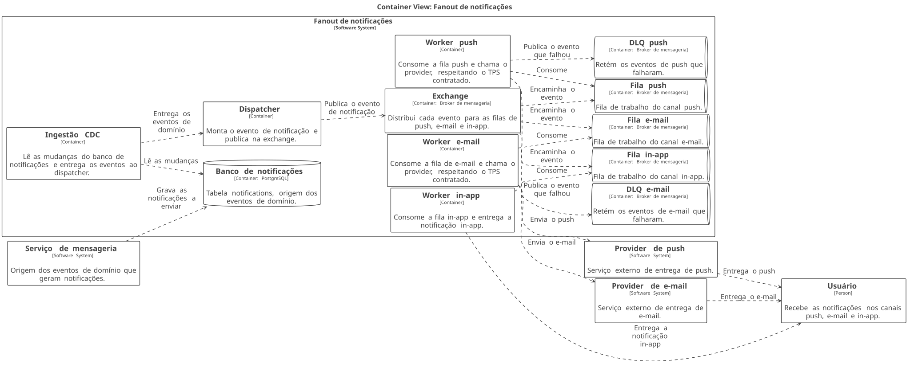

# Fanout de notificações

| | |
|---|---|
| **Estado** | Em revisão |
| **Autor** | Time de Mensageria |
| **Criado em** | 2026-01-28 |
| **Última atualização** | 2026-07-21 |

## Glossário

| Termo | Definição |
|---|---|
| **Fanout** | Padrão em que um único evento publicado é distribuído para vários consumidores independentes — aqui, um por canal de notificação. |
| **Exchange** | Componente do broker de mensageria que recebe as mensagens publicadas e as encaminha para as filas. |
| **CDC** (*Change Data Capture*) | Captura das mudanças de um banco de dados e sua publicação como fluxo de eventos. |
| **DLQ** (*Dead Letter Queue*) | Fila para onde vão as mensagens que não puderam ser processadas, para inspeção e reprocessamento. |
| **TPS** (*Transactions Per Second*) | Taxa de requisições por segundo; aqui, o limite que cada provider aceita. |
| **SLA** (*Service Level Agreement*) | Compromisso de nível de serviço acordado — no caso, o prazo de entrega das notificações. |
| **In-app** | Canal em que a notificação aparece dentro da própria aplicação, sem passar por um provider externo. |

## Visão geral

O envio de notificações hoje é sequencial e, com o crescimento da base de usuários, ficou lento. Este documento propõe substituir esse modelo por um fanout baseado em filas: um dispatcher publica cada evento de notificação numa exchange e workers dedicados a cada canal consomem em paralelo.

O documento descreve a arquitetura proposta e o plano de migração canal a canal, até o desligamento do processamento atual.

## Escopo e contexto

O serviço de notificações processa os envios de forma sequencial dentro do próprio serviço de mensageria. Um cron roda a cada minuto, lê a tabela `notifications`, monta o payload de cada canal (push, e-mail e in-app) e chama os providers um a um. Esse modelo começou a apresentar lentidão à medida que a base cresceu.

## Objetivos

- Melhorar a performance dos envios
- Tornar o sistema escalável
- Garantir o SLA

## Fora de escopo

- O sistema não deve ser lento
- O sistema não deve perder notificações

## Solução

A proposta é distribuir os envios com um fanout de filas por canal: a ingestão CDC entrega os eventos de domínio ao dispatcher, que publica na exchange; a exchange encaminha o evento para a fila de cada canal; e um worker por canal consome sua fila em paralelo, respeitando o TPS de cada provider, com DLQ para o que falhar.



<details>
<summary>Fonte do diagrama (Structurizr DSL)</summary>

```
workspace {
    model {
        usuario = person "Usuário" "Recebe as notificações nos canais push, e-mail e in-app."
        mensageria = softwareSystem "Serviço de mensageria" "Origem dos eventos de domínio que geram notificações."

        notificacoes = softwareSystem "Fanout de notificações" {
            banco = container "Banco de notificações" "Tabela notifications, origem dos eventos de domínio." "PostgreSQL" "Database"
            cdc = container "Ingestão CDC" "Lê as mudanças do banco de notificações e entrega os eventos ao dispatcher."
            dispatcher = container "Dispatcher" "Monta o evento de notificação e publica na exchange."
            exchange = container "Exchange" "Distribui cada evento para as filas de push, e-mail e in-app." "Broker de mensageria"
            filaPush = container "Fila push" "Fila de trabalho do canal push." "Broker de mensageria" "Queue"
            filaEmail = container "Fila e-mail" "Fila de trabalho do canal e-mail." "Broker de mensageria" "Queue"
            filaInApp = container "Fila in-app" "Fila de trabalho do canal in-app." "Broker de mensageria" "Queue"
            workerPush = container "Worker push" "Consome a fila push e chama o provider, respeitando o TPS contratado."
            workerEmail = container "Worker e-mail" "Consome a fila de e-mail e chama o provider, respeitando o TPS contratado."
            workerInApp = container "Worker in-app" "Consome a fila in-app e entrega a notificação in-app."
            dlqPush = container "DLQ push" "Retém os eventos de push que falharam." "Broker de mensageria" "Queue"
            dlqEmail = container "DLQ e-mail" "Retém os eventos de e-mail que falharam." "Broker de mensageria" "Queue"
        }

        providerPush = softwareSystem "Provider de push" "Serviço externo de entrega de push."
        providerEmail = softwareSystem "Provider de e-mail" "Serviço externo de entrega de e-mail."

        mensageria -> banco "Grava as notificações a enviar"
        cdc -> banco "Lê as mudanças"
        cdc -> dispatcher "Entrega os eventos de domínio"
        dispatcher -> exchange "Publica o evento de notificação"
        exchange -> filaPush "Encaminha o evento"
        exchange -> filaEmail "Encaminha o evento"
        exchange -> filaInApp "Encaminha o evento"
        workerPush -> filaPush "Consome"
        workerEmail -> filaEmail "Consome"
        workerInApp -> filaInApp "Consome"
        workerPush -> dlqPush "Publica o evento que falhou"
        workerEmail -> dlqEmail "Publica o evento que falhou"
        workerPush -> providerPush "Envia o push"
        workerEmail -> providerEmail "Envia o e-mail"
        workerInApp -> usuario "Entrega a notificação in-app"
        providerPush -> usuario "Entrega o push"
        providerEmail -> usuario "Entrega o e-mail"
    }

    views {
        container notificacoes "containers" {
            include *
            autolayout lr
        }
        styles {
            element "Database" {
                shape cylinder
            }
            element "Queue" {
                shape pipe
            }
        }
    }
}
```

</details>

O serviço de mensageria continua gravando as notificações a enviar na tabela `notifications`. A **ingestão CDC** lê as mudanças dessa tabela e entrega os eventos de domínio ao **dispatcher**, que monta o evento de notificação e o publica na **exchange**. A exchange encaminha cada evento para as três filas de canal — **push**, **e-mail** e **in-app**.

Cada canal tem seu **worker**, que consome apenas a sua fila. O worker de push e o worker de e-mail chamam os respectivos providers externos respeitando o TPS contratado; o worker in-app entrega a notificação dentro da própria aplicação. Quando o envio falha, o worker de push e o worker de e-mail publicam o evento na **DLQ** do canal. Como cada canal tem fila e worker próprios, um provider lento ou indisponível segura apenas a sua fila, e não os demais canais.

## Plano

1. Criar exchange e filas
2. Migrar o canal de e-mail
3. Migrar push e in-app
4. Desligar o cron
