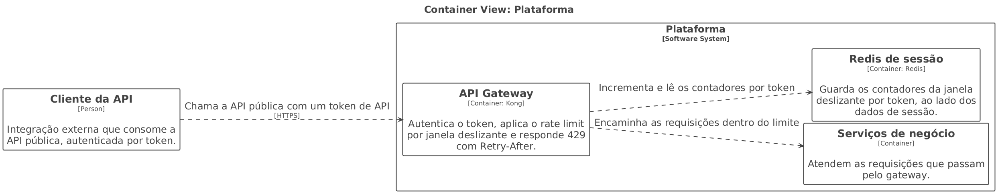
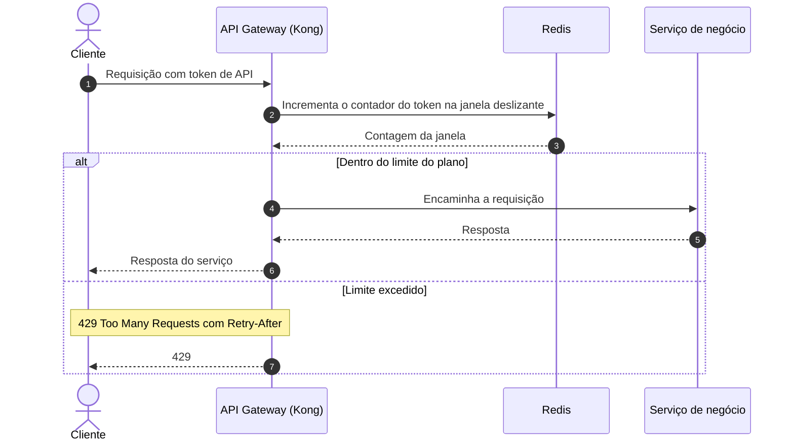

# DD-2026-008 · Rate limiting da API pública

| | |
|---|---|
| **Documento** | DD-2026-008 |
| **Estado** | Rascunho |
| **Autores** | A definir |
| **Revisores** | A definir |
| **Criado em** | 2026-07-21 |
| **Última atualização** | 2026-07-21 |
| **Tags** | api-pública, rate limiting, gateway, disponibilidade |

## Resumo

A API pública não impõe hoje nenhum limite de uso por cliente: uma única integração com defeito consegue consumir a capacidade de todos os outros clientes. Foi o que aconteceu no incidente INC-4412.

Este documento propõe aplicar rate limit por token de API no gateway (Kong), com contadores em janela deslizante no Redis e limites definidos por plano, respondendo 429 com `Retry-After` a quem estoura o limite.

## Contexto

A API pública é servida pelo gateway Kong, que já autentica cada requisição pelo token de API do cliente. Não existe nenhum limite de uso por cliente: qualquer integração pode enviar o volume que quiser, e a capacidade é disputada por todos no mesmo pool.

Em 2026-07-20, um cliente com integração mal feita enviou 40 vezes o tráfego normal e derrubou a API para todos os clientes por 25 minutos (incidente INC-4412). O Redis usado hoje para sessão é a única infraestrutura de contadores rápidos já disponível no caminho do gateway.

## Objetivos

- Nenhum token excede o seu limite contratado por mais de 1 segundo — o mecanismo é a contagem por janela deslizante avaliada no gateway, antes do encaminhamento.
- A API absorve um cliente abusivo sem degradar o serviço dos demais: o excesso de um token vira 429 para aquele token, não latência para todo mundo.

## Proposta

O gateway Kong passa a contar as requisições por token de API em uma janela deslizante, com os contadores no Redis que já usamos para sessão. Cada requisição é avaliada antes de ser encaminhada: se o token está dentro do limite do seu plano, o gateway encaminha; se estourou, o gateway responde 429 com o header `Retry-After` e a requisição não chega aos serviços de negócio.

Os limites saem do plano do cliente:

| Plano | Limite |
|---|---|
| Free | 10 rps |
| Pro | 100 rps |
| Enterprise | Negociado por contrato |

### Arquitetura



<details>
<summary>Fonte do diagrama (Structurizr DSL)</summary>

```
workspace "Rate limiting da API pública" {

    model {
        cliente = person "Cliente da API" "Integração externa que consome a API pública, autenticada por token."

        plataforma = softwareSystem "Plataforma" {
            gateway = container "API Gateway" "Autentica o token, aplica o rate limit por janela deslizante e responde 429 com Retry-After." "Kong"
            servicos = container "Serviços de negócio" "Atendem as requisições que passam pelo gateway."
            redis = container "Redis de sessão" "Guarda os contadores da janela deslizante por token, ao lado dos dados de sessão." "Redis"

            gateway -> redis "Incrementa e lê os contadores por token"
            gateway -> servicos "Encaminha as requisições dentro do limite"
        }

        cliente -> gateway "Chama a API pública com um token de API" "HTTPS"
    }

    views {
        container plataforma "containers" {
            include *
            autolayout lr
        }
        theme default
    }
}
```

</details>

O cliente da API chama o gateway Kong com o seu token. O gateway continua sendo o único ponto de entrada: ele autentica o token, consulta e incrementa o contador daquele token no Redis de sessão e decide ali mesmo se a requisição segue. Os serviços de negócio não participam da decisão — eles só recebem o tráfego que já passou pelo limite. O Redis de sessão ganha, portanto, uma segunda responsabilidade além dos dados de sessão: guardar os contadores da janela deslizante.

### Fluxo de uma requisição



O gateway resolve a contagem antes de qualquer trabalho de negócio: ele incrementa o contador do token no Redis e compara o resultado com o limite do plano. Dentro do limite, encaminha ao serviço de negócio e devolve a resposta ao cliente. Acima do limite, corta a requisição no próprio gateway e devolve 429 com `Retry-After`, dizendo ao cliente quando vale a pena tentar de novo. Os dois caminhos custam a mesma ida ao Redis; o caminho de rejeição não custa nada aos serviços de negócio.

### Compensações

- ✓ Um cliente abusivo passa a afetar apenas o próprio token: o excesso vira 429 para ele, e não indisponibilidade para todos, que é exatamente o que o INC-4412 produziu.
- ✓ A decisão acontece no gateway, antes de a requisição consumir os serviços de negócio e a malha.
- ✓ Reaproveita o Redis que já está em produção — nenhuma peça nova de infraestrutura.
- ✗ Um cliente legítimo em pico — Black Friday, por exemplo — pode tomar 429 por comportamento normal do negócio. Mitigamos por dois lados: o `Retry-After` diz ao cliente quando repetir, e um alerta avisa o time de contas para procurar os clientes enterprise antes que o pico vire ticket.
- ✗ O Redis de sessão passa a estar no caminho crítico de toda requisição da API pública, acumulando duas responsabilidades.

## Alternativas consideradas

**Limitar dentro de cada serviço** — descartada. O limite chegaria tarde demais: quando o serviço avalia a requisição, ela já consumiu o gateway e a malha, que foi justamente a capacidade esgotada no INC-4412. Além disso, cada serviço teria a sua própria cópia da regra e do contador.

**Módulo pago de rate limiting do gateway gerenciado** — descartada. Entregaria a funcionalidade pronta, mas ao custo da licença e de amarrar a política de limites a um fornecedor.

**Não fazer nada** — descartada. É o estado que produziu o INC-4412: sem limite por cliente, qualquer integração com defeito derruba a API para todos, e nada impede a repetição.

**Escolhida: rate limit por token no gateway, com contadores no Redis** — corta o abuso no primeiro ponto que já conhece o token do cliente, usa infraestrutura que já temos e mantém a política de limites sob nosso controle.

## Riscos

| Risco | Mitigação |
|---|---|
| O Redis de sessão virar ponto de contenção ao absorver os contadores de toda a API pública | Medir o impacto no Redis durante o shadow mode, antes de qualquer enforcement |

## Plano de entrega

1. **Shadow mode** — o gateway conta e registra quem estouraria o limite, sem rejeitar nada. Serve para medir a carga no Redis e ver quais clientes reais bateriam no limite.
2. **Enforcing no plano free** — 429 valendo apenas para os tokens do plano free, o segmento de menor impacto.
3. **Enforcing geral** — 429 valendo para todos os planos, com os limites de enterprise já negociados.
