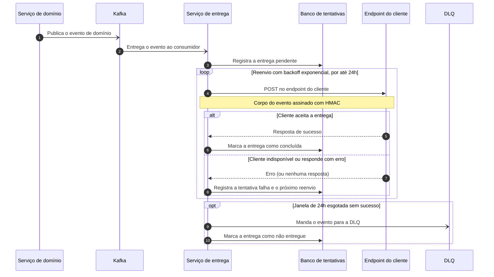

# Serviço de webhooks de saída

|  |  |
|---|---|
| **Documento** | DESIGN-DOC · Serviço de webhooks de saída |
| **Estado** | Rascunho |
| **Autores** | a definir |
| **Revisores** | a definir (sugestão: Segurança, pela assinatura HMAC e pela borda de saída; Infraestrutura/Plataforma, pelo consumo do Kafka e pelo novo banco) |
| **Criado em** | 2026-07-21 |
| **Última atualização** | 2026-07-21 |
| **Tags** | webhooks, entrega, kafka, confiabilidade |

## Glossário

| Termo | Definição |
|---|---|
| **Webhook de saída** | Chamada HTTP que fazemos para um endpoint de um cliente externo para avisá-lo de um evento nosso. |
| **Evento de domínio** | Fato de negócio já publicado pelos nossos serviços no Kafka. |
| **Kafka** | Barramento de eventos que já usamos hoje para publicar os eventos de domínio. |
| **HMAC** | Código de autenticação de mensagem com chave secreta, usado para assinar o corpo do POST e permitir que o cliente verifique a origem. |
| **Backoff exponencial** | Espera crescente entre as tentativas de reenvio, em vez de repetir em intervalo fixo. |
| **DLQ** | *Dead letter queue* — fila para onde vai o evento que não conseguimos entregar dentro da janela de reenvio. |

## Visão geral

Hoje cada serviço que precisa avisar um cliente externo faz o POST na mão, e quando o
endpoint do cliente está fora do ar o evento simplesmente se perde. Este documento propõe
um serviço único de entrega de webhooks: ele consome os eventos de domínio do Kafka,
guarda cada tentativa no Postgres, faz o POST assinado com HMAC no endpoint do cliente e
reenvia com backoff exponencial por até 24 horas antes de mandar o evento para uma DLQ.

Em troca dessa garantia, a entrega deixa de ser imediata em alguns casos, porque passa a
atravessar a fila. O documento explica por que aceitamos esse custo, o que descartamos no
caminho e o que ainda está em aberto.

## Escopo e contexto

Cada serviço que precisa avisar um cliente externo faz o POST por conta própria. Isso nos
deixa com três problemas concretos:

- **Sem retry.** Se o endpoint do cliente está indisponível na hora do POST, a chamada
  falha e o evento se perde — não existe uma segunda tentativa.
- **Sem log central.** Não há um lugar onde alguém possa perguntar "essa notificação saiu?
  quantas vezes tentamos? o que o cliente respondeu?".
- **Descoberta pelo suporte.** Como não temos visibilidade das tentativas, a falha chega
  até nós pelo cliente reclamando no suporte, não pelo nosso monitoramento.

Os eventos de domínio que interessam para essas notificações já são publicados no Kafka
que temos hoje, e é dele que a proposta parte.

## Objetivos e fora de escopo

**Objetivos**

- Nenhum evento perdido por indisponibilidade do endpoint do cliente: o serviço reenvia
  com backoff exponencial por até 24 horas e, só depois disso, manda o evento para a DLQ.
- Visibilidade de cada tentativa: toda tentativa de entrega fica persistida no Postgres,
  de forma que a pergunta "o que aconteceu com esse evento?" seja respondida sem depender
  do suporte.
- Um único caminho de saída: os serviços de domínio deixam de fazer o POST na mão e
  passam a depender apenas da publicação do evento no Kafka.

**Fora de escopo**

- Entrega em tempo real garantida — o trade-off aceito abaixo diz o contrário.
- Reprocessamento automático do que cai na DLQ: a DLQ é o fim da janela de reenvio
  automático; o que se faz com ela ainda é uma questão em aberto.

## A solução

Um serviço de entrega único, no caminho entre os eventos de domínio e os endpoints dos
clientes:

1. O serviço consome os eventos de domínio do Kafka que já temos.
2. Para cada evento a entregar, ele persiste a tentativa no Postgres.
3. Ele faz o POST no endpoint do cliente com o corpo assinado com HMAC.
4. Quando a entrega falha, ele reenvia com backoff exponencial por até 24 horas.
5. Esgotadas as 24 horas, ele manda o evento para a DLQ.

O ponto central do desenho é que a entrega deixa de ser uma chamada síncrona dentro do
serviço de domínio e passa a ser um trabalho com estado próprio: o estado vive no
Postgres, o que é justamente o que permite o retry e a visibilidade das tentativas.

### Arquitetura


> A imagem ainda precisa ser gerada a partir do DSL abaixo (esta máquina não tem a CLI do
> Structurizr nem Docker) — renderizar na passada manual e commitar em
> `docs/design/diagrams/arquitetura.svg`.

<details>
<summary>Fonte do diagrama (Structurizr DSL)</summary>

```
workspace "Serviço de webhooks de saída" "Entrega de eventos de domínio para endpoints de clientes externos." {

    !identifiers hierarchical

    model {
        dominio = softwareSystem "Serviços de domínio" "Serviços que produzem os eventos de negócio que os clientes externos precisam receber." {
            tags "External"
        }

        kafka = softwareSystem "Kafka" "Barramento de eventos de domínio que já existe hoje." {
            tags "External"
        }

        cliente = softwareSystem "Endpoint do cliente" "Endpoint HTTP de um cliente externo que recebe as notificações." {
            tags "External"
        }

        webhooks = softwareSystem "Serviço de webhooks de saída" "Entrega os eventos de domínio nos endpoints dos clientes, com reenvio e registro de cada tentativa." {
            entregador = container "Serviço de entrega" "Consome os eventos de domínio, assina o corpo com HMAC, faz o POST no endpoint do cliente e reenvia com backoff exponencial por até 24h." "a definir"
            tentativas = container "Banco de tentativas" "Guarda cada tentativa de entrega e o seu resultado." "PostgreSQL" {
                tags "Database"
            }
            dlq = container "DLQ" "Recebe os eventos que não foram entregues dentro da janela de 24h." "a definir" {
                tags "Queue"
            }
        }

        dominio -> kafka "Publica eventos de domínio em" "Kafka"
        webhooks.entregador -> kafka "Consome os eventos de domínio de" "Kafka"
        webhooks.entregador -> webhooks.tentativas "Registra e lê as tentativas de entrega em" "SQL/TCP"
        webhooks.entregador -> cliente "Entrega o evento assinado com HMAC em" "HTTPS/POST"
        webhooks.entregador -> webhooks.dlq "Envia os eventos não entregues após 24h para"
    }

    views {
        systemContext webhooks "SystemContext" {
            include *
            autoLayout
        }

        container webhooks "Containers" {
            include *
            autoLayout
        }

        styles {
            element "Element" {
                background #1168bd
                color #ffffff
            }
            element "Database" {
                shape cylinder
            }
            element "Queue" {
                shape pipe
            }
            element "External" {
                background #999999
                color #ffffff
            }
        }
    }

    configuration {
        scope softwaresystem
    }
}
```

</details>

O diagrama tem quatro peças fora da nossa fronteira e três dentro dela. Fora: os
**serviços de domínio**, que continuam apenas publicando os seus eventos no **Kafka** —
eles não conhecem mais o endpoint do cliente; e o **endpoint do cliente**, o destino final
do POST. Dentro do serviço novo: o **serviço de entrega**, que consome do Kafka, assina e
faz o POST e controla o reenvio; o **banco de tentativas** no Postgres, que guarda o
registro de cada tentativa e é o que dá visibilidade e permite retomar um reenvio; e a
**DLQ**, para onde o evento vai quando a janela de 24 horas se esgota sem sucesso.

A única seta que sai da nossa borda em direção ao cliente parte do serviço de entrega —
essa concentração é o que torna possível ter log central e política de retry única.

### Fluxo de entrega com retry



O fluxo começa fora do serviço: o serviço de domínio publica o evento no Kafka (passo 1) e
o serviço de entrega o consome (passo 2). Antes de qualquer chamada externa, ele registra
a entrega no banco de tentativas (passo 3) — é esse registro que sobrevive a uma queda do
próprio serviço de entrega e que responde depois "o que aconteceu com esse evento".

Cada volta do laço é uma tentativa: o POST assinado com HMAC vai para o endpoint do
cliente (passo 4) e o resultado é gravado nos dois casos — sucesso encerra o laço (passos
6 e 7), falha grava a tentativa e agenda o próximo reenvio, com a espera crescendo a cada
rodada (passos 8 e 9). Passadas as 24 horas sem sucesso, o serviço para de tentar, manda o
evento para a DLQ e marca a entrega como não entregue (passos 10 e 11) — o evento não
desaparece, ele muda de lugar.

O diagrama mostra a falha do cliente porque é ela que motiva o desenho; falhas do próprio
serviço de entrega e do Kafka ficaram de fora do desenho.

### Dados e sensibilidade

O banco de tentativas guarda os eventos de domínio e o resultado de cada tentativa de
entrega. Como o conteúdo dos eventos varia por caso de uso, o que exatamente fica retido,
por quanto tempo e com qual sensibilidade é uma questão em aberto (ver abaixo) — e é o
ponto que a revisão de Segurança deve olhar primeiro, junto com a guarda dos segredos
usados na assinatura HMAC.

## Trade-offs da solução escolhida

- ✓ Nenhum evento perdido por indisponibilidade do cliente: a entrega tem estado próprio e
  é reenviada por até 24 horas.
- ✓ Visibilidade de cada tentativa em um único lugar, em vez de nenhum log central.
- ✓ Uma política de retry e uma assinatura HMAC únicas, em vez de uma implementação por
  serviço que precisa notificar.
- ✗ **A entrega deixa de ser imediata em alguns casos, porque passa pela fila.** Esse é o
  custo que o time aceitou: quem hoje faz o POST direto e vê a resposta na hora passa a
  depender do trânsito pelo Kafka e pelo serviço de entrega.
- ✗ Um serviço a mais para operar, com um banco a mais e uma DLQ a mais no caminho entre
  nós e o cliente.

## Alternativas consideradas

**Não fazer nada — manter o POST na mão em cada serviço.** Descartada: é exatamente o
cenário que motiva o documento. Sem retry, o evento se perde quando o endpoint do cliente
cai; sem log central, a falha chega até nós pelo suporte. Nenhum dos dois objetivos é
alcançável assim.

**Usar um SaaS de webhooks.** Descartada por dois motivos: o custo por evento, e o fato de
que o payload sairia da nossa borda — os eventos de domínio passariam a trafegar e ficar
armazenados em um terceiro. Em troca teríamos retry e painel prontos, sem serviço novo
para operar; o time decidiu que a saída do payload da nossa borda não compensa essa
economia de trabalho.

**A escolhida — serviço próprio de entrega.** Mantém o payload dentro da nossa borda e
custa o trabalho de construir e operar o serviço, além do atraso descrito nos trade-offs.

## Preocupações transversais

**Segurança.** O POST vai assinado com HMAC, o que permite ao cliente verificar a origem
da chamada; a guarda e a rotação dos segredos por cliente precisam de revisão de
Segurança. O banco de tentativas passa a reter o conteúdo dos eventos, o que concentra em
um só lugar dados que hoje só trafegam.

**Serviços de domínio.** Eles deixam de fazer o POST e passam a depender só da publicação
no Kafka. Cada serviço que hoje notifica um cliente na mão precisa migrar, e quem depende
de ver a resposta do cliente na hora perde essa resposta síncrona.

**Plataforma/Infraestrutura.** Consumo novo sobre o Kafka existente, um banco Postgres
novo para operar e tráfego de saída para endpoints de terceiros, com o padrão de retry
concentrado em um serviço só.

## Questões em aberto

- Quem assina o documento como autor e quais times entram como revisores?
- Como o cliente e o seu endpoint são cadastrados, e onde ficam os segredos do HMAC?
- Qual é a curva exata do backoff (intervalo inicial, fator, teto) dentro da janela de 24
  horas?
- O que é a DLQ concretamente (um tópico do Kafka? uma tabela?) e o que acontece com o que
  cai nela — alguém reprocessa, alguém é avisado?
- Qual tecnologia o serviço de entrega usa? O DSL do diagrama está com "a definir".
- Que resposta do cliente conta como sucesso, e o que fazer com um erro definitivo
  (endpoint que responde erro permanente) versus uma indisponibilidade temporária?
- O evento fica retido por quanto tempo no banco de tentativas, e ele carrega dado
  sensível?
- Existe alguma exigência de ordem entre eventos do mesmo cliente?
