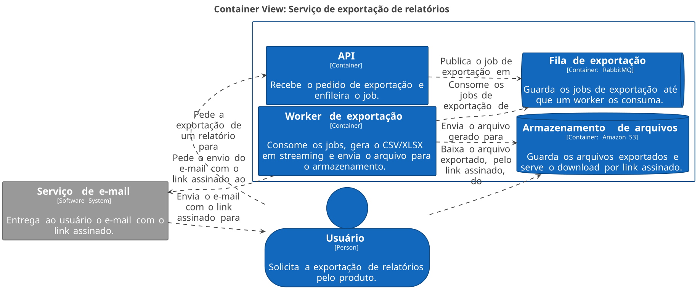
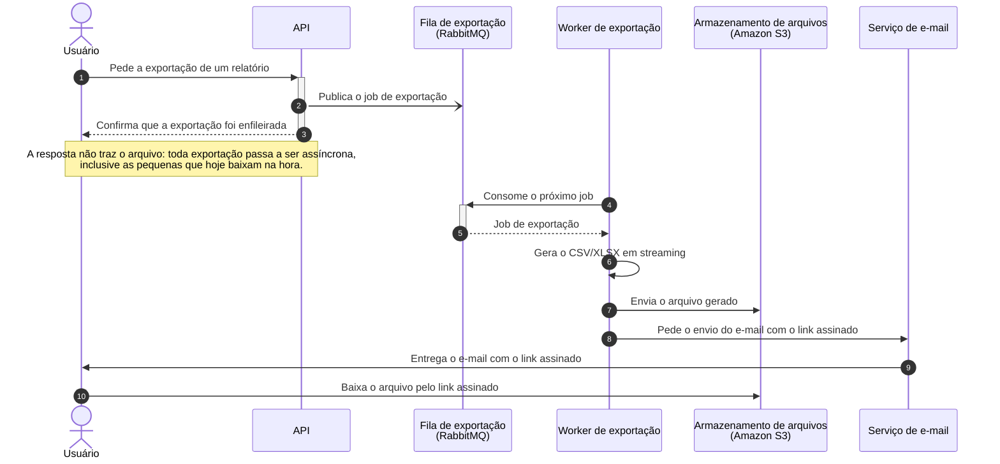

# Exportação de relatórios em background

|  |  |
|---|---|
| **Documento** | DESIGN DOC |
| **Estado** | Rascunho |
| **Título** | Exportação de relatórios em background |
| **Autores** | *a definir* |
| **Revisores sugeridos** | *a definir* (Plataforma — fila compartilhada), *a definir* (Segurança — link assinado com PII) |
| **Criado em** | 2026-07-21 |
| **Última atualização** | 2026-07-21 |
| **Tags** | exportação, relatórios, assíncrono, fila |

## Glossário

| Termo | Definição |
|---|---|
| **Job de exportação** | Unidade de trabalho que representa um pedido de exportação de relatório, publicada na fila pela API e processada pelo worker. |
| **Worker** | Processo separado da API, que consome jobs da fila e os executa fora do ciclo de request/response. |
| **RabbitMQ** | Broker de mensagens já existente na infraestrutura, usado aqui como fila dos jobs de exportação. |
| **Amazon S3** | Serviço de armazenamento de objetos onde o worker grava o arquivo gerado. |
| **Link assinado** | URL temporária de download do arquivo no S3, válida sem autenticação adicional por carregar a assinatura na própria URL. |
| **PII** | *Personally Identifiable Information* — dados que identificam uma pessoa. Os relatórios exportados contêm dados de cliente. |
| **CSV / XLSX** | Formatos de arquivo em que os relatórios são exportados. |
| **BI** | *Business Intelligence* — categoria de ferramentas de análise e relatórios, avaliada como alternativa externa. |
| **Streaming** | Geração do arquivo em blocos, escrevendo a saída conforme os dados são lidos, sem montar o relatório inteiro em memória. |

## Visão geral

Hoje o usuário pede uma exportação de relatório e a API gera o arquivo dentro da própria
request. Quando o relatório é grande, a geração não termina antes do limite de 30 segundos
do gateway e a exportação falha. Este documento propõe tirar a geração do caminho da
request: a API passa a enfileirar um job, um worker separado gera o arquivo e o publica no
S3, e o usuário recebe por e-mail um link assinado para baixá-lo.

A proposta troca a resposta imediata por uma entrega assíncrona — inclusive para as
exportações pequenas, que hoje funcionam na hora. É o custo que aceitamos para ter um único
caminho de exportação e acabar com os timeouts.

## Escopo e contexto

A API gera os relatórios de forma síncrona, na mesma request em que o usuário os pede. O
gateway corta a request em 30 segundos, e a geração de relatórios grandes não cabe nesse
tempo: cerca de **12% das exportações acima de 50 mil linhas falham** por timeout. O suporte
abre ticket sobre essas falhas toda semana.

A infraestrutura já roda **RabbitMQ**, e os arquivos exportados são gerados nos formatos CSV
e XLSX.

## Objetivos e fora de escopo

**Objetivos**

- Zerar as falhas de exportação por timeout, tirando a geração do arquivo do ciclo de
  request/response da API.
- Concluir com sucesso exportações de até **100 mil linhas**.

**Fora de escopo**

- Manter um caminho síncrono para exportações pequenas: elas também passam a ser
  assíncronas, para que exista um só caminho de exportação (ver Trade-offs).
- Substituir a geração de relatórios por uma ferramenta de BI externa (ver Alternativas).

## O desenho

### Visão geral da solução

A API deixa de gerar o arquivo e passa a publicar um job de exportação no RabbitMQ,
respondendo ao usuário assim que o job é enfileirado. Um worker separado consome o job, gera
o CSV ou XLSX em streaming e envia o arquivo para o S3. Terminada a geração, o usuário recebe
um e-mail com um link assinado para o download.

A decisão central é essa separação de processos: o tempo de geração deixa de disputar com o
limite de 30 segundos do gateway, e passa a ser limitado apenas pelo que o worker aguenta
processar. Em troca, nenhuma exportação devolve mais o arquivo na própria resposta.

### Arquitetura



<details>
<summary>Fonte do diagrama (Structurizr DSL)</summary>

```
workspace "Exportação de relatórios em background" "Modelo C4 do serviço que gera exportações de relatórios fora da request da API." {

    !identifiers hierarchical

    model {
        usuario = person "Usuário" "Solicita a exportação de relatórios pelo produto."

        exportacao = softwareSystem "Serviço de exportação de relatórios" "Recebe pedidos de exportação, gera os arquivos fora da request e disponibiliza o download." {
            api = container "API" "Recebe o pedido de exportação e enfileira o job."
            fila = container "Fila de exportação" "Guarda os jobs de exportação até que um worker os consuma." "RabbitMQ" {
                tags "Queue"
            }
            worker = container "Worker de exportação" "Consome os jobs, gera o CSV/XLSX em streaming e envia o arquivo para o armazenamento."
            arquivos = container "Armazenamento de arquivos" "Guarda os arquivos exportados e serve o download por link assinado." "Amazon S3" {
                tags "Database"
            }
        }

        email = softwareSystem "Serviço de e-mail" "Entrega ao usuário o e-mail com o link assinado." {
            tags "External"
        }

        usuario -> exportacao.api "Pede a exportação de um relatório para"
        exportacao.api -> exportacao.fila "Publica o job de exportação em"
        exportacao.worker -> exportacao.fila "Consome os jobs de exportação de"
        exportacao.worker -> exportacao.arquivos "Envia o arquivo gerado para"
        exportacao.worker -> email "Pede o envio do e-mail com o link assinado ao"
        email -> usuario "Envia o e-mail com o link assinado para"
        usuario -> exportacao.arquivos "Baixa o arquivo exportado, pelo link assinado, do"
    }

    views {
        systemContext exportacao "SystemContext" {
            include *
            autoLayout
        }

        container exportacao "Containers" {
            include *
            autoLayout lr
        }

        styles {
            element "Element" {
                background #1168bd
                color #ffffff
            }
            element "Person" {
                shape person
            }
            element "Database" {
                shape cylinder
            }
            element "Queue" {
                shape pipe
            }
            element "External" {
                background #999999
                color #ffffff
            }
        }
    }

    configuration {
        scope softwaresystem
    }
}
```

</details>

Quatro peças compõem o serviço. A **API** recebe o pedido de exportação e publica o job —
ela não gera mais arquivo nenhum. A **fila de exportação**, no RabbitMQ que já existe na
infraestrutura, guarda os jobs até que haja worker disponível, e é o que desacopla o tempo de
geração do tempo da request. O **worker de exportação** consome os jobs e gera o CSV ou XLSX
em streaming, escrevendo a saída conforme lê os dados em vez de montar o relatório inteiro em
memória — é o que permite crescer até 100 mil linhas. O **armazenamento de arquivos**, no S3,
guarda o resultado e serve o download pelo link assinado. Fora do serviço, o **serviço de
e-mail** entrega ao usuário a mensagem com o link.

Duas caixas do diagrama estão sem tecnologia de propósito: ainda não definimos em que a API e
o worker serão escritos, nem qual serviço de e-mail fará a entrega (ver Questões em aberto).

### Fluxo de uma exportação



O usuário pede a exportação (passo 1) e a API responde na hora que o pedido entrou na fila
(passos 2 e 3), sem esperar pela geração — é aqui que o limite de 30 segundos do gateway
deixa de importar. O worker pega o próximo job (passos 4 e 5) e gera o arquivo em streaming
(passo 6), enviando-o para o S3 (passo 7). Com o arquivo disponível, o worker pede o envio do
e-mail (passo 8), o usuário recebe o link assinado (passo 9) e baixa o arquivo direto do S3
(passo 10).

O diagrama mostra apenas o caminho feliz. Ainda não definimos o que acontece quando o job
falha no meio da geração, quando o envio para o S3 falha ou quando o e-mail não é entregue —
esses caminhos estão nas Questões em aberto e devem entrar no documento antes da
implementação.

### Dados e sensibilidade

Os relatórios exportados contêm dados de cliente, o que torna o arquivo no S3 e o link de
download material sensível: o link assinado dá acesso ao conteúdo a quem tiver a URL, sem
autenticação adicional. Isso é o que motiva a revisão de Segurança listada em Preocupações
transversais.

## Trade-offs da solução escolhida

- ✓ A geração deixa de competir com o limite de 30 segundos do gateway — o timeout do
  gateway some como causa de falha de exportação.
- ✓ O tamanho do relatório passa a ser um problema de capacidade do worker, e não da request:
  é o que abre caminho para as 100 mil linhas.
- ✓ Toda exportação segue um caminho único e assíncrono — menos código, menos comportamento
  condicional e menos cenário para testar e suportar.
- ✗ **O usuário perde o download imediato.** Exportações pequenas, que hoje voltam na hora,
  passam a chegar por e-mail. Foi o custo que aceitamos em troca do caminho único.
- ✗ A entrega passa a depender do e-mail: se o e-mail não chega (caixa de spam, endereço
  errado), o usuário não tem o arquivo, mesmo com a exportação bem-sucedida.
- ✗ A exportação passa a ocupar uma fila compartilhada e a envolver mais peças em produção
  (worker, fila, S3, e-mail), o que muda o custo de operação e de investigação de problemas.

## Alternativas consideradas

| Alternativa | Trade-offs | Resultado |
|---|---|---|
| **Enfileirar em worker separado** (escolhida) | ✓ Tira a geração do tempo da request e escala com o worker · ✗ Perde o download imediato e depende do e-mail | **Escolhida** |
| Gerar síncrono com timeout maior no gateway | ✓ Mudança pequena, mantém o download imediato · ✗ Só empurra o problema: o limite continua existindo, e a request longa continua presa | Descartada |
| Ferramenta de BI externa | ✓ Não exigiria construir a geração de arquivos · ✗ Custo da ferramenta e exposição de dado de cliente a terceiro | Descartada |
| Não fazer nada | ✓ Custo zero de desenvolvimento · ✗ Mantém as falhas em 12% das exportações acima de 50 mil linhas e o ticket semanal do suporte | Descartada |

## Preocupações transversais

**Plataforma.** Os jobs de exportação passam a ocupar a fila compartilhada do RabbitMQ, que o
time de plataforma opera. A geração de relatórios grandes é um trabalho longo e pesado, então
vale acordar com eles o que a exportação pode consumir da fila e como isso convive com o
restante do tráfego.

**Segurança.** O link assinado dá acesso a um arquivo com dados de cliente a quem tiver a URL.
Prazo de validade do link, escopo do acesso e o que o e-mail carrega são pontos para o time de
segurança revisar antes da implementação.

## Questões em aberto

- Quem assina o documento como autor, e quem revisa por Plataforma e por Segurança?
- Em que tecnologia a API e o worker serão implementados? O diagrama de arquitetura está com
  esses campos vazios até a resposta.
- Qual serviço faz o envio do e-mail com o link?
- Por quanto tempo o link assinado fica válido, e o arquivo no S3 tem prazo de expiração?
- O que acontece quando um job falha no meio da geração — há retentativa, e o usuário é
  avisado da falha?
- Como o usuário acompanha uma exportação em andamento, já que a resposta da API não traz
  mais o arquivo?
- Como verificamos, antes e depois de subir, que o objetivo foi atingido — qual métrica
  mostra que os timeouts zeraram e que 100 mil linhas passam?
- A entrega vai em uma tacada ou em fases (por exemplo, relatórios grandes primeiro)?
