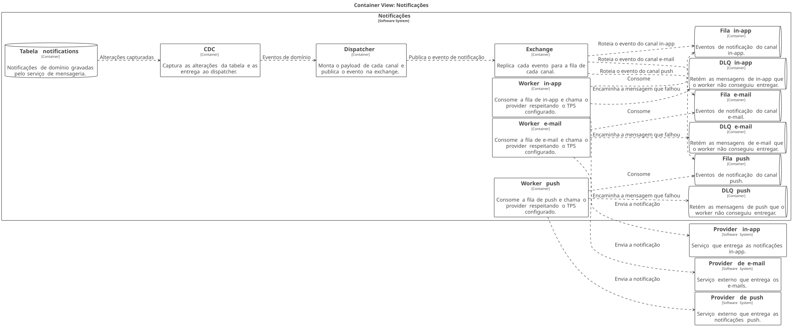

# Fanout de notificações

| | |
|---|---|
| **Estado** | Em revisão |
| **Autor** | Time de Mensageria |
| **Criado em** | 2026-01-28 |
| **Última atualização** | 2026-07-21 |

## Glossário

| Termo | Definição |
|---|---|
| **CDC** | *Change Data Capture* — captura das alterações de uma base de dados e sua publicação como fluxo de eventos. |
| **DLQ** | *Dead Letter Queue* — fila para onde vão as mensagens que o consumidor não conseguiu processar. |
| **Exchange** | Ponto de publicação do broker que roteia cada mensagem recebida para uma ou mais filas. |
| **Fanout** | Distribuição de um mesmo evento para vários destinos — aqui, uma fila por canal. |
| **In-app** | Canal de notificação exibido dentro do próprio produto. |
| **Push** | Canal de notificação entregue ao dispositivo do usuário. |
| **SLA** | *Service Level Agreement* — o compromisso de nível de serviço acordado para a entrega das notificações. |
| **TPS** | Transações por segundo — o limite de chamadas que cada provider aceita. |

## Visão geral

O envio de notificações hoje é sequencial e, com o crescimento da base, ficou lento.
Este documento propõe trocar esse envio por um fanout baseado em filas: um dispatcher
publica cada evento numa exchange e workers dedicados a cada canal consomem em
paralelo, com DLQ por canal e controle de TPS por provider.

## Escopo e contexto

O serviço de notificações processa os envios de forma sequencial dentro do próprio
serviço de mensageria. Um cron roda a cada minuto, lê a tabela `notifications`, monta o
payload de cada canal (push, e-mail e in-app) e chama os providers um a um. Com o
crescimento da base de usuários, esse modelo passou a apresentar lentidão.

## Objetivos

- Melhorar a performance dos envios
- Tornar o sistema escalável
- Garantir o SLA
- Não perder notificações

## Fora de escopo

> Nada foi explicitamente excluído ainda. Os itens que estavam aqui ("o sistema não deve
> ser lento", "o sistema não deve perder notificações") eram a negação dos objetivos: o
> primeiro repete "melhorar a performance dos envios" e o segundo virou objetivo próprio.

## Solução

O dispatcher deixa de enviar as notificações e passa a publicar um evento por
notificação numa exchange, que replica esse evento para uma fila por canal. Cada canal
ganha um worker próprio, que consome sua fila, respeita o TPS do provider e encaminha
para a DLQ do canal aquilo que não conseguiu entregar. Os eventos de domínio chegam ao
dispatcher por CDC sobre a tabela `notifications`, no lugar do cron de um minuto.

### Arquitetura



<details>
<summary>Fonte do diagrama (Structurizr DSL)</summary>

```
workspace "Fanout de notificacoes" {

    model {
        providerPush = softwareSystem "Provider de push" "Serviço externo que entrega as notificações push."
        providerEmail = softwareSystem "Provider de e-mail" "Serviço externo que entrega os e-mails."
        providerInApp = softwareSystem "Provider in-app" "Serviço que entrega as notificações in-app."

        notificacoes = softwareSystem "Notificações" "Fanout de notificações por canal." {
            tabela = container "Tabela notifications" "Notificações de domínio gravadas pelo serviço de mensageria." {
                tags "Database"
            }
            cdc = container "CDC" "Captura as alterações da tabela e as entrega ao dispatcher."
            dispatcher = container "Dispatcher" "Monta o payload de cada canal e publica o evento na exchange."
            exchange = container "Exchange" "Replica cada evento para a fila de cada canal."
            filaPush = container "Fila push" "Eventos de notificação do canal push." {
                tags "Queue"
            }
            filaEmail = container "Fila e-mail" "Eventos de notificação do canal e-mail." {
                tags "Queue"
            }
            filaInApp = container "Fila in-app" "Eventos de notificação do canal in-app." {
                tags "Queue"
            }
            workerPush = container "Worker push" "Consome a fila de push e chama o provider respeitando o TPS configurado."
            workerEmail = container "Worker e-mail" "Consome a fila de e-mail e chama o provider respeitando o TPS configurado."
            workerInApp = container "Worker in-app" "Consome a fila de in-app e chama o provider respeitando o TPS configurado."
            dlqPush = container "DLQ push" "Retém as mensagens de push que o worker não conseguiu entregar." {
                tags "Queue"
            }
            dlqEmail = container "DLQ e-mail" "Retém as mensagens de e-mail que o worker não conseguiu entregar." {
                tags "Queue"
            }
            dlqInApp = container "DLQ in-app" "Retém as mensagens de in-app que o worker não conseguiu entregar." {
                tags "Queue"
            }
        }

        tabela -> cdc "Alterações capturadas"
        cdc -> dispatcher "Eventos de domínio"
        dispatcher -> exchange "Publica o evento de notificação"
        exchange -> filaPush "Roteia o evento do canal push"
        exchange -> filaEmail "Roteia o evento do canal e-mail"
        exchange -> filaInApp "Roteia o evento do canal in-app"
        workerPush -> filaPush "Consome"
        workerEmail -> filaEmail "Consome"
        workerInApp -> filaInApp "Consome"
        workerPush -> dlqPush "Encaminha a mensagem que falhou"
        workerEmail -> dlqEmail "Encaminha a mensagem que falhou"
        workerInApp -> dlqInApp "Encaminha a mensagem que falhou"
        workerPush -> providerPush "Envia a notificação"
        workerEmail -> providerEmail "Envia a notificação"
        workerInApp -> providerInApp "Envia a notificação"
    }

    views {
        container notificacoes "Containers" {
            include *
            autolayout lr
        }

        styles {
            element "Database" {
                shape Cylinder
            }
            element "Queue" {
                shape Pipe
            }
        }

        theme default
    }
}
```

</details>

O CDC observa a tabela `notifications` e entrega ao **dispatcher** os eventos de domínio
gravados pelo serviço de mensageria. O dispatcher monta o payload de cada canal e publica
o evento na **exchange**, que o replica para as três filas de canal — push, e-mail e
in-app. Cada **worker** consome a fila do seu canal, respeita o TPS configurado para o
provider correspondente e chama esse provider. Quando a entrega falha, o worker encaminha
a mensagem para a **DLQ** daquele canal, de onde ela pode ser reprocessada sem bloquear as
demais. Os providers de push, e-mail e in-app são os destinos finais, fora do serviço.

## Plano

1. Criar exchange e filas
2. Migrar o canal de e-mail
3. Migrar push e in-app
4. Desligar o cron
