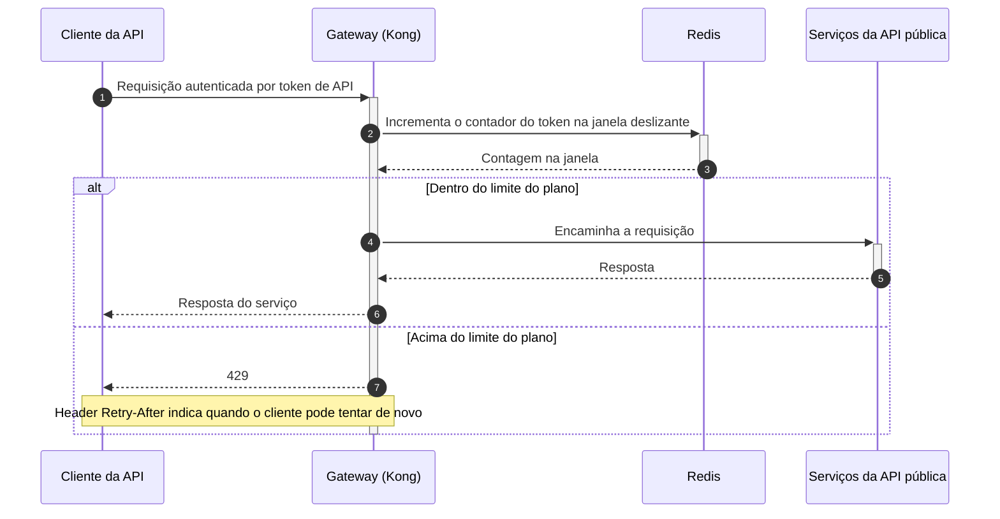

# DD-2026-008 · Rate limiting da API pública

| | |
|---|---|
| **Documento** | DD-2026-008 |
| **Estado** | Rascunho |
| **Autores** | _a definir_ |
| **Revisores** | _a definir_ |
| **Criado em** | 2026-07-21 |
| **Última atualização** | 2026-07-21 |
| **Tags** | api pública, rate limiting, gateway, disponibilidade |

## Resumo

A API pública não tem nenhum limite por cliente: um único integrador conseguiu derrubar a API para todos os outros. Este documento propõe rate limiting por token de API no gateway Kong, com janela deslizante e contadores no Redis, aplicando limites por plano e respondendo 429 com `Retry-After` quando o token estoura o limite.

## Contexto

Ontem, no incidente INC-4412, um cliente com uma integração mal feita enviou 40 vezes o tráfego normal e derrubou a API pública para todos os clientes por 25 minutos. Hoje não existe nenhum limite por cliente: qualquer integrador pode consumir toda a capacidade da API, e o único freio disponível durante o incidente foi a intervenção manual.

## Objetivos

- Nenhum token de API excede o limite do seu plano por mais de 1 segundo.
- A API pública absorve um cliente abusivo sem degradar o atendimento dos demais.

## Proposta

Aplicar rate limiting no gateway Kong, na borda da API pública, com a chave de contagem sendo o **token de API** do cliente — não o IP. O gateway usa uma **janela deslizante**, com os contadores no mesmo Redis que já usamos para sessão. Os limites vêm do plano do cliente:

| Plano | Limite |
|---|---|
| Free | 10 rps |
| Pro | 100 rps |
| Enterprise | negociado por contrato |

Quando o token ultrapassa o limite da sua janela, o gateway responde **429** com o header `Retry-After`, indicando ao cliente quando pode tentar de novo. Requisições dentro do limite seguem normalmente para os serviços da API pública.

### Fluxo de uma requisição

O cliente chama a API pública com seu token (1). Antes de encaminhar qualquer coisa, o Kong incrementa e lê o contador daquele token na janela deslizante mantida no Redis (2–3). Se a contagem está dentro do limite do plano, o gateway encaminha a requisição aos serviços da API pública e devolve a resposta (4–6). Se está acima, o gateway corta ali mesmo e responde 429 com `Retry-After` (7), sem que a requisição chegue aos serviços.

### Compensações

- ✓ Um cliente abusivo passa a consumir no máximo o limite do seu plano, e não a capacidade inteira da API — o cenário do INC-4412 deixa de derrubar os demais clientes.
- ✓ O corte acontece na borda: a requisição excedente não consome os serviços nem a malha atrás do gateway.
- ✓ Reaproveita duas peças que já existem em produção, o Kong e o Redis de sessão — nenhuma infraestrutura nova.
- ✗ Um cliente legítimo em pico — uma Black Friday, por exemplo — pode tomar 429. Mitigamos com o `Retry-After` na resposta e com um alerta para o time de contas avisar os clientes enterprise.
- ✗ O caminho crítico de toda requisição da API pública passa a depender do Redis.

## Alternativas consideradas

- **Não fazer nada.** Descartado pelo próprio INC-4412: sem limite por cliente, uma integração mal feita derruba a API pública inteira, e a única resposta disponível é manual.
- **Limitar dentro de cada serviço.** Descartado: é tarde demais. Quando a requisição chega ao serviço, ela já consumiu o gateway e a malha — exatamente a capacidade que queremos proteger.
- **Módulo pago de rate limiting do gateway gerenciado.** Descartado por custo e por lock-in no fornecedor.
- **Rate limit por token no Kong com contadores no Redis — escolhida.** Corta na borda, com as peças que já operamos.

## Riscos

| Risco | Mitigação |
|---|---|
| O Redis de sessão virar ponto de contenção ao absorver os contadores de rate limiting | Medir a carga adicional antes de habilitar o enforcing — o shadow mode da fase 1 existe para isso |

## Plano de entrega

1. **Shadow mode**: o gateway conta e mede, sem bloquear ninguém.
2. **Enforcing no plano free**: aplica o 429 apenas para os tokens do plano free.
3. **Enforcing geral**: aplica o 429 para todos os planos.
