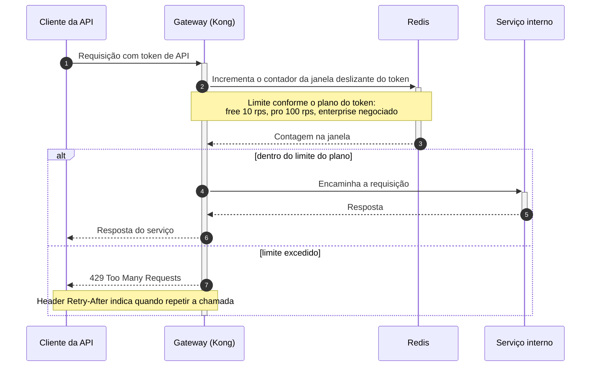

# DD-2026-008 · Rate limiting da API pública

| | |
|---|---|
| **Documento** | DD-2026-008 |
| **Estado** | Rascunho |
| **Autores** | _a definir_ |
| **Revisores** | _a definir_ |
| **Criado em** | 2026-07-21 |
| **Última atualização** | 2026-07-21 |
| **Tags** | api pública, rate limiting, gateway, disponibilidade |

## Resumo

A API pública não tem nenhum limite por cliente: em 2026-07-20 um cliente com integração mal feita enviou 40x o tráfego normal e derrubou a API para todos os clientes por 25 minutos (INC-4412). Este documento propõe rate limiting por token de API no gateway Kong, com contadores de janela deslizante no Redis e limites por plano, respondendo 429 com o header `Retry-After` quando o token estoura seu limite.

## Contexto

A API pública é servida pelo gateway Kong e hoje não existe limite de requisições por cliente: qualquer token pode consumir toda a capacidade disponível. Foi exatamente isso que aconteceu no INC-4412, em 2026-07-20 — um cliente com a integração mal feita passou a mandar 40 vezes o tráfego normal e a API ficou indisponível para todos os clientes por 25 minutos. Já operamos um Redis para sessão, compartilhado pelos serviços da plataforma.

## Objetivos

- Nenhum token excede seu limite por mais de 1 segundo.
- A API absorve um cliente abusivo sem degradar o atendimento dos demais clientes.

## Proposta

Rate limiting por **token de API**, aplicado no gateway Kong, antes de a requisição chegar aos serviços. O gateway mantém um contador por token em **janela deslizante** no Redis que já usamos para sessão. Os limites vêm do plano do cliente:

| Plano | Limite |
|---|---|
| Free | 10 rps |
| Pro | 100 rps |
| Enterprise | Negociado |

Quando o token ultrapassa o limite da janela, o gateway responde **429** com o header `Retry-After`, informando ao cliente quando pode repetir a chamada.

O cliente chega ao gateway com seu token (passo 1). O gateway consulta e incrementa o contador daquele token no Redis (passos 2 e 3) e decide com a contagem da janela. Dentro do limite, encaminha a requisição ao serviço interno e devolve a resposta ao cliente (passos 4 a 6). Acima do limite, o gateway responde 429 com `Retry-After` sem encaminhar nada (passo 7) — a requisição abusiva morre na borda, sem gastar a malha nem os serviços internos.

### Compensações

- ✓ Um cliente abusivo passa a consumir no máximo o limite do seu plano, em vez de toda a capacidade da API — o cenário do INC-4412 deixa de derrubar os demais clientes
- ✓ O bloqueio acontece no gateway, antes da malha e dos serviços, então a requisição rejeitada custa quase nada
- ✗ Cliente legítimo em pico (tipo Black Friday) pode tomar 429; mitigamos com o `Retry-After` e com alerta para o time de contas avisar os clientes enterprise
- ✗ Coloca o Redis de sessão no caminho de toda requisição da API pública

## Alternativas consideradas

**Limitar dentro de cada serviço** — descartado: é tarde demais. Quando a requisição chega ao serviço, ela já consumiu gateway e malha, que é justamente a capacidade que queremos proteger.

**Módulo pago de rate limiting do gateway gerenciado** — descartado por custo e por lock-in no fornecedor.

**Não fazer nada** — descartado: hoje não existe nenhum limite por cliente, e o INC-4412 mostrou o custo disso (25 minutos de API indisponível para todos os clientes por causa de um único integrador).

## Riscos

| Risco | Mitigação |
|---|---|
| O Redis de sessão virar ponto de contenção com o tráfego de contadores | Medir o impacto antes de habilitar o enforcing (fase de shadow mode) |
| Cliente legítimo em pico receber 429 | `Retry-After` na resposta + alerta para o time de contas avisar os clientes enterprise |

## Plano de entrega

1. **Shadow mode** — contadores rodando no Kong, apenas medindo: quantos tokens estourariam o limite, e qual o impacto no Redis de sessão
2. **Enforcing no plano free** — 429 ativo para os tokens do plano free
3. **Enforcing geral** — 429 ativo para todos os planos
