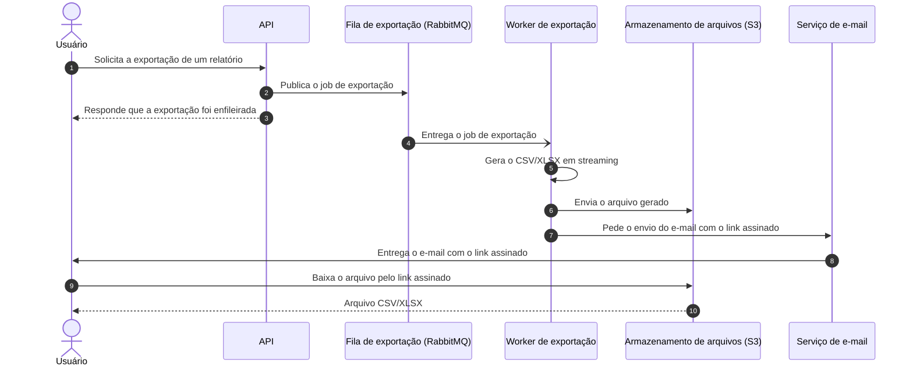

# Exportação de relatórios em background

| | |
|---|---|
| **Estado** | Rascunho |
| **Autores** | (a preencher) |
| **Revisores** | (a definir) — Plataforma; (a definir) — Segurança |
| **Criado em** | 2026-08-07 |
| **Última atualização** | 2026-08-07 |
| **Tags** | exportação, relatórios, fila, assíncrono |

## Glossário

- **PII** — dados pessoais identificáveis (*personally identifiable information*), como nome, e-mail ou documento de um cliente.
- **Link assinado** — URL temporária que dá acesso direto a um arquivo no armazenamento de objetos sem exigir uma sessão autenticada na aplicação.
- **XLSX** — formato de planilha do Excel, um dos formatos de saída das exportações.
- **BI** — *business intelligence*; no documento, uma ferramenta de terceiros para consultar e exportar dados.
- **Job de exportação** — a unidade de trabalho que representa uma exportação solicitada: o worker consome um job da fila e produz um arquivo.

## Visão geral

Hoje a API gera os relatórios exportados dentro da própria request, e as exportações grandes não terminam antes do limite de tempo do gateway. Este documento propõe tirar a geração do caminho da request: a API passa a enfileirar um job, um worker separado gera o arquivo e o disponibiliza no armazenamento, e o usuário recebe por e-mail um link assinado para baixá-lo.

A troca que aceitamos está no centro do documento: o usuário perde o download imediato, inclusive nas exportações pequenas que hoje funcionam na hora, em troca de um caminho único que não depende do tempo de uma request HTTP.

## Escopo e contexto

A exportação de relatórios acontece hoje de forma síncrona: o usuário chama a API, a API gera o arquivo durante o atendimento da request e devolve o conteúdo na resposta.

O gateway corta as requests em 30 segundos. Relatórios grandes não cabem nessa janela: cerca de **12% das exportações acima de 50 mil linhas falham**, e o suporte abre ticket sobre isso toda semana.

A infraestrutura já roda **RabbitMQ**, então processamento assíncrono não exige introduzir um broker novo no ambiente.

## Objetivos e fora de escopo

**Objetivos**

- **Zerar as falhas de exportação por timeout**, tirando a geração do relatório do tempo de vida da request.
- **Suportar exportações de até 100 mil linhas**, gerando o arquivo em streaming em vez de montá-lo inteiro antes de responder.

**Fora de escopo**

Ainda não definimos o que fica explicitamente de fora desta entrega — veja "Perguntas em aberto".

## O design

### Visão geral da solução

A API deixa de gerar o relatório e passa a registrar um job de exportação numa fila do RabbitMQ, respondendo imediatamente ao usuário. Um worker separado consome o job, gera o CSV ou o XLSX em streaming e envia o arquivo para o S3. Quando termina, o usuário recebe um e-mail com um link assinado para baixar o arquivo.

Todas as exportações passam por esse caminho, inclusive as pequenas. O time optou por um caminho só, em vez de manter o síncrono para relatórios pequenos e o assíncrono para os grandes, e é essa uniformidade que custa o download imediato (veja "Trade-offs").

### Arquitetura


> A imagem ainda precisa ser gerada a partir do DSL abaixo na passagem manual: o ambiente onde este documento foi escrito não tem ferramenta de renderização disponível.

<details>
<summary>Fonte do diagrama (Structurizr DSL)</summary>

```
workspace "Exportação de relatórios" "Serviço de exportação de relatórios em background." {

    !identifiers hierarchical

    model {
        usuario = person "Usuário" "Solicita exportações de relatórios e baixa os arquivos gerados."

        exportacao = softwareSystem "Serviço de exportação de relatórios" "Enfileira, gera e entrega exportações de relatórios em CSV/XLSX." {
            api = container "API" "Recebe a solicitação de exportação, cria o job e responde imediatamente."
            fila = container "Fila de exportação" "Guarda os jobs de exportação até que um worker os consuma." "RabbitMQ" {
                tags "Queue"
            }
            worker = container "Worker de exportação" "Consome o job, gera o CSV/XLSX em streaming e envia o arquivo para o armazenamento."
            arquivos = container "Armazenamento de arquivos" "Guarda os arquivos exportados e serve o download por link assinado." "Amazon S3" {
                tags "Database"
            }
        }

        email = softwareSystem "Serviço de e-mail" "Entrega ao usuário o e-mail com o link assinado." {
            tags "External"
        }

        usuario -> exportacao.api "Solicita a exportação de um relatório a"
        exportacao.api -> exportacao.fila "Publica o job de exportação na"
        exportacao.fila -> exportacao.worker "Entrega o job de exportação ao"
        exportacao.worker -> exportacao.arquivos "Envia o CSV/XLSX gerado para o"
        exportacao.worker -> email "Pede o envio do e-mail com o link assinado ao"
        email -> usuario "Entrega o e-mail com o link assinado ao"
        usuario -> exportacao.arquivos "Baixa o arquivo exportado, pelo link assinado, do"
    }

    views {
        systemContext exportacao "SystemContext" {
            include *
            autoLayout lr
        }

        container exportacao "Containers" {
            include *
            autoLayout lr
        }

        styles {
            element "Element" {
                background #1168bd
                color #ffffff
            }
            element "Person" {
                shape person
            }
            element "Database" {
                shape cylinder
            }
            element "Queue" {
                shape pipe
            }
            element "External" {
                background #999999
                color #ffffff
            }
        }
    }

    configuration {
        scope softwaresystem
    }
}
```

</details>

O desenho tem quatro peças nossas e uma de fora. A **API** deixa de ser quem gera o relatório: ela recebe o pedido, cria o job de exportação e responde na hora, então nada no seu tempo de resposta depende do tamanho do relatório. A **fila de exportação**, no RabbitMQ que a infraestrutura já opera, guarda os jobs e desacopla quem pede de quem gera. O **worker de exportação** consome os jobs e é onde a geração passa a viver — sem o limite de 30 segundos do gateway, porque não está atendendo request nenhuma. O **armazenamento de arquivos**, no S3, guarda o resultado e serve o download diretamente ao usuário pelo link assinado, sem passar o arquivo de volta pela API. O **serviço de e-mail** é a peça externa: é por ele que o link chega ao usuário.

Duas caixas estão sem tecnologia de propósito — a API e o worker —, porque a conversa que originou este documento não disse em que stack eles são (ou serão) escritos. Também não aparece no diagrama de onde o worker lê os dados do relatório, pela mesma razão. As duas lacunas estão em "Perguntas em aberto", em vez de preenchidas com um palpite que o revisor leria como decisão tomada.

### Fluxo da exportação



O ponto do fluxo está nos passos 2 e 3: a API entrega o job e responde, e a partir daí nada mais acontece dentro da request do usuário — é isso que tira o timeout do gateway do caminho. Os passos 4 a 6 são o trabalho pesado, agora no worker: ele consome o job, gera o arquivo em streaming (sem materializar o relatório inteiro em memória antes de escrever) e envia o resultado para o S3. Os passos 7 a 10 são a entrega: o link assinado chega ao usuário por e-mail e o download acontece direto contra o S3, sem voltar pela API.

O diagrama mostra só o caminho feliz. O que acontece quando o worker falha no meio da geração, quando o job não é consumido, quando o envio para o S3 ou o e-mail falha, e se há retentativa, ainda não está decidido — está registrado em "Perguntas em aberto".

### Dados e sensibilidade

Os relatórios exportados contêm dados de cliente, incluindo PII. Esse dado muda de lugar com este desenho: hoje o conteúdo vai na resposta da própria chamada de API; com a proposta, ele passa a ficar num arquivo no S3, acessível por um link assinado que trafega por e-mail. Quem tiver o link consegue baixar o arquivo enquanto o link for válido. É o principal motivo pelo qual o time de segurança precisa revisar este documento (veja "Preocupações transversais" e "Perguntas em aberto").

## Trade-offs da solução escolhida

✓ O timeout de 30 segundos do gateway deixa de ser um limite para a exportação: a geração não acontece mais dentro da request.

✓ A geração em streaming permite arquivos maiores do que os que cabiam na janela da request, atendendo ao objetivo de 100 mil linhas.

✓ Um caminho único de exportação — uma implementação de geração de arquivo, um comportamento para explicar ao usuário e ao suporte.

✓ A fila é o RabbitMQ que a infraestrutura já opera, então não entra um broker novo no ambiente.

✗ **O usuário perde o download imediato.** Este é o custo que aceitamos conscientemente: a exportação pequena, que hoje volta na hora, passa a devolver um "vai chegar por e-mail". Aceitamos a piora na experiência do caso pequeno para não manter dois caminhos.

✗ O caminho de exportação passa a envolver mais componentes — fila, worker, armazenamento e e-mail —, e cada um deles é um lugar onde a exportação pode parar depois que a API já respondeu, diferente de hoje, em que a falha aparece na própria chamada.

✗ A exportação passa a consumir a fila compartilhada, ou seja, este desenho gasta um recurso que é de outro time (veja "Preocupações transversais").

✗ O arquivo com PII passa a existir como objeto no S3, acessível por um link que viaja por e-mail, em vez de sair apenas na resposta da chamada de API.

## Alternativas consideradas

### Manter a geração síncrona com um timeout maior

✓ É a mudança menor: não exige worker, fila nem entrega por e-mail, e preserva o download imediato.

✗ Só empurra o problema: o limite muda de lugar, mas continua existindo, e as exportações voltam a falhar acima do novo tamanho.

**Descartada.**

### Usar uma ferramenta de BI externa

✓ Tira do time a responsabilidade de gerar e servir os arquivos.

✗ Custo da ferramenta.

✗ Exige expor dado de cliente para fora.

**Descartada.**

### Não fazer nada

✓ Custo zero de desenvolvimento.

✗ Mantém as falhas que motivaram o documento: cerca de 12% das exportações acima de 50 mil linhas continuam falhando, e o suporte continua abrindo ticket toda semana.

**Descartada.**

### Enfileirar em background — a escolhida

Atende aos dois objetivos — zerar o timeout como causa de falha e suportar 100 mil linhas — sem expor dado de cliente a um fornecedor externo e sem prender a geração a uma janela de tempo da request. Custa o download imediato, e é esse o preço que o documento registra.

## Preocupações transversais

### Plataforma — fila compartilhada

Os jobs de exportação passam a ocupar a fila compartilhada do RabbitMQ, então este desenho adiciona carga a um recurso operado pelo time de plataforma. Vale envolvê-los cedo: dimensionamento, isolamento dos jobs de exportação em relação ao resto do tráfego e o comportamento em picos de exportação são decisões deles tanto quanto nossas.

### Segurança — link assinado com PII

O link assinado dá acesso a um arquivo com PII e é entregue por e-mail, fora do canal da aplicação. O time de segurança precisa revisar pelo menos o prazo de validade do link, o que acontece com o arquivo no S3 depois desse prazo e o que é aceitável registrar em log sobre esses acessos. As perguntas em aberto listam esses pontos.

## Perguntas em aberto

1. Em que stack o worker de exportação será escrito, e ele vive no mesmo repositório/deploy da API ou separado?
2. De onde o worker lê os dados do relatório — o mesmo banco que a API usa hoje ou outra fonte?
3. Quem dispara o e-mail: o próprio worker ou algum serviço de notificação que já exista? (O diagrama mostra o worker disparando, como hipótese a confirmar.)
4. Qual a validade do link assinado, e por quanto tempo os arquivos exportados ficam no S3 antes de serem removidos?
5. O que acontece quando a geração falha no meio: há retentativa, o usuário é avisado, e como ele reenvia o pedido?
6. Como o usuário acompanha uma exportação em andamento — só o e-mail no fim, ou também um estado consultável na API?
7. A fila de exportação será uma fila dedicada dentro do RabbitMQ compartilhado, e há necessidade de prioridade entre exportações grandes e pequenas?
8. Como vamos verificar os objetivos: qual é a métrica que mostra "zero timeouts de exportação" e como validamos as 100 mil linhas antes de subir?
9. A troca do endpoint síncrono pelo assíncrono quebra algum consumidor (integração, script interno, front)? Há período de convivência entre os dois?
10. O que fica explicitamente fora de escopo desta entrega?
