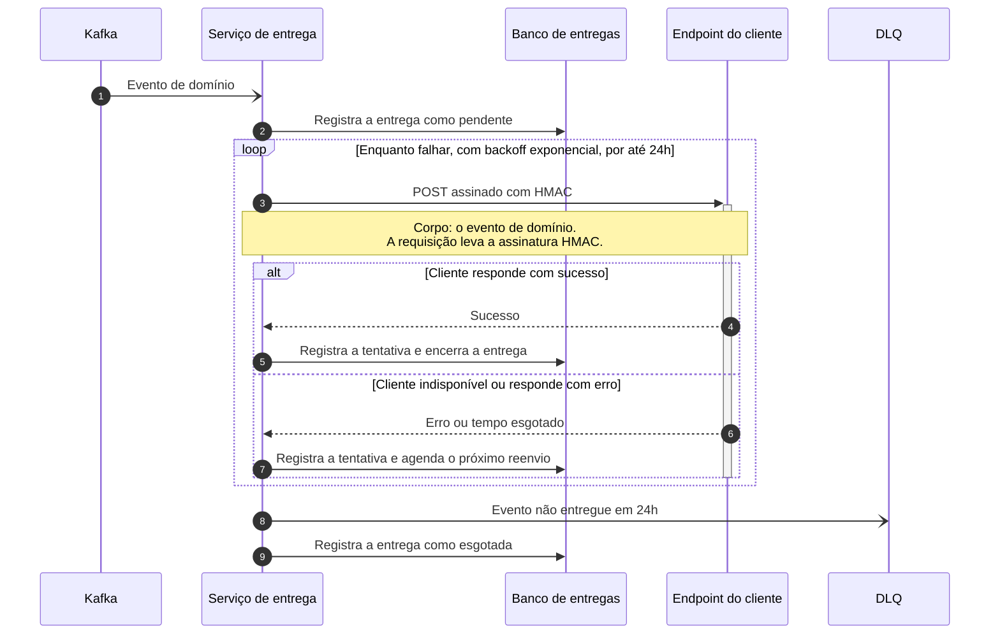

# Serviço de webhooks de saída

| | |
|---|---|
| **Documento** | DESIGN DOC |
| **Estado** | Rascunho |
| **Título** | Serviço de webhooks de saída |
| **Autores** | a definir |
| **Revisores** | a definir (sugestões: Segurança, Infraestrutura, times donos dos serviços que hoje entregam os webhooks) |
| **Criado em** | 2026-08-07 |
| **Última atualização** | 2026-08-07 |
| **Tags** | webhooks, entrega, integração, eventos |

## Glossário

| Termo | Definição |
|---|---|
| **Webhook** | Notificação que o nosso sistema envia por HTTP para um endpoint informado pelo cliente, quando algo acontece do nosso lado. |
| **Evento de domínio** | Registro de algo que aconteceu no negócio, publicado por um serviço nosso no Kafka. |
| **Kafka** | Barramento de eventos que já usamos para publicar e consumir os eventos de domínio. |
| **HMAC** | Assinatura calculada sobre o conteúdo da requisição com uma chave secreta compartilhada, que permite ao cliente verificar que a notificação veio de nós e não foi alterada no caminho. |
| **Backoff exponencial** | Estratégia de reenvio em que o intervalo entre as tentativas cresce a cada falha, em vez de repetir na mesma cadência. |
| **DLQ** | *Dead letter queue*: destino dos eventos que não conseguiram ser entregues dentro da janela de reenvio e que precisam de tratamento à parte. |
| **Tentativa** | Um envio individual do evento para o endpoint do cliente, com o seu resultado. |

## Visão geral

Hoje cada serviço que precisa avisar um cliente externo faz o POST por conta própria, sem reenvio e sem registro central. Quando o endpoint do cliente está fora do ar, o evento se perde e nós só descobrimos pelo suporte. Este documento propõe tirar a entrega das mãos de cada serviço e concentrá-la em um serviço único, que recebe os eventos de domínio, insiste na entrega quando o cliente está fora do ar e guarda o que aconteceu em cada tentativa.

O que se busca é que nenhum evento se perca por indisponibilidade do cliente e que cada tentativa fique visível. O custo aceito, detalhado adiante, é que a entrega deixa de ser imediata em alguns casos, porque passa pela fila.

## Escopo e contexto

- A entrega de webhooks está espalhada: cada serviço que precisa notificar um cliente externo monta e envia o POST na mão.
- Esses envios não têm reenvio. Uma falha no endpoint do cliente é uma falha definitiva daquele aviso.
- Não existe um log central das entregas. Não há um lugar para responder "esse evento chegou no cliente?".
- A consequência prática é que, quando o endpoint do cliente cai, o evento se perde e nós só descobrimos pelo suporte, depois de o cliente reclamar.
- Os eventos de domínio já são publicados no Kafka que temos hoje.

## Objetivos e fora de escopo

**Objetivos**

- Nenhum evento perdido por indisponibilidade do cliente: o evento continua sendo reenviado com backoff exponencial por até 24h e, esgotada a janela, vai para a DLQ em vez de sumir.
- Visibilidade de cada tentativa: para qualquer evento, é possível responder quantas tentativas houve, quando, e qual foi o resultado de cada uma.

**Fora de escopo**

Ainda não delimitado. As exclusões desta entrega estão nas questões em aberto, para o time fechar antes da revisão.

## O desenho

### Visão geral da solução

Um serviço único passa a ser o dono da entrega de webhooks. Ele consome os eventos de domínio do Kafka, persiste a tentativa no Postgres, envia o POST assinado com HMAC no endpoint do cliente e, quando a entrega falha, reagenda com backoff exponencial por até 24h. Passadas as 24h sem sucesso, o evento vai para a DLQ.

A troca central é essa: os serviços de domínio deixam de fazer o POST e passam a apenas publicar o evento, e a responsabilidade pela entrega (reenvio, assinatura, registro) fica em um lugar só. Em compensação, o aviso ao cliente passa a atravessar a fila, então deixa de ser imediato em alguns casos.

### Arquitetura


> A imagem ainda precisa ser gerada a partir do DSL abaixo, na passagem manual.

<details>
<summary>Fonte do diagrama (Structurizr DSL)</summary>

```
workspace "Serviço de webhooks de saída" "Entrega dos eventos de domínio nos endpoints dos clientes externos." {

    !identifiers hierarchical

    model {
        servicosDominio = softwareSystem "Serviços de domínio" "Serviços internos que publicam os eventos de domínio e que hoje fazem o POST no endpoint do cliente por conta própria." {
            tags "Existente"
        }

        kafka = softwareSystem "Kafka" "Barramento de eventos de domínio que já usamos." {
            tags "Existente"
        }

        cliente = softwareSystem "Endpoint do cliente externo" "Endpoint do cliente que recebe a notificação." {
            tags "External"
        }

        webhooks = softwareSystem "Serviço de webhooks de saída" "Entrega os eventos de domínio nos endpoints dos clientes, com reenvio e registro de cada tentativa." {
            entrega = container "Serviço de entrega" "Consome os eventos de domínio, registra cada tentativa, assina e envia o POST e reagenda o reenvio com backoff exponencial por até 24h."
            db = container "Banco de entregas" "Guarda cada tentativa de entrega e o seu resultado." "PostgreSQL" {
                tags "Database"
            }
            dlq = container "DLQ" "Recebe os eventos que não foram entregues dentro das 24h." {
                tags "Queue"
            }
        }

        servicosDominio -> kafka "Publica os eventos de domínio em"
        kafka -> webhooks.entrega "Entrega os eventos de domínio para"
        webhooks.entrega -> webhooks.db "Registra e consulta as tentativas de entrega em" "SQL"
        webhooks.entrega -> cliente "Envia o evento assinado com HMAC para" "HTTP POST"
        webhooks.entrega -> webhooks.dlq "Envia os eventos não entregues em 24h para"
    }

    views {
        systemContext webhooks "SystemContext" {
            include *
            autoLayout
        }

        container webhooks "Containers" {
            include *
            autoLayout lr
        }

        styles {
            element "Element" {
                background #1168bd
                color #ffffff
            }
            element "Database" {
                shape cylinder
            }
            element "Queue" {
                shape pipe
            }
            element "Existente" {
                background #6b7f99
                color #ffffff
            }
            element "External" {
                background #999999
                color #ffffff
            }
        }
    }

    configuration {
        scope softwaresystem
    }
}
```

</details>

Os **serviços de domínio** publicam os eventos no **Kafka**, como já fazem hoje, e param de enviar o POST. O **serviço de entrega** consome esses eventos, assina o payload com HMAC e envia o POST para o **endpoint do cliente externo**. O **banco de entregas** (Postgres) guarda cada tentativa e o seu resultado, e é o que sustenta o objetivo de visibilidade: é dali que se responde o que aconteceu com um evento. A **DLQ** recebe os eventos que atravessaram as 24h de reenvio sem sucesso, para tratamento à parte.

Duas caixas estão sem tecnologia de propósito: a linguagem e o runtime do serviço de entrega, e a tecnologia da DLQ, não foram definidos na conversa. Ambos estão nas questões em aberto.

### Fluxo de entrega com reenvio



O evento chega pelo Kafka (1) e a entrega nasce registrada como pendente (2), antes de qualquer envio: é isso que garante que um evento consumido não desapareça se o envio falhar logo em seguida. A cada tentativa, o serviço envia o POST assinado (3) e grava o resultado. Se o cliente responde com sucesso (5), a entrega termina ali (6). Se o cliente está fora do ar ou responde com erro (7), a falha fica registrada junto com o próximo reenvio (8), e o ciclo se repete com o intervalo crescendo a cada tentativa, por até 24h. Esgotada a janela, o evento vai para a DLQ (9) e a entrega é fechada como esgotada (10), com o histórico completo das tentativas no banco.

## Trade-offs da solução escolhida

- ✓ Um evento não se perde mais por indisponibilidade do cliente: ele sobrevive à queda do endpoint por até 24h de reenvio e, no pior caso, termina na DLQ, onde ainda pode ser tratado.
- ✓ Cada tentativa fica registrada no Postgres, então a pergunta "esse evento chegou?" deixa de depender do suporte e passa a ter resposta.
- ✓ A entrega passa a ter um dono só. Reenvio, assinatura e registro são resolvidos uma vez, e não em cada serviço que precisa avisar um cliente.
- ✗ A entrega deixa de ser imediata em alguns casos, porque passa pela fila. Este é o custo que o time aceitou: o aviso ao cliente ganha a latência do caminho Kafka + serviço de entrega, e nos casos de falha ganha o tempo do backoff.
- ✗ O payload dos eventos passa a ser persistido no Postgres, em vez de só trafegar. É mais um lugar onde o conteúdo enviado aos clientes fica guardado, o que traz uma discussão de sensibilidade e retenção que não existia antes.
- ✗ Os serviços de domínio deixam de controlar o momento do envio. O aviso ao cliente passa a depender da disponibilidade do serviço de entrega, que vira um ponto comum a todas as integrações.

## Alternativas consideradas

**Não fazer nada.** Descartada. É o cenário de hoje: cada serviço envia o POST na mão, sem reenvio e sem log central. A queda do endpoint do cliente continua custando o evento, e a descoberta continua chegando pelo suporte, isto é, depois do prejuízo. Nenhum dos dois objetivos é atendido.

**Usar um SaaS de webhooks.** Descartada. Resolveria o reenvio e a visibilidade sem construirmos o serviço, mas tem custo por evento e o payload sairia da nossa borda, indo parar em um terceiro. Foi essa combinação que pesou contra.

**Serviço próprio de entrega (escolhida).** Assume o trabalho de construir e operar o serviço, e a entrega deixa de ser imediata em alguns casos, em troca do reenvio por 24h, do registro de cada tentativa e do payload não saindo da nossa borda.

## Preocupações transversais

**Segurança.** O POST vai assinado com HMAC, então o cliente consegue verificar a origem e a integridade do que recebeu. Entram na conversa a gestão e a rotação das chaves por cliente, e a sensibilidade dos payloads que passam a ficar guardados no Postgres. Vale trazer o time de Segurança como revisor.

**Infraestrutura.** O desenho adiciona um consumidor no Kafka existente, um banco Postgres e a DLQ. O reenvio com backoff concentra tráfego de saída em um serviço só, inclusive em cima de endpoints de clientes que já estão com problema.

**Times donos dos serviços de domínio.** São eles que param de enviar o POST e passam a confiar a entrega ao novo serviço. A migração é deles tanto quanto nossa, e precisa entrar cedo na conversa.

## Testabilidade e observabilidade

O registro de cada tentativa no Postgres é o que sustenta o objetivo de visibilidade: ele responde, por evento, quantas tentativas houve e como cada uma terminou. Quais métricas e alertas vão em cima disso (taxa de falha por cliente, entrada na DLQ, idade da entrega mais antiga pendente) ainda não foi definido — está nas questões em aberto.

## Questões em aberto

- Quem assina o documento como autor, e quais áreas e times revisam?
- Os objetivos têm número? "Nenhum evento perdido" e "visibilidade de cada tentativa" ficam mais verificáveis com uma meta associada.
- O que fica explicitamente fora desta entrega?
- Qual tecnologia sustenta a DLQ, e qual linguagem/runtime do serviço de entrega?
- Quem consome a DLQ, e qual é o processo de reprocessamento depois que um evento cai nela?
- Como a assinatura HMAC viaja na requisição (qual cabeçalho, qual formato) e como as chaves por cliente são geradas, distribuídas e rotacionadas?
- O payload guardado no Postgres tem dado sensível? Qual é a política de retenção?
- Como o serviço de entrega decide o endpoint de cada cliente por evento: quem é a fonte dessa configuração?
- Quais métricas e alertas acompanham a entrega em produção?
- A migração dos serviços de domínio é de uma vez ou por etapas, e existe caminho de volta se uma etapa der errado?
