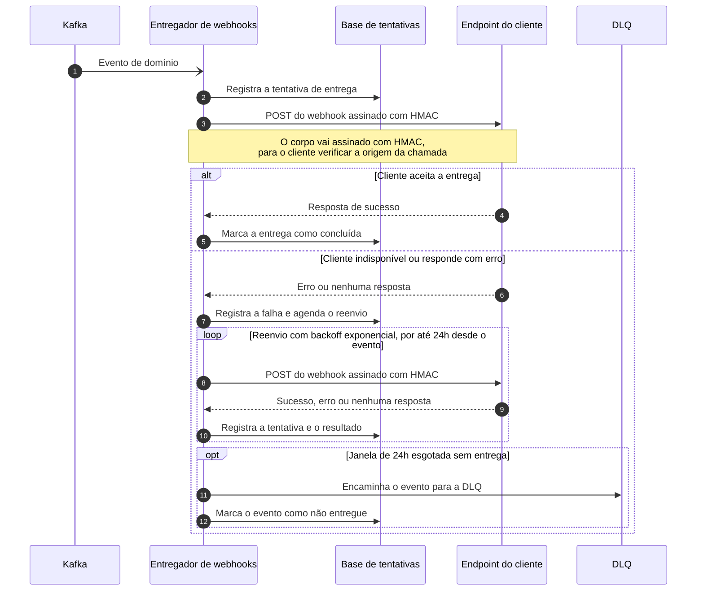

# Serviço de webhooks de saída

| | |
|---|---|
| **Documento** | DESIGN-DOC · Serviço de webhooks de saída |
| **Estado** | Rascunho |
| **Autores** | *a definir* |
| **Revisores** | *a definir* |
| **Criado em** | 2026-08-07 |
| **Última atualização** | 2026-08-07 |
| **Tags** | webhooks, entrega, eventos |

## Glossário

- **Webhook** — chamada HTTP que o nosso sistema faz para um endpoint do cliente para avisá-lo de que algo aconteceu.
- **Evento de domínio** — o fato de negócio que já publicamos no Kafka e que interessa a um cliente externo.
- **HMAC** — assinatura calculada sobre o corpo da requisição com uma chave compartilhada, que permite ao cliente verificar que a chamada veio mesmo de nós.
- **Backoff exponencial** — política de reenvio em que o intervalo entre uma tentativa e a seguinte cresce a cada falha.
- **DLQ** — *dead letter queue*, a fila para onde vai o evento que não conseguimos entregar dentro da janela combinada.

## Visão geral

Este documento propõe um serviço único responsável por entregar webhooks nos endpoints dos nossos clientes externos. Hoje esse trabalho está espalhado: cada serviço que precisa avisar um cliente faz a chamada por conta própria, e quando o cliente não responde o aviso simplesmente desaparece.

A proposta é tirar essa responsabilidade dos serviços produtores e concentrá-la em um serviço de entrega que consome os eventos de domínio do Kafka, guarda o registro de cada tentativa e insiste na entrega até o cliente aceitá-la. O documento descreve a arquitetura, o fluxo de entrega com reenvio, o custo que aceitamos em troca e a alternativa que descartamos.

## Escopo e contexto

Cada serviço que precisa avisar um cliente externo faz o POST na mão, no próprio código. Não existe reenvio: quando o endpoint do cliente está fora do ar, a chamada falha e o evento se perde. Também não existe log central de entregas — nenhum lugar onde alguém consiga perguntar "esse aviso chegou ao cliente?" e obter resposta.

A consequência prática é que a equipe não descobre a falha: quem descobre é o suporte, quando o cliente reclama que não recebeu o aviso. Nesse ponto o evento já não existe mais em lugar nenhum e não há como reenviá-lo.

Os eventos de domínio que interessam a esses clientes já trafegam no Kafka que mantemos hoje.

## Objetivos

- **Nenhum evento perdido por indisponibilidade do cliente**, através do reenvio automático com backoff exponencial por até 24 horas e do encaminhamento para a DLQ depois disso — o evento continua existindo mesmo quando a entrega não acontece.
- **Visibilidade de cada tentativa de entrega**, através do registro persistente de cada tentativa, para que a equipe enxergue a falha sem depender de um chamado do suporte.

## O desenho

### Visão geral da solução

Um serviço de entrega único consome os eventos de domínio do Kafka. Para cada evento ele registra a tentativa na base de tentativas, monta o webhook, assina o corpo com HMAC e faz o POST no endpoint do cliente. Se o cliente não aceita a entrega, o serviço reagenda o envio com backoff exponencial e continua tentando por até 24 horas contadas a partir do evento; esgotada a janela, ele encaminha o evento para a DLQ.

O trade-off central aparece já aqui: a entrega passa a atravessar uma fila, então deixa de ser imediata em alguns casos. Em troca, ela deixa de depender de o cliente estar de pé no exato instante em que o evento aconteceu.

### Arquitetura


> A imagem ainda precisa ser gerada a partir do DSL abaixo, na passada manual.

<details>
<summary>Fonte do diagrama (Structurizr DSL)</summary>

```
workspace "Webhooks de saída" "Serviço único de entrega de webhooks para endpoints de clientes externos." {

    !identifiers hierarchical

    model {
        servicosDominio = softwareSystem "Serviços de domínio" "Serviços internos que produzem os eventos de domínio que interessam a clientes externos." {
            tags "External"
        }

        kafka = softwareSystem "Kafka" "Plataforma de eventos já existente, onde trafegam os eventos de domínio." {
            tags "External"
        }

        webhooks = softwareSystem "Serviço de webhooks de saída" "Entrega os eventos de domínio nos endpoints dos clientes externos, reenviando e registrando cada tentativa." {
            entregador = container "Entregador de webhooks" "Consome os eventos de domínio, registra cada tentativa, assina e envia o webhook, e reagenda o reenvio com backoff exponencial por até 24h."
            tentativas = container "Base de tentativas" "Guarda cada tentativa de entrega e o estado do reenvio." "PostgreSQL" {
                tags "Database"
            }
            dlq = container "DLQ" "Recebe os eventos que não foram entregues dentro da janela de 24h." {
                tags "Queue"
            }
        }

        endpointCliente = softwareSystem "Endpoint do cliente" "Endpoint HTTP mantido pelo cliente externo, que recebe o webhook." {
            tags "External"
        }

        servicosDominio -> kafka "Publicam eventos de domínio em"
        kafka -> webhooks.entregador "Entrega os eventos de domínio para"
        webhooks.entregador -> webhooks.tentativas "Registra e lê as tentativas de entrega em"
        webhooks.entregador -> webhooks.dlq "Encaminha os eventos não entregues em 24h para"
        webhooks.entregador -> endpointCliente "Envia o webhook assinado com HMAC para" "HTTP POST"
    }

    views {
        systemContext webhooks "SystemContext" {
            include *
            autoLayout
        }

        container webhooks "Containers" {
            include *
            autoLayout lr
        }

        styles {
            element "Element" {
                background #1168bd
                color #ffffff
            }
            element "Database" {
                shape cylinder
            }
            element "Queue" {
                shape pipe
            }
            element "External" {
                background #999999
                color #ffffff
            }
        }
    }

    configuration {
        scope softwaresystem
    }
}
```

</details>

O **entregador de webhooks** é o único processo novo: ele consome os eventos de domínio do Kafka, decide o que entregar, assina, envia e reagenda. Ele é também o único ponto do desenho que fala com o endpoint do cliente — os serviços de domínio deixam de fazer essa chamada.

A **base de tentativas**, em PostgreSQL, guarda cada tentativa de entrega e o estado do reenvio. Ela é o que dá origem à visibilidade que hoje não existe: o registro fica lá independentemente de a entrega ter dado certo, e é o que permite responder "esse aviso chegou?".

A **DLQ** recebe o evento quando as 24 horas de reenvio se esgotam sem entrega. Ela existe para que o evento não desapareça nem mesmo no pior caso.

O **Kafka** e os **serviços de domínio** já existem e não mudam de responsabilidade: os serviços continuam publicando os eventos de domínio, e o entregador entra como mais um consumidor. O **endpoint do cliente** é o sistema do cliente externo, fora da nossa borda.

### Fluxo de entrega com reenvio



O fluxo começa quando o entregador recebe um evento de domínio do Kafka (1). Antes de qualquer chamada externa ele registra a tentativa na base (2), e só então envia o webhook assinado ao endpoint do cliente (3).

Se o cliente aceita a entrega, o entregador fecha o registro e o evento termina ali (5–6). Se o cliente está fora do ar ou responde com erro (7), o entregador registra a falha e agenda o reenvio (8), repetindo o envio com intervalos que crescem a cada tentativa (9–11). Esse laço é o que cumpre o objetivo: o evento sobrevive à indisponibilidade do cliente, e cada volta deixa seu próprio registro na base.

O laço termina de uma de duas formas — o cliente aceita a entrega, ou as 24 horas se esgotam. No segundo caso o entregador encaminha o evento para a DLQ e o marca como não entregue (12–13), de modo que o evento continua disponível em vez de se perder.

## Trade-offs da solução escolhida

- ✓ O evento sobrevive à indisponibilidade do cliente: o reenvio por até 24 horas cobre a queda temporária do endpoint, e a DLQ cobre o resto.
- ✓ Cada tentativa fica registrada, então a equipe enxerga a falha na base de tentativas em vez de ficar sabendo pelo suporte.
- ✓ A assinatura, o reenvio e o registro ficam num lugar só; os serviços de domínio param de repetir a chamada na mão, cada um do seu jeito.
- ✗ **A entrega deixa de ser imediata em alguns casos**, porque passa pela fila. Este é o custo que aceitamos conscientemente: trocamos latência de entrega por garantia de entrega.
- ✗ Passamos a operar mais três peças — o entregador, a base de tentativas e a DLQ. Alguém precisa acompanhá-las, e uma falha delas afeta a entrega de todos os clientes de uma vez, e não mais de um serviço só.

## Alternativas consideradas

### Contratar um SaaS de webhooks

Um serviço de terceiros que já faz entrega, reenvio e registro de webhooks resolveria o mesmo problema sem construirmos nada.

- ✓ Não precisaríamos escrever nem operar o entregador, a base de tentativas e a DLQ.
- ✗ O custo é por evento, e cresce junto com o volume de eventos de domínio.
- ✗ O payload sairia da nossa borda: os dados do evento passariam a trafegar e a ficar guardados na infraestrutura do fornecedor.

**Descartada** pelos dois custos acima. O segundo pesou mais: a entrega dos webhooks passa por dados de negócio dos nossos clientes, e mantê-los dentro da nossa borda é uma restrição que não queremos abrir.

### Não fazer nada

Manter cada serviço fazendo o POST na mão.

- ✓ Custo zero, nenhuma peça nova para operar, nenhuma latência adicional.
- ✗ É exatamente o que produz o problema: sem reenvio, a queda do endpoint do cliente destrói o evento, e sem registro central a equipe só fica sabendo quando o suporte traz a reclamação.

**Descartada:** os dois objetivos deste documento são inatingíveis sem alguma forma de reenvio e de registro central.

## Preocupações transversais

**Segurança.** O corpo de cada webhook vai assinado com HMAC, de modo que o cliente consiga verificar que a chamada veio de nós. O par de chaves por cliente passa a ser um segredo que este serviço precisa guardar e usar em toda entrega — como essas chaves nascem, ficam guardadas e são rotacionadas está em aberto (ver abaixo). Manter o payload dentro da nossa borda foi o argumento decisivo contra o SaaS, e continua valendo como restrição do desenho.

**Infraestrutura.** O serviço entra como mais um consumidor dos eventos de domínio no Kafka que já existe, e adiciona uma base PostgreSQL e uma DLQ ao que a equipe opera hoje.

**Times produtores.** Os serviços que hoje fazem o POST na mão deixam de fazê-lo e passam a depender deste serviço para avisar seus clientes. A ordem e a forma dessa migração precisam ser combinadas com esses times.

## Questões em aberto

- O que conta como entrega bem-sucedida? Quais respostas do cliente encerram a entrega e quais disparam o reenvio.
- Como as chaves HMAC de cada cliente nascem, ficam guardadas e são rotacionadas.
- O que acontece com o evento depois que ele chega na DLQ: alguém é avisado, alguém reprocessa, por quanto tempo ele fica lá.
- Como os serviços produtores migram do POST na mão para este serviço, e em que ordem.
- Como a visibilidade das tentativas chega a quem precisa dela — consulta na base, painel, alerta — e o que verifica, antes e depois de subir, que o objetivo de "nenhum evento perdido" está sendo cumprido.
- O que fica explicitamente fora de escopo desta entrega.
- Quem assina como autor e quais áreas revisam o documento.
