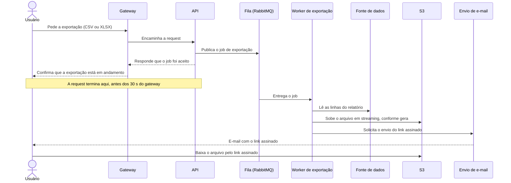

# Exportação de relatórios em background

| | |
|---|---|
| **Documento** | DESIGN-DOC |
| **Estado** | Rascunho |
| **Título** | Exportação de relatórios em background |
| **Autores** | a definir |
| **Revisores** | Time de Plataforma (fila compartilhada) — nome a definir; Time de Segurança (link assinado com PII) — nome a definir |
| **Criado em** | 2026-09-28 |
| **Última atualização** | 2026-09-28 |
| **Tags** | exportação, relatórios, assíncrono, rabbitmq, s3 |

## Visão geral

Hoje a API gera os relatórios exportados dentro da própria request, e os relatórios
grandes não cabem no timeout de 30 s do gateway. Este documento propõe tirar a geração
da request: a API passa a enfileirar um job, um worker separado gera o arquivo CSV/XLSX
em streaming e o sobe para o S3, e o usuário recebe por e-mail um link assinado para
baixar o resultado quando a exportação termina.

O documento registra o problema, a solução, o custo que o time aceitou (o usuário perde
o download imediato, mesmo nas exportações pequenas), as alternativas descartadas e os
pontos que os times de Plataforma e Segurança precisam revisar.

## Contexto

- A API gera cada relatório exportado de forma síncrona, dentro da request que o pediu.
- O gateway na frente da API aplica um timeout de 30 s por request.
- Cerca de 12% das exportações acima de 50 mil linhas falham por estourar esse timeout.
- O suporte abre ticket sobre essas falhas toda semana.
- A infra já tem RabbitMQ em uso.

## Objetivos

- Zerar as exportações que falham por timeout.
- Aguentar exportações de 100 mil linhas.

O time ainda não definiu o que fica explicitamente fora de escopo — ver
[questões em aberto](#questões-em-aberto).

## Solução

### Visão da solução

A exportação deixa de acontecer na request e vira um job assíncrono, com quatro
componentes principais:

1. **API** — recebe o pedido de exportação, publica um job na fila e responde de
   imediato, bem antes do timeout do gateway.
2. **Fila (RabbitMQ)** — a fila já existente na infra transporta os jobs de exportação
   até o worker.
3. **Worker de exportação** — consome os jobs, gera o CSV/XLSX em streaming e sobe o
   arquivo para o S3 conforme o gera.
4. **Entrega por e-mail** — ao terminar, o usuário recebe um e-mail com um link assinado
   (uma URL com validade limitada que dá acesso ao arquivo sem exigir credenciais do S3)
   para baixar o resultado.

O trade-off central: o usuário perde o download imediato. O time decidiu que **toda**
exportação segue esse caminho, inclusive as pequenas que hoje funcionam na hora, para
manter um único fluxo de exportação em vez de dois.

### Arquitetura


*Renderizar esta imagem a partir do DSL abaixo no passo manual.*

<details>
<summary>Fonte do diagrama (Structurizr DSL)</summary>

```
workspace "Exportação de relatórios em background" {

    model {
        usuario = person "Usuário" "Pede a exportação de um relatório e recebe o link por e-mail."

        exportacao = softwareSystem "Exportação de relatórios" "Gera relatórios em CSV/XLSX fora da request da API." {
            gateway = container "Gateway" "Ponto de entrada das requests; aplica timeout de 30 s."
            api = container "API" "Recebe o pedido de exportação e publica o job na fila."
            fila = container "Fila de exportações" "Fila já existente na infra, compartilhada com outros times." "RabbitMQ"
            worker = container "Worker de exportação" "Consome os jobs, gera o CSV/XLSX em streaming e sobe o arquivo para o S3."
            dados = container "Fonte de dados dos relatórios" "Origem das linhas do relatório (a confirmar; ver questões em aberto)."
        }

        s3 = softwareSystem "Amazon S3" "Guarda os arquivos exportados e os entrega por link assinado."
        email = softwareSystem "Envio de e-mail" "Entrega ao usuário o e-mail com o link assinado (mecanismo a confirmar)."

        usuario -> gateway "Pede a exportação"
        gateway -> api "Encaminha a request"
        api -> fila "Publica o job de exportação"
        worker -> fila "Consome os jobs"
        worker -> dados "Lê as linhas do relatório"
        worker -> s3 "Sobe o CSV/XLSX em streaming"
        worker -> email "Solicita o envio do link assinado"
        email -> usuario "Entrega o e-mail com o link assinado"
        usuario -> s3 "Baixa o arquivo pelo link assinado"
    }

    views {
        container exportacao "Containers" {
            include *
            autoLayout lr
        }

        styles {
            element "Person" {
                shape person
            }
        }
    }
}
```

</details>

O gateway continua sendo o ponto de entrada e continua com o timeout de 30 s: a
diferença é que a API agora só publica o job na fila e responde, sem gerar nada dentro
da request. O worker de exportação é um processo separado que consome a fila, lê as
linhas do relatório, gera o CSV/XLSX em streaming e sobe o arquivo para o S3 conforme o
produz, sem esperar o arquivo inteiro ficar pronto. Ao terminar, o worker dispara o
envio do e-mail com o link assinado, e o usuário baixa o arquivo direto do S3 por esse
link. A fila é o RabbitMQ que a infra já opera e que outros times também usam.

Dois elementos do diagrama ainda não têm dono definido: a fonte de onde o worker lê os
dados do relatório e o mecanismo que envia o e-mail. Os dois estão nas
[questões em aberto](#questões-em-aberto).

### Fluxo de uma exportação



A request do usuário termina assim que a API publica o job e responde que o aceitou; o
tempo de geração deixa de contar contra o timeout do gateway. O worker faz o restante
fora da request: lê os dados, gera e sobe o arquivo em streaming e, ao terminar, aciona
o e-mail com o link assinado. O download acontece direto do S3.

O diagrama mostra apenas o caminho feliz. O que acontece quando o worker falha no meio
da geração (nova tentativa, aviso ao usuário) o time ainda não discutiu — ver
[questões em aberto](#questões-em-aberto).

### Dados e sensibilidade

Os relatórios exportados contêm dados de cliente, incluindo PII. Com a mudança, esses
dados passam a existir também como arquivo no S3, e um link assinado enviado por e-mail
passa a dar acesso a esse arquivo — duas superfícies que hoje não existem. O time ainda
não definiu a validade do link nem o tempo de retenção do arquivo no S3; os dois são
pontos de revisão do time de Segurança (ver
[preocupações transversais](#preocupações-transversais)).

## Trade-offs da solução escolhida

- ✓ A request da API termina ao enfileirar o job, então o timeout de 30 s do gateway
  deixa de limitar o tamanho do relatório — é o que ataca diretamente os 12% de falhas
  acima de 50 mil linhas.
- ✓ Gerar e subir o arquivo em streaming evita montar o arquivo inteiro antes de
  entregá-lo — é a parte do design voltada ao objetivo de 100 mil linhas.
- ✓ Um único caminho de exportação, não importa o tamanho do relatório: menos fluxos
  para manter e testar.
- ✓ Reaproveita o RabbitMQ que a infra já opera, sem introduzir uma peça nova.
- ✗ O usuário perde o download imediato. A exportação pequena que hoje sai na hora
  passa a chegar por e-mail — o time aceitou esse custo em troca de um fluxo só.
- ✗ A fila é compartilhada: os jobs de exportação passam a competir por um recurso que
  outros times usam, e isso precisa ser combinado com Plataforma.
- ✗ Arquivos com PII passam a ficar no S3 e a circular por link assinado em e-mail, uma
  superfície nova que Segurança precisa revisar.
- ✗ A exportação passa a depender de mais componentes (fila, worker, S3, envio de
  e-mail), cada um com sua própria forma de falhar — e o tratamento dessas falhas ainda
  está em aberto.

## Alternativas consideradas

### Não fazer nada

Manter a geração síncrona na request. Descartada: 12% das exportações acima de 50 mil
linhas continuam falhando, o suporte continua abrindo ticket toda semana e o objetivo
de 100 mil linhas fica fora de alcance.

### Gerar síncrono com timeout maior

Manter a geração na request e aumentar o timeout do gateway. Descartada: só empurra o
problema — o limite continua existindo, apenas mais longe, e relatórios maiores voltam
a alcançá-lo.

### Ferramenta de BI externa

Delegar a exportação a uma ferramenta de BI de terceiros. Descartada por dois motivos:
custo e exposição de dado de cliente a um serviço externo.

### Job assíncrono em worker separado (escolhida)

A API enfileira um job no RabbitMQ, um worker gera o arquivo em streaming e o sobe para
o S3, e o usuário recebe um link assinado por e-mail. Remove o limite de tempo da
request em vez de deslocá-lo (o que o timeout maior não faz), mantém os dados dentro
da infra própria (o que a ferramenta de BI não faz) e reaproveita uma peça que já
existe. O custo aceito é a perda do download imediato.

## Preocupações transversais

### Plataforma — fila compartilhada

Os jobs de exportação vão trafegar pelo RabbitMQ que outros times já usam. O time de
Plataforma precisa avaliar o volume esperado de jobs e o tamanho de cada um, e combinar
como isolar as exportações do resto do tráfego (fila dedicada, limites) para que uma
rajada de exportações grandes não afete os outros consumidores. Os dois times ainda não
acordaram esses limites.

### Segurança — link assinado com PII

O link assinado dá acesso a um arquivo com PII a quem o tiver. O time de Segurança
precisa definir a validade do link, se ele pode ser aberto por qualquer pessoa que o
receba ou só pelo usuário que pediu a exportação, e por quanto tempo o arquivo fica
retido no S3 depois de gerado. Nada disso está definido ainda.

### Compatibilidade — quem chama a exportação hoje

Toda exportação passa a responder de forma assíncrona, inclusive as pequenas. Quem
consome o endpoint de exportação hoje e espera o arquivo na resposta precisa se adaptar
ao novo retorno. O time ainda não levantou quem são esses consumidores.

## Testabilidade e observabilidade

Antes de subir, uma exportação de 100 mil linhas precisa completar de ponta a ponta —
enfileirar, gerar, subir para o S3 e entregar o link — nos dois formatos, CSV e XLSX.
É o teste que verifica o segundo objetivo.

Em produção, a métrica que prova o primeiro objetivo é a taxa de exportações que falham
por timeout, hoje em 12% acima de 50 mil linhas e que deve ir a zero; os tickets do
suporte sobre exportação são a confirmação do lado do usuário. O time ainda não
discutiu quais outras métricas e alertas o worker vai expor.

## Questões em aberto

1. Quem são os autores do documento e quem revisa por Plataforma e por Segurança?
2. De onde o worker lê as linhas do relatório — a mesma fonte que a API consulta hoje?
3. Qual a validade do link assinado, quem pode abri-lo e por quanto tempo o arquivo
   fica no S3? (Segurança)
4. Quem envia o e-mail e por qual serviço?
5. O que acontece quando o worker falha no meio da geração: nova tentativa? O usuário é
   avisado?
6. O usuário tem alguma forma de acompanhar o status da exportação além de esperar o
   e-mail?
7. Os jobs de exportação usam uma fila dedicada dentro do RabbitMQ compartilhado? Quais
   limites Plataforma aceita? (Plataforma)
8. Quem consome o endpoint de exportação hoje e precisa se adaptar ao retorno
   assíncrono?
9. O que fica explicitamente fora de escopo desta entrega?
10. A virada é de uma vez ou por etapas, e qual é o caminho de volta se algo der errado?
