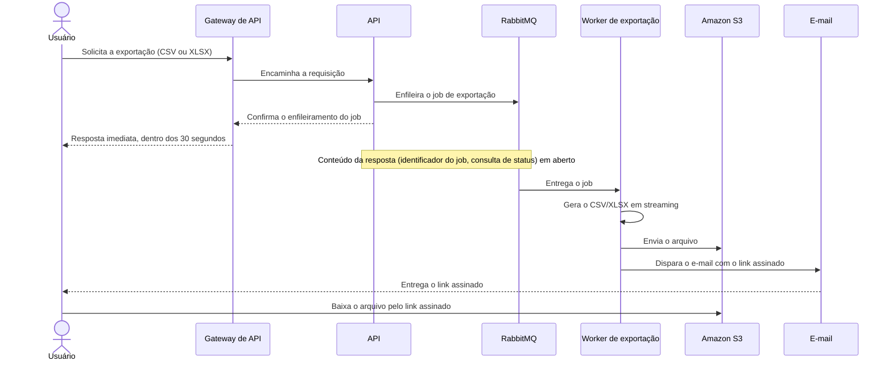

# Exportação de relatórios em background

| | |
|---|---|
| **Documento** | DESIGN-DOC |
| **Estado** | Rascunho |
| **Título** | Exportação de relatórios em background |
| **Autores** | (a preencher) |
| **Revisores** | Time de Plataforma (fila compartilhada), Time de Segurança (link assinado com PII) |
| **Criado em** | 2026-09-28 |
| **Atualizado em** | 2026-09-28 |
| **Tags** | exportação, relatórios, rabbitmq, s3, assíncrono |

## Glossário

- **Gateway**: o componente na frente da API que encerra qualquer requisição que passe de 30 segundos.
- **Job**: uma solicitação de exportação enfileirada para processamento fora da requisição da API.
- **Worker**: o processo separado que consome os jobs e gera os arquivos.
- **Link assinado**: uma URL que dá acesso a um arquivo específico no S3 sem exigir credenciais da conta.
- **PII**: informação pessoal identificável (dados de cliente presentes nos relatórios).
- **BI**: business intelligence; aqui, ferramentas de terceiros para consulta e exportação de relatórios.
- **RabbitMQ**: o broker de mensagens já presente na infraestrutura, compartilhado entre times.
- **S3**: o serviço de armazenamento de objetos onde os arquivos exportados ficam disponíveis.

## Visão geral

Hoje a API gera os relatórios grandes dentro da própria requisição, e o gateway encerra a requisição aos 30 segundos. Cerca de 12% das exportações acima de 50 mil linhas falham por isso, e o suporte abre ticket sobre o problema toda semana.

Esta proposta tira a geração da requisição. A API passa a enfileirar um job no RabbitMQ que a infraestrutura já possui; um worker separado consome o job, gera o CSV ou XLSX em streaming e envia o arquivo ao S3; ao terminar, o usuário recebe por e-mail um link assinado para baixar o arquivo. O objetivo é zerar os timeouts de exportação e sustentar relatórios de 100 mil linhas. Em troca, toda exportação, inclusive a pequena que hoje sai na hora, passa a ser assíncrona, para que exista um caminho só.

## Contexto

A API gera cada relatório exportado dentro da requisição HTTP que o pediu. Na frente da API há um gateway com timeout de 30 segundos. Quando a geração passa desse limite, o gateway encerra a requisição e a exportação falha.

O problema se concentra nos relatórios grandes. Nas exportações acima de 50 mil linhas, cerca de 12% falham por timeout, e o suporte abre ticket sobre isso toda semana.

Os relatórios exportados carregam dados de cliente, incluindo PII, o que pesa em qualquer decisão sobre onde o arquivo fica e quem consegue acessá-lo.

A infraestrutura já conta com um RabbitMQ, compartilhado entre times e mantido pelo time de Plataforma.

## Objetivos

- Zerar as falhas de exportação por timeout, tirando a geração do relatório da requisição da API.
- Sustentar exportações de 100 mil linhas (hoje as falhas se concentram acima de 50 mil).

O time ainda não definiu o que fica explicitamente fora de escopo (questão 2).

## Solução

### Visão da solução

A solução separa o pedido de exportação da geração do arquivo. A API deixa de gerar o relatório e passa a enfileirar um job no RabbitMQ. Um worker separado consome o job, gera o CSV ou XLSX em streaming e envia o arquivo ao S3. Quando o arquivo está no S3, o usuário recebe por e-mail um link assinado para baixá-lo.

A requisição da API passa a durar o tempo de enfileirar o job, independentemente do tamanho do relatório, e é isso que retira o gateway do caminho da exportação. A geração em streaming é o mecanismo escolhido para chegar às 100 mil linhas.

O trade-off central é a perda do download imediato. A exportação pequena, que hoje o usuário recebe na própria resposta, também vai passar pela fila e chegar por e-mail. O time aceitou esse custo para ter um caminho único de exportação em vez de dois (um síncrono para arquivos pequenos e um assíncrono para os grandes).

### Arquitetura


Renderizar esta imagem a partir do DSL abaixo no passe manual.

<details>
<summary>Fonte do diagrama (Structurizr DSL)</summary>

```
workspace "Exportação de relatórios" "Contêineres do serviço de exportação de relatórios em background." {

    model {
        usuario = person "Usuário" "Solicita exportações de relatórios e recebe o link por e-mail."

        gateway = softwareSystem "Gateway de API" "Ponto de entrada das requisições; encerra qualquer requisição aos 30 segundos. Já existe."

        exportacao = softwareSystem "Exportação de relatórios" "Gera relatórios CSV/XLSX em background e entrega o link assinado por e-mail." {
            api = container "API" "Recebe o pedido de exportação e enfileira o job."
            worker = container "Worker de exportação" "Consome os jobs, gera o CSV/XLSX em streaming e envia o arquivo ao S3."
        }

        rabbitmq = softwareSystem "RabbitMQ" "Fila compartilhada entre times, já presente na infraestrutura; mantida pelo time de Plataforma."
        s3 = softwareSystem "Amazon S3" "Armazena os arquivos exportados."
        email = softwareSystem "E-mail" "Entrega ao usuário a mensagem com o link assinado."

        usuario -> gateway "Solicita a exportação"
        gateway -> api "Encaminha a requisição"
        api -> rabbitmq "Enfileira o job de exportação"
        worker -> rabbitmq "Consome os jobs de exportação"
        worker -> s3 "Envia o arquivo CSV/XLSX gerado em streaming"
        worker -> email "Dispara o e-mail com o link assinado"
        email -> usuario "Entrega o link assinado"
        usuario -> s3 "Baixa o arquivo pelo link assinado"
    }

    views {
        container exportacao "Conteineres" "Contêineres do serviço de exportação e os sistemas com que interagem." {
            include *
            include usuario
            autolayout lr
        }

        styles {
            element "Person" {
                shape person
            }
        }
    }
}
```

</details>

O diagrama mostra dois contêineres novos ou alterados e quatro sistemas com os quais eles conversam:

- **API**: já existe. Deixa de gerar o relatório e passa a enfileirar um job de exportação no RabbitMQ, respondendo ao usuário dentro do limite do gateway.
- **Worker de exportação**: processo novo, separado da API. Consome os jobs da fila, gera o CSV ou XLSX em streaming, envia o arquivo ao S3 e dispara o e-mail com o link assinado.
- **Gateway de API**: já existe. Continua encerrando requisições aos 30 segundos; a diferença é que a requisição de exportação passa a caber nesse limite.
- **RabbitMQ**: já existe na infraestrutura e é compartilhado entre times. Passa a carregar os jobs de exportação.
- **Amazon S3**: guarda os arquivos exportados. O usuário baixa o arquivo direto do S3, pelo link assinado.
- **E-mail**: o canal pelo qual o usuário recebe o link assinado quando a exportação termina.

O diagrama deixa vazias as tecnologias da API e do worker e o mecanismo de envio do e-mail (questões 9 e 10).

### Fluxo de exportação



O fluxo tem duas metades independentes. Na primeira, o usuário pede a exportação, a API enfileira o job e responde de imediato; a requisição não espera a geração, então o gateway não a encerra. Na segunda, o worker consome o job, gera o arquivo em streaming, envia o arquivo ao S3 e dispara o e-mail com o link assinado. O usuário baixa o arquivo direto do S3, sem passar pela API.

O diagrama registra o caminho feliz; a falha do worker no meio de um job é a questão 7.

### Dados e sensibilidade

O worker grava no S3 o arquivo exportado, em CSV ou XLSX. Esses arquivos contêm dados de cliente, incluindo PII. O acesso ao arquivo se dá por um link assinado enviado por e-mail ao usuário que pediu a exportação.

A validade do link assinado e o tempo de retenção do arquivo no S3 definem o tamanho desse risco, e são o principal item de revisão do time de Segurança (questão 5).

## Trade-offs da solução escolhida

- ✓ A requisição da API deixa de depender do tamanho do relatório, então o timeout de 30 segundos do gateway deixa de ser um limite para a exportação.
- ✓ A geração em streaming dá ao worker o caminho para sustentar 100 mil linhas.
- ✓ Exportações pequenas e grandes seguem a mesma rota, sem um caminho síncrono paralelo para manter.
- ✓ Reaproveita o RabbitMQ que a infraestrutura já possui, sem introduzir um broker novo.
- ✗ O usuário perde o download imediato. A exportação pequena, que hoje sai na hora, passa a chegar por e-mail.
- ✗ Adiciona carga a uma fila compartilhada com outros times, o que envolve o time de Plataforma.
- ✗ Cria um link assinado que dá acesso, fora da API, a um arquivo com PII, o que abre uma superfície nova para o time de Segurança revisar.

## Alternativas consideradas

| Alternativa | Trade-off | Resultado |
|---|---|---|
| Não fazer nada | Mantém os 12% de falhas acima de 50 mil linhas e os tickets semanais de suporte; não atende o objetivo de zerar timeouts nem o de chegar a 100 mil linhas. | ✗ Descartada |
| Geração síncrona com timeout maior | Empurra o problema; um relatório maior que o novo limite volta a falhar. | ✗ Descartada |
| Ferramenta de BI externa | Custo, e expõe dado de cliente a um terceiro. | ✗ Descartada |
| Job em background com worker, S3 e link por e-mail | Zera a dependência do timeout e sustenta 100 mil linhas; o usuário perde o download imediato. | ✓ Escolhida |

**Não fazer nada.** O problema já está medido. Cerca de 12% das exportações acima de 50 mil linhas falham e o suporte abre ticket toda semana; manter o estado atual preserva esses números e não chega a 100 mil linhas.

**Geração síncrona com timeout maior.** Aumentar o timeout do gateway mantém a geração dentro da requisição e move o limite, e o relatório que ultrapassar o novo teto falha do mesmo jeito. O time descartou a opção porque ela empurra o problema em vez de resolvê-lo.

**Ferramenta de BI externa.** O time descartou delegar a exportação a uma ferramenta de BI de terceiros pelo custo e por expor dado de cliente a um serviço externo.

**Job em background (escolhida).** Tira a geração da requisição, o que remove a causa do timeout, e reaproveita o RabbitMQ existente. O custo aceito é a perda do download imediato para todas as exportações.

## Preocupações transversais

### Plataforma (fila compartilhada)

O RabbitMQ é compartilhado entre times e passa a carregar os jobs de exportação. O time de Plataforma precisa avaliar a carga adicional que esses jobs trazem e como eles convivem com o que já trafega na fila. Fila dedicada ou compartilhada dentro do broker, e com quais limites, é a questão 6.

### Segurança (link assinado com PII)

O arquivo exportado contém PII e fica acessível por um link assinado enviado por e-mail, fora do controle de acesso da API. O time de Segurança precisa revisar a validade do link, a retenção do arquivo no S3 e o uso do e-mail como canal de entrega desse link.

## Testabilidade e observabilidade

Antes de entrar em produção, uma exportação de 100 mil linhas precisa concluir de ponta a ponta (job enfileirado, arquivo no S3, e-mail com o link recebido), já que esse é o objetivo declarado.

Em produção, os dois números que provam o objetivo são a quantidade de exportações encerradas por timeout, que deve ficar em zero, e a taxa de falha das exportações acima de 50 mil linhas, que hoje está em cerca de 12%. O volume de tickets de suporte sobre exportação serve como confirmação indireta.

## Questões em aberto

1. Quem assina o documento como autor, e quais pessoas dos times de Plataforma e Segurança revisam.
2. O que fica explicitamente fora de escopo deste trabalho.
3. O que a API responde ao enfileirar o job: há um identificador do job, e o usuário consegue consultar o status da exportação?
4. Quem gera o link assinado e dispara o e-mail. O documento assume que é o próprio worker, ao concluir o envio ao S3.
5. Validade do link assinado e tempo de retenção do arquivo no S3 (para Segurança).
6. Os jobs de exportação ficam numa fila dedicada dentro do RabbitMQ ou numa fila já existente, e com quais limites de carga (para Plataforma).
7. O que acontece quando o worker falha no meio de um job: retentativa, descarte, aviso ao usuário.
8. De onde o worker lê os dados do relatório, e se é a mesma fonte que a API usa hoje.
9. Qual mecanismo envia o e-mail com o link.
10. Tecnologias da API e do worker, para completar o diagrama de contêineres.
11. A mudança entra de uma vez para todas as exportações, ou por etapas?
