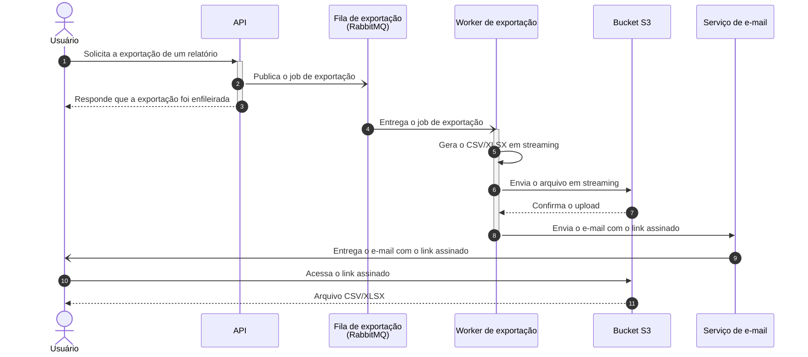

# Exportação de relatórios em background

| | |
|---|---|
| **Documento** | DESIGN-DOC |
| **Estado** | Rascunho |
| **Título** | Exportação de relatórios em background |
| **Autores** | a preencher |
| **Revisores** | Time de Plataforma (fila compartilhada), Time de Segurança (link assinado com PII); nomes a confirmar |
| **Criado em** | 2026-09-28 |
| **Última atualização** | 2026-09-28 |
| **Tags** | exportação, relatórios, rabbitmq, s3, assíncrono |

## Glossário

- **Gateway**: o API gateway na frente da API, que encerra qualquer request após 30 segundos.
- **Link assinado**: URL de download do arquivo no S3 que carrega a própria autorização e uma validade; quem tem o link baixa o arquivo.
- **PII**: informação pessoal identificável; os relatórios exportados contêm dados de cliente dessa natureza.
- **Streaming**: gerar e enviar o arquivo em partes, à medida que as linhas são produzidas, em vez de montar o arquivo inteiro antes de enviá-lo.

## Visão geral

Hoje a API gera os relatórios exportados dentro da própria request, e as exportações grandes estouram o timeout de 30 segundos do gateway. Este documento propõe tirar a geração do caminho da request: a API passa a enfileirar um job no RabbitMQ, um worker separado gera o CSV/XLSX em streaming e envia o arquivo para o S3, e o usuário recebe por e-mail um link assinado para baixar o arquivo quando a exportação termina.

Em troca, toda exportação passa a ser assíncrona, inclusive as pequenas que hoje funcionam na hora. O time aceitou esse custo para ter um único caminho de exportação.

## Contexto

- A API gera o relatório e devolve o arquivo na mesma request. O gateway encerra a request em 30 segundos.
- Cerca de 12% das exportações acima de 50 mil linhas falham por esse timeout.
- O suporte abre ticket sobre essas falhas toda semana.
- A infraestrutura já opera um RabbitMQ. A fila é compartilhada, o que envolve o time de Plataforma.
- Os relatórios exportados contêm dados de cliente, incluindo PII.

## Objetivos

1. Zerar as falhas de exportação por timeout.
2. Suportar exportações de até 100 mil linhas (hoje as falhas se concentram acima de 50 mil).

## A solução

### Visão geral da solução

A solução separa o pedido da geração. A API deixa de gerar o arquivo e passa apenas a publicar um job de exportação na fila do RabbitMQ. Um worker de exportação, um processo separado da API, consome o job, gera o CSV ou XLSX em streaming e envia o arquivo, também em streaming, para um bucket no S3. Ao terminar, o worker dispara um e-mail ao usuário com um link assinado para o download.

A decisão central é usar esse caminho para toda exportação, independentemente do tamanho. O usuário perde o download imediato que hoje tem nas exportações pequenas, e em troca o time mantém um único fluxo para construir, operar e explicar ao suporte.

### Arquitetura



<details>
<summary>Fonte do diagrama (Structurizr DSL)</summary>

```
workspace "Exportação de relatórios em background" "Exportação assíncrona de relatórios CSV/XLSX, entregues por link assinado." {

    !identifiers hierarchical

    model {
        usuario = person "Usuário" "Solicita a exportação de um relatório e recebe o arquivo por e-mail."

        exportacao = softwareSystem "Exportação de relatórios" "Gera relatórios CSV/XLSX em background e entrega um link assinado por e-mail." {
            api = container "API" "Recebe o pedido de exportação e enfileira um job de exportação."
            fila = container "Fila de exportação" "Jobs de exportação aguardando processamento, no RabbitMQ compartilhado da infraestrutura." "RabbitMQ" {
                tags "Queue"
            }
            worker = container "Worker de exportação" "Consome os jobs, gera o CSV/XLSX em streaming e envia o arquivo para o S3."
            bucket = container "Bucket de exportações" "Arquivos exportados, servidos ao usuário por link assinado." "Amazon S3" {
                tags "Storage"
            }
        }

        email = softwareSystem "Serviço de e-mail" "Entrega ao usuário o e-mail com o link assinado." {
            tags "External"
        }

        usuario -> exportacao.api "Solicita a exportação de um relatório em"
        exportacao.api -> exportacao.fila "Publica o job de exportação em"
        exportacao.fila -> exportacao.worker "Entrega o job de exportação a"
        exportacao.worker -> exportacao.bucket "Envia o arquivo gerado, em streaming, para"
        exportacao.worker -> email "Envia o e-mail com o link assinado por meio de"
        email -> usuario "Entrega o e-mail com o link assinado a"
        usuario -> exportacao.bucket "Baixa o arquivo pelo link assinado de"
    }

    views {
        systemContext exportacao "SystemContext" {
            include *
            autoLayout lr
        }

        container exportacao "Containers" {
            include *
            autoLayout lr
        }

        styles {
            element "Element" {
                background #1168bd
                color #ffffff
            }
            element "Person" {
                shape person
            }
            element "Queue" {
                shape pipe
            }
            element "Storage" {
                shape cylinder
            }
            element "External" {
                background #999999
                color #ffffff
            }
        }
    }

    configuration {
        scope softwaresystem
    }
}
```

</details>

O sistema de exportação tem quatro containers:

- **API**: a API que já existe. Recebe o pedido de exportação e publica um job na fila; deixa de gerar o arquivo.
- **Fila de exportação**: uma fila no RabbitMQ que a infraestrutura já opera. Guarda os jobs até um worker consumi-los.
- **Worker de exportação**: processo novo, separado da API. Consome os jobs, gera o CSV ou XLSX em streaming e envia o arquivo para o S3.
- **Bucket de exportações**: bucket no S3 onde os arquivos ficam. O usuário baixa o arquivo diretamente do bucket, pelo link assinado.

O serviço de e-mail aparece como sistema externo genérico porque o envio do e-mail faz parte da proposta, mas o mecanismo (serviço da plataforma ou provedor) ainda é uma escolha aberta. Pelo mesmo motivo o diagrama não mostra de onde o worker lê os dados do relatório nem a tecnologia da API e do worker; as três lacunas estão em Questões em aberto.

### Fluxo de uma exportação



Nos passos 1 a 3 a API recebe o pedido, publica o job e responde ao usuário de imediato; a request não espera a geração do arquivo. Nos passos 4 a 8 o worker consome o job, produz o arquivo em streaming e o envia para o S3, também em streaming, sem que a API participe. Nos passos 9 e 10 o worker dispara o e-mail com o link assinado, e nos passos 11 e 12 o usuário baixa o arquivo diretamente do S3.

O diagrama mostra apenas o caminho feliz. Falha do job, e-mail não entregue e link expirado ficaram de fora de propósito, até o time decidir como cada um se comporta.

### Dados e sensibilidade

Os arquivos exportados contêm dados de cliente, incluindo PII. Com a proposta, esses dados passam a existir em repouso no bucket do S3, e o acesso a eles se dá por um link assinado enviado por e-mail. A validade do link e o tempo de retenção dos arquivos são decisões para o time de Segurança revisar.

## Trade-offs da solução escolhida

- ✓ A geração do arquivo sai do caminho da request. O timeout de 30 segundos do gateway deixa de limitar o tamanho do relatório, que é a causa das falhas de hoje.
- ✓ Reaproveita o RabbitMQ que a infraestrutura já opera; a proposta não adiciona uma peça nova de mensageria.
- ✓ Um único caminho de exportação, sem uma bifurcação entre "pequeno, síncrono" e "grande, assíncrono"; menos casos para construir, testar e explicar ao suporte.
- ✓ A geração e o upload em streaming evitam montar o arquivo inteiro antes de enviá-lo.
- ✗ O usuário perde o download imediato. Exportações pequenas, que hoje chegam na hora, passam a chegar por e-mail. O time aceitou esse custo em troca do caminho único.
- ✗ Arquivos com PII passam a ficar em repouso no S3 e acessíveis por um link que circula por e-mail. É uma superfície nova, que o time de Segurança precisa avaliar.
- ✗ A exportação passa a depender de mais peças entre o pedido e o arquivo: a fila compartilhada, o worker, o S3 e a entrega do e-mail. Cada uma é um ponto novo de falha e de operação, e a fila compartilhada recebe carga nova.

## Alternativas consideradas

**Não fazer nada.** Mantém as falhas em cerca de 12% das exportações acima de 50 mil linhas e os tickets semanais do suporte, e não abre caminho para 100 mil linhas. Descartada.

**Gerar síncrono com timeout maior.** Preserva o download imediato, mas apenas empurra o problema: a request continua limitada por um timeout, e um relatório maior estoura o limite seguinte. Descartada.

**Usar uma ferramenta de BI externa.** Descartada por dois motivos: o custo da ferramenta e a exposição de dados de cliente a um terceiro.

**Enfileirar um job e gerar em um worker separado (escolhida).** Tira a geração do caminho da request de vez, em vez de alargar o limite, e mantém os dados de cliente dentro da infraestrutura própria. O custo é o download deixar de ser imediato, discutido acima.

## Preocupações transversais

### Plataforma (fila compartilhada)

Os jobs de exportação entram no RabbitMQ que a infraestrutura já opera e que outros consumidores compartilham. O time de Plataforma precisa avaliar a carga que as exportações adicionam e como isolá-las dos demais consumidores.

### Segurança (link assinado com PII)

Arquivos com PII passam a existir no S3 e a ser acessíveis por link assinado enviado por e-mail. O time de Segurança precisa revisar a validade do link, a retenção dos arquivos e quem consegue obter o link.

## Testabilidade e observabilidade

Os dois objetivos definem o que precisa ser medido:

- A taxa de exportações que falham por timeout, hoje cerca de 12% nas exportações acima de 50 mil linhas, deve ir a zero depois da mudança. Os tickets semanais do suporte servem de sinal complementar.
- Uma exportação de 100 mil linhas, em CSV e em XLSX, deve completar o fluxo de ponta a ponta (job, arquivo no S3, e-mail, download) antes de a proposta ser considerada entregue.

## Questões em aberto

1. Quem assina o documento como autor, e quem revisa pelos times de Plataforma e de Segurança?
2. De onde o worker lê os dados do relatório? Se for o mesmo banco da API, qual é o impacto de exportações de 100 mil linhas sobre ele? Com a resposta, o diagrama de arquitetura ganha esse container.
3. Qual é a tecnologia da API e do worker? O diagrama deixa esses campos vazios de propósito.
4. Como o e-mail é enviado: por um serviço que a plataforma já tem ou por um provedor externo?
5. O que a API responde ao enfileirar, e o usuário consegue acompanhar o status da exportação em algum lugar além do e-mail?
6. Qual é a validade do link assinado e por quanto tempo o arquivo fica no S3? (Segurança)
7. O que acontece quando o job falha (retentativa, aviso ao usuário) e quando o e-mail não é entregue? O diagrama de sequência mostra só o caminho feliz.
8. A exportação usa uma fila dedicada dentro do RabbitMQ compartilhado, e como se isola dos demais consumidores? (Plataforma)
9. O que fica explicitamente fora de escopo desta entrega?
10. A mudança entra em produção de uma vez ou em etapas, e existe caminho de volta se algo der errado?
