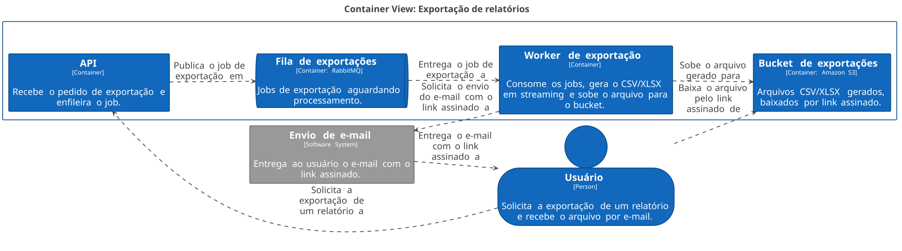
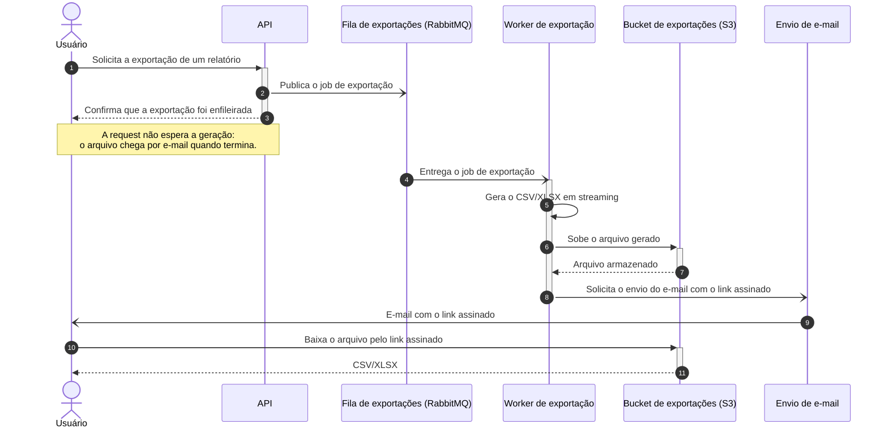

# Exportação de relatórios em background

| | |
|---|---|
| **Documento** | DESIGN-DOC |
| **Estado** | Rascunho |
| **Título** | Exportação de relatórios em background |
| **Autores** | A definir |
| **Revisores** | A definir (Plataforma: fila compartilhada), A definir (Segurança: link assinado com PII) |
| **Criado em** | 2026-09-28 |
| **Última atualização** | 2026-09-28 |
| **Tags** | exportação, relatórios, fila, rabbitmq, s3 |

## Glossário

- **PII**: informação pessoal identificável (dados de cliente presentes nos relatórios).
- **Link assinado**: URL temporária que autoriza o download de um arquivo específico do bucket sem exigir credenciais da conta.
- **Geração em streaming**: o worker escreve o arquivo à medida que lê os dados, sem montar o relatório inteiro em memória.
- **Job**: um pedido de exportação publicado na fila e processado pelo worker.

## Visão geral

Hoje a API gera relatórios grandes dentro da própria request e estoura o timeout de 30 s do gateway. Este documento propõe tirar a geração da request: a API passa a enfileirar um job, um worker separado gera o CSV/XLSX em streaming e sobe o arquivo para o S3, e o usuário recebe por e-mail um link assinado quando a exportação termina. O objetivo é zerar os timeouts de exportação e sustentar relatórios de 100 mil linhas, aceitando em troca que toda exportação, inclusive as pequenas, passe a ser assíncrona.

## Contexto e escopo

A API gera os relatórios de forma síncrona, na request que o usuário dispara. O gateway na frente da API corta requests em 30 s. Relatórios grandes não cabem nessa janela: cerca de 12% das exportações acima de 50 mil linhas falham por timeout, e o suporte abre ticket sobre isso toda semana.

A infraestrutura já conta com RabbitMQ, usado por outras cargas e operado pelo time de plataforma. Os relatórios contêm dados de cliente, o que inclui PII.

## Objetivos

- Zerar as falhas de exportação por timeout, tirando a geração do relatório da request da API.
- Sustentar exportações de 100 mil linhas, gerando o arquivo em streaming num worker separado.

O que fica explicitamente fora de escopo ainda não foi definido (ver Questões em aberto).

## Visão da solução

A exportação deixa de ser uma operação síncrona da API e vira um job. A API recebe o pedido, publica o job na fila do RabbitMQ e responde na hora, sem esperar a geração. Um worker separado consome a fila, gera o CSV/XLSX em streaming e sobe o arquivo para um bucket no S3. Ao terminar, o usuário recebe por e-mail um link assinado para baixar o arquivo.

O time optou por um caminho único: exportações pequenas, que hoje funcionam na hora, também passam pelo job. O usuário perde o download imediato em qualquer tamanho, e em compensação existe um só fluxo para manter, operar e explicar ao suporte.

## Arquitetura



<details>
<summary>Fonte do diagrama (Structurizr DSL)</summary>

```
workspace "Exportação de relatórios em background" "Geração assíncrona de relatórios CSV/XLSX fora da request da API." {

    !identifiers hierarchical

    model {
        usuario = person "Usuário" "Solicita a exportação de um relatório e recebe o arquivo por e-mail."

        exportacao = softwareSystem "Exportação de relatórios" "Gera relatórios grandes fora da request da API e entrega o arquivo por link assinado." {
            api = container "API" "Recebe o pedido de exportação e enfileira o job."
            fila = container "Fila de exportações" "Jobs de exportação aguardando processamento." "RabbitMQ" {
                tags "Queue"
            }
            worker = container "Worker de exportação" "Consome os jobs, gera o CSV/XLSX em streaming e sobe o arquivo para o bucket."
            bucket = container "Bucket de exportações" "Arquivos CSV/XLSX gerados, baixados por link assinado." "Amazon S3" {
                tags "Storage"
            }
        }

        email = softwareSystem "Envio de e-mail" "Entrega ao usuário o e-mail com o link assinado." {
            tags "External"
        }

        usuario -> exportacao.api "Solicita a exportação de um relatório a"
        exportacao.api -> exportacao.fila "Publica o job de exportação em"
        exportacao.fila -> exportacao.worker "Entrega o job de exportação a"
        exportacao.worker -> exportacao.bucket "Sobe o arquivo gerado para"
        exportacao.worker -> email "Solicita o envio do e-mail com o link assinado a"
        email -> usuario "Entrega o e-mail com o link assinado a"
        usuario -> exportacao.bucket "Baixa o arquivo pelo link assinado de"
    }

    views {
        systemContext exportacao "SystemContext" {
            include *
            autoLayout lr
        }

        container exportacao "Containers" {
            include *
            autoLayout lr
        }

        styles {
            element "Element" {
                background #1168bd
                color #ffffff
            }
            element "Person" {
                shape person
            }
            element "Queue" {
                shape pipe
            }
            element "Storage" {
                shape bucket
            }
            element "External" {
                background #999999
                color #ffffff
            }
        }
    }

    configuration {
        scope softwaresystem
    }
}
```

</details>

O sistema tem quatro containers e uma dependência externa:

- **API**: o ponto de entrada que já existe. Passa a apenas registrar o pedido e publicar o job na fila; não gera mais o arquivo.
- **Fila de exportações (RabbitMQ)**: guarda os jobs até o worker consumi-los. Roda no RabbitMQ que a infraestrutura já tem, compartilhado com outras cargas.
- **Worker de exportação**: processo separado da API, que consome a fila, lê os dados do relatório, escreve o CSV/XLSX em streaming e sobe o arquivo para o bucket. A fonte de onde o worker lê os dados não foi definida (ver Questões em aberto).
- **Bucket de exportações (Amazon S3)**: armazena os arquivos gerados. O usuário baixa direto do bucket, pelo link assinado.
- **Envio de e-mail**: entrega ao usuário o e-mail com o link assinado. Neste desenho o worker dispara o envio ao terminar a geração; o serviço de e-mail em si e quem o opera ainda não foram definidos.

A API e o worker aparecem sem tecnologia no diagrama porque a conversa não a estabeleceu; preencha os dois campos ao revisar o DSL. O gateway com timeout de 30 s fica na frente da API e continua existindo; ele não aparece na visão de containers porque é infraestrutura de implantação, não um componente do sistema.

## Fluxo de exportação



Nos passos 1 a 3 a API recebe o pedido, publica o job e responde na hora; é isso que elimina o timeout, porque a request termina em segundos independentemente do tamanho do relatório. Nos passos 4 a 7 o worker consome o job, gera o arquivo em streaming e sobe para o bucket. Nos passos 8 e 9 o worker pede o envio do e-mail e o usuário recebe o link assinado. Nos passos 10 e 11 o usuário baixa o arquivo direto do bucket.

O diagrama mostra apenas o caminho feliz. O que a API responde ao enfileirar, como o usuário acompanha o andamento e o que acontece quando o job falha, o e-mail não chega ou o link expira ainda não foram definidos; estão listados em Questões em aberto.

## Dados e sensibilidade

Os relatórios exportados carregam dados de cliente, incluindo PII. Com o novo desenho, esses dados passam a existir também como arquivos no bucket S3 e a ser acessíveis por um link assinado que viaja por e-mail. Hoje o dado só transita na resposta da API. Validade do link, retenção dos arquivos e quem pode acessá-los são decisões que cabem ao time de segurança e estão em aberto.

## Trade-offs da solução escolhida

- ✓ Zera os timeouts de exportação por construção: a request só enfileira o job, e a geração não fica mais sujeita aos 30 s do gateway.
- ✓ Um único caminho de exportação, para relatórios pequenos e grandes, em vez de um fluxo síncrono e outro assíncrono para manter.
- ✓ Reaproveita o RabbitMQ que a infraestrutura já tem, sem introduzir um novo broker.
- ✓ O dado de cliente permanece na infraestrutura própria, ao contrário da alternativa com ferramenta de BI externa.
- ✗ O usuário perde o download imediato. Exportações pequenas, que hoje saem na hora, passam a chegar por e-mail.
- ✗ A exportação passa a ocupar a fila compartilhada do time de plataforma, que precisa absorver essa carga.
- ✗ O link assinado com PII, enviado por e-mail, é uma superfície de exposição nova, que o time de segurança precisa avaliar.
- ✗ A entrega depende de mais peças: fila, worker, bucket e e-mail. Uma falha em qualquer uma delas é uma exportação que o usuário não recebe, e o tratamento dessas falhas ainda não foi definido.

## Alternativas consideradas

### Não fazer nada

Manter a geração síncrona na request. Descartada: cerca de 12% das exportações acima de 50 mil linhas continuariam falhando e o suporte seguiria abrindo ticket toda semana. O objetivo de sustentar 100 mil linhas não é alcançável dentro dos 30 s do gateway.

### Gerar síncrono com timeout maior

Manter a geração na request e aumentar o timeout do gateway. Descartada porque só empurra o problema: o limite continua existindo, apenas mais adiante, e um relatório maior que a nova janela volta a falhar do mesmo jeito.

### Ferramenta de BI externa

Delegar a exportação a uma ferramenta de BI de terceiros. Descartada por dois motivos: o custo da ferramenta e a exposição de dado de cliente a um serviço fora da infraestrutura própria.

### Job em worker separado com entrega por link assinado (escolhida)

A solução descrita neste documento. Venceu porque remove o limite de tempo da geração em vez de deslocá-lo, mantém o dado de cliente dentro de casa e usa infraestrutura que já existe. O custo aceito é a perda do download imediato para todas as exportações.

## Preocupações transversais

### Plataforma

O RabbitMQ é compartilhado e operado pelo time de plataforma. A exportação adiciona uma carga nova a essa fila, com jobs que podem levar bem mais tempo que as mensagens usuais, já que cada um gera um arquivo de até 100 mil linhas. O time de plataforma precisa revisar o volume esperado de jobs, se a exportação usa uma fila dedicada ou compartilha fila com outras cargas, e como o worker será dimensionado.

### Segurança

O link assinado dá acesso a um arquivo com PII e viaja por e-mail. O time de segurança precisa definir a validade do link, o tempo de retenção dos arquivos no bucket, quem pode acessá-los e se o e-mail é um canal aceitável para esse link.

## Testabilidade e observabilidade

Os dois objetivos são mensuráveis e definem o que precisa ser verificado:

- Antes de liberar: uma exportação de 100 mil linhas precisa completar de ponta a ponta (job, arquivo no bucket, e-mail com link, download).
- Em produção: a taxa de falha de exportação por timeout, que hoje está em cerca de 12% para relatórios acima de 50 mil linhas, deve cair a zero. Acompanhar também o volume de tickets de suporte sobre exportação, que hoje é semanal.

Como esses números serão coletados e alarmados ainda não foi definido.

## Questões em aberto

1. Quem são os autores do documento e quais pessoas dos times de plataforma e segurança revisam.
2. De onde o worker lê os dados do relatório (o mesmo banco que a API usa hoje? uma réplica?) e qual o impacto de uma leitura de 100 mil linhas nessa fonte.
3. O que a API responde ao enfileirar o job e como o usuário acompanha o andamento da exportação enquanto o e-mail não chega.
4. O que acontece quando o job falha, é perdido, ou o e-mail não é entregue: há retentativa? o usuário é avisado da falha?
5. Qual serviço envia o e-mail e quem o opera. O desenho assume que o worker dispara o envio ao terminar.
6. Segurança: validade do link assinado, retenção dos arquivos no bucket, quem pode acessá-los, e se o e-mail é um canal aceitável para o link.
7. Plataforma: fila dedicada ou compartilhada com outras cargas, volume esperado de jobs e dimensionamento do worker.
8. O que fica explicitamente fora de escopo desta entrega, e o que acontece com exportações acima de 100 mil linhas.
9. A entrega é feita de uma vez, com todas as exportações migrando para o job, ou em etapas.
