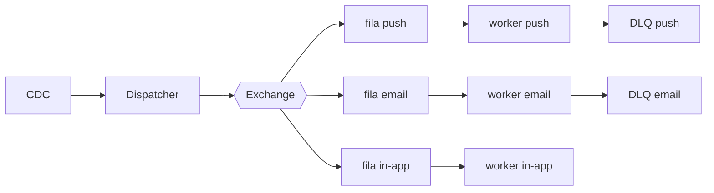

# Fanout de notificações

| | |
|---|---|
| **Estado** | Em revisão |
| **Autor** | Time de Mensageria |
| **Criado em** | 2026-01-28 |
| **Última atualização** | 2026-09-28 |

## Glossário

- **CDC** (Change Data Capture): captura das mudanças de um banco de dados como um fluxo de eventos; aqui, a forma de ingestão dos eventos de domínio.
- **DLQ** (Dead Letter Queue): fila que recebe as mensagens que o worker não conseguiu processar, para que não se percam nem travem a fila principal.
- **Provider**: serviço que faz a entrega final da notificação em um canal.
- **SLA** (Service Level Agreement): acordo de nível de serviço; aqui, o prazo de entrega das notificações.
- **TPS** (transações por segundo): taxa de chamadas por segundo feitas a um provider.

## Visão geral

O envio de notificações é sequencial hoje e começou a apresentar lentidão com o crescimento da base. Este documento propõe trocar esse modelo por um fanout baseado em filas, em que um dispatcher publica os eventos e um worker por canal (push, e-mail, in-app) consome em paralelo.

## Contexto

O serviço de notificações roda dentro do serviço de mensageria e processa os envios de forma sequencial. Um cron lê a tabela `notifications` a cada minuto, monta o payload de cada canal (push, e-mail, in-app) e chama os providers um a um. Com o crescimento da base, esse modelo começou a apresentar lentidão.

## Objetivos

- Melhorar a performance dos envios
- Tornar o sistema escalável
- Garantir o SLA

## Fora de escopo

- O sistema não deve ser lento
- O sistema não deve perder notificações

## Solução

Adotaremos um fanout com filas por canal:

Os eventos de domínio entram por CDC e chegam ao dispatcher, que publica cada evento numa exchange. A exchange encaminha os eventos para as filas de cada canal (push, e-mail, in-app). Cada canal tem o seu worker, que consome a própria fila em paralelo com os demais e faz a entrega pelo provider do canal, com controle de TPS por provider. As mensagens que um worker não consegue processar vão para a DLQ do seu canal.

## Plano

1. Criar exchange e filas
2. Migrar o canal de e-mail
3. Migrar push e in-app
4. Desligar o cron
