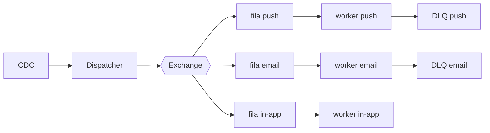

# Fanout de notificações

| | |
|---|---|
| **Estado** | Em revisão |
| **Autor** | Time de Mensageria |
| **Criado em** | 2026-01-28 |
| **Última atualização** | 2026-09-28 |

## Glossário

- **CDC** (Change Data Capture): captura das mudanças no banco de dados na forma de um fluxo de eventos.
- **DLQ** (Dead Letter Queue): fila que recebe as mensagens que o worker não conseguiu processar.
- **Exchange**: componente de mensageria que recebe as mensagens publicadas e as roteia para as filas.
- **Fanout**: padrão em que uma mensagem publicada é distribuída para várias filas, uma por consumidor.
- **Provider**: serviço que efetua a entrega da notificação em um canal (push, e-mail ou in-app).
- **SLA** (Service Level Agreement): acordo de nível de serviço; neste documento, o compromisso de prazo de entrega das notificações.
- **TPS** (transações por segundo): taxa de chamadas por segundo feitas a um provider.

## Visão geral

O serviço de notificações envia push, e-mail e in-app de forma sequencial, e com o crescimento da base os envios começaram a apresentar lentidão. Este documento propõe substituir esse modelo por um fanout baseado em filas, com um worker por canal consumindo em paralelo, para atender o SLA de entrega.

## Contexto

Hoje o envio de notificações roda dentro do próprio serviço de mensageria. Um cron lê a tabela `notifications` a cada minuto, monta o payload de cada canal (push, e-mail, in-app) e chama os providers um a um, de forma sequencial. Com o crescimento da base esse modelo começou a apresentar lentidão.

## Objetivos

- Melhorar a performance dos envios
- Tornar o sistema escalável
- Garantir o SLA

## Fora de escopo

- O sistema não deve ser lento
- O sistema não deve perder notificações

## Solução

A solução proposta é mais escalável e robusta que o modelo atual, além de mais fácil de manter. Adotaremos o fanout com filas por canal:

O fluxo do diagrama tem quatro etapas:

1. Ingestão: o CDC captura os eventos de domínio e os entrega ao dispatcher, no lugar da leitura da tabela `notifications` por cron.
2. Roteamento: o dispatcher publica cada evento na exchange, que o roteia para a fila do canal correspondente (push, e-mail ou in-app).
3. Entrega: um worker por canal consome a sua fila em paralelo com os demais e chama o provider do canal, respeitando o controle de TPS por provider.
4. Falhas: os workers de push e e-mail encaminham para a DLQ do seu canal as mensagens cuja entrega falhou.

## Plano

1. Criar exchange e filas
2. Migrar o canal de e-mail
3. Migrar push e in-app
4. Desligar o cron
