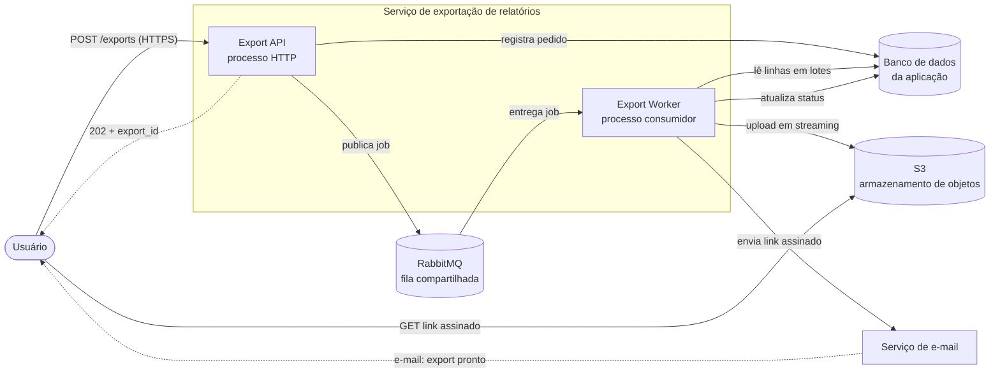

# Serviço de exportação de relatórios em background

| | |
|---|---|
| **Documento** | DESIGN-DOC |
| **Estado** | Rascunho |
| **Título** | Serviço de exportação de relatórios em background |
| **Autores** | _(a definir)_ |
| **Revisores** | _(a definir — sugestão: Plataforma, Segurança)_ |
| **Criado em** | 2026-06-07 |
| **Última atualização** | 2026-06-07 |
| **Tags** | exportação, fila, rabbitmq, s3, async |

## Glossário

| Termo | Definição |
|---|---|
| **Gateway** | Camada de entrada da API onde está configurado o timeout de 30s por request. |
| **Job** | Unidade de trabalho de exportação enfileirada para processamento assíncrono. |
| **Worker** | Processo separado da API que consome jobs da fila e gera os arquivos. |
| **Streaming** | Geração e escrita do arquivo em lotes de linhas, sem materializar o relatório inteiro em memória. |
| **Link assinado (pre-signed URL)** | URL temporária do S3 que concede download direto do arquivo sem expor credenciais, válida por um tempo limitado (TTL). |
| **TTL** | _Time to live_ — janela de validade do link assinado. |
| **PII** | _Personally Identifiable Information_ — dados pessoais identificáveis do cliente presentes nos relatórios. |
| **CSV / XLSX** | Formatos de arquivo de exportação (texto separado por vírgulas / planilha Excel). |

## Visão geral

Hoje os relatórios são gerados de forma síncrona dentro da própria request da API, e os
relatórios grandes estouram o timeout de 30s do gateway. Este documento propõe mover a
geração de relatórios para fora do ciclo de request: a API passa a enfileirar um job num
worker dedicado, que gera o arquivo em streaming, sobe para o S3 e notifica o usuário por
e-mail com um link assinado para download. O objetivo é eliminar os timeouts de exportação
e suportar relatórios de até 100 mil linhas.

## Escopo e contexto

A geração de relatórios acontece atualmente na thread da request HTTP da API. Para
relatórios pequenos isso funciona — o usuário clica, espera alguns segundos e recebe o
arquivo no próprio response, com download imediato. Para relatórios grandes, a geração
ultrapassa o limite de 30s configurado no gateway, e a request é cortada antes de
terminar.

Os números atuais:

- Cerca de **12% das exportações acima de 50 mil linhas falham** por timeout.
- O suporte abre **ticket recorrente sobre isso toda semana**.

A infraestrutura já conta com **RabbitMQ** em produção, então adotar processamento
assíncrono baseado em fila não exige introduzir uma tecnologia nova de mensageria. O
armazenamento de objetos será no **S3**.

## Objetivos e fora de escopo

### Objetivos

- **Zerar os timeouts de exportação** tirando a geração do relatório do ciclo de
  request/response: a request da API só enfileira o job e retorna imediatamente, então não
  há mais nada acontecendo na request que possa estourar o timeout de 30s do gateway.
- **Suportar exportações de até 100 mil linhas** gerando o arquivo em streaming (em lotes
  de linhas) no worker, sem carregar o relatório inteiro em memória.
- **Entregar o resultado de forma assíncrona**: o usuário recebe por e-mail um link
  assinado para baixar o arquivo do S3 quando a geração termina.
- **Unificar o caminho de exportação**: todas as exportações — grandes e pequenas — passam
  a ser assíncronas, eliminando a bifurcação síncrono/assíncrono na base de código.

### Fora de escopo

- **Manter o download síncrono imediato** para relatórios pequenos. É uma escolha
  deliberada (ver _Trade-offs_): aceitamos perder o download na hora em troca de um caminho
  único.
- **Interface de acompanhamento do job na UI** (barra de progresso, página "minhas
  exportações"). O canal de entrega nesta versão é o e-mail com o link; um acompanhamento
  in-app pode vir depois.
- **Novos formatos de exportação** além de CSV e XLSX, que já são os suportados hoje.
- **Geração agendada/recorrente de relatórios**. Este trabalho cobre exportações sob
  demanda.

## A solução

### Visão geral da solução

A request de exportação deixa de gerar o arquivo e passa a fazer só duas coisas: registrar
o pedido e **publicar um job no RabbitMQ**, devolvendo imediatamente um `202 Accepted` com
o identificador da exportação. Um **worker dedicado** consome o job, busca as linhas do
banco em lotes, gera o CSV/XLSX **em streaming** fazendo upload incremental para o **S3**,
e ao terminar gera um **link assinado** e dispara um **e-mail** ao usuário com esse link.

O trade-off central já aparece aqui: ao remover a geração da request, **nenhuma exportação
tem mais download imediato** — nem as pequenas, que hoje funcionam na hora. Aceitamos essa
perda em troca de um caminho único e de eliminar a classe inteira de falhas por timeout
(detalhado em _Trade-offs_).

### Arquitetura

> Os diagramas abaixo não puderam ser validados por ferramenta de renderização (o servidor
> de validação retornou erro de transporte); são ilustrações inline em sintaxe Mermaid
> padrão.



Os componentes:

- **Export API** — o processo HTTP existente. Deixa de gerar o relatório; passa a registrar
  o pedido no banco (com status inicial) e a publicar o job na fila. Responde `202` na hora.
- **RabbitMQ** — broker de mensageria **já existente** na infra. Recebe os jobs de
  exportação. É uma **fila compartilhada** com outros consumidores da plataforma (ver
  _Cross-cutting concerns_).
- **Export Worker** — processo novo e separado da API, que consome os jobs. É onde a
  geração pesada acontece, agora sem o limite de 30s do gateway. Escala
  horizontalmente (mais instâncias = mais throughput de exportações).
- **Banco de dados da aplicação** — fonte das linhas do relatório e também o registro do
  estado de cada exportação (`queued` → `running` → `done`/`failed`).
- **S3** — onde o arquivo gerado é armazenado, e de onde o usuário baixa diretamente via
  link assinado.
- **Serviço de e-mail** — canal de entrega do link ao usuário ao fim do job.

### Fluxo de uma exportação

```mermaid
sequenceDiagram
    actor U as Usuário
    participant API as Export API
    participant DB as Banco da aplicação
    participant MQ as RabbitMQ
    participant W as Export Worker
    participant S3 as S3
    participant ML as Serviço de e-mail

    U->>API: POST /exports (filtros, formato)
    API->>DB: cria registro (status=queued)
    API->>MQ: publica job de exportação
    API-->>U: 202 Accepted { export_id, status: queued }

    MQ->>W: entrega o job
    W->>DB: status=running
    loop em lotes de linhas
        W->>DB: busca próximo lote
        W->>S3: envia parte (upload incremental)
    end
    W->>S3: finaliza upload
    W->>S3: gera link assinado (TTL)
    W->>DB: status=done, guarda a chave do objeto
    W->>ML: envia e-mail com o link assinado
    ML-->>U: "sua exportação está pronta" + link
    U->>S3: GET link assinado (baixa o arquivo)

    Note over W,DB: em falha: status=failed, retry pela fila; alerta + notificação ao usuário
```

O caminho feliz: a API responde em milissegundos porque só enfileira; o worker faz o
trabalho pesado fora da request, lendo o banco em lotes e subindo o arquivo ao S3 conforme
gera (sem materializar 100 mil linhas em memória); ao terminar, o usuário recebe o link por
e-mail e baixa direto do S3. Como o download é uma requisição do usuário ao S3 (não à nossa
API), o tamanho do arquivo deixa de pressionar a API.

O caminho de falha é tratado pela própria fila: um job que falha pode ser reprocessado
(retry) e, esgotadas as tentativas, é marcado como `failed`, gera alerta e notifica o
usuário — em vez de simplesmente estourar um timeout silencioso como hoje.

### API

A mudança contratual relevante é a **substituição da resposta síncrona com o arquivo por
uma resposta `202 Accepted` que apenas aceita o pedido**. Os campos que sustentam a decisão:

- **`POST /exports`** → retorna `202` com `{ export_id, status }`. Não retorna mais o
  arquivo no corpo.
- **`GET /exports/{export_id}`** → permite consultar o estado (`queued` / `running` /
  `done` / `failed`) e, quando `done`, o link assinado. Útil tanto para o e-mail quanto
  para um eventual acompanhamento in-app no futuro.

O contrato completo (corpo de filtros, formatos, paginação dos resultados) segue a fonte de
verdade da especificação da API e não é replicado aqui.

### Dados e sensibilidade

Os relatórios contêm **PII de clientes** — é justamente o motivo de a alternativa de BI
externa ter sido descartada. Isso restringe o design em dois pontos que precisam do aval da
Segurança:

- O arquivo gerado fica no **S3 com PII**; acesso a ele se dá **apenas via link assinado com
  TTL curto**, nunca por bucket/objeto público.
- O **link assinado trafega por e-mail**, um canal que não controlamos totalmente — o que
  reforça a necessidade de TTL curto e de o link dar acesso só ao objeto daquela exportação.

## Trade-offs da solução escolhida

- ✓ **Elimina a classe de falhas por timeout.** A geração sai da request; o gateway não tem
  mais nada longo para cortar. Endereça diretamente os ~12% de falhas acima de 50 mil linhas.
- ✓ **Escala para 100 mil linhas (e além) sem pressionar a API.** O streaming evita carregar
  o relatório inteiro em memória, e o download sai do S3, não da nossa API.
- ✓ **Um caminho único de exportação.** Some a bifurcação síncrono (pequeno) / assíncrono
  (grande): menos código, menos casos de borda, comportamento consistente.
- ✓ **Reaproveita infraestrutura existente** (RabbitMQ), sem introduzir mensageria nova.
- ✗ **Perde o download imediato — inclusive para exportações pequenas que hoje funcionam na
  hora.** Este é o custo aceito explicitamente: priorizamos um caminho único e previsível em
  vez de manter o atalho síncrono para casos pequenos. Quem exportava 200 linhas e recebia o
  arquivo na hora passa a esperar o e-mail.
- ✗ **Aumenta o número de partes móveis e modos de falha.** Worker, fila e e-mail são
  componentes novos no caminho; uma exportação agora pode falhar por job perdido, e-mail não
  entregue ou link expirado — cenários que antes não existiam e precisam de observabilidade
  e tratamento.
- ✗ **Cria dependência de uma fila compartilhada.** Uma rajada de exportações pode competir
  por capacidade com outros consumidores da plataforma (ver _Cross-cutting concerns_).
- ✗ **Expõe PII via link em e-mail.** Mitigável com TTL curto, mas é uma superfície nova que
  não existia quando o arquivo voltava só dentro da sessão autenticada.

## Alternativas consideradas

| Alternativa | Trade-offs | Decisão |
|---|---|---|
| **Worker assíncrono + fila + S3 + link por e-mail** | ✓ Tira a geração da request, escala para 100k, reusa RabbitMQ. ✗ Perde download imediato; mais partes móveis; PII em e-mail. | **Escolhida** |
| **Manter síncrono, só aumentar o timeout** | ✓ Mudança trivial, mantém download imediato. ✗ Só empurra o problema: relatórios maiores voltam a estourar; segura uma thread/conexão por toda a geração; piora a saúde da API sob carga. | Descartada |
| **Ferramenta de BI externa** | ✓ Tira a carga de geração de nós; recursos prontos. ✗ Custo elevado; exporia PII de cliente a um terceiro. | Descartada |
| **Não fazer nada** | ✓ Custo zero de desenvolvimento. ✗ Os ~12% de falhas acima de 50k continuam; o suporte segue abrindo ticket toda semana; não há caminho para 100k linhas. | Descartada |

A alternativa de **aumentar o timeout** foi descartada porque não resolve, só adia: o limite
volta a ser atingido com relatórios maiores e, no meio tempo, manter conexões abertas por
muito tempo degrada a API sob carga. A de **BI externo** foi descartada por **custo** e por
**expor dado de cliente (PII) a um terceiro**. **Não fazer nada** é inaceitável porque os
sintomas atuais (12% de falhas, tickets semanais) persistem e não há caminho para a meta de
100 mil linhas.

## Cross-cutting concerns

### Plataforma (fila compartilhada)

Os jobs de exportação vão para o **RabbitMQ compartilhado** com outros consumidores. Uma
rajada de exportações pode competir por capacidade e afetar outros fluxos da plataforma —
ou ser afetada por eles. Pontos a alinhar com o time de Plataforma: fila/exchange dedicada
para exportação, limites de concorrência por consumidor e política de prioridade/quotas
para que exportação não monopolize nem seja monopolizada. **Sugerido como revisor.**

### Segurança (link assinado com PII)

Os relatórios contêm **PII de clientes**, agora acessíveis por um **link assinado entregue
por e-mail**. Pontos a alinhar com o time de Segurança: o **TTL** do link, garantir que o
escopo do link seja só o objeto daquela exportação, e a postura de não tornar nenhum objeto
público. **Sugerido como revisor.**

## Testabilidade e observabilidade

- **Antes de subir:** testes de integração do fluxo enfileirar → consumir → gerar → upload →
  link; teste de carga gerando um relatório de **100 mil linhas** para confirmar a meta de
  capacidade e o comportamento de streaming sob memória controlada.
- **Em produção:** métrica de **taxa de timeout de exportação** (meta: zero) — é a prova
  direta do objetivo; tempo de fila e tempo de geração por tamanho de relatório;
  profundidade da fila e taxa de jobs em `failed`/retry; alerta para acúmulo na fila e para
  picos de falha. O ticket semanal de suporte é uma métrica de negócio que deve cair junto.

## Plano de implantação

Como a mudança troca o contrato de exportação (de download imediato para assíncrono), vale
entregar em etapas em vez de num único corte:

1. Subir o **worker** e a publicação de jobs **atrás de uma flag**, ainda sem trocar o
   comportamento exposto ao usuário, validando o fluxo ponta a ponta em produção.
2. **Rotear primeiro as exportações grandes** (as que hoje falham por timeout) para o
   caminho assíncrono — é onde o ganho é imediato e o risco de regressão é menor (elas já
   não funcionam bem hoje).
3. **Migrar as exportações pequenas** para o assíncrono, consolidando o caminho único, com
   comunicação prévia ao usuário sobre a mudança de comportamento (deixa de ser na hora).
4. **Remover o código de geração síncrona** e a flag.

Rollback: enquanto a geração síncrona ainda existir (até a etapa 4), é possível voltar uma
classe de exportação ao caminho antigo desligando a flag.

## Questões em aberto

- **Autores e revisores nomeados** do documento (sugerimos revisores de Plataforma e
  Segurança — quem são as pessoas?).
- **TTL do link assinado** — a definir com Segurança.
- **Mecanismo/serviço de e-mail** a ser usado para a notificação e seu tratamento de falha
  de entrega (e-mail não entregue ≠ exportação falhou).
- **Política de retry e dead-letter** dos jobs na fila, a alinhar com Plataforma.
- **Retenção dos arquivos no S3** (por quanto tempo o objeto fica antes de ser expirado) e
  se há lifecycle policy.
- **Comportamento quando o link expira** antes de o usuário baixar (reenviar? regenerar a
  partir do `export_id`?).
