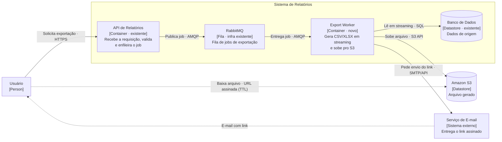
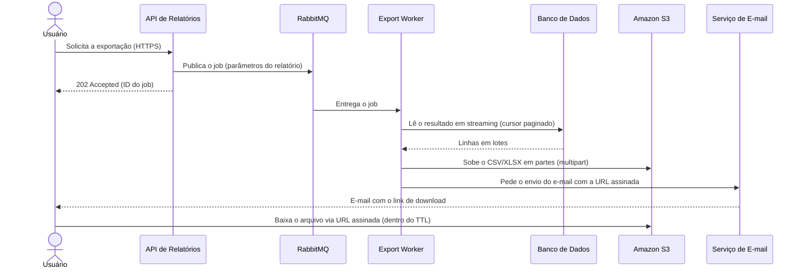

# Serviço de exportação de relatórios em background

| | |
|---|---|
| **Documento** | DESIGN-DOC |
| **Estado** | Rascunho |
| **Título** | Serviço de exportação de relatórios em background |
| **Autores** | _(a preencher)_ |
| **Revisores** | _(sugeridos)_ Time de Plataforma (fila compartilhada), Time de Segurança (link assinado com PII) |
| **Criado em** | 2026-06-07 |
| **Última atualização** | 2026-06-07 |
| **Tags** | exportação, relatórios, fila, assíncrono, s3 |

## Glossário

- **Job**: unidade de trabalho de exportação enfileirada na fila e processada por um worker.
- **Worker**: processo separado da API que consome jobs da fila e gera os arquivos.
- **AMQP**: protocolo de mensageria usado pelo RabbitMQ.
- **CSV / XLSX**: formatos de arquivo de saída da exportação.
- **S3**: object storage da AWS onde o arquivo gerado é armazenado.
- **URL assinada (signed URL)**: link temporário, com prazo de validade (TTL), que autoriza o download direto do arquivo no S3 sem credenciais permanentes.
- **TTL (time to live)**: prazo de validade da URL assinada, após o qual o link deixa de funcionar.
- **PII (Personally Identifiable Information)**: dado pessoal identificável; relatórios de cliente podem conter PII.
- **Streaming**: geração do arquivo em pedaços, sem materializar o resultado inteiro em memória.
- **Gateway**: o API gateway que hoje aplica o timeout de 30s sobre a request.

## Overview

Hoje os relatórios são gerados de forma síncrona, dentro da própria request da API. Para relatórios grandes isso estoura o timeout de 30s do gateway: cerca de 12% das exportações acima de 50 mil linhas falham, e o suporte abre ticket disso toda semana. Este documento propõe mover a geração de relatórios para um worker em background: a API passa a enfileirar um job, um worker separado gera o arquivo (CSV/XLSX) em streaming e o envia para o S3, e o usuário recebe por e-mail um link assinado para baixar quando o processamento termina. O objetivo é zerar os timeouts de exportação e suportar relatórios de até 100 mil linhas.

## Escopo e contexto

A geração de relatórios acontece dentro do ciclo de request/response da API. O API gateway aplica um timeout de 30 segundos em todas as requests. Relatórios com muitas linhas levam mais que isso para serem gerados, então a request é cortada antes de terminar: aproximadamente **12% das exportações acima de 50 mil linhas falham** por timeout. Cada falha vira ticket de suporte, recorrente toda semana.

A infraestrutura já conta com **RabbitMQ**, hoje usado por outros fluxos e operado pelo time de Plataforma. Há também acesso a **S3** para armazenamento de arquivos. Os relatórios de cliente podem conter **PII**.

O fluxo atual, em uma frase: o usuário chama a API, a API consulta os dados, monta o arquivo em memória e o devolve na mesma resposta HTTP — tudo dentro da janela de 30s.

## Objetivos e fora de escopo

**Objetivos (mensuráveis):**

- **Zerar as falhas de exportação por timeout** ao remover a geração do caminho síncrono da request — exportações deixam de depender da janela de 30s do gateway.
- **Suportar relatórios de até 100 mil linhas** gerando o arquivo em streaming no worker, sem materializar o resultado inteiro em memória.
- **Entregar um caminho único de exportação**: toda exportação (grande ou pequena) passa a ser assíncrona, eliminando a bifurcação síncrono/assíncrono.

**Fora de escopo:**

- **Download imediato no navegador** para exportações pequenas — a entrega passa a ser por e-mail com link, inclusive para os relatórios que hoje funcionam na hora (trade-off aceito, detalhado adiante).
- **Mudar os formatos de saída** — continua CSV e XLSX.
- **Substituir o mecanismo de relatórios por uma ferramenta de BI** — avaliado e descartado (ver Alternativas).
- **Migrar a fila/broker** — reaproveitamos o RabbitMQ existente, não trocamos a tecnologia de mensageria.

## A solução

### Visão geral

A API deixa de gerar o relatório na request e passa a apenas **enfileirar um job** no RabbitMQ, respondendo imediatamente que a exportação foi aceita. Um **worker separado** consome o job, lê os dados do banco **em streaming**, escreve o arquivo (CSV/XLSX) também em streaming direto para o **S3**, e então dispara um **e-mail com uma URL assinada** para o usuário baixar o arquivo.

O trade-off central, aceito explicitamente: o usuário **perde o download imediato**. Exportações pequenas, que hoje retornam o arquivo na hora, também passam a ser assíncronas. Em troca, ganhamos um caminho único — sem timeout, sem limite prático de tamanho dentro da meta — e eliminamos a classe inteira de falhas que hoje gera tickets.

### Arquitetura

Diagrama de container (C4). A estrutura e as relações abaixo foram validadas via Structurizr; a renderização Mermaid embutida é fiel a esse modelo.

Componentes e interações:

- **API de Relatórios** (existente, modificada): em vez de gerar o relatório, ela valida os parâmetros, cria um job de exportação e o publica na fila. Responde de imediato com um aceite (ver fluxo). É o único componente que o usuário chama diretamente.
- **RabbitMQ** (infra existente): transporta os jobs da API para os workers. Desacopla a velocidade de quem pede (API) da de quem processa (worker), e absorve picos de demanda.
- **Export Worker** (novo): consome um job por vez, lê os dados do banco em streaming, escreve o CSV/XLSX em streaming para o S3 e solicita o envio do e-mail. É onde o processamento longo passa a viver, sem nenhum timeout de gateway sobre ele.
- **Banco de Dados** (existente): fonte dos dados do relatório. O worker o lê de forma paginada/em cursor para não carregar tudo em memória.
- **Amazon S3**: guarda o arquivo gerado e serve o download via URL assinada, tirando o tráfego do arquivo de cima da API.
- **Serviço de E-mail**: entrega ao usuário o e-mail com o link assinado quando o job termina. _(Qual serviço/infra de e-mail será usado é uma questão em aberto — ver Questões em aberto.)_

### Fluxo de exportação

Sequência do caminho feliz. _(Diagrama Mermaid escrito inline; o servidor de validação de Mermaid estava indisponível, então este diagrama não foi validado por máquina. A mesma sequência foi modelada e validada como dynamic view no Structurizr.)_

Pontos do fluxo:

1. A API responde **202 Accepted** logo após enfileirar — a request fica curtíssima e nunca mais chega perto dos 30s. O corpo da resposta carrega um identificador do job para eventual rastreio.
2. O worker lê o banco em **cursor paginado** e escreve no S3 em **multipart**, de modo que nem o banco nem o worker precisam segurar 100 mil linhas em memória de uma vez. Esse par (leitura em streaming + escrita em streaming) é o que sustenta a meta de tamanho.
3. O e-mail só sai **depois** do upload concluído, então o link que chega ao usuário sempre aponta para um arquivo já existente no S3.
4. O download acontece **direto no S3**, via URL assinada — a API e o worker não entram no caminho dos bytes do arquivo.

### Dados e sensibilidade

O arquivo gerado pode conter **PII** (dado de cliente). Isso tem duas consequências de design:

- O arquivo vive no S3 e é acessível por **URL assinada com TTL**, não por um link público nem por um link permanente.
- O link viaja por **e-mail**, um canal que o time não controla totalmente. Quem tiver o link, dentro do TTL, baixa o arquivo. Daí a importância de um TTL curto e da revisão do time de Segurança (ver Cross-cutting concerns e Questões em aberto).

## Trade-offs da solução escolhida

✓ **Acaba com o timeout de exportação**: a geração sai do caminho da request, então a janela de 30s do gateway deixa de ser um limite — endereça diretamente os ~12% de falhas e os tickets semanais.

✓ **Suporta relatórios grandes**: geração em streaming (leitura paginada + upload multipart) sustenta os 100 mil linhas sem estourar memória.

✓ **Um caminho único**: toda exportação segue o mesmo fluxo assíncrono, simplificando o código (some a bifurcação síncrono/assíncrono) e a operação.

✓ **Tira o download de cima da API**: o tráfego do arquivo passa pelo S3, não pela aplicação.

✗ **Usuário perde o download imediato**: exportações pequenas, que hoje retornam na hora, passam a chegar por e-mail depois de processadas. É o custo deliberadamente aceito em troca do caminho único — a experiência de "baixou na hora" some para 100% dos casos, inclusive os que hoje funcionam bem.

✗ **Depende de e-mail e de S3**: a entrega agora atravessa dois sistemas a mais (serviço de e-mail e S3). E-mail que atrasa ou cai no spam vira "não recebi meu relatório"; é uma nova superfície de falha e de suporte.

✗ **Nova superfície de segurança**: um arquivo com PII passa a residir no S3 e a ser acessível por um link que trafega por e-mail. Exige TTL, política de acesso ao bucket e, possivelmente, retenção/expiração dos arquivos.

✗ **Carga em uma fila compartilhada**: jobs de exportação passam a disputar o RabbitMQ com os outros fluxos do time de Plataforma; um pico de exportações pode afetar vizinhos.

## Alternativas consideradas

| Alternativa | Trade-offs | Veredito |
|---|---|---|
| **Não fazer nada** | ✗ Mantém os ~12% de falhas acima de 50k linhas e os tickets semanais; ✗ não há caminho para 100k linhas dentro de 30s | ✗ Rejeitada — o problema é recorrente e custa suporte toda semana |
| **Síncrono com timeout maior** | ✓ Mudança mínima; ✗ só empurra o problema (relatórios maiores estouram o novo limite); ✗ requests longas seguram recursos da API e do gateway | ✗ Rejeitada — não resolve, adia |
| **Ferramenta de BI externa** | ✓ Tira a geração da nossa stack; ✗ custo; ✗ expõe dado de cliente (PII) a um terceiro | ✗ Rejeitada — custo e exposição de PII |
| **Worker em background + S3 + link por e-mail** | ✓ Zera o timeout; ✓ aguenta 100k linhas; ✓ caminho único; ✗ perde o download imediato; ✗ depende de e-mail/S3; ✗ nova superfície de segurança e carga em fila compartilhada | ✓ **Escolhida** |

O "síncrono com timeout maior" foi descartado por apenas mover a fronteira do problema sem eliminá-lo. A "ferramenta de BI externa" foi descartada por custo e, principalmente, por expor dado de cliente a um terceiro. A opção escolhida assume custos reais (perda do download imediato, dependência de e-mail/S3, segurança e fila compartilhada) em troca de eliminar a classe de falhas e habilitar relatórios grandes.

## Cross-cutting concerns

### Segurança (time de Segurança)

O design coloca um arquivo com **PII** no S3 e o entrega por um **link assinado** que trafega por e-mail. Pontos para revisão do time de Segurança:

- **TTL da URL assinada**: prazo curto o suficiente para limitar a janela de exposição, longo o suficiente para o usuário baixar. _(Valor a definir — questão em aberto.)_
- **Política de acesso ao bucket**: bloqueio de acesso público; acesso apenas via URL assinada.
- **Retenção/expiração** dos arquivos no S3, para não acumular PII indefinidamente. _(A definir.)_
- **Conteúdo do e-mail**: o que vai no corpo além do link (idealmente nada de PII no próprio e-mail).

### Infraestrutura / Plataforma (time de Plataforma)

A exportação passa a usar a **fila compartilhada do RabbitMQ**, operada pela Plataforma. Pontos para revisão:

- **Isolamento**: usar fila/exchange dedicada para jobs de exportação, para que um pico de exportações não afete os outros consumidores.
- **Vazão e concorrência**: quantos workers, quantos jobs em paralelo, e o efeito disso no broker.
- **Backpressure e retentativa**: o que acontece quando a fila enche ou um job falha (DLQ, número de tentativas).

### Compatibilidade

O contrato da API de exportação **muda**: o que hoje devolve o arquivo na resposta passa a devolver um aceite assíncrono. Qualquer cliente (UI, integração) que espera o arquivo na resposta precisa ser ajustado para o novo fluxo. _(O inventário de consumidores e o plano de transição do contrato são questões em aberto.)_

## Testabilidade e observabilidade

- **Antes de subir**: teste de geração em streaming com um relatório de **100 mil linhas**, verificando que o arquivo é gerado sem estourar memória e sem depender de janela de tempo de request. Teste de ponta a ponta do fluxo (enfileira → gera → S3 → e-mail → download).
- **Em produção**, métricas atreladas aos objetivos:
  - **Falhas de exportação por timeout** — meta: zero (hoje ~12% acima de 50k linhas). Como a geração sai da request, o número deve cair a zero; vale alertar se voltar a aparecer.
  - **Tempo de processamento do job** (do enfileiramento ao e-mail enviado), por faixa de tamanho.
  - **Profundidade da fila** e **idade do job mais antigo** — sinais de saturação da fila compartilhada.
  - **Taxa de falha de job** (e jobs na DLQ).
  - **Taxa de entrega de e-mail** — para pegar "não recebi o relatório" cedo.

## Plano de implantação

Sugestão de entrega incremental (a confirmar com os times impactados):

1. **Worker + fila dedicada**, gerando para o S3, sem expor ao usuário final — validar a geração em streaming com 100k linhas.
2. **Entrega por e-mail com link assinado**, com TTL e política de bucket revisados pela Segurança.
3. **Cortar a exportação grande para o fluxo assíncrono** (acima de um limite de linhas), atrás de flag, medindo a queda das falhas por timeout.
4. **Unificar todas as exportações no caminho assíncrono**, inclusive as pequenas, e remover o caminho síncrono.

Cada etapa atrás de flag permite reverter para o comportamento anterior se necessário. _(O rollback da etapa 4 — voltar o download imediato — precisa ser pensado, já que é uma mudança de contrato; ver Questões em aberto.)_

## Questões em aberto

- **Autores e revisores nomeados** do documento (sugeridos no header: Plataforma e Segurança).
- **TTL da URL assinada** e **política de retenção/expiração** dos arquivos no S3 — alinhar com Segurança.
- **Serviço/infra de e-mail** a ser usado para a entrega do link.
- **Status/rastreio do job para o usuário**: além do e-mail, haverá um endpoint para consultar o andamento da exportação (usando o ID do job retornado no 202)?
- **Inventário de consumidores da API de exportação** e plano de transição do contrato síncrono → assíncrono.
- **Política de retentativa e DLQ** para jobs que falham, alinhada com a Plataforma.
- **Limite de corte** na etapa 3 (a partir de quantas linhas a exportação vira assíncrona antes da unificação total).
