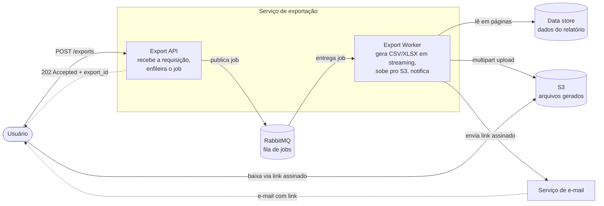
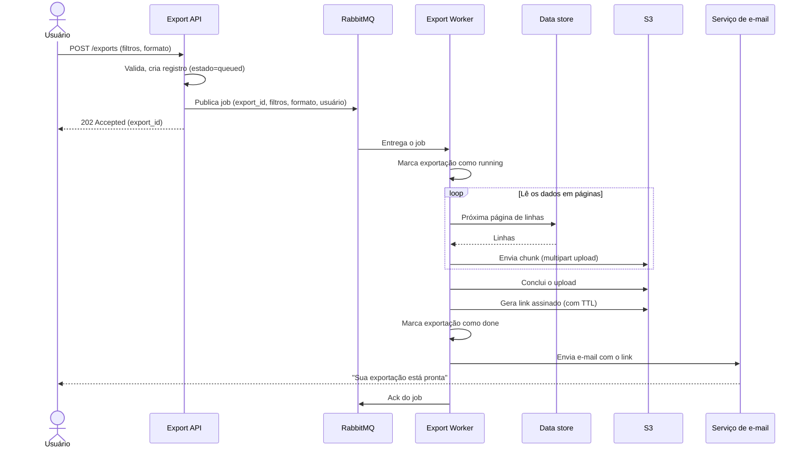

# Serviço de exportação de relatórios em background

| | |
|---|---|
| **Documento** | DESIGN-DOC |
| **Estado** | Draft |
| **Título** | Serviço de exportação de relatórios em background |
| **Autores** | _(a preencher)_ |
| **Revisores** | _(sugeridos)_ Plataforma (fila compartilhada), Segurança (link assinado com PII) |
| **Criado em** | 2026-06-07 |
| **Última atualização** | 2026-06-07 |
| **Tags** | exportação, background, rabbitmq, s3, csv, xlsx |

## Glossário

| Termo | Definição |
|---|---|
| **API** | _Application Programming Interface_ — aqui, o serviço HTTP de exportação que os clientes chamam. |
| **HTTP** | Protocolo das requisições entre cliente e API. |
| **URL** | Endereço web; aqui, o endereço do arquivo no S3 servido como link assinado. |
| **BI** | _Business Intelligence_ — categoria de ferramentas de análise/relatório; aqui, a opção de ferramenta externa avaliada como alternativa. |
| **Exportação síncrona** | Geração do relatório dentro da própria request HTTP, com o usuário aguardando a resposta. |
| **Exportação assíncrona** | A request apenas enfileira o trabalho; a geração acontece depois, fora do ciclo request/response. |
| **Gateway** | API gateway na frente da API que aplica o timeout de 30s nas requests. |
| **Worker** | Processo separado da API que consome jobs da fila e gera os relatórios. |
| **RabbitMQ** | Broker de mensageria já existente na infra, usado aqui como fila de jobs. |
| **S3** | Object storage onde o arquivo gerado é armazenado. |
| **Link assinado** | URL temporária do S3 que concede acesso ao arquivo por um tempo limitado, sem autenticação adicional. |
| **TTL** | _Time to live_ — prazo de validade do link assinado, após o qual ele deixa de funcionar. |
| **PII** | _Personally Identifiable Information_ — dados pessoais identificáveis (ex.: nome, e-mail, CPF) presentes nos relatórios. |
| **CSV / XLSX** | Formatos de arquivo de saída suportados pela exportação. |
| **DLQ** | _Dead-letter queue_ — fila para onde vão os jobs que falharam após esgotar as tentativas. |
| **Streaming** | Gerar e enviar o arquivo em pedaços (chunks), sem carregar o relatório inteiro em memória. |

## Visão geral

Hoje os relatórios são gerados dentro da própria request da API de exportação, e os relatórios grandes estouram o timeout de 30s do gateway antes de terminar. Este documento propõe mover a geração para um worker em background: a API passa a enfileirar um job no RabbitMQ e responde imediatamente; o worker gera o CSV/XLSX em streaming, sobe o arquivo para o S3 e envia ao usuário um link assinado por e-mail quando termina. O objetivo é zerar os timeouts de exportação e suportar relatórios de até 100 mil linhas, aceitando como custo que toda exportação — inclusive as pequenas que hoje baixam na hora — passe a ser assíncrona, em troca de um caminho único e confiável.

## Escopo e contexto

A exportação de relatórios é feita hoje de forma síncrona: o cliente chama a API, a API gera o arquivo durante a request e devolve o conteúdo na resposta. O gateway à frente da API impõe um timeout de 30 segundos. Relatórios grandes não cabem nesse orçamento de tempo:

- Cerca de **12% das exportações acima de 50 mil linhas falham** por estourar o timeout do gateway.
- O suporte abre **ticket dessa falha toda semana**, de forma recorrente.

A infraestrutura atual já dispõe de **RabbitMQ**, então adotar um modelo baseado em fila não exige introduzir um broker novo. Não há hoje um caminho assíncrono para exportações: o usuário sempre espera o download na própria chamada.

## Objetivos e fora de escopo

### Objetivos

- **Zerar os timeouts de exportação**, eliminando a geração dentro da request: nenhuma exportação deve falhar por estourar o timeout de 30s do gateway, porque a geração deixa de acontecer no ciclo request/response.
- **Suportar exportações de até 100 mil linhas** processando o relatório em streaming no worker, sem carregar o conjunto inteiro em memória nem depender do tempo da request.
- **Entregar o resultado por um link assinado enviado por e-mail**, oferecendo um único caminho de exportação para qualquer tamanho de relatório.

### Fora de escopo

- **Download imediato na request** — deixa de existir; toda exportação passa a ser assíncrona (ver _Trade-offs_).
- **Novos formatos de saída** além de CSV e XLSX já suportados.
- **Acompanhamento de progresso em tempo real** (barra de progresso / percentual) — o usuário é notificado apenas na conclusão.
- **Substituir a ferramenta de relatório/BI** ou ampliar o catálogo de relatórios disponíveis — o conjunto de relatórios é o mesmo, muda só a forma de gerá-los.

## A solução

### Visão da solução

A exportação passa a ter duas metades desacopladas por uma fila:

1. **A API** valida a requisição, registra a exportação e publica um job no RabbitMQ, respondendo na hora com um identificador da exportação (`202 Accepted`). Ela não gera mais o arquivo.
2. **O worker** (processo separado) consome o job, busca os dados em páginas, gera o CSV/XLSX **em streaming** direto para o S3, gera um **link assinado** com prazo de validade e dispara um e-mail ao usuário com esse link.

O trade-off central já aparece aqui: ao remover a geração do caminho da request, ganhamos confiabilidade e a capacidade de processar relatórios grandes, mas **o usuário perde o download imediato** — inclusive nas exportações pequenas que hoje funcionam na hora. Aceitamos esse custo em troca de ter **um único caminho de exportação** para manter, em vez de dois (síncrono para pequeno, assíncrono para grande).

### Arquitetura

> Os diagramas abaixo são Mermaid embutido. O servidor de validação de diagramas estava indisponível no momento da escrita, então eles não foram validados por máquina; a sintaxe é padrão e renderiza no GitHub/GitLab.

Os componentes:

- **Export API** — o serviço HTTP existente, alterado para deixar de gerar o arquivo na request. Passa a validar a requisição, criar um registro da exportação (estado inicial `queued`) e publicar o job no RabbitMQ, respondendo imediatamente com `202` e o `export_id`.
- **RabbitMQ** — broker já presente na infra. Atua como buffer entre API e worker e desacopla os dois: a API não depende da disponibilidade ou da velocidade do worker para responder.
- **Export Worker** — processo novo e separado, sem o timeout do gateway. Consome jobs, lê os dados em páginas e gera o arquivo em streaming.
- **Data store** — a mesma fonte de dados que a API consulta hoje; o worker passa a lê-la em páginas em vez de tudo de uma vez.
- **S3** — guarda o arquivo gerado e serve o download via link assinado, tirando do worker e da API a responsabilidade de entregar bytes.
- **Serviço de e-mail** — canal de notificação; entrega o link assinado ao usuário quando a exportação conclui.

### Fluxo da exportação

Pontos do fluxo que sustentam os objetivos:

- A API responde **antes** de qualquer geração acontecer, então a request nunca chega perto dos 30s — é o que zera os timeouts.
- O worker lê os dados **em páginas** e escreve no S3 via **multipart upload**, mantendo memória constante independentemente do tamanho do relatório — é o que viabiliza as 100 mil linhas.
- O **ack** do RabbitMQ só ocorre após o upload concluir e o e-mail ser enviado, garantindo que um job não seja perdido se o worker cair no meio (ver _Confiabilidade_).

### Estado da exportação e API

A API ganha um recurso de exportação com estado. Os campos que importam para o design (não o schema completo):

- `export_id` — identificador retornado no `202` e usado para consulta.
- `status` — `queued` → `running` → `done` / `failed`.
- `format` — `csv` ou `xlsx`.
- `download_url` / `expires_at` — preenchidos quando a exportação conclui (a URL é o link assinado).

Endpoints relevantes:

- `POST /exports` — enfileira a exportação, responde `202 Accepted` com o `export_id`.
- `GET /exports/{export_id}` — devolve o estado atual e, quando pronto, o link assinado (fallback para quem perdeu o e-mail; sustenta também a observabilidade).

A notificação primária é o **e-mail com o link assinado**; o `GET` é um caminho de consulta secundário, não o mecanismo principal de entrega.

### Confiabilidade

- **Retentativas e DLQ** — jobs que falham (erro transitório no data store, indisponibilidade do S3) são retentados; após esgotar as tentativas, vão para uma **dead-letter queue** para inspeção, e a exportação é marcada `failed`. Isso evita que uma falha pontual vire um ticket de suporte.
- **Ack após persistir** — como o ack só acontece depois do upload e do e-mail, a queda do worker no meio do trabalho faz o RabbitMQ reentregar o job, em vez de perdê-lo.

### Dados e sensibilidade

Os relatórios contêm **PII** (dados de cliente). Isso tem duas consequências de design:

- O **arquivo no S3** carrega PII e precisa de bucket privado, criptografia em repouso e uma política de retenção/expiração definida (ver _Questões em aberto_).
- O **link assinado** dá acesso ao arquivo sem autenticação adicional durante sua validade; o **TTL deve ser curto** para limitar a janela de exposição (ver _Segurança_).

## Trade-offs da solução escolhida

- ✓ **Zera os timeouts de exportação** — a geração sai do caminho da request, então o timeout de 30s do gateway deixa de ser um teto para o tamanho do relatório.
- ✓ **Suporta relatórios grandes (100 mil linhas)** — o streaming no worker mantém memória constante e não tem prazo de request para cumprir.
- ✓ **Um único caminho de exportação** — pequeno e grande seguem o mesmo fluxo, reduzindo a superfície de código e de bugs a manter.
- ✓ **Reaproveita infra existente** — RabbitMQ e S3 já estão na casa; não introduzimos broker nem storage novos.
- ✗ **Perda do download imediato** — exportações pequenas que hoje retornam na hora passam a chegar por e-mail; é uma regressão de experiência para o caso pequeno, aceita em troca do caminho único.
- ✗ **Mais partes móveis** — passa a haver um worker, uma fila, integração com e-mail e DLQ para operar e monitorar, contra o serviço único de hoje.
- ✗ **Nova superfície de exposição de PII** — o link assinado dá acesso ao arquivo sem login durante sua validade; exige TTL curto e revisão de segurança (ver _Cross-cutting_).
- ✗ **Dependência da entrega de e-mail** — se o e-mail não chega (spam, endereço errado), o usuário fica sem o link; mitigado pelo `GET /exports/{id}`, mas a notificação primária fica fora do nosso controle total.

## Alternativas consideradas

| Alternativa | Resolve timeout? | Suporta 100k linhas? | Custo / risco | Resultado |
|---|---|---|---|---|
| **Worker assíncrono + S3 + link por e-mail** | ✓ | ✓ | Mais partes móveis; perda do download imediato; PII em link assinado | ✓ **Escolhida** |
| Síncrono com timeout maior | ⚠ adia | ✗ | Empurra o problema; segura conexões/threads por minutos; teto sobe mas não some | ✗ Descartada |
| Ferramenta de BI externa | ✓ | ✓ | Custo de licença; expõe dado de cliente (PII) a terceiro | ✗ Descartada |
| Não fazer nada | ✗ | ✗ | 12% de falha acima de 50k linhas continua; tickets semanais seguem | ✗ Descartada |

- **Síncrono com timeout maior** — aumentar o limite do gateway faria mais relatórios caberem, mas só **adia** o problema: o próximo patamar de tamanho volta a estourar, e enquanto isso a request segura conexões e threads por minutos, piorando o uso de recursos do servidor. Descartada por só empurrar o problema.
- **Ferramenta de BI externa** — uma plataforma de BI de terceiros resolveria a geração pesada, mas foi descartada por **custo** e por **expor dado de cliente (PII)** a um fornecedor externo, o que conflita com as restrições de segurança.
- **Não fazer nada** — manter o síncrono atual deixa os 12% de falha acima de 50 mil linhas e os tickets semanais intactos, e não chega perto das 100 mil linhas. Inaceitável dado o objetivo.

## Cross-cutting concerns

### Segurança

Os relatórios contêm **PII** e a entrega passa a ser por **link assinado** — uma URL que concede acesso sem autenticação adicional enquanto for válida. Pontos para revisão do time de Segurança:

- **TTL curto** no link assinado para limitar a janela de exposição (valor a definir com Segurança — ver _Questões em aberto_).
- **Bucket S3 privado**, sem acesso público, com criptografia em repouso.
- **Política de retenção** dos arquivos no S3 — por quanto tempo o relatório com PII permanece armazenado antes de ser apagado.
- Cuidado com **PII em logs** (filtros, e-mails) no worker e na API.

Sugerimos o time de Segurança como revisor deste documento.

### Infraestrutura / Plataforma

O worker passa a usar uma **fila compartilhada no RabbitMQ**, que é responsabilidade do time de Plataforma. Pontos a alinhar:

- **Impacto na fila compartilhada** — volume de jobs de exportação e se eles precisam de vhost/fila dedicada para não competir com outras cargas.
- **Dimensionamento do worker** — quantos consumidores, e como escalar sob pico de exportações.
- **Capacidade e custo no S3** — armazenamento dos arquivos gerados e o tráfego de download.

Sugerimos o time de Plataforma como revisor deste documento.

### Compatibilidade

O contrato da exportação muda: `POST /exports` deixa de devolver o arquivo na resposta e passa a devolver `202 Accepted`. Clientes que hoje esperam o conteúdo no corpo da resposta **vão quebrar** e precisam se adaptar ao fluxo assíncrono. É preciso mapear os consumidores atuais da API de exportação antes do corte (ver _Questões em aberto_).

## Testabilidade e observabilidade

- **Antes de subir** — testes de geração em streaming com um relatório de **100 mil linhas** (objetivo de capacidade) verificando memória constante; testes de integração do fluxo API → fila → worker → S3 → e-mail.
- **Em produção** — métrica de **timeouts de exportação** (deve ir a zero, é o objetivo principal), taxa de jobs `failed` e tamanho da **DLQ**, tempo de processamento por exportação, e profundidade da fila no RabbitMQ. Alertar quando a DLQ cresce ou o tempo de processamento degrada.

## Questões em aberto

- **Autores e revisores nomeados** — preencher o cabeçalho com os autores e os nomes dos revisores de Plataforma e Segurança.
- **TTL do link assinado** — qual o prazo de validade aceitável para o time de Segurança?
- **Retenção dos arquivos no S3** — por quanto tempo manter os relatórios com PII antes de apagar?
- **Consumidores atuais da API** — quem chama `POST /exports` hoje esperando o arquivo na resposta, e como/quando migram para o fluxo assíncrono?
- **E-mail vs. outros canais** — o e-mail é o único canal de notificação, ou há in-app/webhook a considerar como reforço?
- **Reexecução pelo usuário** — se a exportação falhar (DLQ), o usuário consegue disparar de novo, ou só via suporte?
