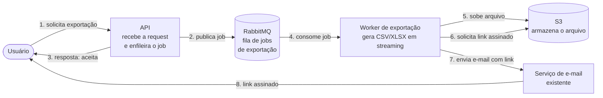

# Serviço de exportação de relatórios em background

|                  |                                                        |
| ---------------- | ------------------------------------------------------ |
| **Documento**    | DESIGN-DOC                                              |
| **Estado**       | Rascunho                                                |
| **Título**       | Serviço de exportação de relatórios em background      |
| **Autores**      | _(a preencher)_                                        |
| **Revisores**    | _(sugeridos)_ Plataforma (fila compartilhada), Segurança (link assinado / PII) |
| **Criado em**    | 2026-06-07                                              |
| **Atualizado em**| 2026-06-07                                              |
| **Tags**         | exportação, relatórios, background, rabbitmq, s3       |

## Glossário

| Termo | Definição |
| --- | --- |
| **API** | A aplicação web que hoje recebe a request de exportação e gera o relatório de forma síncrona. |
| **HTTP** | Protocolo da request do cliente para a API; o limite de 30s do gateway incide sobre essa request. |
| **Gateway** | O proxy/balanceador na borda que encerra requests acima de 30s (origem do timeout atual). |
| **Worker** | Processo separado da API que consome jobs da fila e gera o relatório. |
| **Job** | Unidade de trabalho enfileirada que representa uma exportação a ser produzida. |
| **RabbitMQ** | Broker de mensagens já existente na infraestrutura, usado como fila de jobs. |
| **S3** | Object storage onde o arquivo gerado é armazenado. |
| **Link assinado** | URL temporária e autenticada do S3 (presigned URL) que dá acesso ao arquivo por tempo limitado. |
| **CSV / XLSX** | Formatos de saída do relatório (texto separado por vírgula / planilha Excel). |
| **Streaming** | Geração do arquivo linha a linha, sem materializar o resultado inteiro em memória. |
| **PII** | Personally Identifiable Information — dado pessoal de cliente que exige tratamento de segurança. |
| **BI** | Business Intelligence — categoria de ferramenta de análise/relatório, avaliada como alternativa. |
| **DLQ** | Dead-letter queue — fila para onde jobs que falham repetidamente são desviados. |
| **TTL** | Time to live — tempo de validade (do link assinado e do arquivo no S3). |

## Visão geral

Hoje os relatórios são gerados dentro da própria request da API, e os grandes
estouram o timeout de 30s do gateway: cerca de 12% das exportações acima de 50 mil
linhas falham, e o suporte abre ticket disso toda semana. Este documento propõe mover
a geração para fora do ciclo de request — a API passa a enfileirar um job, um worker
separado gera o arquivo em streaming e o envia ao S3, e o usuário recebe por e-mail um
link assinado quando o relatório fica pronto. A proposta troca o download imediato por
um caminho único e assíncrono, capaz de zerar os timeouts e suportar 100 mil linhas.

## Escopo e contexto

A exportação de relatórios é processada inteiramente dentro da request HTTP da API: o
cliente chama o endpoint, a API monta o CSV/XLSX em memória e responde com o arquivo. O
gateway na borda encerra qualquer request que ultrapasse 30s. Relatórios grandes (acima
de ~50 mil linhas) frequentemente ultrapassam esse limite — cerca de 12% deles falham —
e cada falha vira um ticket de suporte, recorrentes toda semana.

A infraestrutura já dispõe de RabbitMQ, hoje usado por outros fluxos, e de armazenamento
em S3. Não há, atualmente, nenhum processamento assíncrono no caminho de exportação: a
API faz tudo de forma síncrona e bloqueante.

## Objetivos e fora de escopo

**Objetivos** (mensuráveis):

- **Zerar os timeouts de exportação**, retirando a geração do relatório do ciclo de
  request da API e processando-a em um worker assíncrono — meta: 0% de exportações
  falhando por estouro do limite de 30s do gateway (hoje ~12% acima de 50 mil linhas).
- **Suportar exportações de até 100 mil linhas**, gerando o arquivo em streaming para
  não esbarrar em memória nem em tempo de request.
- **Unificar o caminho de exportação**: toda exportação — pequena ou grande — passa pelo
  mesmo fluxo assíncrono, eliminando a bifurcação síncrono/assíncrono.

**Fora de escopo:**

- **Download imediato (síncrono)**: deixa de existir como caminho; até as exportações
  pequenas que hoje respondem na hora passam a ser assíncronas (ver Trade-offs).
- **Novos formatos de relatório** além de CSV e XLSX já suportados.
- **Mudança no conteúdo ou nas colunas dos relatórios**: a saída é a mesma, só muda como
  e quando ela é entregue.
- **Redesenho da entrega de e-mail**: reutiliza-se o mecanismo de e-mail existente; só se
  adiciona a mensagem com o link.

## A solução

### Visão geral da solução

A API deixa de gerar o relatório e passa a apenas **registrar e enfileirar um job** no
RabbitMQ, respondendo imediatamente ao cliente que a exportação foi aceita. Um **worker**
dedicado consome o job, gera o CSV/XLSX **em streaming** e faz o upload para o **S3**.
Concluído o upload, o worker gera um **link assinado** (presigned URL, com validade
limitada) e dispara um **e-mail** ao usuário com esse link.

O trade-off central já aparece aqui: ganha-se um caminho único e robusto, capaz de
suportar relatórios grandes sem timeout, em troca de **perder o download imediato** —
mesmo a exportação pequena, que hoje volta na hora, passa a chegar por e-mail.

### Arquitetura

> Diagrama de containers (C4). Escrito inline em Mermaid; **não validado por ferramenta**
> de validação (indisponível neste ambiente).



Os componentes:

- **API** — deixa de gerar o relatório. Valida a requisição, persiste o registro do job
  (para permitir consulta de status) e publica a mensagem no RabbitMQ. Responde de
  imediato, sem esperar a geração.
- **RabbitMQ** — broker já existente, usado como **fila compartilhada** de jobs de
  exportação. Desacopla a API do worker e absorve picos de demanda.
- **Worker de exportação** — processo separado que consome a fila, gera o arquivo em
  streaming (linha a linha, sem materializar tudo em memória) e o sobe ao S3. É onde mora
  o trabalho pesado que antes bloqueava a request.
- **S3** — armazena o arquivo gerado e fornece o **link assinado** (presigned URL) com
  validade limitada.
- **Serviço de e-mail** — o mecanismo de e-mail já existente, agora também usado para
  enviar ao usuário a notificação de "relatório pronto" com o link.

### Fluxo de uma exportação

> Diagrama de sequência. Escrito inline em Mermaid; **não validado por ferramenta**
> de validação (indisponível neste ambiente).

```mermaid
sequenceDiagram
    actor U as Usuário
    participant A as API
    participant Q as RabbitMQ
    participant W as Worker
    participant S as S3
    participant E as Serviço de e-mail

    U->>A: POST /exports (parâmetros do relatório)
    A->>A: valida e registra o job (status=enfileirado)
    A->>Q: publica mensagem do job
    A-->>U: 202 Accepted (id do job)
    Q->>W: entrega o job
    W->>W: status=processando; gera CSV/XLSX em streaming
    W->>S: upload do arquivo
    W->>S: gera link assinado (TTL)
    W->>W: status=concluído
    W->>E: enviar e-mail (link assinado)
    E-->>U: e-mail "relatório pronto" + link
    Note over W,Q: em caso de falha, retry; após N tentativas, DLQ
```

O usuário dispara a exportação e recebe de imediato um `202 Accepted` com o
identificador do job — a request retorna em milissegundos, bem abaixo do limite de 30s,
porque a API não gera mais nada. O worker recebe o job pela fila, gera o arquivo em
streaming, sobe ao S3, obtém o link assinado e aciona o serviço de e-mail. O usuário só
volta a interagir quando recebe o e-mail com o link. Falhas na geração são tratadas com
retry; após um número de tentativas, o job vai para a DLQ para inspeção, sem travar a
fila.

### API e estado do job

O endpoint de exportação deixa de devolver o arquivo e passa a devolver o **registro do
job**. Os campos que importam para o design:

- `id` — identificador do job, retornado no `202` e usado para consulta de status.
- `status` — `enfileirado` → `processando` → `concluído` / `falhou`.

A consulta de status é secundária à entrega por e-mail (o e-mail é o canal primário de
notificação), mas dá ao cliente um modo de acompanhar sem esperar a mensagem.

### Dados e sensibilidade

Os relatórios podem conter **PII** de cliente. Isso é o que torna o **link assinado** uma
decisão de design e não um detalhe: o arquivo no S3 não deve ser público; o acesso se dá
por presigned URL com **TTL** curto, e o arquivo tem um ciclo de vida (expiração) para não
acumular PII indefinidamente. O e-mail carrega o link, não o arquivo — o que mantém o dado
no S3 sob controle de acesso e expiração. O time de Segurança precisa revisar a janela do
TTL, a política de retenção e o tratamento do e-mail como vetor de exposição do link.

## Trade-offs da solução escolhida

- ✓ **Zera os timeouts**: a geração sai do ciclo de request, então o limite de 30s do
  gateway deixa de ser atingível no caminho de exportação.
- ✓ **Suporta relatórios grandes**: streaming + worker dedicado permitem alvo de 100 mil
  linhas sem pressão de memória nem de tempo de request.
- ✓ **Um caminho único**: elimina a bifurcação síncrono/assíncrono — menos código de
  caminho duplo, comportamento uniforme, mais fácil de operar e testar.
- ✓ **Absorve picos**: a fila desacopla produção de consumo; rajadas de exportação não
  derrubam a API.
- ✗ **Perde o download imediato**: esta é a contrapartida aceita explicitamente. A
  exportação pequena, que hoje volta na hora, passa a chegar por e-mail — o usuário troca
  imediatismo por confiabilidade. Justifica-se por um caminho só, em vez de manter dois
  comportamentos.
- ✗ **Mais partes móveis**: introduz worker, consumo de fila, DLQ e tratamento de retry —
  mais superfície operacional do que uma geração inline.
- ✗ **Depende do e-mail**: a entrega do resultado passa a depender da chegada do e-mail
  (e do link continuar válido). Atraso ou perda de e-mail vira um modo de falha novo, que
  antes não existia.
- ✗ **Exposição de PII por link**: mover o arquivo para o S3 com link assinado cria uma
  nova superfície que o caminho síncrono não tinha (ver Concerns transversais → Segurança).

## Alternativas consideradas

| Alternativa | Trade-offs | Resultado |
| --- | --- | --- |
| **Worker assíncrono + S3 + e-mail** (proposta) | ✓ zera timeout, ✓ aguenta 100 mil linhas, ✓ caminho único; ✗ perde download imediato, ✗ mais partes móveis | **Escolhida** |
| **Gerar síncrono com timeout maior** | ✓ mudança mínima, mantém download imediato; ✗ só empurra o problema — relatórios ainda maiores voltam a estourar, e segurar requests longas no gateway/API piora consumo de recursos e estabilidade | Descartada |
| **Ferramenta de BI externa** | ✓ tira a carga da nossa stack; ✗ custo, ✗ expõe dado de cliente (PII) a terceiro | Descartada |
| **Não fazer nada** | ✓ custo zero de desenvolvimento; ✗ os ~12% de falhas acima de 50 mil linhas continuam, e o suporte segue abrindo ticket toda semana | Descartada |

- **Gerar síncrono com timeout maior** foi descartada porque apenas adia o problema:
  qualquer crescimento do volume traz o estouro de volta, e prolongar o limite do gateway
  para acomodar requests longas degrada a estabilidade da API.
- **Ferramenta de BI externa** foi descartada por **custo** e por **expor dado de
  cliente** a um terceiro — inaceitável com PII envolvido.
- **Não fazer nada** não é aceitável: o problema é recorrente e visível (12% de falhas nos
  relatórios grandes e tickets semanais de suporte), o que por si só justifica a mudança.

## Concerns transversais

### Plataforma (fila compartilhada)

A exportação passa a usar o RabbitMQ, que é **compartilhado** com outros fluxos. Jobs de
exportação grandes e longos podem competir por recursos com o resto da plataforma. Pontos
a alinhar com o time de Plataforma: dimensionamento e isolamento (fila/vhost dedicado vs.
compartilhado), limites de concorrência do worker, política de retry e DLQ, e o impacto de
picos de exportação sobre os demais consumidores. O time de Plataforma deve ser revisor.

### Segurança (link assinado com PII)

Os relatórios contêm PII, e o arquivo passa a residir no S3, acessível por link assinado.
Pontos para o time de Segurança revisar: a **validade (TTL)** do link, a **política de
retenção/expiração** do arquivo no S3, o controle de acesso ao bucket (nada público), e o
tratamento do **e-mail como vetor** — o link concede acesso a quem o tiver, então a janela
de validade e o escopo importam. O time de Segurança deve ser revisor.

## Testabilidade e observabilidade

- **Antes de subir**: testes de geração em streaming com volumes alvo (incluindo 100 mil
  linhas) para confirmar que não há pressão de memória nem regressão de tempo; teste de
  ponta a ponta do fluxo enfileirar → gerar → S3 → e-mail; teste do link assinado
  (validade e expiração).
- **Em produção**: a métrica primária é a **taxa de timeout de exportação**, que deve ir a
  zero (hoje ~12% acima de 50 mil linhas) — é o objetivo medido diretamente. Acompanhar
  também tempo de geração por tamanho de relatório, profundidade da fila, taxa de retry e
  de mensagens na **DLQ**, e taxa de sucesso de envio de e-mail. Alertas sobre crescimento
  da DLQ e da profundidade da fila sinalizam problemas antes do usuário.

## Plano de implantação

1. **Worker e fila** — subir o worker e a fila de exportação consumindo jobs, ainda sem
   trocar o comportamento do usuário (caminho síncrono atual mantido).
2. **Caminho assíncrono ponta a ponta** — habilitar enfileiramento → geração em
   streaming → S3 → link assinado → e-mail, validado em ambiente controlado.
3. **Corte gradual** — direcionar primeiro as exportações grandes (as que hoje falham)
   para o caminho assíncrono, depois as pequenas, atrás de flag — com possibilidade de
   reverter para o caminho síncrono enquanto ele ainda existir.
4. **Remoção do caminho síncrono** — uma vez estável e com todo o tráfego no caminho
   único, remover a geração inline da API.

## Questões em aberto

- **Isolamento da fila**: usar fila/vhost dedicado de exportação no RabbitMQ ou
  compartilhar com os fluxos existentes? — aguarda alinhamento com Plataforma.
- **TTL do link e retenção no S3**: qual a janela de validade do link assinado e por
  quanto tempo o arquivo fica no S3? — aguarda definição com Segurança.
- **Política de retry/DLQ**: número de tentativas e tratamento de jobs que vão para a DLQ.
- **Consulta de status**: o endpoint de status é necessário no primeiro corte ou o e-mail
  basta como canal de notificação?
- **Autores e revisores nominais** do documento (a preencher no header).
