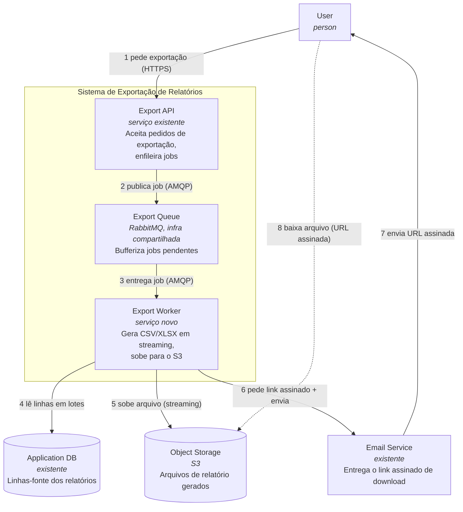
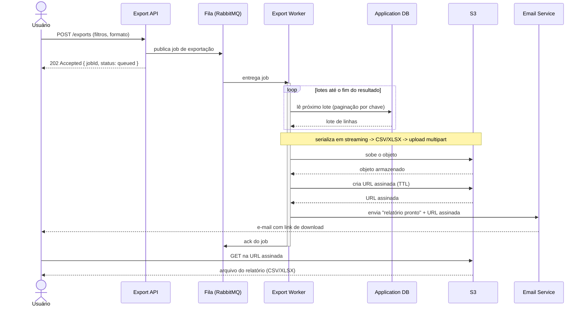

# Serviço de exportação de relatórios em background

| | |
|---|---|
| **Documento** | DESIGN-DOC |
| **Estado** | Rascunho |
| **Título** | Serviço de exportação de relatórios em background |
| **Autores** | _(a preencher)_ |
| **Revisores** | _(sugeridos)_ Time de Plataforma (fila compartilhada), Time de Segurança (link assinado com PII) |
| **Criado em** | 2026-06-07 |
| **Última atualização** | 2026-06-07 |
| **Tags** | exportação, relatórios, fila, assíncrono, s3 |

## Glossário

| Termo | Definição |
|---|---|
| **API** | A aplicação que hoje atende as requisições de exportação e passará a enfileirar jobs. |
| **Gateway** | Camada de borda que faz proxy das requisições da API e impõe o timeout de 30s. |
| **Worker** | Processo separado que consome jobs da fila e gera os arquivos de relatório. |
| **RabbitMQ** | Broker de mensageria já existente na infraestrutura, usado como fila de jobs. |
| **AMQP** | Protocolo de mensageria usado para publicar e consumir jobs no RabbitMQ. |
| **S3** | Armazenamento de objetos onde os arquivos de relatório gerados são guardados. |
| **Link/URL assinado** | URL temporária e autenticada para o S3 que permite o download do arquivo sem expor credenciais. |
| **PII** | Dados pessoais identificáveis (_Personally Identifiable Information_) que podem constar nos relatórios. |
| **CSV / XLSX** | Formatos de arquivo de saída dos relatórios. |
| **BI** | _Business Intelligence_ — ferramenta externa de análise de dados, considerada como alternativa. |
| **TTL** | _Time To Live_ — janela de validade do link assinado. |
| **DLQ** | _Dead-Letter Queue_ — fila para onde vão jobs que falharam em definitivo. |
| **vhost** | _Virtual host_ do RabbitMQ — espaço lógico isolado dentro do broker, usado para separar cargas de times diferentes. |

## Visão geral

Hoje os relatórios são gerados dentro da própria requisição da API e os relatórios grandes estouram o timeout de 30 segundos do gateway, fazendo cerca de 12% das exportações acima de 50 mil linhas falharem. Este documento propõe mover a geração de relatórios para fora do ciclo de requisição: a API passa a enfileirar um job num worker separado que gera o arquivo em streaming e o publica no S3, e o usuário recebe por e-mail um link assinado para download quando o relatório fica pronto. O objetivo é zerar os timeouts de exportação e sustentar relatórios de até 100 mil linhas, aceitando em troca que toda exportação — inclusive as pequenas que hoje funcionam na hora — passe a ser assíncrona.

## Escopo e contexto

A exportação de relatórios é hoje uma operação síncrona: o cliente chama a API, a API consulta o banco, serializa o resultado em CSV ou XLSX e devolve o arquivo na própria resposta. Toda essa cadeia acontece atrás do gateway, que corta qualquer requisição que ultrapasse 30 segundos.

Para relatórios pequenos isso funciona bem e o download sai na hora. Para relatórios grandes, a geração não cabe na janela de 30s: cerca de **12% das exportações acima de 50 mil linhas falham** por timeout no gateway. O sintoma chega ao suporte como **um ticket por semana**, recorrente, sempre da mesma natureza — exportações que "travam" e não completam.

A infraestrutura já dispõe de **RabbitMQ** e de armazenamento de objetos em **S3**, então a peça que falta é o processamento fora da requisição, não a fundação de mensageria ou de storage.

## Objetivos e fora de escopo

**Objetivos**

- **Zerar os timeouts de exportação** removendo a geração do relatório do ciclo de requisição da API: a requisição apenas enfileira o job e retorna imediatamente, então não há mais nada para o gateway cortar aos 30s.
- **Sustentar exportações de até 100 mil linhas** gerando o arquivo em streaming no worker (lendo o banco em lotes e subindo o arquivo para o S3 sem materializá-lo inteiro em memória), em vez de montar o resultado completo dentro da requisição.
- **Entregar um caminho único de exportação**: toda exportação — grande ou pequena — passa pelo mesmo fluxo assíncrono, eliminando a bifurcação entre "rápida e síncrona" e "grande e quebrada".

**Fora de escopo**

- **Download imediato/síncrono** para exportações pequenas: deixa de existir como caminho (ver Trade-offs). Não haverá um modo "exportar e baixar na hora".
- **Geração de outros formatos** além de CSV e XLSX (por exemplo PDF ou JSON): não fazem parte desta entrega.
- **Agendamento e exportações recorrentes** (relatórios programados): este trabalho cobre exportações sob demanda, não agendadas.
- **Limite acima de 100 mil linhas**: a meta de capacidade é 100 mil; volumes maiores não são alvo desta entrega.

## A solução

### Visão geral da solução

A API deixa de gerar o relatório e passa a publicar um **job de exportação** numa fila do RabbitMQ, respondendo imediatamente ao cliente (sem arquivo na resposta). Um **worker** separado consome o job, lê as linhas do banco em lotes, serializa em CSV/XLSX **em streaming** e sobe o arquivo para o **S3**. Concluído o upload, o worker gera um **link assinado** e dispara um e-mail ao usuário com esse link para download.

A troca central já é visível aqui: **trocamos o download imediato por um fluxo que nunca estoura o timeout e escala com o tamanho do relatório**. Nada do que o usuário pede acontece mais dentro da janela de 30s do gateway, porque a requisição não gera nada — ela só enfileira.

### Arquitetura

> O diagrama abaixo não pôde ser validado por ferramenta automática nesta sessão (servidor de validação indisponível); a sintaxe foi mantida conservadora e renderiza diretamente no GitHub/GitLab.

**Componentes e interações:**

- **Export API** (existente, modificada): recebe o pedido de exportação com os filtros e o formato desejado, valida, publica um job na fila e responde imediatamente com o identificador do job. Não toca mais no banco para montar o relatório nem devolve arquivo.
- **Export Queue** (RabbitMQ, infra compartilhada): desacopla a API do worker. Absorve picos de pedidos e permite que o worker processe no seu próprio ritmo. Por ser **compartilhada com outros times**, é um ponto de atenção tratado em _Cross-cutting concerns_.
- **Export Worker** (novo): consome um job por vez (com concorrência configurável), lê as linhas do **Application DB** em lotes, serializa em CSV/XLSX **em streaming** e faz upload para o **S3** sem reter o arquivo inteiro em memória — é isso que permite chegar a 100 mil linhas sem estourar recursos.
- **Object Storage (S3)**: guarda o arquivo gerado e serve o download diretamente ao usuário via URL assinada, sem passar pela API.
- **Email Service** (existente): entrega ao usuário o e-mail com o link assinado quando o relatório fica pronto.

### Fluxo de uma exportação

> Diagrama não validado automaticamente nesta sessão (mesma indisponibilidade acima).

**O que o fluxo mostra:**

1. O usuário pede a exportação; a API **publica o job e responde `202 Accepted`** com um `jobId` — a requisição termina em milissegundos, bem dentro dos 30s, e o gateway não tem o que cortar.
2. O worker consome o job e **lê o banco em lotes** (paginação por chave / _keyset paging_, não por `OFFSET`, para que o custo por lote não cresça conforme avança no resultado).
3. Cada lote é serializado e enviado ao S3 **em streaming** (upload multipart), de modo que o pico de memória do worker independe do tamanho do relatório — é o que sustenta as 100 mil linhas.
4. Com o arquivo no S3, o worker **gera a URL assinada** (com TTL) e dispara o **e-mail** com o link.
5. Só então o worker **confirma (ack) o job**: enquanto o arquivo não estiver no S3 e o e-mail não tiver sido pedido, o job não é confirmado, o que dá uma garantia de _at-least-once_ (reprocessar em caso de falha) — ver _Open questions_ sobre idempotência.
6. O download é **direto do S3** via URL assinada; a API e o worker não ficam no caminho do tráfego de download.

### API e payloads

Apenas o fragmento que a decisão exige (o contrato completo vive no código/OpenAPI da API):

- **Pedido** — `POST /exports` recebe os filtros do relatório e o `format` (`csv` | `xlsx`); responde **`202 Accepted`** com `{ jobId, status: "queued" }`. A mudança de contrato relevante é deixar de ser **`200` com o arquivo no corpo** para ser **`202` com um identificador de job** — é nesse ponto que clientes existentes precisarão se adaptar (ver _Compatibilidade_).
- **Consulta de status** (opcional, ver _Open questions_) — `GET /exports/{jobId}` retornando `queued | processing | ready | failed`, útil para uma UI que queira mostrar progresso sem depender só do e-mail.

### Dados e sensibilidade

Os relatórios podem conter **PII de clientes**. Isso tem duas consequências de projeto: (1) o **link assinado** carrega acesso a dado sensível, então seu **TTL deve ser curto** e o acesso, auditável (ver _Segurança_); (2) os objetos no S3 são **dados sensíveis em repouso**, sujeitos a criptografia e a uma **política de expiração/retenção** para que não fiquem disponíveis indefinidamente.

## Trade-offs da solução escolhida

- ✓ **Acaba com o timeout de exportação**: a requisição não gera mais nada, então não há trabalho para o gateway cortar aos 30s — o caso que hoje falha em 12% deixa de existir por construção.
- ✓ **Escala com o tamanho do relatório**: a geração em streaming no worker desacopla o pico de memória do número de linhas, viabilizando as 100 mil linhas-alvo.
- ✓ **Um caminho único**: toda exportação segue o mesmo fluxo, eliminando a bifurcação entre o caminho síncrono (que funciona) e o caminho grande (que quebra) e simplificando o código e o suporte.
- ✓ **Reaproveita infra existente** (RabbitMQ e S3 já estão na casa): nada de fundação nova de mensageria ou storage.
- ✗ **O usuário perde o download imediato** — _este é o custo aceito explicitamente_. Exportações pequenas, que hoje saem na hora, passam a ser assíncronas: o usuário pede, fecha a tela e espera o e-mail. Aceitamos essa piora na experiência das exportações pequenas em troca de um caminho único e da eliminação dos timeouts.
- ✗ **Mais partes móveis para operar**: passam a existir um worker, uma fila e um fluxo de e-mail no caminho crítico — mais pontos de falha e mais coisas para observar do que numa chamada síncrona.
- ✗ **Latência de ponta a ponta maior no caso pequeno**: o que era uma resposta imediata vira "enfileirar → processar → e-mail", então o relatório pequeno chega mais devagar do que chegava antes, mesmo que nunca mais falhe.
- ✗ **Dependência do e-mail e do S3 como caminho de entrega**: se o e-mail não chega ou o link expira, o usuário não tem o relatório, ainda que ele tenha sido gerado com sucesso.

## Alternativas consideradas

| Alternativa | Resumo | Avaliação |
|---|---|---|
| **Fila + worker + S3 + e-mail** | A API enfileira; o worker gera em streaming e sobe ao S3; usuário recebe link assinado. | ✓ **Escolhida** — elimina o timeout por construção e escala com o tamanho do relatório, ao custo do download imediato. |
| Síncrono com timeout maior | Aumentar o limite do gateway acima de 30s para o relatório grande caber na requisição. | ✗ Descartada — só **empurra o problema**: relatórios maiores voltariam a estourar o novo limite, e segura conexões/recursos da API durante toda a geração. |
| Ferramenta de BI externa | Delegar a geração de relatórios a uma ferramenta externa de _Business Intelligence_. | ✗ Descartada — **custo** e **exposição de dado de cliente** a um terceiro. |
| Não fazer nada | Manter a geração síncrona como está. | ✗ Descartada — os 12% de falha acima de 50 mil linhas e o **ticket semanal de suporte** persistem; o problema é recorrente e não se resolve sozinho. |

**Por que a escolhida venceu:** as duas alternativas técnicas (timeout maior, BI externo) ou apenas adiam o problema ou trazem custo e risco de privacidade; nenhuma elimina o timeout por construção como o caminho assíncrono. "Não fazer nada" é refutado pela própria recorrência dos tickets.

## Cross-cutting concerns

### Segurança (Time de Segurança)

O link de download é **assinado e carrega acesso a PII de cliente**. Pontos a revisar com o time de Segurança:

- **TTL curto** na URL assinada, equilibrando segurança e a janela em que o usuário precisa do link.
- **Criptografia em repouso** dos objetos no S3 e uma **política de expiração/retenção** dos arquivos gerados, para que relatórios com PII não persistam indefinidamente.
- **Auditabilidade** dos acessos de download e do escopo mínimo de permissão das credenciais que assinam as URLs.

### Infraestrutura / Plataforma (Time de Plataforma)

O RabbitMQ é uma **fila compartilhada** com outros times. Pontos a revisar com o time de Plataforma:

- **Isolamento** dos jobs de exportação (exchange/fila/vhost dedicados) para que um pico de exportações não impacte outras cargas que dividem o broker.
- **Limites de concorrência** do worker e dimensionamento, para não saturar nem o broker nem o banco de origem.
- **Tratamento de falhas**: política de _retry_ e **DLQ** para jobs que falham em definitivo, evitando reprocessamento infinito.

### Compatibilidade

O contrato muda de **`200` com o arquivo** para **`202` com um `jobId`**. Clientes que hoje esperam o arquivo na resposta precisarão se adaptar ao novo fluxo (consultar status e/ou aguardar o e-mail). Definir se haverá período de transição/versionamento é uma questão em aberto (ver _Open questions_).

## Testabilidade e observabilidade

- **Antes de subir:** teste de carga gerando um relatório de **100 mil linhas** ponta a ponta (a meta de capacidade), verificando o pico de memória do worker e o tempo total; testes de integração do fluxo enfileirar → gerar → S3 → e-mail.
- **Em produção, ligado às metas:**
  - **Taxa de timeout/falha de exportação** — deve ir a ~0, validando o objetivo de zerar os timeouts (hoje 12% acima de 50 mil linhas).
  - **Tempo de fila e tempo de processamento** por job (e tamanho da fila), para detectar saturação do worker antes que vire fila acumulada.
  - **Taxa de jobs na DLQ** e **taxa de e-mails entregues**, para flagrar relatórios gerados que não chegaram ao usuário.
  - **Volume de tickets de suporte sobre exportação** — a métrica de negócio que motivou o trabalho.

## Plano de implantação

1. **Worker + fila em paralelo ao caminho atual**, atrás de _feature flag_, sem ainda mudar o comportamento do cliente — permite validar geração, upload e e-mail em produção com tráfego controlado.
2. **Migrar exportações grandes** (as que hoje falham) para o caminho assíncrono — é onde está o ganho imediato e o risco já é "falha por falha".
3. **Migrar as exportações pequenas**, completando o caminho único e aposentando a geração síncrona.
4. **Rollback:** enquanto a flag existir, reverter para o caminho síncrono é desligar a flag; remover o código síncrono só após o passo 3 estar estável.

## Open questions

- **Idempotência / reprocessamento:** com _ack_ só após o upload, o modelo é _at-least-once_. Como evitar e-mail/arquivo duplicado num reprocessamento (chave idempotente por `jobId`?).
- **TTL e reemissão do link:** qual a janela de validade da URL assinada, e o que acontece quando o usuário clica num link já expirado — reemitir sob demanda?
- **Estratégia de transição do contrato `200 → 202`:** haverá versionamento da API ou um período em que os dois comportamentos coexistem? — pendente de alinhamento com os times consumidores.
- **Endpoint de status:** vamos expor `GET /exports/{jobId}` nesta entrega ou o e-mail basta como canal de notificação?
- **Retenção dos arquivos no S3:** por quanto tempo o relatório com PII deve ficar disponível antes de expirar — pendente de definição com Segurança.
