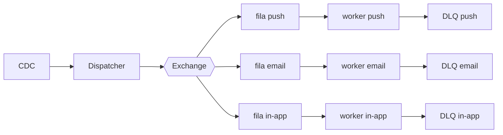

# Fanout de notificações

| | |
|---|---|
| **Estado** | Em revisão |
| **Autor** | Time de Mensageria |
| **Revisores** | _(a definir — ver questões abertas)_ |
| **Criado em** | 2026-01-28 |
| **Última atualização** | 2026-06-07 |

## Glossário

- **Fanout** — padrão em que um único evento é distribuído para múltiplos consumidores (aqui, um por canal de notificação).
- **CDC** (Change Data Capture) — captura de mudanças no banco de dados para gerar eventos a partir das alterações nas tabelas de domínio.
- **DLQ** (Dead Letter Queue) — fila para onde mensagens que não puderam ser processadas são desviadas, evitando perda e permitindo reprocessamento.
- **TPS** (Transactions Per Second) — limite de taxa de chamadas por segundo, usado aqui para respeitar os limites de cada provider.
- **SLA** (Service Level Agreement) — acordo de nível de serviço que define o prazo/garantia de entrega das notificações.
- **Provider** — serviço externo que efetivamente entrega a notificação de um canal (push, e-mail, in-app).

## Visão geral

O envio de notificações tornou-se lento à medida que a base de usuários cresceu. Este
documento propõe substituir o processamento sequencial atual por um *fanout* baseado em
filas, no qual cada canal (push, e-mail e in-app) é processado em paralelo por workers
dedicados. O objetivo é sustentar o crescimento dos envios sem comprometer o prazo de
entrega.

## Escopo e contexto

Hoje o serviço de notificações processa os envios de forma sequencial dentro do próprio
serviço de mensageria: um cron roda a cada minuto, lê da tabela `notifications`, monta o
payload de cada canal (push, e-mail, in-app) e chama os providers um a um. Com o
crescimento da base, esse modelo passou a apresentar lentidão, já que o processamento
serial não acompanha o volume de envios e qualquer provider lento atrasa toda a fila.

## Objetivos

> **Nota de revisão:** os objetivos abaixo ainda não são verificáveis (sem número, sem
> mecanismo). Ver questões abertas para os valores a preencher.

- Melhorar a performance dos envios
- Tornar o sistema escalável
- Garantir o SLA

## Fora de escopo

> **Nota de revisão:** os itens abaixo apenas negam os objetivos e não excluem nada de
> concreto. Ver questões abertas para as exclusões reais.

- O sistema não deve ser lento
- O sistema não deve perder notificações

## Solução

Adotaremos um *fanout* com filas por canal. A ingestão dos eventos de domínio passa a
ser feita via CDC; um dispatcher publica cada evento numa exchange, que o roteia para
uma fila por canal; workers dedicados consomem cada fila em paralelo, respeitando o TPS
de cada provider, e mensagens que falham são desviadas para uma DLQ por canal.

O **CDC** observa as mudanças na tabela de domínio e alimenta o **dispatcher**, que
substitui o cron atual. O dispatcher publica cada evento na **exchange**, responsável
por replicar o evento para uma **fila por canal** (push, e-mail, in-app) — é aqui que o
processamento deixa de ser serial. Cada fila tem um **worker** dedicado, que monta o
payload do seu canal e chama o provider correspondente respeitando o limite de **TPS**;
canais lentos deixam de bloquear os demais porque cada um avança no seu próprio ritmo.
Mensagens que falham após as tentativas vão para a **DLQ** do canal, de modo que uma
falha pontual não bloqueia a fila nem perde a notificação.

> **Nota de revisão:** esta seção descreve *o que* será construído, mas ainda não
> registra os *custos* assumidos (operar fila + DLQ + CDC é mais complexo que um cron)
> nem por que esta opção venceu as alternativas. Sem isso, o documento perde seu maior
> valor. Ver questões abertas.

## Plano de implantação

1. Criar exchange e filas
2. Migrar o canal de e-mail
3. Migrar push e in-app
4. Desligar o cron
