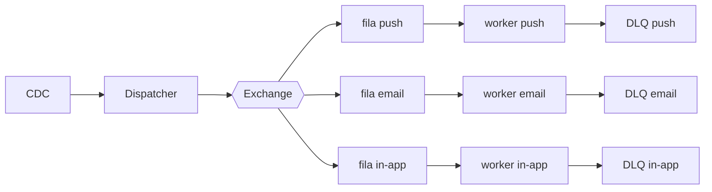

# Fanout de notificações

| | |
|---|---|
| **Estado** | Em revisão |
| **Autor** | Time de Mensageria <!-- TODO: nome(s) das pessoas autoras --> |
| **Revisores** | <!-- TODO: revisores com suas áreas, ex.: Fulano (Plataforma/Infra), Ciclana (Dados/CDC) --> |
| **Criado em** | 2026-01-28 |
| **Última atualização** | 2026-06-07 |
| **Tags** | notificações, filas, fanout, cdc |

## Glossário

| Termo | Definição |
|---|---|
| **Fanout** | Distribuir um mesmo evento para vários consumidores em paralelo — aqui, um por canal. |
| **CDC** | Change Data Capture — captura de mudanças no banco para gerar eventos de domínio a partir de inserções/atualizações. |
| **Exchange** | Componente do broker de mensageria que recebe eventos e os roteia para as filas. |
| **DLQ** | Dead Letter Queue — fila para onde vão as mensagens que falharam após o número máximo de tentativas. |
| **TPS** | Transactions Per Second — limite de chamadas por segundo aceito por um provider. |
| **SLA** | Service Level Agreement — compromisso de nível de serviço (aqui, de prazo de entrega da notificação). |
| **Provider** | Serviço externo que efetiva a entrega de um canal (ex.: provedor de push, de e-mail). |
| **Canal** | Meio de entrega da notificação: push, e-mail ou in-app. |

## Visão geral

Este documento propõe substituir o envio sequencial de notificações por um **fanout baseado em filas**, em que um dispatcher publica eventos numa exchange e workers por canal os consomem em paralelo. O objetivo é eliminar a lentidão que o modelo atual passou a apresentar com o crescimento da base e dar previsibilidade ao prazo de entrega.

## Escopo e contexto

O serviço de notificações atual processa os envios de forma sequencial dentro do próprio serviço de mensageria: um cron roda a cada minuto, lê da tabela `notifications`, monta o payload de cada canal (push, e-mail, in-app) e chama os providers um a um. Com o crescimento da base, esse modelo sequencial passou a apresentar lentidão crescente — todos os canais competem pelo mesmo ciclo do cron, e um provider lento atrasa os demais.

<!-- TODO (autor): o quanto a lentidão dói hoje? Há número de fila acumulada, atraso médio/P99 de entrega, ou um incidente que motivou este trabalho? -->

## Objetivos

<!-- TODO (autor): transformar cada objetivo abaixo em algo mensurável e com o mecanismo nomeado. Exemplos do formato esperado: -->

- Reduzir o atraso de entrega processando os canais **em paralelo por fila** — alvo: <!-- TODO: ex.: P99 de entrega < N segundos --> .
- Absorver picos de volume sem aumentar o atraso, escalando workers por canal de forma independente — alvo: <!-- TODO: ex.: sustentar N notificações/min no pico --> .
- Cumprir o SLA de entrega de <!-- TODO: qual SLA, em números? --> mesmo quando um provider está degradado, isolando a falha por canal (DLQ por canal).

## Fora de escopo

<!-- TODO (autor): substituir por exclusões reais — coisas que alguém poderia esperar deste trabalho mas que NÃO faremos agora. Candidatos a confirmar: -->

- Reescrita do modelo de dados da tabela `notifications` (mantida como está).
- Novos canais de notificação (ex.: SMS, WhatsApp) — apenas push, e-mail e in-app.
- Mudanças na UI/preferências de notificação do usuário.

## Solução

Adotaremos o fanout com filas por canal. Um **dispatcher** consome os eventos de domínio (ingeridos via CDC a partir da tabela `notifications`), monta o payload e publica numa **exchange**, que faz o roteamento para uma fila por canal. Cada canal tem seu próprio conjunto de **workers**, que consomem em paralelo e chamam o provider correspondente respeitando o limite de **TPS** daquele provider. Mensagens que falham após o número máximo de tentativas vão para a **DLQ** do canal.

No fluxo acima, o **CDC** transforma alterações na tabela `notifications` em eventos, sem que o serviço de mensageria precise mais varrer a tabela por cron. O **dispatcher** publica cada evento na **exchange**, que roteia para a **fila** do canal. Os **workers** de cada canal consomem de forma independente: um provider lento de e-mail não bloqueia mais o push ou o in-app, e cada canal pode escalar seu número de workers conforme sua carga. A **DLQ por canal** isola as mensagens que esgotaram as tentativas, permitindo reprocessá-las sem travar a fila principal.

> Diagrama não validado por ferramenta de renderização.

## Trade-offs da solução escolhida

<!-- TODO (autor): preencher os custos reais aceitos. Um trade-off honesto sempre tem ✗. Pontos a confirmar/quantificar; abaixo o que se infere do desenho, a validar: -->

- ✓ Canais processados em paralelo e escaláveis de forma independente; falha de um provider deixa de atrasar os demais.
- ✓ DLQ por canal dá um lugar para reprocessar entregas que falharam, sem perder a notificação.
- ✗ Passa a depender de um broker de mensageria e de pipeline de CDC — mais peças para operar, monitorar e manter disponíveis. <!-- TODO: quem opera? já existe broker/CDC no ambiente? -->
- ✗ Entrega passa a ser assíncrona e eventual; a ordem entre canais não é garantida. <!-- TODO: isso é aceitável para o produto? -->
- ✗ Risco de entrega duplicada (at-least-once das filas) exige idempotência nos workers. <!-- TODO: como garantimos idempotência? -->

## Alternativas consideradas

<!-- TODO (autor): quais opções foram realmente avaliadas e por que perderam? Incluir obrigatoriamente "não fazer nada". Esqueleto a preencher: -->

- **Não fazer nada (manter o cron sequencial).** <!-- TODO: por que isso não é aceitável? (ligar ao número do problema em Escopo e contexto) -->
- **Paralelizar dentro do próprio serviço (threads/pool), sem filas.** <!-- TODO: foi considerada? quais limites levaram a descartá-la? -->
- **Outras opções de barramento/broker avaliadas.** <!-- TODO: quais brokers/abordagens foram comparados e por que o escolhido venceu? -->

## Preocupações transversais

<!-- TODO (autor): confirmar quem fora do time de Mensageria é impactado. Inferências a validar: -->

- **Infraestrutura/Plataforma.** Introduz broker de mensageria e workers novos — capacidade, custo e monitoração. <!-- TODO: time responsável e capacidade disponível? -->
- **Dados/banco.** O CDC lê do banco da tabela `notifications`; precisa de configuração no banco e pode impor carga adicional. <!-- TODO: alinhar com o time dono do banco. -->
- **Providers externos.** O controle de TPS por provider precisa respeitar os limites contratados de cada um. <!-- TODO: limites atuais por provider? -->

## Testabilidade e observabilidade

<!-- TODO (autor): como verificaremos antes de subir e o que vamos observar em produção? Sugestões a confirmar: métricas de atraso de entrega (P99) por canal, profundidade de fila, taxa de erro e tamanho da DLQ por canal, alertas quando a DLQ cresce. -->

## Plano

1. Criar exchange e filas
2. Migrar o canal de e-mail
3. Migrar push e in-app
4. Desligar o cron

<!-- TODO (autor): há rollback se uma etapa falhar? Os dois modelos (cron e filas) convivem durante a migração, ou há corte? -->

## Questões em aberto

<!-- TODO (autor): listar o que ainda está indefinido — ver os TODOs ao longo do documento (números de SLA/performance, idempotência, broker escolhido, donos de banco/infra). -->
