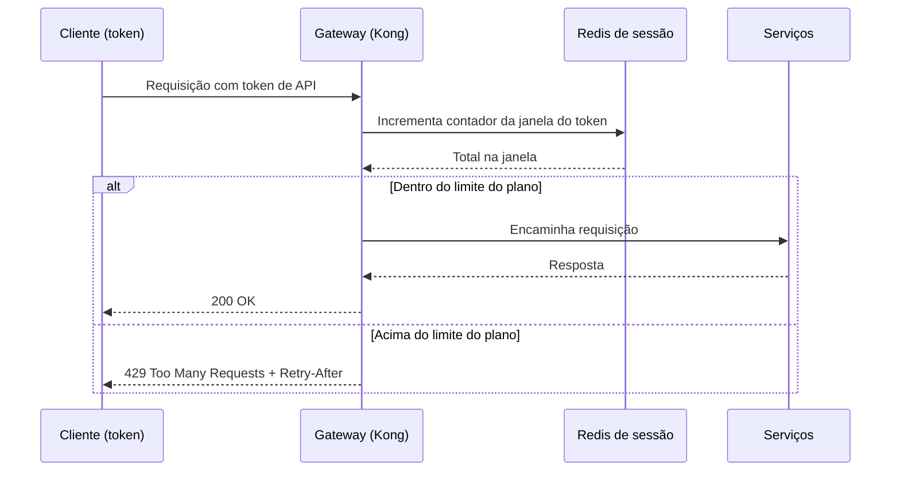

# DD-2026-008 · Rate limiting da API pública

| | |
|---|---|
| **Documento** | DD-2026-008 |
| **Estado** | Proposto |
| **Autores** | Cássio Botaro |
| **Revisores** | — |
| **Criado em** | 2026-06-07 |
| **Última atualização** | 2026-06-07 |
| **Tags** | api, rate-limiting, gateway, kong, redis, resiliência |

## Resumo

Hoje a API pública não tem nenhum limite por cliente, então uma única integração mal feita consegue derrubar a API para todo mundo. Este documento propõe rate limiting por token de API no gateway (Kong), com janela deslizante apoiada em contadores no Redis, limites por plano e resposta `429` com `Retry-After`.

## Contexto

A API pública não impõe nenhum limite de requisições por cliente: qualquer token pode mandar tráfego à vontade. No incidente INC-4412 (ontem), um cliente com integração mal feita enviou 40x o tráfego normal e derrubou a API para todos os outros clientes por 25 minutos. Os contadores de sessão já rodam num cluster Redis em produção, que reusaremos aqui.

## Proposta

Rate limit **por token de API**, aplicado no gateway Kong, antes de a requisição entrar na malha de serviços. A contagem usa **janela deslizante** com contadores no **Redis de sessão** que já operamos. Cada plano tem seu limite:

| Plano | Limite |
|---|---|
| Free | 10 rps |
| Pro | 100 rps |
| Enterprise | Negociado |

Quando o token ultrapassa o limite da janela, o gateway responde **`429 Too Many Requests`** com o header **`Retry-After`** indicando quando o cliente pode tentar de novo.

### Fluxo da requisição

O gateway resolve o plano a partir do token, incrementa o contador da janela deslizante daquele token no Redis e compara com o limite do plano. Se está dentro do limite, encaminha para os serviços normalmente; se estourou, corta a requisição ali mesmo com `429` e `Retry-After`, sem que ela chegue a consumir a malha. A decisão acontece no gateway justamente para que o tráfego abusivo seja barrado o mais cedo possível.

### Compensações

- ✓ Um cliente abusivo deixa de degradar os demais: o excesso é cortado no gateway antes de tocar a malha de serviços
- ✓ Reusa o Redis de sessão já em produção — sem nova peça de infraestrutura no caminho crítico
- ✓ `Retry-After` dá ao cliente uma instrução clara de quando voltar, em vez de uma falha opaca
- ✗ Um cliente legítimo em pico (ex.: Black Friday) pode tomar `429` ao ultrapassar o limite do plano
- ✗ O Redis de sessão passa a estar no caminho de toda requisição da API pública

A compensação aceita é o `429` em cliente legítimo durante pico. Mitigamos por dois caminhos: o `Retry-After`, que orienta a integração a recuar e voltar, e um alerta para o time de contas avisar os clientes enterprise antes de picos previstos.

## Alternativas consideradas

| Alternativa | Por que foi descartada |
|---|---|
| **Não fazer nada** | Mantém a API exposta ao próximo INC-4412: qualquer token segue capaz de derrubar todos os outros. |
| **Limitar dentro de cada serviço** | Tarde demais — quando o serviço decide barrar, a requisição já consumiu o gateway e a malha. Não protege o recurso que o INC-4412 derrubou. |
| **Módulo pago do gateway gerenciado** | Custo recorrente e lock-in no fornecedor, sem ganho sobre a janela deslizante no Redis que já operamos. |

## Objetivos

- Nenhum token excede seu limite de plano por mais de 1s.
- A API pública aguenta um cliente abusivo (como no INC-4412) sem degradar os demais clientes.

## Riscos

| Risco | Mitigação |
|---|---|
| O Redis de sessão virar ponto de contenção sob a carga adicional de contagem | Medir o impacto antes de habilitar o enforcing (a fase de shadow mode existe para isso) |

## Plano de entrega

1. **Shadow mode** — o gateway conta as requisições por token e mede, mas não bloqueia ninguém; serve para dimensionar a carga sobre o Redis de sessão e calibrar os limites.
2. **Enforcing no plano free** — passa a responder `429` para tokens free acima do limite, contendo o blast radius à base de menor risco.
3. **Enforcing geral** — estende o bloqueio para os planos pro e enterprise.
