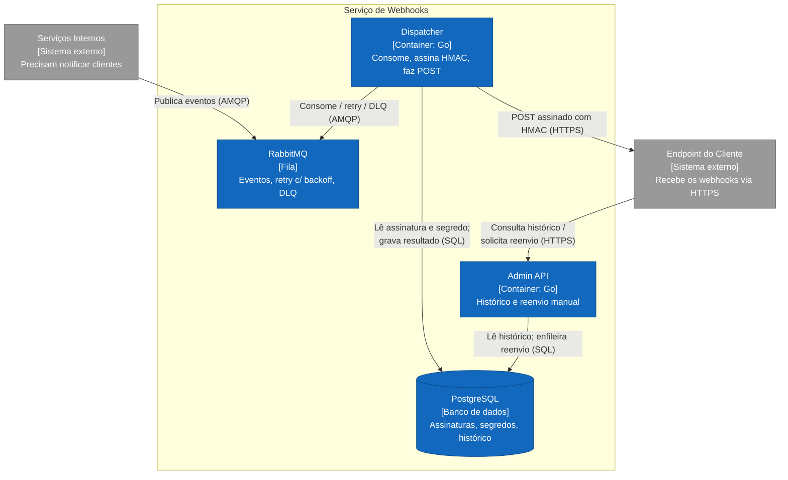
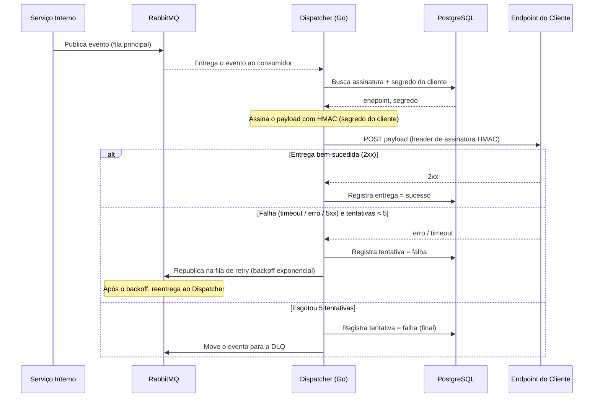

# Serviço de Entrega de Webhooks

| | |
|---|---|
| **Documento** | DESIGN-DOC |
| **Estado** | Rascunho |
| **Título** | Serviço de entrega de webhooks |
| **Autores** | Time de Plataforma |
| **Revisores** | _(sugeridos)_ SRE — operação da nova fila e do serviço; Segurança — assinatura HMAC e gestão de segredos por cliente |
| **Criado em** | 2026-06-20 |
| **Última atualização** | 2026-06-20 |
| **Tags** | webhooks, plataforma, mensageria, confiabilidade |

## Glossário

- **Webhook** — notificação HTTP que um sistema envia para o endpoint de um cliente externo quando um evento acontece.
- **HMAC** (*Hash-based Message Authentication Code*) — assinatura criptográfica do payload, calculada com um segredo compartilhado, que permite ao cliente verificar a autenticidade e a integridade da mensagem.
- **AMQP** (*Advanced Message Queuing Protocol*) — protocolo de mensageria usado para publicar e consumir eventos no RabbitMQ.
- **Backoff exponencial** — estratégia de retry em que o intervalo entre tentativas cresce a cada falha (ex.: 1s, 2s, 4s, …).
- **DLQ** (*Dead Letter Queue*) — fila para onde vão as mensagens que esgotaram as tentativas de entrega, para inspeção e tratamento manual.
- **SaaS** (*Software as a Service*) — software de terceiros consumido como serviço hospedado.
- **SRE** (*Site Reliability Engineering*) — time responsável pela operação e confiabilidade dos serviços em produção.
- **PII** (*Personally Identifiable Information*) — dados que identificam uma pessoa; sensíveis por natureza.
- **C4** — modelo de documentação de arquitetura por níveis; aqui usamos o nível de contêineres (processos executáveis e armazenamentos).
- **TTL** (*Time To Live*) — tempo que uma mensagem aguarda na fila de retry antes de ser reentregue; é o que implementa o backoff.
- **API** (*Application Programming Interface*) — interface programática exposta por um serviço; aqui, a Admin API.
- **HTTP/HTTPS** — protocolo de transporte web (HTTPS = HTTP sobre TLS) usado nas entregas e na Admin API.
- **SQL** (*Structured Query Language*) — linguagem de consulta usada para acessar o PostgreSQL.
- **UI** (*User Interface*) — interface gráfica de usuário.

## Visão geral

Este documento propõe um serviço central de entrega de webhooks para o time de Plataforma. Hoje cada serviço interno faz, por conta própria, um `POST` direto para o endpoint do cliente externo, sem retry e sem visibilidade — quando o endpoint do cliente está fora do ar, o evento é perdido, o que já causou incidentes em produção mais de uma vez. A proposta concentra a entrega num único serviço que recebe os eventos por uma fila, faz a entrega assinada com HMAC, tenta novamente com backoff exponencial quando falha e expõe um histórico consultável. O custo aceito é tornar a entrega assíncrona; o ganho é retry, durabilidade e visibilidade.

## Escopo e contexto

A notificação de clientes externos hoje é responsabilidade de cada serviço interno individualmente. O padrão atual é um `POST` HTTP inline, na própria request que originou o evento, sem nenhuma camada de reentrega:

- Quando o endpoint do cliente está indisponível, **o evento é perdido** — não há fila, nem persistência, nem nova tentativa. Esse cenário já ocorreu em produção mais de uma vez.
- Não há **visibilidade**: nem o time interno nem o cliente conseguem saber o que foi (ou não foi) entregue, nem reenviar o que falhou.
- A lógica de notificação está **espalhada e duplicada** entre os serviços, sem comportamento consistente.

A infraestrutura já conta com RabbitMQ e PostgreSQL, e o time de Plataforma desenvolve em Go.

## Objetivos e fora de escopo

**Objetivos**

- **Eliminar a perda de eventos** quando o endpoint do cliente está temporariamente fora do ar, persistindo o evento e reentregando-o com retry e backoff exponencial (até 5 tentativas antes de ir para a DLQ).
- **Centralizar** a entrega de webhooks num único serviço, removendo a lógica de `POST`/retry duplicada dos serviços internos.
- **Dar visibilidade** da entrega: cada cliente pode consultar o histórico das suas entregas e reenviar manualmente uma entrega que falhou.
- **Garantir autenticidade** das mensagens entregues, assinando cada payload com HMAC usando um segredo por cliente.

**Fora de escopo**

- **Ordenação garantida** entre eventos de uma mesma assinatura — a entrega é independente por evento; não há garantia de ordem.
- **Entrega exactly-once** — o modelo é at-least-once (ver Trade-offs); o cliente deve tratar duplicatas.
- **Autosserviço de configuração de assinaturas** pelo cliente (criar/editar endpoint e rotacionar segredo via UI) — nesta primeira versão a configuração é provisionada internamente.
- **Outros transportes de notificação** (e-mail, SMS, push) — apenas webhooks HTTP.

## A solução

### Visão geral da solução

Os serviços internos deixam de fazer o `POST` direto e passam a **publicar o evento numa fila no RabbitMQ**. Um **dispatcher** em Go consome essa fila, busca no PostgreSQL a configuração da assinatura do cliente (endpoint e segredo), assina o payload com HMAC e faz o `POST` para o endpoint do cliente. Quando a entrega falha, o evento é republicado numa **fila de retry com backoff exponencial**; após **5 tentativas** ele vai para uma **DLQ**. Uma **Admin API**, também em Go, permite ao cliente consultar o histórico de entregas e reenviar manualmente. O histórico de cada tentativa fica persistido no PostgreSQL.

A decisão central é trocar a entrega **inline e síncrona** de hoje por uma entrega **assíncrona** mediada por fila: é isso que dá durabilidade e retry, e é também o principal custo (latência adicional de alguns segundos), detalhado em [Trade-offs](#trade-offs-da-solução-escolhida).

### Arquitetura

O diagrama abaixo é um diagrama de contêineres C4 do serviço. A fonte Mermaid também está versionada em [`diagrams/arquitetura-webhooks.mmd`](diagrams/arquitetura-webhooks.mmd).

> O diagrama não foi validado por ferramenta automática nesta sessão (os servidores de validação/render do Structurizr e do Mermaid não estavam disponíveis); ele é uma ilustração do texto abaixo.

Os contêineres e suas interações:

- **Serviços Internos** (externos a este serviço) deixam de fazer o `POST` direto e passam a publicar o evento na fila do RabbitMQ via AMQP. Para eles, a notificação vira um "publish e esquece".
- **RabbitMQ** guarda os eventos a entregar. Modela três filas: a fila principal de eventos, a fila de retry (com TTL/backoff exponencial) e a DLQ. É a fonte da durabilidade — um evento publicado sobrevive à indisponibilidade do endpoint do cliente.
- **Dispatcher (Go)** é o coração da entrega. Consome a fila principal, lê do PostgreSQL a configuração da assinatura (endpoint e segredo do cliente), assina o payload com HMAC e faz o `POST` para o **Endpoint do Cliente** via HTTPS. Em caso de falha, republica o evento na fila de retry; após 5 tentativas, encaminha para a DLQ. Grava o resultado de cada tentativa no histórico.
- **PostgreSQL** armazena a configuração das assinaturas, os segredos por cliente e o histórico de entregas. É a fonte de verdade tanto para o dispatcher (o que e para onde entregar) quanto para a Admin API (o que já foi entregue).
- **Admin API (Go)** atende o cliente externo: lê o histórico de entregas no PostgreSQL e, num reenvio manual, enfileira novamente o evento para o dispatcher.
- **Endpoint do Cliente** (externo) recebe o `POST` assinado e verifica a assinatura HMAC com o segredo compartilhado.

### Fluxo de entrega

O diagrama de sequência abaixo descreve uma entrega, incluindo o caminho de falha/retry.

Após a primeira entrega, cada nova tentativa repete o ciclo "consome → assina → POST → registra"; o intervalo entre tentativas cresce de forma exponencial até o limite de 5 tentativas, quando o evento é parado na DLQ. Um reenvio manual disparado pela Admin API reinjeta o evento na fila principal, recomeçando o ciclo.

### Dados e sensibilidade

O PostgreSQL guarda três coisas:

- **Configuração de assinaturas** — para cada cliente, a URL do endpoint e os tipos de evento que ele assina.
- **Segredos por cliente** — usados para a assinatura HMAC. São **dados sensíveis**: precisam de armazenamento cifrado (ou de um cofre de segredos) e nunca devem aparecer em logs nem no histórico exposto pela Admin API. Ver [Cross-cutting concerns → Segurança](#segurança).
- **Histórico de entregas** — uma linha por tentativa: evento, assinatura, timestamp, status, código de resposta e número da tentativa. O payload pode conter PII, dependendo do evento de origem; a política de retenção e o acesso ao histórico devem considerar isso.

### APIs e payloads

Apenas os fragmentos que a decisão exige (os contratos completos são a fonte de verdade e ficam fora deste doc):

- **Publicação do evento (interno → RabbitMQ):** mensagem AMQP com, no mínimo, identificador do evento, tipo do evento, identificador da assinatura/cliente e o payload a entregar.
- **Entrega (dispatcher → cliente):** `POST` para o endpoint do cliente com o payload no corpo e um header de assinatura — por exemplo `X-Webhook-Signature: sha256=<hmac>` — mais um identificador de evento para idempotência no lado do cliente.
- **Admin API (cliente → serviço):** ao menos `GET` do histórico de entregas de uma assinatura e `POST` de reenvio de uma entrega específica.

## Trade-offs da solução escolhida

- ✓ **Sem perda de eventos:** um evento publicado fica durável na fila e é reentregue mesmo se o endpoint do cliente estiver fora do ar — resolvendo diretamente o incidente recorrente de produção.
- ✓ **Retry automático com backoff** e DLQ para o que esgota as tentativas, em vez de uma única tentativa "tudo ou nada".
- ✓ **Visibilidade e reenvio:** histórico consultável e reenvio manual via Admin API.
- ✓ **Comportamento consistente e único:** a lógica de entrega deixa de ser duplicada em cada serviço interno.
- ✓ **Autenticidade:** payload assinado com HMAC por segredo de cliente.
- ✗ **Entrega assíncrona — latência adicional:** antes a entrega era inline na request; agora passa pela fila, então o cliente pode ver o evento com **alguns segundos de atraso**. Este é o custo explicitamente aceito em troca de retry, durabilidade e visibilidade.
- ✗ **Entrega at-least-once:** retry pode causar entregas duplicadas; o cliente precisa ser idempotente (usar o identificador do evento). Não há ordenação garantida entre eventos.
- ✗ **Nova superfície operacional:** um serviço a mais (dispatcher + Admin API) e novas filas (retry, DLQ) para o SRE operar e monitorar — incluindo o tratamento do que acumula na DLQ.
- ✗ **Novo risco de segurança a gerir:** segredos por cliente passam a ser armazenados e usados pelo serviço; um vazamento permitiria forjar webhooks.

## Alternativas consideradas

| Alternativa | Trade-offs | Decisão |
|---|---|---|
| **Serviço central de webhooks** (esta proposta) | ✓ Retry, durabilidade, visibilidade, lógica única e consistente. ✗ Entrega assíncrona (latência de segundos); nova superfície operacional e de segurança. | **Escolhida** |
| **Cada serviço com sua própria lógica de retry** | ✓ Sem novo serviço para operar; entrega continua no próprio serviço. ✗ Duplica código em cada serviço e gera comportamento inconsistente; cada time reimplementa retry/backoff/visibilidade. | Rejeitada — duplicação e inconsistência. |
| **SaaS de webhooks (ex.: Svix)** | ✓ Pronto, com retry e dashboard fora da caixa. ✗ Custo recorrente; manda dado sensível (payloads, possivelmente PII) para fora do nosso ambiente. | Rejeitada — custo e saída de dado sensível do ambiente. |
| **Não fazer nada** (manter o `POST` inline direto) | ✓ Zero esforço. ✗ Continuamos perdendo eventos quando o endpoint do cliente cai — exatamente o incidente que já ocorreu em produção mais de uma vez. | Rejeitada — a perda de eventos já é um problema ativo em produção. |

## Cross-cutting concerns

### Segurança

Impacta o time de **Segurança**, sugerido como revisor. Dois pontos:

- **Assinatura HMAC:** cada payload é assinado com um segredo por cliente, para que o cliente verifique autenticidade e integridade. É preciso definir o algoritmo (ex.: SHA-256), o formato do header e o procedimento de rotação de segredo.
- **Gestão de segredos:** os segredos por cliente são dados sensíveis. Precisam de armazenamento cifrado (ou cofre de segredos), nunca aparecer em logs nem no histórico exposto pela Admin API, e ter controle de acesso. Um vazamento permitiria forjar webhooks válidos.

### Infraestrutura / operação

Impacta o time de **SRE**, sugerido como revisor. Entram em operação **um novo serviço** (dispatcher + Admin API) e **novas filas** no RabbitMQ (principal, retry e DLQ). O SRE precisa de visibilidade sobre profundidade das filas, taxa de falha de entrega e, em especial, sobre o acúmulo na DLQ — uma DLQ crescendo é sinal de cliente persistentemente indisponível ou de bug na entrega.

### Compatibilidade

Os serviços internos precisam migrar do `POST` direto para a publicação na fila. A migração pode ser incremental (ver [Plano de implantação](#plano-de-implantação)); enquanto não migram, o comportamento antigo (e a perda de eventos) permanece para aqueles serviços.

## Testabilidade e observabilidade

- **Antes de subir:** testes de integração do dispatcher cobrindo o caminho feliz (2xx → sucesso), o caminho de falha (erro/timeout → retry com backoff), o esgotamento de tentativas (→ DLQ) e a verificação da assinatura HMAC pelo cliente. Teste da Admin API para consulta de histórico e reenvio.
- **Em produção:** métricas de eventos entregues vs. falhados, latência fim-a-fim da entrega (para acompanhar o atraso aceito como trade-off), profundidade das filas e, principalmente, **tamanho da DLQ**, com alerta quando crescer. O objetivo "eliminar a perda de eventos" é verificável por: zero eventos perdidos silenciosamente (todo evento termina como entregue ou visível na DLQ).

## Plano de implantação

1. Subir o serviço (dispatcher + Admin API), as filas (principal, retry, DLQ) e o schema no PostgreSQL, sem nenhum produtor ainda — validar com tráfego de teste.
2. Provisionar a configuração e os segredos das primeiras assinaturas; validar a entrega assinada e o histórico contra um endpoint de teste.
3. Migrar **um** serviço interno do `POST` direto para a publicação na fila e observar em produção (entregas, retries, DLQ) antes de seguir.
4. Migrar os demais serviços internos gradualmente; ao final, remover a lógica de `POST` direto dos serviços migrados.

Rollback: enquanto um serviço não foi migrado, ele mantém o comportamento antigo; um serviço recém-migrado pode voltar ao `POST` direto se a entrega via serviço apresentar problema.

## Perguntas em aberto

- **Provisionamento das assinaturas:** como clientes e endpoints serão cadastrados nesta primeira versão (já que o autosserviço está fora de escopo)? Precisa de alinhamento com o time dono do relacionamento com o cliente.
- **Armazenamento dos segredos:** cifrado no PostgreSQL ou em cofre de segredos dedicado? A decidir com o time de Segurança.
- **Retenção do histórico/payload:** por quanto tempo guardar o histórico de entregas, considerando que o payload pode conter PII?
- **Tratamento da DLQ:** qual o processo operacional para o que cai na DLQ — reprocessamento manual, expiração, notificação ao time? A definir com o SRE.
- **Limites de retry/backoff:** o limite de 5 tentativas e a curva de backoff estão definidos como ponto de partida; confirmar contra o comportamento real dos endpoints dos clientes.
