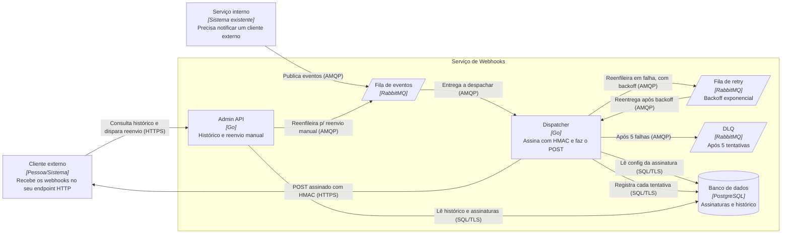
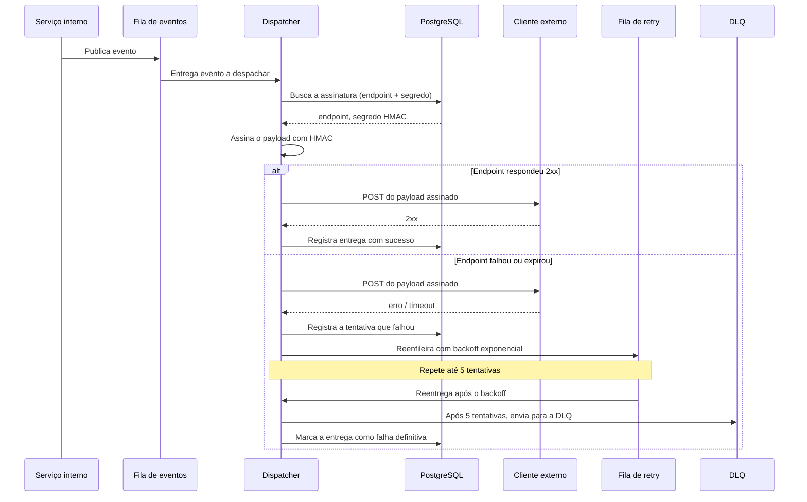

# Serviço de entrega de webhooks

| | |
|---|---|
| **Documento** | DESIGN-DOC |
| **Estado** | Rascunho |
| **Título** | Serviço de entrega de webhooks |
| **Autores** | Time de Plataforma |
| **Revisores** | _a definir_ (SRE), _a definir_ (Segurança) |
| **Criado** | 2026-06-20 |
| **Última atualização** | 2026-06-20 |
| **Tags** | webhooks, plataforma, mensageria, confiabilidade |

## Glossário

| Termo | Definição |
|---|---|
| **Webhook** | Notificação HTTP que a plataforma envia ao endpoint de um cliente externo quando um evento acontece. |
| **HMAC** | _Hash-based Message Authentication Code_; assinatura criptográfica do payload com um segredo compartilhado, que permite ao cliente verificar autenticidade e integridade. |
| **Backoff exponencial** | Estratégia de retry em que o intervalo entre tentativas cresce a cada falha (ex.: 1s, 2s, 4s, 8s…). |
| **DLQ** | _Dead Letter Queue_; fila para onde vão as mensagens que esgotaram as tentativas de entrega e precisam de tratamento manual. |
| **AMQP** | Protocolo de mensageria usado pelo RabbitMQ. |
| **PII** | _Personally Identifiable Information_; dado pessoal que identifica uma pessoa. |
| **SRE** | _Site Reliability Engineering_; time responsável por operar a infraestrutura e a confiabilidade em produção. |
| **SLA / SLO** | _Service Level Agreement_ / _Service Level Objective_; o nível de serviço acordado com o cliente e a meta interna que o sustenta (ex.: atraso máximo aceitável da entrega). |

## Visão geral

Este documento propõe um serviço central de entrega de webhooks para a plataforma. Hoje cada serviço interno que precisa avisar um cliente externo faz a chamada HTTP por conta própria, sem retry e sem visibilidade; quando o endpoint do cliente está fora do ar, o evento é perdido. A proposta centraliza a entrega num serviço dedicado que consome eventos de uma fila, assina o payload, faz o POST ao cliente e — quando a entrega falha — tenta de novo com backoff, registrando todo o histórico. Em troca de tornar a entrega assíncrona, a plataforma ganha retry, durabilidade e visibilidade.

## Escopo e contexto

Hoje a notificação de clientes externos é responsabilidade de cada serviço interno. Cada um faz um `POST` direto para o endpoint do cliente, de forma inline na request que originou o evento. Esse modelo tem três limitações que já custaram caro:

- **Sem retry.** Quando o endpoint do cliente está indisponível, a chamada falha e o evento é descartado. Já perdemos eventos em produção mais de uma vez por causa disso.
- **Sem durabilidade.** O evento só existe enquanto a request está em andamento; não há onde recuperá-lo depois.
- **Sem visibilidade.** Não há registro do que foi entregue, do que falhou nem de por quê. Quando um cliente pergunta "vocês me mandaram o evento X?", não temos como responder com segurança.

A lógica de notificação está espalhada e duplicada entre os serviços, o que torna o comportamento inconsistente de um serviço para outro.

## Objetivos e fora de escopo

### Objetivos

- **Não perder eventos quando o endpoint do cliente está temporariamente fora do ar**, persistindo o evento em fila e reentregando com retry automático.
- **Reentregar com backoff exponencial**, até 5 tentativas, antes de declarar a entrega como falha definitiva.
- **Dar visibilidade da entrega ao cliente**, registrando o histórico de cada tentativa e permitindo reenvio manual via uma Admin API.
- **Garantir autenticidade da entrega**, assinando cada payload com HMAC usando um segredo por cliente.
- **Eliminar a duplicação** da lógica de entrega, concentrando-a num único serviço com comportamento consistente.

### Fora de escopo

- **Garantia de entrega exatamente-uma-vez.** O serviço entrega ao menos uma vez; o cliente deve tratar idempotência no seu lado (um mesmo evento pode chegar mais de uma vez após um retry).
- **Transformação ou enriquecimento do payload.** O serviço entrega o evento como o serviço interno o publicou.
- **Portal/UI para o cliente.** Nesta fase a visibilidade é exposta apenas via Admin API; uma interface gráfica fica para depois.
- **Fan-out para múltiplos endpoints por assinatura.** Cada assinatura aponta para um endpoint.

## A solução

Um serviço central de webhooks com três partes que se comunicam por uma fila no RabbitMQ e compartilham um Postgres:

1. Os **serviços internos** deixam de fazer o POST direto e passam a **publicar o evento numa fila de eventos** no RabbitMQ.
2. Um **dispatcher** (em Go) consome a fila, busca no Postgres a configuração da assinatura do cliente (endpoint e segredo), **assina o payload com HMAC** e faz o **POST ao endpoint do cliente**. O resultado de cada tentativa é gravado no histórico.
3. Quando a entrega falha, o evento vai para uma **fila de retry com backoff exponencial**; após **5 tentativas** ele é enviado para a **DLQ**.
4. Uma **Admin API** (em Go) deixa o cliente **consultar o histórico de entregas** e **reenviar manualmente** um evento.

O trade-off central, decidido aqui: a entrega deixa de ser inline na request e passa a ser **assíncrona**. O cliente pode ver o evento com alguns segundos de atraso; em troca, ganhamos retry, durabilidade e visibilidade — exatamente o que falta hoje.

### Arquitetura

O diagrama de containers abaixo mostra os processos executáveis, os armazenamentos e como se comunicam.



<details>
<summary>Fonte do diagrama (Structurizr DSL)</summary>

```
workspace "Serviço de Webhooks" "Entrega centralizada e confiável de webhooks para clientes externos" {

    model {
        clienteExterno = person "Cliente externo" "Sistema do cliente que recebe os webhooks no seu endpoint HTTP."

        servicoInterno = softwareSystem "Serviço interno" "Qualquer serviço da plataforma que precisa notificar um cliente externo de um evento." {
            tags "Existente"
        }

        webhooks = softwareSystem "Serviço de Webhooks" "Recebe eventos dos serviços internos e os entrega aos endpoints dos clientes com retry, assinatura e visibilidade." {
            filaEventos = container "Fila de eventos" "Recebe os eventos publicados pelos serviços internos para entrega." "RabbitMQ" {
                tags "Fila"
            }
            filaRetry = container "Fila de retry" "Reentrega de eventos que falharam, com backoff exponencial." "RabbitMQ" {
                tags "Fila"
            }
            dlq = container "DLQ" "Fila de mensagens mortas: eventos que falharam após 5 tentativas." "RabbitMQ" {
                tags "Fila"
            }
            dispatcher = container "Dispatcher" "Consome eventos, busca a configuração da assinatura, assina o payload com HMAC e faz o POST ao endpoint do cliente." "Go"
            adminApi = container "Admin API" "Permite ao cliente consultar o histórico de entregas e reenviar manualmente." "Go"
            banco = container "Banco de dados" "Armazena as assinaturas dos clientes (endpoint, segredo HMAC) e o histórico de entregas." "PostgreSQL" {
                tags "Banco"
            }
        }

        servicoInterno -> filaEventos "Publica eventos a entregar" "AMQP"
        filaEventos -> dispatcher "Entrega eventos a despachar" "AMQP"
        dispatcher -> banco "Lê a configuração da assinatura do cliente" "SQL/TLS"
        dispatcher -> banco "Registra o resultado de cada tentativa de entrega" "SQL/TLS"
        dispatcher -> clienteExterno "POST do payload assinado com HMAC" "HTTPS"
        dispatcher -> filaRetry "Reenfileira entregas que falharam, com backoff" "AMQP"
        filaRetry -> dispatcher "Reentrega após o backoff" "AMQP"
        dispatcher -> dlq "Envia eventos após 5 tentativas falhas" "AMQP"
        clienteExterno -> adminApi "Consulta o histórico e dispara reenvio manual" "HTTPS"
        adminApi -> banco "Lê o histórico de entregas e as assinaturas" "SQL/TLS"
        adminApi -> filaEventos "Reenfileira um evento para reenvio manual" "AMQP"
    }

    views {
        container webhooks "Containers" {
            include *
            autolayout lr
        }

        styles {
            element "Person" { shape person }
            element "Existente" { background "#999999" color "#ffffff" }
            element "Fila" { shape pipe }
            element "Banco" { shape cylinder }
        }
    }
}
```

</details>

**Componentes e como interagem.** O **serviço interno** é qualquer serviço da plataforma que precise notificar um cliente; ele não conhece mais o endpoint do cliente nem o segredo — apenas publica o evento na **fila de eventos** do RabbitMQ. O **dispatcher**, escrito em Go, é o consumidor dessa fila: para cada evento ele busca no **banco de dados** (PostgreSQL) a assinatura correspondente — o endpoint de destino e o segredo HMAC — assina o payload e faz o `POST` ao **cliente externo** por HTTPS. Cada tentativa, com sucesso ou falha, é gravada no histórico do mesmo banco. Quando a entrega falha, o dispatcher reenfileira o evento na **fila de retry**, que o devolve ao dispatcher após o intervalo de backoff; esgotadas as 5 tentativas, o evento segue para a **DLQ**. A **Admin API**, também em Go, lê o histórico e as assinaturas do banco para responder às consultas do cliente e, num reenvio manual, recoloca o evento na fila de eventos para que ele percorra o mesmo caminho de entrega.

### Fluxo de entrega

A sequência abaixo mostra a ordem temporal de uma entrega, incluindo o caminho de falha.



**O fluxo, em palavras.** O serviço interno publica o evento na fila e segue sua vida — a entrega é assíncrona a partir daqui. O dispatcher pega o evento, busca a assinatura do cliente no Postgres, assina o payload com HMAC e faz o POST. Se o cliente responde `2xx`, o dispatcher registra o sucesso e encerra. Se o cliente falha ou estoura o timeout, o dispatcher registra a tentativa e reenfileira o evento na fila de retry, que o devolve após o intervalo de backoff; esse ciclo se repete até 5 vezes. Esgotadas as tentativas, o evento vai para a DLQ e a entrega é marcada como falha definitiva no histórico, ficando disponível para reenvio manual via Admin API.

### APIs e payloads

Apenas os pontos em que o design se apoia (o contrato completo da Admin API e o schema das tabelas são a fonte da verdade no repositório do serviço):

- **Assinatura HMAC.** Cada entrega leva um header com a assinatura do corpo — por exemplo `X-Webhook-Signature: sha256=<hmac>` — que o cliente recalcula com o segredo dele para verificar autenticidade e integridade. Um header de timestamp ajuda o cliente a rejeitar replays.
- **Admin API — consulta de histórico.** `GET /deliveries?...` retorna, por assinatura/evento, o status de cada entrega, o número de tentativas e o último código HTTP recebido.
- **Admin API — reenvio manual.** `POST /deliveries/{id}/resend` recoloca o evento na fila de eventos, reiniciando o ciclo de entrega.

### Dados e sensibilidade

O PostgreSQL guarda dois conjuntos de dados:

- **Assinaturas dos clientes** — endpoint de destino e **segredo HMAC por cliente**. O segredo é material sensível: deve ser armazenado cifrado (ou referenciado a partir de um cofre de segredos), nunca logado e nunca exposto pela Admin API.
- **Histórico de entregas** — metadados de cada tentativa (status, código HTTP, timestamps, número de tentativas) e o payload do evento. O payload pode conter PII dependendo do evento, então o acesso ao histórico precisa ser restrito ao dono da assinatura e a retenção precisa de um prazo definido.

## Trade-offs da solução escolhida

- ✓ **Não perdemos mais eventos** em quedas temporárias do cliente: o evento fica durável na fila e é reentregue com retry.
- ✓ **Visibilidade**: todo histórico de entrega fica consultável, e o cliente pode reenviar manualmente.
- ✓ **Comportamento consistente e sem duplicação**: a lógica de entrega (assinatura, retry, registro) vive num único lugar.
- ✓ **Segurança da entrega**: o payload é assinado com HMAC por cliente.
- ✗ **A entrega passa a ser assíncrona** — antes inline na request. O cliente pode ver o evento com **alguns segundos de atraso**. Foi o custo aceito conscientemente em troca de retry, durabilidade e visibilidade.
- ✗ **Entrega ao-menos-uma-vez, não exatamente-uma-vez**: um retry pode reentregar um evento que o cliente já recebeu. Empurramos a idempotência para o lado do cliente.
- ✗ **Mais peças para operar**: uma nova fila (com retry e DLQ) e dois novos serviços passam a fazer parte do que precisa ser monitorado e mantido em pé — custo que recai sobre o SRE.
- ✗ **Novo armazenamento de segredos**: passamos a guardar um segredo HMAC por cliente, o que cria uma superfície que precisa de proteção e rotação.

## Alternativas consideradas

| Alternativa | Trade-offs | Resultado |
|---|---|---|
| **Serviço central de webhooks** (esta proposta) | ✓ Retry, durabilidade, visibilidade e assinatura num lugar só. ✗ Entrega assíncrona; mais peças para operar. | **Escolhida** |
| **Cada serviço com sua própria lógica de retry** | ✓ Sem novo serviço para operar. ✗ Duplica código em cada serviço e gera comportamento inconsistente; a visibilidade continua espalhada e parcial. | Rejeitada |
| **SaaS de webhooks (ex.: Svix)** | ✓ Pronto para usar, sem construir nada. ✗ Custo recorrente; manda dado sensível (incluindo payloads que podem ter PII) para fora do nosso ambiente. | Rejeitada |
| **Não fazer nada** | ✗ Continuamos perdendo eventos em produção, sem retry e sem visibilidade — o problema que já nos custou caro mais de uma vez. | Rejeitada |

A escolha pelo serviço central vem de duas razões concretas: precisamos de retry, durabilidade e visibilidade **consistentes** (o que a opção "cada um faz o seu" não dá, por duplicação e divergência), e não podemos mandar dado sensível para fora do nosso ambiente nem assumir custo recorrente (o que descarta o SaaS). Não fazer nada não é opção porque já estamos perdendo eventos.

## Preocupações transversais

### Segurança

A equipe de Segurança é impactada diretamente. A solução introduz **um segredo HMAC por cliente**: é preciso definir como esses segredos são gerados, armazenados (cifrados ou em cofre), distribuídos ao cliente e **rotacionados**. A assinatura deve cobrir o corpo da requisição e, idealmente, um timestamp para mitigar replay. O histórico pode conter PII no payload, então o acesso pela Admin API tem de ser autenticado e restrito ao dono da assinatura. Segurança deve revisar o esquema de assinatura, o armazenamento dos segredos e a política de retenção do histórico.

### Infraestrutura e operação (SRE)

O SRE passa a operar uma **nova fila no RabbitMQ** (com suas filas de retry e DLQ) e **dois novos serviços em Go** (dispatcher e Admin API). Itens que precisam de definição junto ao SRE: dimensionamento e escala do dispatcher, alertas sobre crescimento da fila de retry e, principalmente, sobre **acúmulo na DLQ** (sinal de cliente persistentemente fora do ar), e o runbook para tratar a DLQ. SRE deve revisar a topologia de filas e os SLOs do serviço.

### Compatibilidade

Os serviços internos precisam migrar do `POST` direto para a publicação na fila. Essa mudança é por serviço e pode ser feita de forma incremental (ver Plano de implantação).

## Testabilidade e observabilidade

- **Antes de subir:** testes de integração cobrindo o caminho feliz (publica → entrega → registra) e os caminhos de falha (retry com backoff, esgotamento para a DLQ, verificação da assinatura HMAC pelo lado do cliente). Vale um teste de carga para validar que o dispatcher acompanha o pico de eventos.
- **Em produção:** métricas de taxa de entrega no primeiro POST, taxa de sucesso após retry, profundidade das filas de eventos e de retry, e **tamanho da DLQ**. Alertar quando a DLQ cresce (entregas que falharam de vez) e quando a latência fila→entrega ultrapassa o atraso aceitável combinado com os clientes — a métrica que prova o objetivo de não perder eventos é a ausência de eventos descartados sem registro.

## Plano de implantação

1. **Subir a infraestrutura**: filas (eventos, retry, DLQ) no RabbitMQ, banco com as tabelas de assinaturas e histórico, dispatcher e Admin API em ambiente de homologação.
2. **Migrar um serviço interno piloto** do POST direto para a publicação na fila, validando entrega, retry e histórico ponta a ponta.
3. **Migrar os demais serviços** incrementalmente, um a um. Durante a transição, um serviço pode publicar na fila e — se necessário — manter o POST direto como rede de segurança até ganharmos confiança, removendo-o em seguida.
4. **Disponibilizar a Admin API aos clientes** para consulta de histórico e reenvio manual.

Rollback: enquanto um serviço ainda mantém o caminho antigo, voltar atrás é desligar a publicação na fila para aquele serviço. Depois de removido o POST direto, o rollback é operacional (reprocessar a partir das filas/DLQ), não um retorno ao modelo antigo.

## Questões em aberto

- **Política de retenção do histórico e dos payloads** — por quanto tempo guardamos, dado que o payload pode conter PII? A definir com Segurança.
- **Armazenamento e rotação dos segredos HMAC** — banco cifrado ou cofre de segredos dedicado? A definir com Segurança.
- **Parâmetros do backoff** — intervalos exatos entre as 5 tentativas e teto de tempo total. A definir com SRE.
- **Ownership operacional** — o serviço fica com Plataforma, SRE, ou responsabilidade compartilhada? A alinhar com SRE.
- **SLA de atraso aceitável** — qual o atraso máximo fila→entrega que combinamos com os clientes, agora que a entrega é assíncrona?

---

> Revisores sugeridos: um representante de **SRE** (topologia de filas, SLOs, runbook da DLQ) e um de **Segurança** (assinatura HMAC, segredos por cliente, retenção de PII). Adicione os nomes no cabeçalho ao iniciar a revisão.
