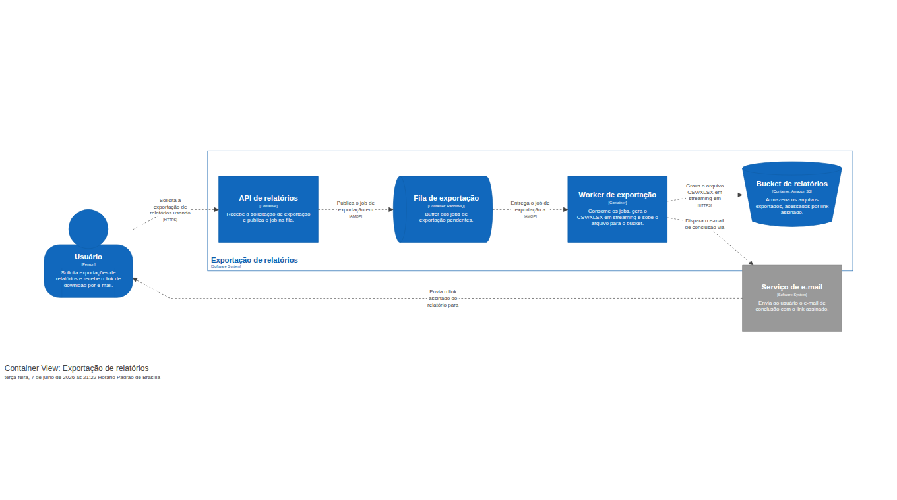
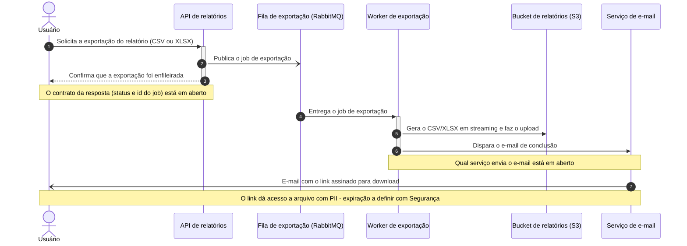

# Exportação de relatórios em background

| | |
|---|---|
| **Documento** | Design doc |
| **Estado** | Rascunho |
| **Título** | Exportação de relatórios em background |
| **Autores** | A definir |
| **Revisores** | Time de Plataforma (fila compartilhada), Time de Segurança (link assinado com PII) — nomes a definir |
| **Criado em** | 2026-07-07 |
| **Atualizado em** | 2026-07-07 |
| **Tags** | relatórios, exportação, fila, background |

## Glossário

- **AMQP** — protocolo de mensageria usado pelo RabbitMQ.
- **API** — a interface HTTP do produto pela qual o usuário solicita a exportação.
- **BI** — Business Intelligence; categoria de ferramentas externas de análise e relatórios.
- **C4** — modelo de diagramação de arquitetura em níveis (contexto, contêiner, componente, código).
- **CSV** — formato de exportação em texto com valores separados por vírgula.
- **DSL** — Domain-Specific Language; aqui, a linguagem textual do Structurizr que descreve o modelo C4.
- **Endpoint** — o caminho da API que atende uma operação; aqui, o de exportação.
- **Gateway** — o gateway de API na frente da nossa API, que impõe o timeout de 30 s por request.
- **HTTP / HTTPS** — protocolo de comunicação web das requests da API; HTTPS é a variante segura, usada nas chamadas à API e ao bucket.
- **Job** — unidade de trabalho colocada na fila: uma exportação a ser gerada.
- **Link assinado** — endereço temporário com assinatura que dá acesso ao arquivo no S3 sem credenciais adicionais.
- **PII** — Personally Identifiable Information; dado pessoal identificável de cliente.
- **RabbitMQ** — broker de mensageria que já existe na infraestrutura, mantido pelo time de Plataforma.
- **S3** — serviço de armazenamento de objetos da Amazon onde os arquivos exportados ficam.
- **Worker** — processo em background que consome jobs da fila e gera os relatórios.
- **XLSX** — formato de exportação em planilha do Excel.

## Visão geral

Este documento descreve a mudança da exportação de relatórios de um modelo síncrono —
a API gera o arquivo dentro da própria request — para um modelo assíncrono: a API
enfileira um job, um worker gera o arquivo CSV/XLSX em background e o usuário recebe
por e-mail um link assinado para download. A motivação é eliminar as falhas por
timeout que hoje atingem as exportações grandes e abrir caminho para relatórios
maiores.

## Escopo e contexto

- Hoje a API gera os relatórios dentro da própria request HTTP.
- O gateway de API impõe um timeout de 30 s por request.
- Cerca de **12% das exportações acima de 50 mil linhas falham** por estourar esse
  timeout, e o suporte abre ticket sobre isso toda semana.
- A infraestrutura já possui um RabbitMQ compartilhado, mantido pelo time de
  Plataforma.

## Objetivos e fora de escopo

**Objetivos**

- **Zerar as falhas por timeout** nas exportações, movendo a geração do relatório
  para fora da request da API.
- **Suportar exportações de até 100 mil linhas** (hoje o corte prático fica em torno
  de 50 mil, onde a taxa de falha chega a 12%).

**Fora de escopo**

- Manter um caminho síncrono de download imediato para exportações pequenas. A
  decisão deliberada é ter **um caminho só**: toda exportação passa a ser assíncrona,
  mesmo as que hoje terminam dentro do timeout.

## Design

### Visão da solução

A API deixa de gerar o arquivo e passa a **publicar um job de exportação** em uma
fila no RabbitMQ já existente. Um **worker separado** consome o job, gera o CSV/XLSX
**em streaming** — o arquivo não precisa caber inteiro na memória nem na janela de
uma request — e sobe o resultado para um bucket no S3. Ao terminar, o usuário recebe
um **e-mail com um link assinado** para baixar o arquivo.

O trade-off central, aceito desde já: o usuário perde o download imediato. Exportações
pequenas que hoje resolvem na hora também passam pelo fluxo assíncrono, em troca de um
único caminho de exportação para manter, testar e operar.

### Arquitetura



O diagrama mostra os contêineres do sistema e como eles se comunicam:

- **API de relatórios** — recebe a solicitação de exportação do usuário via HTTPS e
  publica o job na fila. A request responde de imediato; a API não gera mais arquivo.
- **Fila de exportação** — fila no RabbitMQ compartilhado que armazena os jobs de
  exportação pendentes até um worker consumi-los.
- **Worker de exportação** — consome os jobs da fila, gera o CSV/XLSX em streaming e
  grava o arquivo no bucket. Ao concluir, dispara o e-mail de conclusão.
- **Bucket de relatórios (S3)** — armazena os arquivos exportados; o acesso do
  usuário acontece pelo link assinado.
- **Serviço de e-mail** (externo ao sistema) — envia ao usuário o e-mail de conclusão
  com o link assinado. Qual serviço cumpre esse papel ainda está em aberto (ver
  Questões em aberto).

O gateway de API não aparece no diagrama por ser um componente de implantação, mas é
o motivador do desenho: com a geração fora da request, o timeout de 30 s deixa de
alcançar a exportação.

<details>
<summary>Fonte do diagrama (Structurizr DSL)</summary>

```
workspace "Exportação de relatórios em background" "Serviço assíncrono de exportação de relatórios CSV/XLSX." {

    !identifiers hierarchical

    model {
        usuario = person "Usuário" "Solicita exportações de relatórios e recebe o link de download por e-mail."

        exportacao = softwareSystem "Exportação de relatórios" "Gera relatórios CSV/XLSX em background e entrega o resultado por link assinado." {
            api = container "API de relatórios" "Recebe a solicitação de exportação e publica o job na fila."
            fila = container "Fila de exportação" "Buffer dos jobs de exportação pendentes." "RabbitMQ" {
                tags "Queue"
            }
            worker = container "Worker de exportação" "Consome os jobs, gera o CSV/XLSX em streaming e sobe o arquivo para o bucket."
            bucket = container "Bucket de relatórios" "Armazena os arquivos exportados, acessados por link assinado." "Amazon S3" {
                tags "Bucket"
            }
        }

        email = softwareSystem "Serviço de e-mail" "Envia ao usuário o e-mail de conclusão com o link assinado." {
            tags "External"
        }

        usuario -> exportacao.api "Solicita a exportação de relatórios usando" "HTTPS"
        exportacao.api -> exportacao.fila "Publica o job de exportação em" "AMQP"
        exportacao.fila -> exportacao.worker "Entrega o job de exportação a" "AMQP"
        exportacao.worker -> exportacao.bucket "Grava o arquivo CSV/XLSX em streaming em" "HTTPS"
        exportacao.worker -> email "Dispara o e-mail de conclusão via"
        email -> usuario "Envia o link assinado do relatório para"
    }

    views {
        systemContext exportacao "SystemContext" {
            include *
            autoLayout lr
        }

        container exportacao "Containers" {
            include *
            autoLayout lr
        }

        styles {
            element "Element" {
                background #1168bd
                color #ffffff
            }
            element "Person" {
                shape person
            }
            element "Queue" {
                shape pipe
            }
            element "Bucket" {
                shape bucket
            }
            element "External" {
                background #999999
                color #ffffff
            }
        }
    }

    configuration {
        scope softwaresystem
    }
}
```

</details>

### Fluxo de exportação



Passo a passo: o usuário solicita a exportação (1) e a API apenas publica o job na
fila (2) e confirma o recebimento (3) — a request termina em milissegundos, longe do
timeout do gateway. A fila entrega o job ao worker (4), que gera o arquivo em
streaming e o sobe para o bucket (5). Ao concluir, o worker dispara o e-mail de
conclusão (6), que chega ao usuário com o link assinado para download (7).

O diagrama mostra apenas o caminho feliz: a política para jobs que falham (retry,
descarte, aviso ao usuário) ainda não foi definida — ver Questões em aberto.

### Dados e sensibilidade

Os relatórios exportados contêm **dados de clientes (PII)** — essa sensibilidade foi
inclusive um dos motivos para descartar uma ferramenta externa de BI. Dois pontos do
desenho decorrem disso:

- O arquivo fica em um bucket S3 da própria empresa; o dado não sai para terceiros.
- O acesso do usuário acontece por **link assinado enviado por e-mail**, ou seja, fora
  do perímetro autenticado da API. Os requisitos de expiração, escopo e revogação
  desse link precisam ser definidos com o time de Segurança (ver Questões em aberto).

## Trade-offs da solução escolhida

- ✓ **Elimina o timeout estrutural**: a request só enfileira; a geração acontece no
  worker, fora do limite de 30 s do gateway.
- ✓ **Um único caminho de exportação**: sem bifurcação síncrono/assíncrono para
  manter, testar e explicar ao usuário.
- ✓ **Geração em streaming**: o tamanho do arquivo deixa de estar preso à janela da
  request, viabilizando a meta de 100 mil linhas.
- ✓ **Reusa infraestrutura existente**: o RabbitMQ já está na infra; nenhum
  componente novo de mensageria é introduzido.
- ✗ **O usuário perde o download imediato**: exportações pequenas que hoje resolvem
  na hora passam a chegar por e-mail. Custo aceito em troca do caminho único.
- ✗ **Mais partes móveis**: fila, worker, bucket e e-mail entram no caminho da
  exportação; operar e observar esse fluxo é mais complexo do que uma request única.
- ✗ **Carga nova sobre a fila compartilhada**: os jobs de exportação passam a
  disputar o RabbitMQ com os demais consumidores — impacto a alinhar com o time de
  Plataforma.
- ✗ **Nova superfície de segurança**: o link assinado dá acesso a arquivo com PII
  fora do perímetro autenticado da API — impacto a alinhar com o time de Segurança.

## Alternativas consideradas

1. **Não fazer nada** — manteria os ~12% de falha nas exportações acima de 50 mil
   linhas e os tickets semanais no suporte, e é incompatível com a meta de 100 mil
   linhas. Descartada.
2. **Gerar síncrono com timeout maior** — aumentar o limite do gateway e continuar
   gerando o arquivo na request. Descartada: só empurra o problema — o limite continua
   existindo e volta a ser estourado conforme os relatórios crescem.
3. **Ferramenta de BI externa** — delegar a exportação a um produto de mercado.
   Descartada pelo custo e por expor dados de clientes a um terceiro.
4. **Exportação assíncrona com worker e fila (escolhida)** — elimina o limite
   estrutural em vez de movê-lo, mantém o dado dentro da infraestrutura própria e
   reusa o RabbitMQ existente, ao custo de perder o download imediato.

## Preocupações transversais

### Plataforma

Os jobs de exportação passam a rodar sobre a **fila compartilhada do RabbitMQ**,
somando carga aos consumidores que já existem. O dimensionamento — e a decisão entre
fila dedicada ou compartilhada para esse tráfego — precisa ser alinhado com o time de
Plataforma antes da implementação. O time está sugerido como revisor no cabeçalho.

### Segurança

O **link assinado enviado por e-mail dá acesso a arquivos com PII** fora do perímetro
autenticado da API. Tempo de expiração, escopo do link e possibilidade de revogação
precisam ser definidos com o time de Segurança, também sugerido como revisor no
cabeçalho.

## Testabilidade e observabilidade

- A meta de **zerar timeouts** é verificável pela taxa de falha por timeout no
  endpoint de exportação — hoje ~12% nas exportações acima de 50 mil linhas —
  acompanhada após a entrada do novo fluxo.
- A meta de **100 mil linhas** é verificável com uma exportação de teste desse volume
  percorrendo o fluxo de ponta a ponta.
- Com o fluxo assíncrono, o sucesso deixa de aparecer na resposta HTTP: o que
  monitorar na fila e no worker (tempo em fila, taxa de jobs com erro) ainda precisa
  ser definido — ver Questões em aberto.

## Questões em aberto

1. **Fonte dos dados**: de onde o worker lê os dados do relatório — o mesmo banco que
   a API usa hoje? Uma exportação de 100 mil linhas impõe carga relevante a essa
   fonte?
2. **Contrato da API**: o que a API responde ao enfileirar (status, id do job)?
   Haverá endpoint para consultar o andamento, ou o e-mail é o único canal de
   retorno?
3. **Política de falha do job**: o que acontece quando a geração falha — retry,
   descarte, aviso ao usuário? O fluxo documentado cobre apenas o caminho feliz.
4. **Requisitos do link assinado**: expiração, escopo e revogação, a definir com o
   time de Segurança.
5. **Envio do e-mail**: qual serviço envia o e-mail de conclusão? Já existe um
   mecanismo de e-mail transacional no produto?
6. **Fila dedicada ou compartilhada**: os jobs de exportação ganham fila própria no
   RabbitMQ ou dividem com os demais consumidores? A alinhar com Plataforma.
7. **Tecnologia do worker**: o worker usa a mesma stack da API? O diagrama de
   contêineres ainda não registra a tecnologia da API nem do worker.
8. **Rollout**: a troca do caminho síncrono pelo assíncrono acontece de uma vez ou
   de forma gradual (por exemplo, atrás de uma flag por cliente)?
