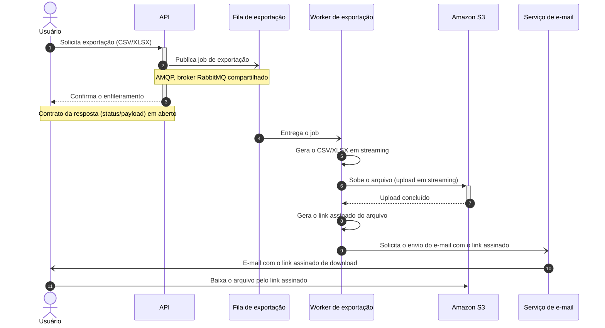

# Exportação de relatórios em background

| | |
|---|---|
| **Título** | Exportação de relatórios em background |
| **Estado** | Rascunho |
| **Autores** | A definir (ver Questões em aberto) |
| **Revisores** | Time de Plataforma (fila compartilhada), Time de Segurança (link assinado com PII) — nomes a definir |
| **Criado** | 2026-07-07 |
| **Última atualização** | 2026-07-07 |
| **Tags** | exportação, relatórios, fila, worker, s3 |

## Glossário

- **AMQP** — protocolo de mensageria usado pelo RabbitMQ.
- **API** — o serviço HTTP que hoje recebe e atende as solicitações de exportação.
- **BI** — Business Intelligence; categoria de ferramentas externas de análise e exportação de dados.
- **CSV / XLSX** — formatos de arquivo das exportações (texto separado por vírgula / planilha Excel).
- **DSL** — Domain-Specific Language; aqui, a linguagem textual do Structurizr que descreve o diagrama C4.
- **Gateway** — o proxy de entrada das requisições da API, que impõe o timeout de 30 s.
- **Link assinado** — URL com credencial embutida e prazo de validade que dá acesso temporário a um arquivo no S3.
- **PII** — Personally Identifiable Information; dados pessoais de clientes presentes nos relatórios.
- **S3** — serviço de armazenamento de objetos da Amazon Web Services onde os arquivos exportados ficarão.
- **Streaming** — gerar e transmitir o arquivo em partes, sem montá-lo inteiro na memória.
- **Worker** — processo separado da API que consome jobs da fila e executa a exportação.

## Visão geral

Este documento descreve a mudança da exportação de relatórios de um modelo síncrono — o arquivo é gerado dentro da própria request da API — para um modelo assíncrono: a API enfileira um job, um worker gera o CSV/XLSX em streaming e sobe o arquivo para o S3, e o usuário recebe por e-mail um link assinado para download.

A motivação é eliminar as falhas por timeout nas exportações grandes; o custo aceito é que o usuário perde o download imediato, inclusive nas exportações pequenas que hoje funcionam na hora.

## Escopo e contexto

- Hoje a API gera os relatórios dentro da própria request. O gateway impõe um timeout de 30 s.
- Cerca de **12% das exportações acima de 50 mil linhas falham** por estourar esse timeout.
- O suporte abre ticket sobre essas falhas **toda semana**.
- A infraestrutura já opera um **RabbitMQ** (fila compartilhada, do time de plataforma), que este projeto reaproveita.

## Objetivos e fora de escopo

Objetivos:

- **Zerar as falhas de exportação por timeout** (hoje ~12% nas exportações acima de 50 mil linhas), tirando a geração do arquivo de dentro da request.
- **Suportar exportações de até 100 mil linhas**, gerando o arquivo em streaming no worker.

Fora de escopo:

- **Manter um caminho síncrono para exportações pequenas.** Alguém poderia esperar que exportações que hoje saem na hora continuassem imediatas; o time decidiu deliberadamente ter um caminho só, e toda exportação passa a ser assíncrona.

## O design

### Visão da solução

A API deixa de gerar o arquivo e passa a publicar um job de exportação na fila (RabbitMQ já existente). Um worker separado consome o job, gera o CSV/XLSX em streaming — sem montar o arquivo inteiro na memória — e sobe o resultado para o S3. Ao terminar, o worker dispara um e-mail ao usuário com um link assinado para o download.

O trade-off central: a request da API volta em milissegundos e nenhuma exportação depende mais do timeout de 30 s do gateway, mas o usuário troca o download imediato pela espera do e-mail — em toda exportação, grande ou pequena.

### Arquitetura


*(Imagem ainda não renderizada — gerar a partir do DSL abaixo na passada manual; o DSL foi validado com `structurizr/structurizr validate`.)*

<details>
<summary>Fonte do diagrama (Structurizr DSL)</summary>

```
workspace "Exportação de relatórios em background" "Exportação assíncrona de relatórios CSV/XLSX via fila e worker." {

    !identifiers hierarchical

    model {
        u = person "Usuário" "Solicita exportações de relatórios e recebe o link de download por e-mail."

        s = softwareSystem "Plataforma de relatórios" "Gera e entrega exportações de relatórios em CSV/XLSX." {
            api = container "API" "Recebe a solicitação de exportação, enfileira o job e responde de imediato."
            fila = container "Fila de exportação" "Jobs de exportação pendentes, no broker RabbitMQ compartilhado da infraestrutura." "RabbitMQ" {
                tags "Queue"
            }
            worker = container "Worker de exportação" "Consome jobs, gera o CSV/XLSX em streaming e sobe o arquivo para o S3."
        }

        s3 = softwareSystem "Amazon S3" "Armazena os arquivos exportados e serve os downloads por link assinado." {
            tags "External"
        }

        email = softwareSystem "Serviço de e-mail" "Entrega ao usuário o e-mail com o link assinado de download." {
            tags "External"
        }

        u -> s.api "Solicita exportação de relatório usando" "HTTPS"
        s.api -> s.fila "Publica o job de exportação em" "AMQP"
        s.worker -> s.fila "Consome jobs de exportação de" "AMQP"
        s.worker -> s3 "Sobe o arquivo exportado em streaming para" "HTTPS"
        s.worker -> email "Solicita o envio do e-mail com o link assinado a"
        email -> u "Envia o link assinado de download para" "E-mail"
    }

    views {
        systemContext s "SystemContext" {
            include *
            autoLayout
        }

        container s "Containers" {
            include *
            autoLayout lr
        }

        styles {
            element "Element" {
                background #1168bd
                color #ffffff
            }
            element "Person" {
                shape person
            }
            element "Queue" {
                shape pipe
            }
            element "External" {
                background #999999
                color #ffffff
            }
        }
    }

    configuration {
        scope softwaresystem
    }
}
```

</details>

O diagrama mostra três containers e dois sistemas externos:

- **API** — o serviço existente. Deixa de gerar o arquivo: recebe a solicitação de exportação, publica o job na fila e responde de imediato.
- **Fila de exportação** — a fila dos jobs pendentes, no broker RabbitMQ que a infraestrutura já opera. O broker é compartilhado com outros times (ver Preocupações transversais).
- **Worker de exportação** — processo novo, separado da API. Consome os jobs, gera o CSV/XLSX em streaming, sobe o arquivo para o S3 e dispara o e-mail de conclusão.
- **Amazon S3** (externo) — guarda os arquivos exportados; o download do usuário acontece por link assinado apontando para ele.
- **Serviço de e-mail** (externo) — entrega o link assinado ao usuário. O mecanismo concreto (serviço interno existente ou provedor) está em aberto.

O worker não conversa com a API: a fila é o único acoplamento entre os dois, o que permite escalá-los e implantá-los de forma independente. O gateway de 30 s continua na frente da API, mas passa a cobrir apenas o enfileiramento — operação de milissegundos.

### Fluxo de exportação



Passo a passo: a request do usuário termina no passo 3 — a API só publica o job (passo 2) e confirma; nada mais roda dentro do timeout do gateway. Do passo 4 em diante o trabalho é do worker: geração em streaming (passo 5), upload para o S3 (passos 6–7), link assinado (passo 9) e disparo do e-mail (passo 10). O download final (passo 12) acontece direto contra o S3, sem passar pela API.

O diagrama mostra apenas o caminho feliz: o comportamento em falha (job que quebra no meio da geração, upload que falha, e-mail que não chega) ainda não foi definido — ver Questões em aberto.

### Dados e sensibilidade

Os relatórios exportados contêm dados de clientes (PII) — foi inclusive um dos motivos para descartar a ferramenta de BI externa. Com este design, esses dados passam a **persistir no S3** e a ficar acessíveis por **link assinado que trafega por e-mail**. Prazo de expiração do link e política de retenção dos arquivos ainda não foram definidos e precisam da revisão do time de segurança (ver Questões em aberto).

## Trade-offs da solução escolhida

- ✓ **Zera os timeouts de exportação**: a geração sai da request; o limite de 30 s do gateway passa a cobrir só o enfileiramento.
- ✓ **Viabiliza 100 mil linhas**: o worker gera em streaming e não fica preso ao ciclo de vida de uma request HTTP.
- ✓ **Reaproveita infraestrutura existente** (RabbitMQ) em vez de introduzir um broker novo.
- ✓ **Um caminho só de exportação**: sem bifurcação síncrono/assíncrono para manter e testar.
- ✗ **O usuário perde o download imediato** — custo aceito deliberadamente: exportações pequenas que hoje saem na hora passam a chegar por e-mail.
- ✗ **Carga nova na fila compartilhada** do time de plataforma.
- ✗ **Arquivos com PII acessíveis por link assinado** — superfície nova que o time de segurança precisa avaliar.
- ✗ **Mais partes móveis na entrega**: o resultado passa a depender de fila, worker, S3 e e-mail, não só da API.

## Alternativas consideradas

1. **Geração síncrona com timeout maior** — descartada: só empurra o problema. O relatório continua crescendo, e a meta de 100 mil linhas esbarraria no próximo limite.
2. **Ferramenta de BI externa** — descartada por custo e por expor dado de cliente a um terceiro.
3. **Não fazer nada** — descartada: ~12% das exportações acima de 50 mil linhas seguem falhando, o suporte segue abrindo ticket toda semana, e o objetivo de 100 mil linhas fica inalcançável.

**Escolhida: exportação assíncrona via fila + worker**, descrita na seção O design.

## Preocupações transversais

- **Plataforma (fila compartilhada)** — os jobs de exportação adicionam carga ao RabbitMQ que outros times usam. O volume esperado e eventuais limites precisam ser acordados com o time de plataforma, que deve revisar este documento.
- **Segurança (link assinado com PII)** — relatórios com dados de clientes ficarão no S3 e acessíveis por link assinado enviado por e-mail. Expiração do link, retenção dos arquivos e o risco de encaminhamento do e-mail precisam da revisão do time de segurança.

## Testabilidade e observabilidade

Os dois objetivos são mensuráveis e indicam a verificação: antes de liberar, um teste de exportação com **100 mil linhas** precisa completar de ponta a ponta (fila → worker → S3 → e-mail); depois de liberar, a **taxa de falha de exportação por timeout** é a métrica a acompanhar — a meta é zero, e os tickets semanais do suporte devem cessar. As métricas operacionais do caminho novo (profundidade da fila, duração dos jobs, falhas do worker) ainda não foram definidas.

## Questões em aberto

1. **Autores e revisores nominais** — quem assina o documento e quem revisa pelos times de Plataforma e Segurança?
2. **Contrato da API** — o que a solicitação de exportação responde (status, payload)? Haverá consulta de andamento do job na interface, ou o e-mail é o único canal de conclusão?
3. **Comportamento em falha** — o que acontece quando a geração ou o upload falha no meio: reprocessamento, descarte, aviso ao usuário? O fluxo acima mostra só o caminho feliz.
4. **Link assinado e retenção** — prazo de expiração do link e por quanto tempo os arquivos ficam no S3 (definição junto ao time de segurança).
5. **Mecanismo de e-mail** — serviço interno existente ou provedor a contratar?
6. **Acordo com o time de plataforma** — volume esperado de jobs e limites na fila compartilhada.
7. **Comunicação da mudança** — como avisar os usuários de exportações pequenas que o download imediato deixa de existir, e se a mudança entra de uma vez ou por etapas.
