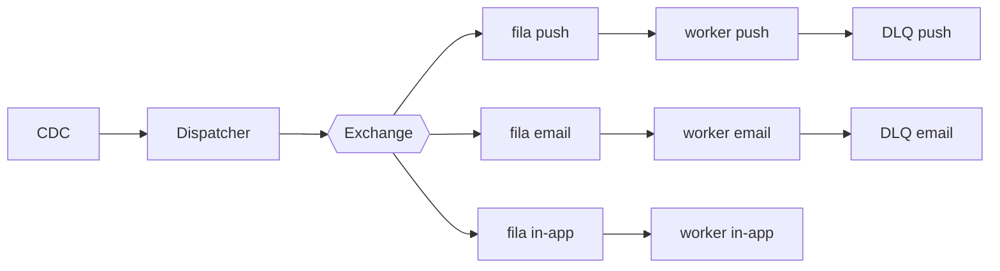

# Fanout de notificações

| | |
|---|---|
| **Estado** | Em revisão |
| **Autor** | Time de Mensageria |
| **Criado em** | 2026-01-28 |
| **Última atualização** | 2026-07-07 |

## Glossário

- **CDC** (Change Data Capture): captura das mudanças do banco de dados na forma de eventos; aqui, a origem dos eventos de domínio que alimentam o dispatcher.
- **DLQ** (Dead Letter Queue): fila que recebe as mensagens que falharam no processamento, para tratamento posterior.
- **SLA** (Service Level Agreement): acordo de nível de serviço — aqui, o compromisso de prazo de entrega das notificações.
- **TPS** (transações por segundo): taxa de chamadas enviadas a cada provider; cada provider impõe seu limite.

## Visão geral

O serviço de notificações processa os envios de forma sequencial e, com o crescimento da base, esse modelo começou a apresentar lentidão. Este documento propõe substituí-lo por um fanout baseado em filas, em que workers por canal (push, e-mail, in-app) consomem os envios em paralelo, garantindo o SLA de entrega.

## Contexto

Hoje o próprio serviço de mensageria faz os envios: um cron lê a tabela `notifications` a cada minuto, monta o payload de cada canal (push, e-mail, in-app) e chama os providers um a um, de forma sequencial. Com o crescimento da base esse modelo começou a apresentar lentidão.

## Objetivos

- Melhorar a performance dos envios
- Tornar o sistema escalável
- Garantir o SLA

## Fora de escopo

- O sistema não deve ser lento
- O sistema não deve perder notificações

## Solução

A solução proposta é mais escalável e robusta que o modelo atual, além de mais fácil de manter. Adotaremos o fanout com filas por canal: o CDC captura os eventos de domínio e alimenta o dispatcher, que publica cada notificação numa exchange; cada canal tem sua própria fila e seus próprios workers, que consomem em paralelo respeitando o controle de TPS de cada provider, com DLQ por canal para as mensagens que falham.

No diagrama, o CDC entrega os eventos de domínio ao dispatcher, que publica cada notificação na exchange. A exchange roteia a mensagem para a fila do canal correspondente (push, e-mail ou in-app), e os workers de cada canal consomem suas filas em paralelo, chamando o provider do canal. As mensagens que esgotam as tentativas de processamento vão para a DLQ do canal.

## Plano

1. Criar exchange e filas
2. Migrar o canal de e-mail
3. Migrar push e in-app
4. Desligar o cron
