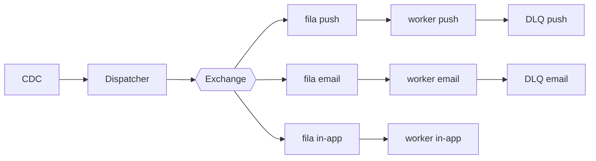

# Fanout de notificações

| | |
|---|---|
| **Estado** | Em revisão |
| **Autor** | Time de Mensageria |
| **Criado em** | 2026-01-28 |
| **Última atualização** | 2026-07-07 |

## Glossário

- **CDC** (Change Data Capture) — captura de mudanças no banco de dados como um fluxo de eventos.
- **DLQ** (Dead Letter Queue) — fila que recebe as mensagens cujo processamento falhou.
- **Exchange** — componente do broker de mensagens que recebe as publicações e as roteia para as filas.
- **Fanout** — padrão em que um evento publicado é distribuído para múltiplos consumidores em paralelo.
- **In-app** — canal de notificação exibido dentro do próprio aplicativo.
- **Provider** — serviço externo que efetua a entrega em um canal (push, e-mail).
- **SLA** (Service Level Agreement) — acordo de nível de serviço; aqui, o compromisso de prazo de entrega das notificações.
- **TPS** (transações por segundo) — taxa máxima de chamadas que um provider aceita.

## Visão geral

O serviço de mensageria processa os envios de notificações de forma sequencial e, com o crescimento da base, começou a apresentar lentidão. Este documento propõe substituir esse modelo por um fanout baseado em filas, em que workers por canal (push, e-mail e in-app) consomem e entregam as notificações em paralelo.

## Escopo e contexto

Hoje o próprio serviço de mensageria faz os envios: um cron lê a tabela `notifications` a cada minuto, monta o payload de cada canal (push, e-mail e in-app) e chama os providers um a um, de forma sequencial. Com o crescimento da base, esse modelo começou a apresentar lentidão.

## Objetivos

- Melhorar a performance dos envios
- Tornar o sistema escalável
- Garantir o SLA de entrega
- Não perder notificações

## Fora de escopo

- A definir (ver "Questões em aberto").

## Solução

Adotaremos o fanout com filas por canal:

O CDC captura os eventos de domínio e os entrega ao dispatcher, substituindo a leitura da tabela `notifications` por cron. O dispatcher publica cada notificação na exchange, que a roteia para a fila do canal correspondente (push, e-mail ou in-app). Os workers de cada canal consomem suas filas em paralelo, montam o payload e chamam o provider do canal, respeitando o limite de TPS de cada provider. As mensagens cujo envio falha vão para a DLQ do canal.

## Plano

1. Criar exchange e filas
2. Migrar o canal de e-mail
3. Migrar push e in-app
4. Desligar o cron

## Questões em aberto

- Quais números dimensionam o problema hoje (volume de notificações, atraso ou latência atual) e quais são as metas mensuráveis dos objetivos?
- Qual é o SLA de entrega (valor e como é medido)?
- Quais custos a solução escolhida aceita (trade-offs) e quais alternativas foram consideradas, incluindo não fazer nada?
- O que está de fato fora de escopo deste trabalho?
- O worker de in-app tem DLQ? O texto prevê DLQ por canal, mas o diagrama não mostra DLQ para in-app.
- Quais times e sistemas fora do Time de Mensageria são impactados (infraestrutura do broker, limites dos providers), e quem dessas áreas revisa este documento?
