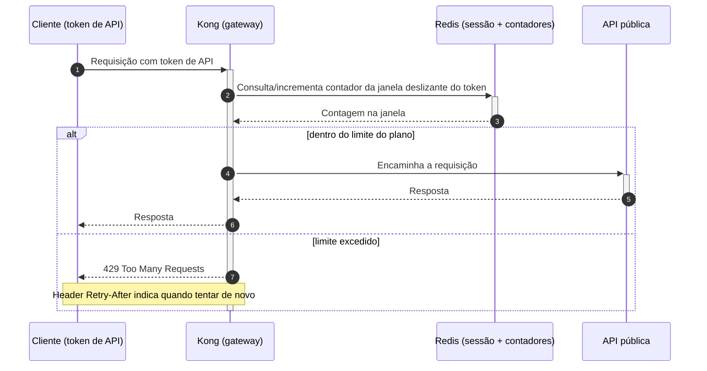

# DD-2026-008 · Rate limiting da API pública

| | |
|---|---|
| **Documento** | DD-2026-008 |
| **Estado** | Rascunho |
| **Autores** | *(a preencher)* |
| **Revisores** | *(a preencher — sugestão: Plataforma, SRE e time de contas, pelas áreas que o design toca)* |
| **Criado em** | 2026-07-07 |
| **Última atualização** | 2026-07-07 |
| **Tags** | rate-limiting, api-pública, gateway, redis |

## Resumo

Ontem um único cliente com integração mal feita derrubou a API pública para todos os
demais por 25 minutos (INC-4412), porque hoje não existe nenhum limite de tráfego por
cliente. Este documento propõe rate limiting por token de API aplicado no gateway
(Kong), com janela deslizante mantida em contadores no Redis que já usamos para sessão
e limites definidos por plano; requisições acima do limite recebem `429` com o header
`Retry-After`.

## Contexto

A API pública roda atrás do gateway Kong e hoje não impõe nenhum limite de tráfego por
cliente: qualquer token pode enviar quanto tráfego quiser. No incidente INC-4412, um
cliente com integração mal feita enviou 40x o tráfego normal e derrubou a API para
todos os clientes por 25 minutos. Já operamos um Redis para armazenamento de sessão,
no mesmo caminho da API.

## Proposta

A proposta persegue dois objetivos mensuráveis:

- Nenhum token excede seu limite por mais de 1 segundo.
- A API sustenta um cliente abusivo sem degradar os demais clientes.

O Kong aplica rate limit **por token de API** — não por IP, então integrações
distintas atrás de um mesmo NAT não interferem umas nas outras. A contagem usa
**janela deslizante** com contadores no Redis que já usamos para sessão. Os limites
são definidos por plano:

| Plano | Limite |
|---|---|
| Free | 10 rps |
| Pro | 100 rps |
| Enterprise | Negociado por contrato |

Quando um token excede o limite do seu plano, o Kong responde `429 Too Many Requests`
com o header `Retry-After`, indicando ao cliente quando tentar de novo, e a requisição
não entra na malha de serviços.

No fluxo, o Kong consulta e incrementa no Redis o contador da janela deslizante do
token antes de qualquer outra coisa (passos 2–3). Dentro do limite, a requisição segue
normalmente para a API (passos 4–6); acima do limite, o próprio gateway responde `429`
com `Retry-After` (passos 7–8) e a API nem vê a requisição.

### Compensações

- ✓ O gateway barra o token abusivo na borda: a requisição rejeitada não consome a
  malha de serviços e não degrada os demais clientes.
- ✓ Reutiliza o Redis de sessão já existente — nenhuma peça nova de infraestrutura.
- ✗ Um cliente legítimo em pico (ex.: Black Friday) pode receber `429`. Mitigação
  aceita no war room: o `Retry-After` orienta o cliente a reenviar, e um alerta avisa
  o time de contas para comunicar os clientes enterprise.

## Alternativas consideradas

- **Limitar dentro de cada serviço** — descartada: o corte acontece tarde demais; a
  requisição abusiva já consumiu gateway e malha antes de ser rejeitada.
- **Módulo pago de rate limiting do gateway gerenciado** — descartada: custo e
  lock-in no fornecedor.
- **Não fazer nada** — descartada: sem limite por cliente, qualquer integração mal
  feita repete o INC-4412; o status quo é exatamente o cenário do incidente.

## Riscos

| Risco | Mitigação |
|---|---|
| O Redis de sessão virar ponto de contenção com a carga adicional dos contadores | Medir a carga no Redis durante o shadow mode, antes de qualquer enforcement |

## Plano de entrega

1. **Shadow mode**: contadores ligados, apenas medindo — nenhuma requisição bloqueada;
   também serve para medir o impacto no Redis de sessão.
2. **Enforcement no plano free**.
3. **Enforcement geral** (pro e enterprise).
