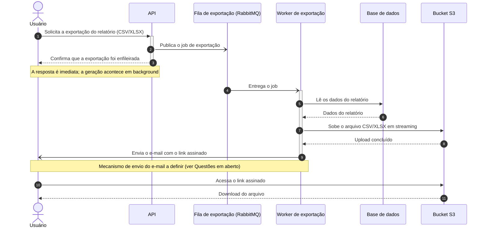

# Exportação de relatórios em background

| | |
|---|---|
| **Documento** | DESIGN-DOC |
| **Estado** | Rascunho |
| **Título** | Exportação de relatórios em background |
| **Autores** | *(a preencher — ver Questões em aberto)* |
| **Revisores** | *(a confirmar — sugeridos: time de Plataforma, time de Segurança)* |
| **Criado em** | 2026-07-07 |
| **Atualizado em** | 2026-07-07 |
| **Tags** | exportação, relatórios, fila, assíncrono |

## Glossário

- **API** — interface HTTP do produto que hoje gera as exportações na própria request.
- **BI** — *Business Intelligence*; categoria de ferramentas externas de análise e exportação de dados, citada nas alternativas.
- **CSV / XLSX** — formatos de arquivo das exportações (texto separado por vírgulas / planilha Excel).
- **Gateway** — camada de entrada das requests da API; impõe o timeout de 30 segundos.
- **Link assinado** — endereço (URL) temporário que dá acesso a um objeto no S3 sem exigir credenciais adicionais.
- **PII** — *Personally Identifiable Information*; dados pessoais de clientes presentes nos relatórios exportados.
- **RabbitMQ** — broker de mensagens já existente na infraestrutura, compartilhado entre times.
- **S3** — serviço de armazenamento de objetos da AWS (Amazon Web Services) onde os arquivos gerados ficam disponíveis.
- **Streaming** — geração e envio do arquivo em partes, sem montar o relatório inteiro em memória.
- **Worker** — processo separado que consome jobs da fila e executa a geração do arquivo.

## Visão geral

Hoje a API gera relatórios grandes dentro da própria request e estoura o timeout de 30 segundos do gateway: cerca de 12% das exportações acima de 50 mil linhas falham, e o suporte abre ticket disso toda semana. Este documento propõe mover a geração para fora da request: a API passa a enfileirar um job no RabbitMQ, um worker separado gera o CSV/XLSX em streaming e sobe o arquivo para o S3, e o usuário recebe por e-mail um link assinado quando a exportação termina.

O documento registra os objetivos (zerar os timeouts de exportação e suportar 100 mil linhas), o trade-off aceito (o usuário perde o download imediato — todas as exportações viram assíncronas), as alternativas descartadas e o impacto nos times de Plataforma e de Segurança.

## Escopo e contexto

- A API gera as exportações de relatório (CSV/XLSX) de forma síncrona, dentro da request HTTP.
- O gateway impõe um timeout de 30 segundos por request.
- Cerca de **12% das exportações acima de 50 mil linhas falham** por estourar esse timeout.
- O suporte abre ticket dessas falhas **toda semana**.
- A infraestrutura já opera um **RabbitMQ compartilhado** entre times — não é preciso introduzir um broker novo.
- Os relatórios exportados contêm dados de clientes (PII), o que restringe onde os arquivos podem ficar e como são acessados.

## Objetivos e fora de escopo

**Objetivos**

- **Zerar as falhas de exportação por timeout**, tirando a geração do arquivo do caminho da request — hoje ~12% das exportações acima de 50 mil linhas falham.
- **Suportar exportações de até 100 mil linhas**, gerando o arquivo em streaming num worker sem o limite de 30 segundos.

**Fora de escopo**

- **Manter um caminho síncrono de download imediato para exportações pequenas.** Alguém poderia esperar que exportações que hoje funcionam na hora continuassem síncronas; a decisão deliberada é o contrário — todas as exportações passam pelo fluxo assíncrono, para existir um caminho só.

## Design

### Visão da solução

A geração do relatório sai da request e vira um job assíncrono. A API só valida a solicitação, publica o job na fila de exportação do RabbitMQ e responde de imediato. Um worker separado consome o job, lê os dados do relatório, gera o CSV/XLSX **em streaming** — sem montar o arquivo inteiro em memória — e sobe o resultado para um bucket S3. Ao terminar, o usuário recebe um e-mail com um **link assinado** para baixar o arquivo.

O trade-off central: a request nunca mais espera a geração — o que zera os timeouts e destrava relatórios de 100 mil linhas — em troca de o usuário perder o download imediato, inclusive nas exportações pequenas que hoje funcionam na hora. O time aceitou esse custo para manter um caminho único de exportação.

### Arquitetura


*Renderizar esta imagem a partir do DSL abaixo na passada manual (não há renderizador disponível neste ambiente).*

<details>
<summary>Fonte do diagrama (Structurizr DSL)</summary>

```
workspace "Exportação de relatórios em background" "Exportações de relatórios geradas por um worker assíncrono, com entrega por link assinado." {

    !identifiers hierarchical

    model {
        usuario = person "Usuário" "Solicita a exportação de relatórios e recebe o link por e-mail."

        plataforma = softwareSystem "Plataforma de relatórios" "Gera e entrega exportações de relatórios em CSV/XLSX." {
            api = container "API" "Recebe a solicitação de exportação, cria o job e responde de imediato."
            fila = container "Fila de exportação" "Jobs de exportação pendentes, no RabbitMQ compartilhado da infraestrutura." "RabbitMQ" {
                tags "Queue"
            }
            worker = container "Worker de exportação" "Consome jobs, gera o CSV/XLSX em streaming e dispara o e-mail com o link assinado."
            bd = container "Base de dados da aplicação" "Fonte já existente dos dados dos relatórios." {
                tags "Database"
            }
            bucket = container "Bucket de exportações" "Arquivos CSV/XLSX gerados, acessados por link assinado." "Amazon S3" {
                tags "Bucket"
            }
        }

        usuario -> plataforma.api "Solicita a exportação de um relatório usando" "HTTPS"
        plataforma.api -> plataforma.fila "Publica o job de exportação em"
        plataforma.fila -> plataforma.worker "Entrega o job de exportação para"
        plataforma.worker -> plataforma.bd "Lê os dados do relatório de"
        plataforma.worker -> plataforma.bucket "Sobe o arquivo gerado, em streaming, para"
        plataforma.worker -> usuario "Envia o e-mail com o link assinado para"
        usuario -> plataforma.bucket "Baixa o arquivo pelo link assinado usando" "HTTPS"
    }

    views {
        systemContext plataforma "SystemContext" {
            include *
            autoLayout
        }

        container plataforma "Containers" {
            include *
            autoLayout lr
        }

        styles {
            element "Element" {
                background #1168bd
                color #ffffff
            }
            element "Person" {
                shape person
            }
            element "Database" {
                shape cylinder
            }
            element "Queue" {
                shape pipe
            }
            element "Bucket" {
                shape bucket
            }
        }
    }

    configuration {
        scope softwaresystem
    }
}
```

</details>

O diagrama mostra cinco contêineres e um ator:

- **API** (existente) — deixa de gerar o arquivo; passa a criar o job de exportação, publicá-lo na fila e responder de imediato ao usuário.
- **Fila de exportação** (RabbitMQ) — fila nova no broker compartilhado da infraestrutura; guarda os jobs pendentes e desacopla a request da geração.
- **Worker de exportação** (novo) — consome os jobs, lê os dados do relatório na base da aplicação, gera o CSV/XLSX em streaming, sobe o arquivo para o S3 e dispara o e-mail com o link assinado.
- **Base de dados da aplicação** (existente) — fonte dos dados dos relatórios; se o worker lê do banco primário ou de uma réplica ainda está em aberto (ver Questões em aberto).
- **Bucket de exportações** (S3) — armazena os arquivos gerados; o usuário baixa o arquivo diretamente do bucket pelo link assinado, sem passar pela API.

### Fluxo de exportação



O fluxo tem duas metades desacopladas pela fila. Nos passos 1–3, o usuário solicita a exportação e a API apenas enfileira o job e confirma — a request termina de imediato, longe do timeout de 30 segundos. Nos passos 4–9, o worker consome o job, lê os dados, gera e sobe o arquivo em streaming para o S3. Nos passos 10–12, o usuário recebe o e-mail com o link assinado e baixa o arquivo direto do bucket.

O diagrama mostra apenas o caminho feliz: o comportamento quando um job falha (retentativas, destino das mensagens com falha, aviso ao usuário) ainda não foi definido — está registrado nas Questões em aberto.

### Dados e sensibilidade

Os arquivos exportados contêm **dados de clientes (PII)** — foi inclusive um dos motivos para descartar a ferramenta de BI externa. Isso restringe o design em dois pontos:

- Os arquivos ficam num bucket S3 da própria empresa, não em serviço de terceiros.
- O acesso ao arquivo acontece só por **link assinado**, enviado por e-mail ao usuário que pediu a exportação. A validade do link e o tempo de retenção dos arquivos no bucket ainda não foram definidos e precisam de revisão do time de Segurança (ver Questões em aberto).

## Trade-offs da solução escolhida

- ✓ **Zera os timeouts de exportação**: a request só enfileira o job e responde; a geração não disputa mais os 30 segundos do gateway.
- ✓ **Suporta 100 mil linhas**: o worker gera o arquivo em streaming, sem o limite da request e sem montar o relatório inteiro em memória.
- ✓ **Um caminho só**: todas as exportações, pequenas ou grandes, seguem o mesmo fluxo — um único código para manter e observar.
- ✓ **Reutiliza a infraestrutura existente**: o RabbitMQ já está na infra; não entra broker novo.
- ✗ **O usuário perde o download imediato** — custo aceito pelo time. Exportações pequenas que hoje terminam na hora passam a chegar por e-mail.
- ✗ **Carga nova na fila compartilhada**: os jobs de exportação passam a disputar o RabbitMQ com os demais times — por isso o time de Plataforma precisa revisar este design.
- ✗ **Nova superfície de exposição de PII**: arquivos com dados de clientes ficam no S3 acessíveis por link assinado — por isso o time de Segurança precisa revisar este design.

## Alternativas consideradas

**1. Não fazer nada (manter a geração síncrona como está)** — descartada. O problema continua: ~12% das exportações acima de 50 mil linhas seguem falhando por timeout e o suporte segue abrindo ticket toda semana. O objetivo de suportar 100 mil linhas fica inalcançável dentro dos 30 segundos do gateway.

**2. Gerar síncrono com timeout maior** — descartada. Aumentar o timeout só empurra o problema: relatórios maiores (como as 100 mil linhas do objetivo) voltariam a estourar o novo limite, e a request continuaria presa à geração.

**3. Ferramenta de BI externa** — descartada por dois motivos: **custo** e **exposição de dados de clientes** a um serviço de terceiros — os relatórios contêm PII.

**4. Exportação assíncrona com worker, fila e link assinado (escolhida ✓)** — tira a geração do caminho da request, atende os dois objetivos e reusa o RabbitMQ existente, ao custo de o usuário perder o download imediato (ver Trade-offs).

## Preocupações transversais

### Plataforma (infraestrutura compartilhada)

A fila de exportação entra no **RabbitMQ compartilhado** da infraestrutura: os jobs de exportação passam a adicionar carga a um recurso que outros times usam. O time de Plataforma deve revisar este design e alinhar o volume esperado de jobs — o alinhamento ainda não aconteceu (ver Questões em aberto).

### Segurança

Os arquivos exportados contêm **PII** e ficam acessíveis por **link assinado enviado por e-mail**. O time de Segurança deve revisar o desenho do link (validade, escopo de acesso) e a retenção dos arquivos no bucket — parâmetros ainda não definidos (ver Questões em aberto).

## Questões em aberto

- **Autores e revisores**: quem assina o documento e quem revisa pelos times de Plataforma e de Segurança?
- **Falha de job**: o que acontece quando a geração falha — retentativas, destino das mensagens com falha, aviso ao usuário? O fluxo documentado cobre só o caminho feliz.
- **Link assinado**: qual a validade do link e o tempo de retenção dos arquivos no S3? (Depende da revisão de Segurança.)
- **Envio do e-mail**: o próprio worker dispara o e-mail ou um serviço de notificação existente faz isso?
- **Fonte de leitura do worker**: o worker lê do banco primário ou de uma réplica? Exportações de 100 mil linhas podem pesar na fonte de dados.
- **Acompanhamento pelo usuário**: além do e-mail, o usuário consegue ver o andamento da exportação em algum lugar do produto?
- **Capacidade da fila compartilhada**: qual o volume esperado de jobs e o que o time de Plataforma precisa provisionar?
- **Tecnologias dos componentes**: as tecnologias da API e do worker não foram registradas aqui — preencher no diagrama quando definidas.
