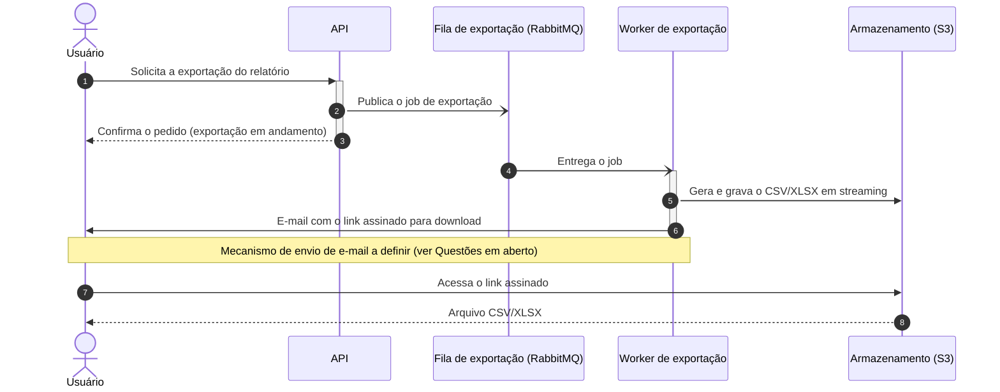

# Exportação de relatórios em background

| | |
|---|---|
| **Documento** | DESIGN-DOC |
| **Estado** | Rascunho |
| **Título** | Exportação de relatórios em background |
| **Autores** | A definir (ver Questões em aberto) |
| **Revisores** | A definir — sugeridos: time de Plataforma (fila compartilhada), time de Segurança (link assinado com PII) |
| **Criado em** | 2026-07-07 |
| **Última atualização** | 2026-07-07 |
| **Tags** | exportação, relatórios, assíncrono, fila, worker |

## Glossário

- **BI** — Business Intelligence: categoria de ferramentas externas de análise e geração de relatórios.
- **PII** — Personally Identifiable Information: dados pessoais que identificam clientes, presentes nos relatórios exportados.
- **Link assinado** — URL que embute a credencial de acesso ao arquivo no S3, permitindo o download sem autenticação adicional na API. Seus parâmetros (ex.: expiração) estão em aberto.

## Visão geral

Este documento propõe mover a geração de exportações de relatórios (CSV/XLSX) para fora do ciclo de request da API: a API passa a enfileirar um job, um worker separado gera o arquivo em streaming e o envia ao S3, e o usuário recebe por e-mail um link assinado para download quando a exportação termina.

A motivação é eliminar as falhas por timeout que hoje atingem as exportações grandes e abrir espaço para relatórios maiores (meta: 100 mil linhas). Em troca, o time aceita que o usuário perde o download imediato — inclusive nas exportações pequenas, que passam pelo mesmo caminho assíncrono.

## Escopo e contexto

Hoje a API gera o relatório dentro da própria request. O gateway impõe um timeout de 30 segundos, e as exportações grandes estouram esse limite: cerca de **12% das exportações acima de 50 mil linhas falham**, e o suporte abre ticket disso toda semana.

A infraestrutura já conta com RabbitMQ compartilhado entre os times, o que dispensa a introdução de um novo broker de mensagens para este trabalho.

## Objetivos e fora de escopo

Objetivos:

- **Zerar os timeouts de exportação**, movendo a geração do arquivo para fora do ciclo da request — hoje ~12% das exportações acima de 50 mil linhas falham por estourar os 30s do gateway.
- **Suportar exportações de até 100 mil linhas**, gerando o arquivo em streaming no worker.

Fora de escopo:

- **Manter um caminho síncrono de download imediato para exportações pequenas.** Alguém poderia esperar que a exportação que hoje resolve na hora continuasse síncrona; o time decidiu deliberadamente ter um caminho só, e toda exportação vira assíncrona.

## Design

### Visão da solução

A solução tem três peças: a **API**, que recebe o pedido de exportação e apenas publica um job na fila, respondendo de imediato; o **worker de exportação**, um processo separado que consome os jobs, gera o CSV/XLSX em streaming e grava o arquivo no S3; e a **notificação por e-mail**, que entrega ao usuário um link assinado para download quando a exportação termina.

O trade-off central: a geração sai do caminho da request — o timeout de 30s do gateway deixa de limitar o tamanho do relatório — em troca da perda do download imediato para todos os tamanhos de exportação.

### Arquitetura


*Renderizar esta imagem a partir do DSL abaixo na revisão manual (a exportação PNG/SVG não estava disponível neste ambiente).*

<details>
<summary>Fonte do diagrama (Structurizr DSL)</summary>

```
workspace "Exportação de relatórios em background" "Serviço que gera exportações de relatórios de forma assíncrona, fora do ciclo de request da API." {

    !identifiers hierarchical

    model {
        u = person "Usuário" "Solicita a exportação de um relatório e recebe o link por e-mail."

        s = softwareSystem "Plataforma de relatórios" "Gera e entrega exportações de relatórios em CSV/XLSX." {
            api = container "API" "Recebe o pedido de exportação e enfileira um job; responde imediatamente, sem gerar o arquivo na request."
            fila = container "Fila de exportação" "Buffer de jobs de exportação, na infraestrutura RabbitMQ compartilhada." "RabbitMQ" {
                tags "Queue"
            }
            worker = container "Worker de exportação" "Consome jobs, gera o CSV/XLSX em streaming e grava o arquivo no S3."
            bucket = container "Armazenamento de relatórios" "Guarda os arquivos exportados, servidos por link assinado. Contém dado de cliente (PII)." "Amazon S3" {
                tags "Bucket"
            }
        }

        u -> s.api "Solicita a exportação de um relatório usando" "HTTPS"
        s.api -> s.fila "Publica o job de exportação em"
        s.fila -> s.worker "Entrega o job de exportação a"
        s.worker -> s.bucket "Grava o CSV/XLSX em streaming em" "HTTPS"
        s.worker -> u "Envia e-mail com o link assinado quando a exportação termina" "E-mail"
        u -> s.bucket "Baixa o relatório pelo link assinado" "HTTPS"
    }

    views {
        systemContext s "SystemContext" {
            include *
            autoLayout
        }

        container s "Containers" {
            include *
            autoLayout lr
        }

        styles {
            element "Element" {
                background #1168bd
                color #ffffff
            }
            element "Person" {
                shape person
            }
            element "Queue" {
                shape pipe
            }
            element "Bucket" {
                shape cylinder
            }
        }
    }

    configuration {
        scope softwaresystem
    }
}
```

</details>

O diagrama mostra quatro containers. A **API** continua sendo a porta de entrada: ela recebe o pedido de exportação e publica um job na **fila de exportação**, que vive no RabbitMQ compartilhado da infraestrutura. O **worker de exportação** consome os jobs dessa fila, gera o CSV/XLSX em streaming — sem materializar o arquivo inteiro em memória — e grava o resultado no **armazenamento de relatórios** (S3). Ao terminar, o worker envia ao usuário um e-mail com o link assinado, e o usuário baixa o arquivo direto do S3 por esse link, sem passar pela API. O gateway com timeout de 30s fica no caminho entre o usuário e a API; ele não aparece no diagrama de containers por ser um componente de deployment, e deixa de ser relevante porque a API responde de imediato.

### Fluxo de exportação



O fluxo acima cobre o caminho feliz: o usuário pede a exportação (passo 1), a API enfileira o job e responde na hora (passos 2–3), o worker consome o job, gera e grava o arquivo em streaming (passos 4–5) e avisa o usuário por e-mail (passo 6); o download final (passos 7–8) acontece direto contra o S3, pelo link assinado. O time ainda não definiu o comportamento em caso de falha do worker — retentativas, descarte, o que o usuário vê —, e a questão está registrada em Questões em aberto; por isso o diagrama não desenha ramos de erro.

### Dados e sensibilidade

Os relatórios exportados contêm **dado de cliente (PII)**. Isso constrange o design em dois pontos: foi um dos motivos para descartar a ferramenta de BI externa (não expor dado de cliente a terceiros), e faz do link assinado uma superfície sensível — quem tiver o link acessa um arquivo com PII sem autenticação adicional. A revisão do time de Segurança cobre esse ponto (ver Preocupações transversais); expiração do link e retenção dos arquivos no S3 estão em aberto.

## Trade-offs da solução escolhida

- ✓ **Zera os timeouts de exportação** — a geração sai do ciclo da request, e o limite de 30s do gateway deixa de derrubar exportações grandes (hoje ~12% de falha acima de 50 mil linhas).
- ✓ **Suporta relatórios grandes** — o worker gera o arquivo em streaming, com meta de 100 mil linhas.
- ✓ **Um caminho só de exportação** — pequenas e grandes seguem o mesmo fluxo, sem ramificação síncrona/assíncrona para manter.
- ✗ **O usuário perde o download imediato** — a exportação pequena que hoje resolve na hora passa a chegar por e-mail. Custo aceito em troca do caminho único.
- ✗ **Carga nova na fila compartilhada** — os jobs de exportação passam a disputar o RabbitMQ da infraestrutura com outros times.
- ✗ **Nova superfície de segurança** — o link assinado dá acesso a arquivo com PII fora do ciclo autenticado da API.

## Alternativas consideradas

**Gerar síncrono com timeout maior — descartada.** Aumentar o timeout do gateway manteria o fluxo atual, mas só empurra o problema: relatórios maiores voltariam a estourar o novo limite.

**Ferramenta de BI externa — descartada.** Delegaria a geração de relatórios a um produto pronto, mas o time a descartou pelo custo e por expor dado de cliente a um terceiro.

**Não fazer nada — descartada.** Manter o fluxo atual significa conviver com ~12% de falha nas exportações acima de 50 mil linhas e com os tickets semanais no suporte — exatamente o problema que motiva este documento.

## Preocupações transversais

**Segurança.** O link assinado dá acesso direto a um arquivo com PII, fora do ciclo autenticado da API. O time de Segurança precisa revisar esse mecanismo — expiração do link e retenção dos arquivos estão listadas nas Questões em aberto. Sugerimos um revisor de Segurança no cabeçalho.

**Plataforma.** A fila de exportação usa o RabbitMQ compartilhado da infraestrutura, adicionando carga a um recurso de outros times. O time precisa alinhar volume e limites dessa carga com o time de Plataforma antes da implementação. Sugerimos um revisor de Plataforma no cabeçalho.

## Questões em aberto

1. **Autores e revisores nomeados** — quem assina o documento, e quem dos times de Plataforma e de Segurança revisa?
2. **Falha do worker** — o que acontece quando a geração falha (retentativas? descarte?), e o que o usuário vê nesse caso?
3. **Parâmetros do link assinado e retenção** — por quanto tempo o link vale, e por quanto tempo o arquivo fica no S3? (Decisão junto ao time de Segurança.)
4. **Mecanismo de envio de e-mail** — a plataforma já tem um serviço de envio, ou isso precisa ser provisionado?
5. **Limites da fila compartilhada** — que volume de jobs e tamanho de mensagem o time de Plataforma aceita no RabbitMQ compartilhado?
6. **Verificação e observação em produção** — quais métricas e alertas provam a meta de zerar os timeouts (ex.: taxa de falha de exportação) e acompanham a fila e o worker?
7. **Transição do fluxo atual** — a mudança para o caminho assíncrono entra de uma vez ou por etapas, e como o time avisa os usuários da mudança de comportamento?
