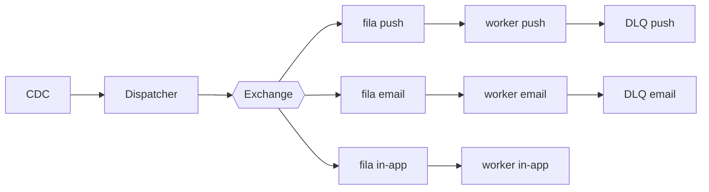

# Fanout de notificações

| | |
|---|---|
| **Estado** | Em revisão |
| **Autor** | Time de Mensageria |
| **Criado em** | 2026-01-28 |
| **Última atualização** | 2026-07-07 |

## Glossário

| Termo | Definição |
|---|---|
| **CDC** | Change Data Capture — captura das alterações do banco de dados como eventos, usada aqui na ingestão dos eventos de domínio. |
| **DLQ** | Dead Letter Queue — fila que recebe as mensagens que falharam no processamento, para análise e reprocessamento. |
| **Exchange** | Componente do broker de mensagens que recebe os eventos publicados e os roteia para as filas. |
| **Fanout** | Padrão em que cada evento publicado é distribuído para múltiplos consumidores em paralelo. |
| **SLA** | Service Level Agreement — o prazo de entrega das notificações acordado com o negócio. |
| **TPS** | Transações por segundo — a taxa máxima de chamadas que cada provider aceita. |

## Visão geral

O serviço de notificações processa os envios de forma sequencial e, com o crescimento da base, começou a apresentar lentidão. Este documento propõe substituir esse modelo por um fanout baseado em filas, em que workers por canal (push, e-mail e in-app) consomem os eventos em paralelo, para garantir o SLA de entrega.

## Escopo e contexto

Hoje o envio acontece dentro do próprio serviço de mensageria: um cron lê a tabela `notifications` a cada minuto, monta o payload de cada canal (push, e-mail e in-app) e chama os providers um a um. Com o crescimento da base, esse modelo sequencial começou a apresentar lentidão.

## Objetivos

- Melhorar a performance dos envios
- Tornar o sistema escalável
- Garantir o SLA

## Fora de escopo

- O sistema não deve ser lento
- O sistema não deve perder notificações

## Solução

Adotaremos o fanout com filas por canal, com ingestão dos eventos de domínio via CDC:

O CDC captura os eventos de domínio e os entrega ao dispatcher, que publica cada evento na exchange. A exchange faz o fanout para uma fila por canal (push, e-mail e in-app), e um worker dedicado consome cada fila em paralelo: monta o payload do canal e chama o provider respeitando o limite de TPS dele. As mensagens que falham vão para a DLQ do canal.

## Plano

1. Criar exchange e filas
2. Migrar o canal de e-mail
3. Migrar push e in-app
4. Desligar o cron
