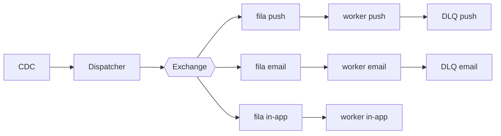

# Fanout de notificações

| | |
|---|---|
| **Estado** | Em revisão |
| **Autor** | Time de Mensageria |
| **Criado em** | 2026-01-28 |
| **Última atualização** | 2026-07-07 |

## Glossário

- **CDC** (Change Data Capture): captura de mudanças no banco de dados como eventos consumíveis.
- **DLQ** (Dead Letter Queue): fila que recebe as mensagens cujo processamento falhou, para tratamento posterior.
- **SLA** (Service Level Agreement): acordo de nível de serviço — aqui, o compromisso de tempo de entrega das notificações.
- **TPS** (transações por segundo): taxa de chamadas que cada provider aceita.

## Visão geral

O serviço de notificações processa os envios de forma sequencial e, com o crescimento da base, começou a apresentar lentidão. Este documento propõe substituir esse modelo por um fanout baseado em filas: um dispatcher publica os eventos numa exchange e workers por canal consomem em paralelo.

## Escopo e contexto

Hoje o envio acontece dentro do próprio serviço de mensageria: um cron lê a tabela `notifications` a cada minuto, monta o payload de cada canal (push, e-mail, in-app) e chama os providers um a um. Com o crescimento da base esse modelo começou a apresentar lentidão.

## Objetivos

- Melhorar a performance dos envios
- Tornar o sistema escalável
- Garantir o SLA

## Fora de escopo

- O sistema não deve ser lento
- O sistema não deve perder notificações

## Solução

Adotaremos o fanout com filas por canal:

O CDC captura os eventos de domínio e alimenta o dispatcher, que publica cada notificação na exchange. A exchange roteia a mensagem para a fila do canal correspondente (push, e-mail ou in-app), e o worker de cada canal consome sua fila em paralelo, chamando o provider dentro do limite de TPS que ele aceita. Envios que falham vão para a DLQ do canal.

## Plano

1. Criar exchange e filas
2. Migrar o canal de e-mail
3. Migrar push e in-app
4. Desligar o cron
