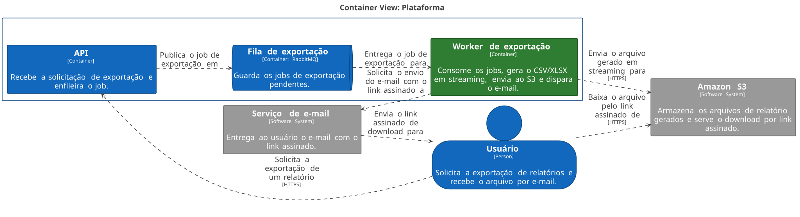
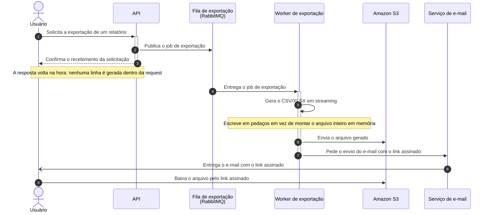

# Exportação de relatórios em background

| | |
|---|---|
| **Documento** | DESIGN-DOC · Exportação de relatórios em background |
| **Estado** | Rascunho |
| **Autores** | *(a preencher)* |
| **Revisores sugeridos** | *(a preencher)* — Plataforma (fila compartilhada), Segurança (link assinado com PII) |
| **Criado em** | 2026-07-20 |
| **Última atualização** | 2026-07-20 |
| **Tags** | exportação, relatórios, assíncrono, fila |

## Glossário

| Termo | Definição |
|---|---|
| **Exportação** | Geração de um relatório em arquivo para o usuário baixar. |
| **CSV / XLSX** | Formatos de arquivo em que os relatórios são entregues (texto separado por vírgula e planilha do Excel). |
| **Job** | Unidade de trabalho enfileirada: uma exportação solicitada, ainda não gerada. |
| **Worker** | Processo separado da API que consome jobs da fila e os executa. |
| **RabbitMQ** | Broker de mensagens já presente na nossa infraestrutura, usado aqui como fila de jobs. |
| **S3** | Serviço de armazenamento de objetos da AWS, onde os arquivos gerados ficam guardados. |
| **Link assinado** | URL temporária de download que carrega sua própria autorização, sem exigir sessão do usuário. |
| **Gateway** | Camada de entrada das requisições HTTP, onde hoje vive o timeout de 30 segundos. |
| **Streaming** | Escrever o arquivo em pedaços conforme as linhas são lidas, em vez de montá-lo inteiro em memória. |
| **PII** | Dado pessoal identificável (*Personally Identifiable Information*). |
| **BI** | *Business Intelligence* — ferramentas de análise e relatório de mercado. |

## Visão geral

Hoje o usuário pede uma exportação de relatório e espera a resposta na própria
requisição HTTP. Quando o relatório é grande, a geração passa dos 30 segundos que o
gateway tolera e a requisição morre no meio — o usuário não recebe nada e o suporte
recebe mais um ticket.

Este documento propõe tirar a geração de dentro da requisição: a API passa a enfileirar
um job, um worker separado gera o arquivo em streaming e o envia ao S3, e o usuário
recebe por e-mail um link assinado para baixá-lo. O documento também registra o custo
que aceitamos em troca: nenhuma exportação continua sendo imediata, nem as pequenas.

## Escopo e contexto

A exportação de relatórios roda hoje inteiramente dentro da requisição da API: o
usuário chama o endpoint, a API monta o arquivo e devolve o conteúdo na resposta. O
gateway à frente da API corta qualquer requisição que passe de 30 segundos.

Relatórios grandes não cabem nessa janela. **Cerca de 12% das exportações acima de 50
mil linhas falham por timeout**, e o suporte abre ticket sobre isso toda semana — é o
que motiva este trabalho agora. A infraestrutura já opera um RabbitMQ, hoje usado por
outros times.

## Objetivos e fora de escopo

**Objetivos**

- Zerar as falhas por timeout na exportação, removendo a geração do caminho da
  requisição HTTP.
- Suportar exportações de **100 mil linhas**, gerando o arquivo em streaming em vez de
  materializá-lo em memória.

**Fora de escopo**

- Manter o download imediato para exportações pequenas: elas também passam a ser
  assíncronas (ver *Trade-offs*).
- Mudar o conteúdo, as colunas ou os filtros dos relatórios — só muda como o arquivo é
  gerado e entregue.
- Elevar o timeout de 30 segundos do gateway, que continua como está para todas as
  demais rotas.

## A solução

### Visão geral da solução

A API deixa de gerar o relatório e passa a apenas registrar o pedido: publica um job na
fila e responde na hora. Um worker separado consome esse job, lê as linhas do relatório
e escreve o CSV/XLSX em streaming direto para o S3. Terminado o arquivo, o usuário
recebe um e-mail com um link assinado para baixá-lo.

A troca central está aí: o usuário ganha uma exportação que não falha por tamanho e
perde o arquivo na mão no fim da requisição.

### Arquitetura



<details>
<summary>Fonte do diagrama (Structurizr DSL)</summary>

```
workspace "Exportação de relatórios" "Geração assíncrona de relatórios grandes em background." {

    !identifiers hierarchical

    model {
        usuario = person "Usuário" "Solicita a exportação de relatórios e recebe o arquivo por e-mail."

        exportacao = softwareSystem "Plataforma" "Produto onde o usuário solicita relatórios." {
            api = container "API" "Recebe a solicitação de exportação e enfileira o job." {
                tags "Existente"
            }
            fila = container "Fila de exportação" "Guarda os jobs de exportação pendentes." "RabbitMQ" {
                tags "Queue" "Existente"
            }
            worker = container "Worker de exportação" "Consome os jobs, gera o CSV/XLSX em streaming, envia ao S3 e dispara o e-mail." {
                tags "Novo"
            }
        }

        s3 = softwareSystem "Amazon S3" "Armazena os arquivos de relatório gerados e serve o download por link assinado." {
            tags "External"
        }

        email = softwareSystem "Serviço de e-mail" "Entrega ao usuário o e-mail com o link assinado." {
            tags "External"
        }

        usuario -> exportacao.api "Solicita a exportação de um relatório" "HTTPS"
        exportacao.api -> exportacao.fila "Publica o job de exportação em"
        exportacao.fila -> exportacao.worker "Entrega o job de exportação para"
        exportacao.worker -> s3 "Envia o arquivo gerado em streaming para" "HTTPS"
        exportacao.worker -> email "Solicita o envio do e-mail com o link assinado a"
        email -> usuario "Envia o link assinado de download para"
        usuario -> s3 "Baixa o arquivo pelo link assinado de" "HTTPS"
    }

    views {
        systemContext exportacao "SystemContext" {
            include *
            autoLayout lr
        }

        container exportacao "Containers" {
            include *
            autoLayout lr
        }

        styles {
            element "Element" {
                background #1168bd
                color #ffffff
            }
            element "Person" {
                shape person
            }
            element "Queue" {
                shape pipe
            }
            element "Novo" {
                background #2e7d32
            }
            element "External" {
                background #999999
                color #ffffff
            }
        }
    }

    configuration {
        scope softwaresystem
    }
}
```

</details>

Quatro peças participam da arquitetura. A **API** é a que já existe; ela perde a
responsabilidade de gerar o arquivo e passa a publicar um job na fila e responder ao
usuário. A **fila de exportação** vive no RabbitMQ que a infraestrutura já opera e
guarda os jobs pendentes, desacoplando quem pede de quem executa — é o que permite que
a requisição termine antes da geração. O **worker de exportação** é o componente novo:
consome os jobs, gera o CSV/XLSX em streaming e envia o arquivo para o **S3**, que
guarda o resultado e serve o download por link assinado. Fora do nosso sistema, o
serviço de e-mail leva o link até o usuário.

### Fluxo de uma exportação



O fluxo se divide em duas metades. Nos passos 1 a 3 o usuário pede a exportação, a API
publica o job na fila e confirma o recebimento — essa parte termina em milissegundos,
muito longe dos 30 segundos do gateway, e é por isso que o timeout deixa de existir. Do
passo 4 em diante o trabalho corre fora da requisição: o worker recebe o job, gera o
arquivo em streaming (passo 6, onde está o suporte às 100 mil linhas), envia o
resultado ao S3 e pede o e-mail. O usuário só volta a aparecer no passo 10, quando
recebe o link assinado e baixa o arquivo direto do S3, sem passar pela nossa API.

Este é o caminho feliz. O que acontece quando a geração falha, quando o job estoura o
tempo do worker ou quando o e-mail não é entregue ainda não está definido — está
registrado em *Questões em aberto*.

### Dados e sensibilidade

Os relatórios exportados carregam dados de cliente, incluindo PII. Isso muda de lugar
com esta proposta: o arquivo deixa de existir apenas em trânsito na resposta HTTP e
passa a ficar **armazenado no S3**, acessível por um link assinado que trafega **por
e-mail** — um canal fora do nosso controle. Quanto tempo o arquivo e o link permanecem
válidos é uma decisão a fechar com o time de Segurança (ver *Questões em aberto*).

## Trade-offs da solução escolhida

- ✓ Nenhuma exportação falha por timeout do gateway: a requisição não espera mais a
  geração, então o tamanho do relatório deixa de ser um limite de tempo de resposta.
- ✓ A geração em streaming sustenta relatórios de 100 mil linhas sem manter o arquivo
  inteiro em memória.
- ✓ O worker escala e é ajustado separadamente da API; uma exportação pesada deixa de
  ocupar a capacidade que atende às outras requisições.
- ✗ **O usuário perde o download imediato.** Exportações pequenas, que hoje funcionam
  na hora, também viram assíncronas. Aceitamos isso de propósito: um caminho só é mais
  simples de operar e de explicar do que dois caminhos com regras de corte.
- ✗ A entrega passa a depender do e-mail. Se o e-mail não chega, ou cai no spam, o
  usuário fica sem o relatório mesmo com o arquivo pronto no S3.
- ✗ A solução tem mais partes móveis do que a de hoje: uma fila, um worker e um bucket
  a mais para operar, monitorar e depurar.

## Alternativas consideradas

| Alternativa | Trade-offs | Resultado |
|---|---|---|
| Fila + worker + S3 + link por e-mail | ✓ Elimina o timeout e sustenta 100 mil linhas · ✗ Perde o download imediato e adiciona componentes | **Escolhida** |
| Gerar síncrono com timeout maior | ✓ Mudança mínima, mantém o download imediato · ✗ Só empurra o problema: o limite volta a ser atingido com relatórios maiores | Descartada |
| Ferramenta de BI externa | ✓ Não precisamos construir nem operar a geração · ✗ Custo e exposição de dado de cliente a um terceiro | Descartada |
| Não fazer nada | ✓ Custo zero de desenvolvimento · ✗ Mantém 12% de falha nas exportações acima de 50 mil linhas e o fluxo semanal de tickets no suporte | Descartada |

Aumentar o timeout foi descartada porque não resolve, apenas adia: qualquer valor
escolhido vira o novo teto, e o relatório que cresce volta a estourá-lo. A ferramenta de
BI externa foi descartada por dois motivos independentes — o custo e o fato de expor
dado de cliente fora da nossa fronteira. Não fazer nada não se sustenta diante dos 12%
de falha e dos tickets recorrentes.

## Preocupações transversais

**Plataforma.** O RabbitMQ é compartilhado com outros times. Uma exportação de 100 mil
linhas não é um job pequeno, e uma rajada de exportações passa a disputar recursos com
as filas dos outros. O time de Plataforma precisa revisar esta proposta e dizer se a
fila de exportação deve ser isolada e com quais limites.

**Segurança.** O link assinado dá acesso a um arquivo com PII e viaja por e-mail. O
time de Segurança precisa revisar o desenho e definir os parâmetros de validade e
retenção antes da implementação.

## Testabilidade e observabilidade

As duas métricas que provam os objetivos já estão nomeadas neles: a **taxa de falha por
timeout nas exportações**, que deve ir a zero, e o **sucesso de uma exportação de 100
mil linhas**, que deve ser verificado antes de subir. Como as duas serão medidas e
alarmadas em produção ainda não está decidido — ver *Questões em aberto*.

## Questões em aberto

- Quem assina o documento e quem revisa por Plataforma e por Segurança.
- O que acontece quando um job falha: quantas tentativas, o que o usuário vê e se há
  fila de mensagens mortas.
- Por quanto tempo o arquivo fica no S3 e por quanto tempo o link assinado é válido —
  a definir com Segurança.
- Se a fila de exportação será isolada dentro do RabbitMQ compartilhado — a definir com
  Plataforma.
- Como o usuário acompanha uma exportação em andamento, já que a resposta imediata
  desaparece.
- Quais tecnologias o worker e a fila usam de fato (linguagem, biblioteca de geração de
  planilha) e como as métricas dos objetivos serão coletadas.
