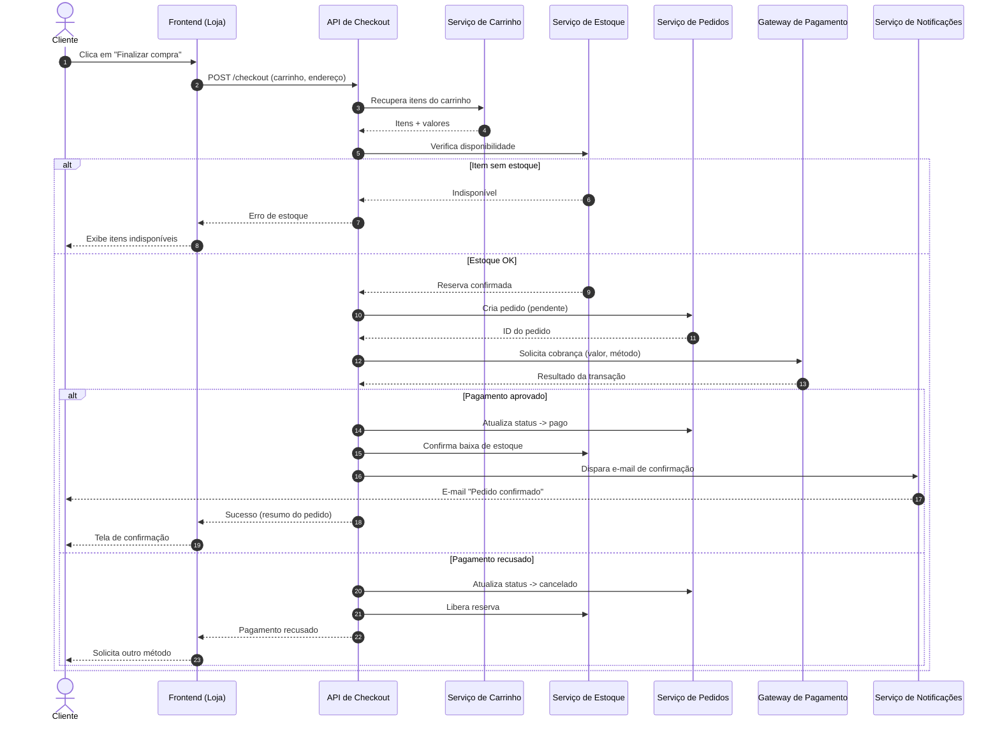

Claro! Montei um diagrama de sequência do fluxo de checkout em Mermaid, que você pode colar direto no README (GitHub, GitLab e a maioria dos renderizadores de Markdown desenham Mermaid automaticamente).

Como você não passou os detalhes específicos do seu e-commerce, modelei um fluxo de checkout típico (carrinho → estoque → pagamento → confirmação) com os atores mais comuns. Veja se bate com a sua arquitetura — deixei perguntas no final para refinar.

Premissas que adotei: cliente já autenticado com itens no carrinho; arquitetura em serviços separados; pagamento síncrono; estoque reservado antes do pagamento e liberado em caso de recusa.

Perguntas para deixar fiel ao seu sistema: (1) Pagamento síncrono ou assíncrono via webhook (PIX/boleto)? (2) Microsserviços ou monólito, e quais os nomes reais? (3) Incluir login, frete e cupom? (4) Há antifraude/cálculo de frete/validação de cupom? (5) Quer mais casos de erro (timeout, etc.)?
