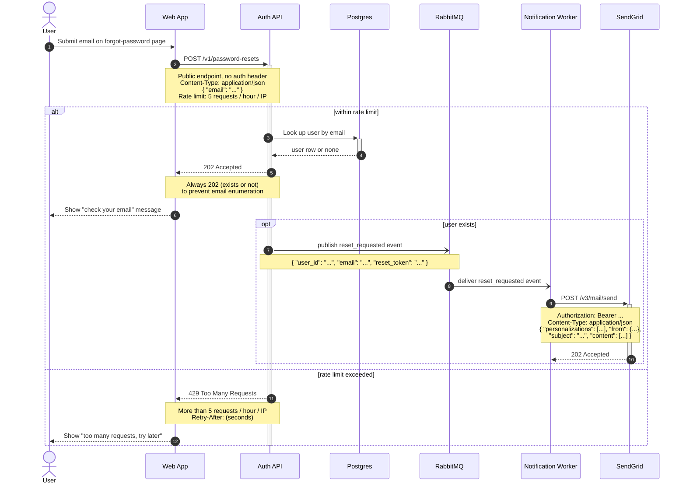

# Password reset flow — sequence diagram

Here is the password reset flow as a Mermaid sequence diagram. It renders natively in your GitLab wiki (fenced ` ```mermaid ` blocks), and I kept to portable "safe core" Mermaid syntax so the version GitLab bundles will render it without trouble. Both the happy path and the rate-limit (429) case are shown, with the endpoints, headers, and payloads in notes.



## Walkthrough

- **Steps 1–2:** the user submits their email on the forgot-password page, and the Web App calls `POST /v1/password-resets` on the Auth API — a public, unauthenticated endpoint, rate-limited to 5 requests/hour/IP.
- **Steps 3–6 (within rate limit):** the Auth API looks the user up in Postgres and returns `202 Accepted` regardless of whether the user exists, so attackers can't enumerate emails. The Web App tells the user to check their inbox.
- **Steps 7–10 (user exists, the `opt` block):** the Auth API publishes a `reset_requested` event to RabbitMQ; the Notification Worker consumes it and sends the email via SendGrid's `POST /v3/mail/send` (with an `Authorization: Bearer` header), which returns `202 Accepted`. The publish and consume are drawn as async (`-)`) since they're fire-and-forget over the queue.
- **Steps 7–9 (rate limit exceeded — the `else` branch):** if more than 5 requests/hour/IP come in, the Auth API returns `429 Too Many Requests` with a `Retry-After` header, and the Web App surfaces a "too many requests" message.

## A couple of notes on what I left as placeholders

I only put into the notes what you actually specified. Two payload fields are shown as illustrative placeholders rather than facts:

- The **RabbitMQ `reset_requested` event body** (`user_id`, `email`, `reset_token`) — you said the event is published but didn't give its shape. Adjust to match your real schema.
- The **SendGrid request body** — shown as the generic v3 mail/send shape, not your specific template/payload.

Everything else (endpoints, the `202`/`429` status codes, the no-auth-header detail, the rate-limit threshold, the `Retry-After` header, the `{ "email": "..." }` request body, the `Authorization: Bearer` header) is exactly as you described.

## Validation

I was **not able to validate or render this diagram in my environment** — no Mermaid MCP server is connected here, and the shell/mermaid-cli was unavailable. The syntax uses only the portable "safe core" Mermaid features and follows the escaping rules (no raw angle brackets — redacted values are written as `...`; no literal `end` inside message text), so it should render cleanly. To preview/edit it before committing, paste the code block into <https://mermaid.live>. GitLab wikis render ` ```mermaid ` blocks natively, so you can also drop it straight into the wiki page.
