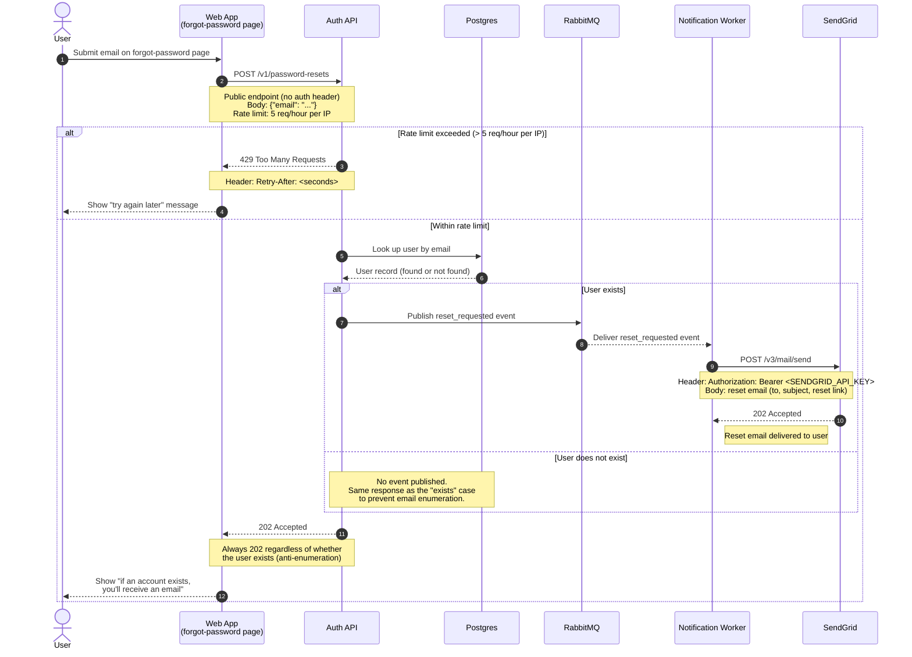

Here's a Mermaid sequence diagram for your password reset flow. It's written for GitLab's flavored Markdown (a fenced ` ```mermaid ` block), so you can paste it straight into your wiki page. It covers both the success path and the rate-limited (429) case, with notes carrying the endpoints, headers, and payloads.

## Password reset flow



## Notes on the flow

- POST /v1/password-resets (Auth API): public, unauthenticated endpoint. Request body `{"email": "..."}`. Rate-limited to 5 requests per hour per IP; exceeding the limit returns `429 Too Many Requests` with a `Retry-After` header.
- Anti-enumeration: the Auth API always returns `202 Accepted` whether or not the user exists, so attackers can't tell which emails are registered. The reset event (and therefore the email) is only produced when the user actually exists.
- RabbitMQ: on a matching user, the Auth API publishes a `reset_requested` event. The Notification Worker consumes it asynchronously, so email delivery happens off the request path.
- SendGrid: the worker calls `POST /v3/mail/send` with an `Authorization: Bearer <API key>` header to send the reset email.

### Rendering / wiki tips

- GitLab renders Mermaid from a fenced code block tagged `mermaid` (shown above) — no plugin needed.
- The `<br/>` line breaks inside notes/participant labels are supported by GitLab's Mermaid renderer; if your wiki is on an older GitLab version and a label looks off, replace `<br/>` with a space.
- `autonumber` adds the step numbers automatically; remove that line if you'd rather not number the steps.
