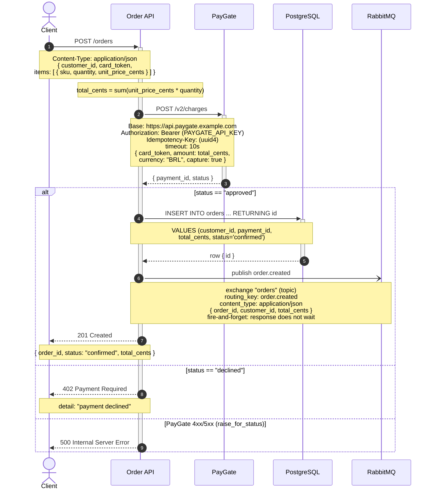

Aqui está o diagrama de sequência do `POST /orders`, montado a partir do código real (`main.py`, `payments.py`, `db.py`, `events.py`). É só colar este bloco no README — GitHub, GitLab e a maioria dos wikis renderizam blocos ` ```mermaid ` nativamente.



Passo a passo do fluxo:

1. O cliente envia `POST /orders` com `customer_id`, `card_token` e a lista de `items`; a API valida o corpo (Pydantic: `quantity > 0`, `unit_price_cents > 0`, ao menos 1 item) e calcula `total_cents`.
2-4. A API cobra o cartão no PayGate (`POST /v2/charges`, header `Idempotency-Key` por requisição) e recebe `{ payment_id, status }`.
5. Caminho feliz (`status == "approved"`): grava o pedido no PostgreSQL (`INSERT ... RETURNING id`), recebe o `id`, publica o evento `order.created` no RabbitMQ em modo fire-and-forget (a resposta não espera os consumidores) e retorna `201` com `{ order_id, status: "confirmed", total_cents }`.

Caminhos de falha (ambos vêm do código, não inventados):

- `status == "declined"` → a API responde `402` com `detail: "payment declined"`. Nada é gravado e nenhum evento é publicado.
- Se o PayGate responde 4xx/5xx, `resp.raise_for_status()` em `payments.py` levanta a exceção, que sobe como `500` da nossa API (comportamento documentado na própria docstring de `charge`).

Observações:

- A validação do corpo do request é feita pelo FastAPI/Pydantic antes de `create_order` rodar — um corpo inválido retorna `422` antes de qualquer chamada ao PayGate. Não desenhei essa ramificação para não poluir o diagrama; me avise se quiser incluí-la.
- **Não foi possível validar/renderizar o diagrama neste ambiente** (não há servidor MCP do Mermaid conectado e o `mermaid-cli` não pôde ser verificado/executado aqui). O bloco usa apenas sintaxe do núcleo portável do Mermaid. Para pré-visualizar e editar, cole o código em https://mermaid.live; no README ele já renderiza nativamente no GitHub/GitLab.
